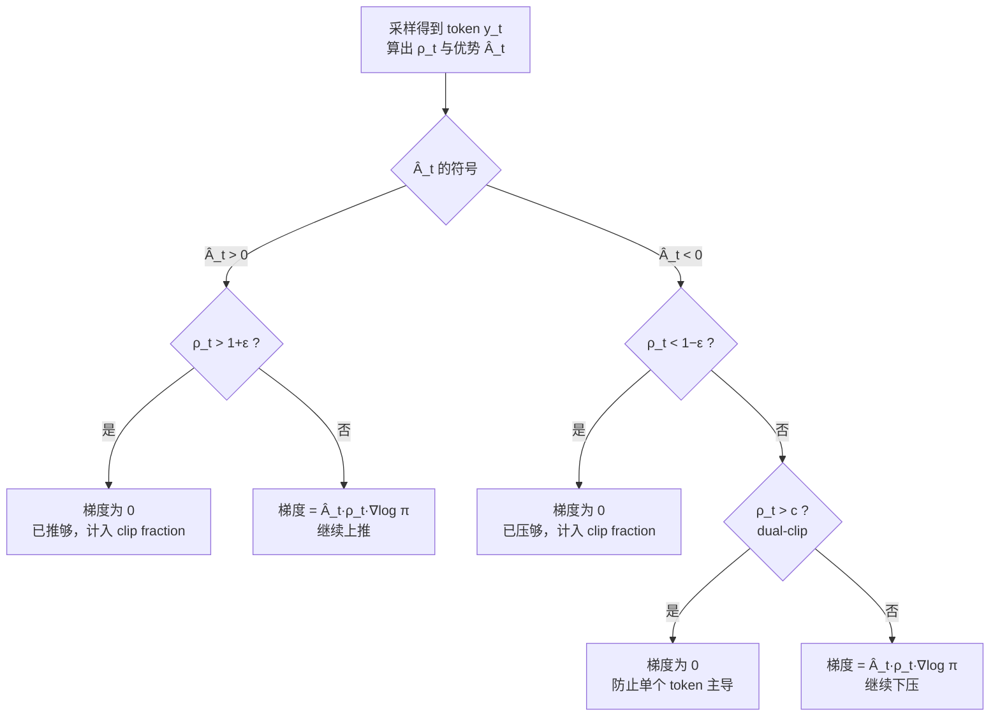
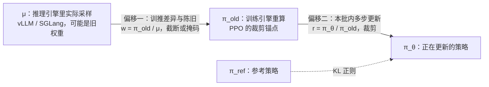
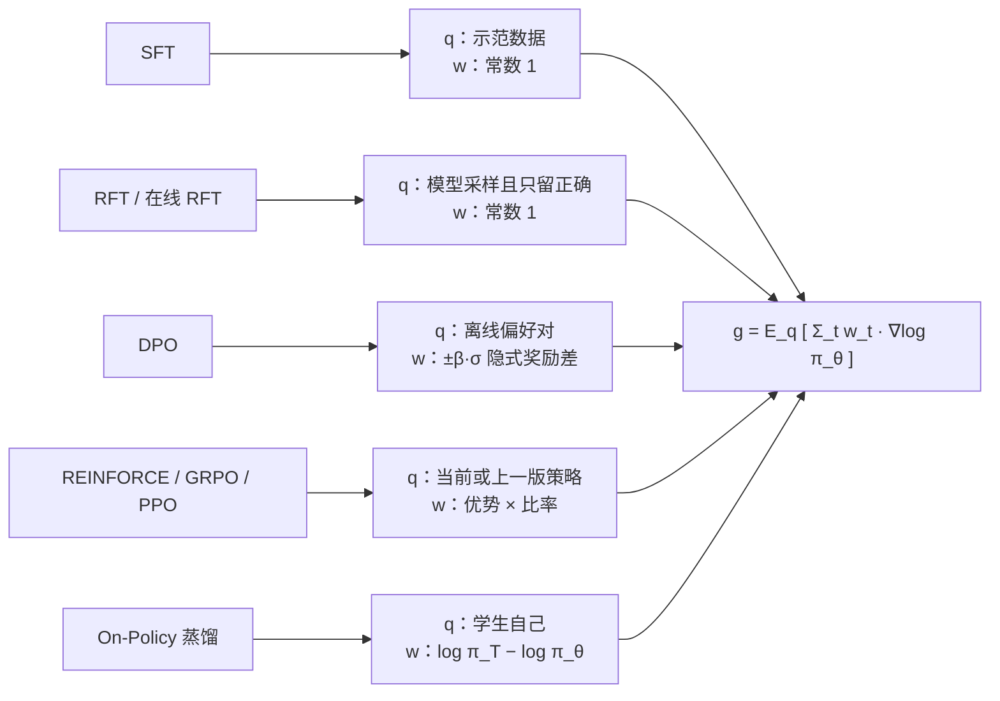

# 算法谱系与推导

这一页是全站的推导中枢。从一条公式——策略梯度——出发，把 PPO、GRPO、DAPO、GSPO、CISPO、DPO 和 On-Policy 蒸馏放进同一个框架：**它们估计的是同一类梯度，区别只在样本从哪来、每个 token 乘多大的权重，以及为了稳定牺牲了多少无偏性。** 历史脉络与工业背景见 [LLM 强化学习](/topics/rl-for-llm)，这里只回答“为什么这样算”。

::: human
这些算法都在做同一件事：把“好回答”里的词说得更频繁一点，把“差回答”里的词说得少一点。PPO、GRPO、DAPO 们争论的，只是“好坏怎么打分”和“一次改多少才不会改坏”。
:::

**记号**（全站统一）：提示 $x$，回答 $y=(y_1,\dots,y_T)$，前缀状态 $s_t=(x,y_{<t})$；正在训练的策略 $\pi_\theta$，生成样本时的策略 $\pi_{\theta_\text{old}}$，参考策略 $\pi_\text{ref}$；重要性比率 $\rho_t=\pi_\theta(y_t\mid s_t)/\pi_{\theta_\text{old}}(y_t\mid s_t)$；$\sg(\cdot)$ 表示<Term t="stop-gradient">停止梯度</Term>。需要区分“推理引擎里实际采样的分布”时，另记为 $\mu$。

<LineageGraph graph="policy-gradient" />

读图时抓住一条主线：左边两列是“怎样估计优势”的演化，中间一列是去掉价值网络的无 Critic 家族，第四列是 2025 年以来围绕“比率、裁剪与离策略”的稳定性修正，最右列的偏好学习与蒸馏会在[统一视角](#unified-view)里重新汇合。

## 策略梯度：一切的起点 {#policy-gradient}

我们要最大化期望奖励：

$$
J(\theta)=\E_{x\sim\mathcal D}\,\E_{y\sim\pi_\theta(\cdot\mid x)}\big[r(x,y)\big]
$$

难点在于样本本身由 $\pi_\theta$ 产生，没法直接对样本求导。<Term t="log-derivative-trick">对数导数技巧</Term>利用 $\nabla_\theta\pi_\theta=\pi_\theta\nabla_\theta\log\pi_\theta$，把梯度写成对样本的加权对数似然：

$$
\nabla_\theta J=\E_{x,\;y\sim\pi_\theta}\Big[\,r(x,y)\sum_{t=1}^{T}\nabla_\theta\log\pi_\theta(y_t\mid s_t)\Big]
$$

这个式子有两个直接推论。第一，奖励只需要能打分，不需要可导——答案对不对、测试过没过，都可以直接当训练信号，这是 <Term t="rlvr">RLVR</Term> 成立的前提。第二，自回归模型的序列对数概率拆成逐 token 之和，所以“奖励 × 每个 token 的对数似然梯度”就是最朴素的更新。

::: derive 从期望到逐 token 求和
1. 固定 $x$，$J=\sum_y\pi_\theta(y\mid x)\,r(x,y)$。求导：$\nabla J=\sum_y\nabla\pi_\theta(y\mid x)\,r=\sum_y\pi_\theta(y\mid x)\,\nabla\log\pi_\theta(y\mid x)\,r=\E_{y\sim\pi_\theta}\big[r\,\nabla\log\pi_\theta(y\mid x)\big]$。
2. 自回归分解 $\pi_\theta(y\mid x)=\prod_t\pi_\theta(y_t\mid s_t)$，于是 $\nabla\log\pi_\theta(y\mid x)=\sum_t\nabla\log\pi_\theta(y_t\mid s_t)$。LLM 的“环境转移”是确定性的（把 token 接到前缀后面），没有需要建模的动力学项。
3. 如果奖励是逐 token 的 $r_t$（例如带 KL 惩罚），第 $t$ 项只需乘以未来回报 $\sum_{t'\ge t}r_{t'}$：对 $t'<t$，$r_{t'}$ 已由前缀 $s_t$ 决定，与 $y_t$ 的选择无关，因此 $\E_{y_t\sim\pi_\theta(\cdot\mid s_t)}\big[r_{t'}\nabla\log\pi_\theta(y_t\mid s_t)\big]=r_{t'}\,\nabla\sum_{y_t}\pi_\theta(y_t\mid s_t)=0$。这就是“因果性”（reward-to-go）。
:::

### REINFORCE 与基线 {#reinforce}

Williams 在 1992 年提出的 REINFORCE[^williams] 就是上式的蒙特卡洛估计：采样、打分、按分数加权对数似然梯度。它无偏，但方差很大——如果某道题的回答奖励全是 1，所有样本都会被往上推，梯度里全是噪声。解决办法是减去一个与动作无关的<Term t="baseline">基线</Term> $b$：

$$
\hat g=\big(r(x,y)-b(x)\big)\sum_{t}\nabla_\theta\log\pi_\theta(y_t\mid s_t)
$$

::: derive 基线为什么不引入偏差，最优基线是什么
- **无偏**：只要 $b$ 不依赖被求导的 $y_t$（可以依赖 $x$、前缀 $s_t$，也可以依赖其他独立样本），就有 $\E_{y_t\sim\pi_\theta(\cdot\mid s_t)}\big[b\,\nabla\log\pi_\theta(y_t\mid s_t)\big]=b\,\nabla_\theta\sum_{y_t}\pi_\theta(y_t\mid s_t)=b\,\nabla_\theta 1=0$。
- **反例**：若基线用到了样本自身的奖励（例如包含自己的组均值），上式不再严格成立。后文会看到：组均值只让梯度缩小一个常数倍，而除以组内标准差会真正改变优化目标。
- **最优常数基线**：取梯度的某一维 $g$，$\operatorname{Var}[(r-b)g]=\E[(r-b)^2g^2]-\big(\E[rg]\big)^2$，第二项与 $b$ 无关；对 $b$ 求导令其为零，得 $b^{\star}=\E[r\,g^2]/\E[g^2]$。实践中取 $b\approx\E[r\mid x]$（价值函数或组内均值）已足够接近。
:::

LLM 上方差有两个主要来源：一是奖励稀疏，整条回答一个分数，几千个 token 共享同一个权重；二是提示之间难度差异巨大，简单题的奖励普遍偏高。所以基线必须随提示变化——要么用价值网络 $V(s_t)$（PPO），要么对同一提示多采样几次、用组内统计量（GRPO、RLOO）。

::: human
基线就是“及格线”：同一道题，高于平均的回答多学，低于平均的少学。及格线不改变“往哪个方向学”，只决定“学得稳不稳”。
:::

## Actor-Critic 与 GAE {#gae}

<Term t="advantage">优势函数</Term> $A(s_t,y_t)=Q(s_t,y_t)-V(s_t)$ 衡量“这个 token 比在当前前缀下的平均表现好多少”。Actor-Critic 用一个价值网络 $V_\phi$（<Term t="critic">critic</Term>）估计 $V$，由此得到 TD 误差：

$$
\delta_t=r_t+\gamma V_\phi(s_{t+1})-V_\phi(s_t)
$$

<Term t="gae">GAE</Term> 把各步 TD 误差按 $(\gamma\lambda)^l$ 几何加权（最后一个 token 之后 $V_\phi=0$）：

$$
\hat A_t^{\text{GAE}(\gamma,\lambda)}=\sum_{l=0}^{T-t}(\gamma\lambda)^l\,\delta_{t+l},\qquad \hat A_t=\delta_t+\gamma\lambda\,\hat A_{t+1}
$$

::: derive GAE 是 k 步优势的几何平均，也是 λ-回报减基线
- k 步优势：$\hat A_t^{(k)}=\sum_{l=0}^{k-1}\gamma^l\delta_{t+l}=-V(s_t)+r_t+\gamma r_{t+1}+\cdots+\gamma^{k-1}r_{t+k-1}+\gamma^kV(s_{t+k})$，中间的价值项逐项相消。
- 以 $(1-\lambda)\lambda^{k-1}$ 加权求和：$(1-\lambda)\sum_{k\ge1}\lambda^{k-1}\hat A_t^{(k)}=\sum_{l\ge0}\gamma^l\delta_{t+l}\cdot(1-\lambda)\sum_{k>l}\lambda^{k-1}=\sum_{l\ge0}(\gamma\lambda)^l\delta_{t+l}$。
- 两个端点：$\lambda=0$ 时 $\hat A_t=\delta_t$，方差最小，但只要 $V_\phi$ 不准就有偏；$\lambda=1$ 时 $\hat A_t=\sum_l\gamma^lr_{t+l}-V_\phi(s_t)$，即蒙特卡洛回报减基线，对任何 $V_\phi$ 都无偏，方差最大。
- $\hat A_t+V_\phi(s_t)$ 就是 λ-回报 $G_t^\lambda$，通常作为 critic 的回归目标。
:::

**LLM 上 γ、λ 怎么取。** 经典控制里常用 $\gamma=0.99$、$\lambda=0.95$（PPO 论文的 MuJoCo 设置）；LLM 框架的默认值则是 $\gamma=\lambda=1$（verl 的 `algorithm.gamma`、`algorithm.lam`，OpenRLHF 的 `--algo.advantage.gamma`、`--algo.advantage.lambd`）[^gae-defaults]。原因有二：

- **γ=1**：回答级奖励只在最后一个 token 出现。$\gamma<1$ 时第 $t$ 个 token 收到的信号按 $\gamma^{T-t}$ 衰减，几千 token 的长 CoT 开头几乎收不到信号，还隐含了“越短越好”的偏好。
- **λ 接近 1**：终局奖励传到第 $t$ 个 token 要乘 $(\gamma\lambda)^{T-t}$。$\lambda=0.95$ 时往前 100 个 token 只剩 $0.95^{100}\approx0.006$，其余全靠价值网络自举——而 LLM 的价值网络恰恰最难学准（稀疏终局奖励、从奖励模型初始化）。[VAPO](/library/?id=vapo) 一系的做法因此是：先用固定策略的蒙特卡洛回报预训练价值网络，再让 critic 与 actor 用不同的 λ（Decoupled-GAE，如 $\lambda_\text{value}=1$、$\lambda_\text{policy}=0.95$），并让 actor 的 λ 随回答长度 $l$ 自适应（Length-Adaptive GAE，$\lambda_\text{policy}=1-\frac{1}{\alpha l}$）[^vapo]。

::: human
γ 决定“未来的奖励打几折”，λ 决定“多信价值网络的估计，还是多信真实拿到的分数”。LLM 只在结尾给分、价值网络又难学，所以通常不打折（γ=1），也尽量相信真实分数（λ 接近 1）。
:::

## 信任域与 PPO {#ppo}

### 从 TRPO 到代理目标 {#trpo}

策略梯度只告诉你在 $\theta_\text{old}$ 处往哪走，不告诉你能走多远；而一旦在同一批样本上走了多步，样本就不再来自当前策略。<Term t="surrogate-objective">代理目标</Term>用旧样本加权来近似新策略的表现：

$$
L_{\theta_\text{old}}(\theta)=\E_{s_t,\,y_t\sim\pi_{\theta_\text{old}}}\big[\rho_t(\theta)\,\hat A_t\big]
$$

它在 $\theta=\theta_\text{old}$ 处与真实目标的一阶梯度一致（$\rho=1$ 时 $\nabla\rho=\nabla\log\pi_\theta$），离得越远越不可信。[TRPO](/library/?id=trpo) 于是在一个<Term t="trust-region">信任域</Term>里最大化它：

$$
\max_\theta\ L_{\theta_\text{old}}(\theta)\quad\text{s.t.}\quad \E_{s}\Big[\KL\big(\pi_{\theta_\text{old}}(\cdot\mid s)\,\big\Vert\,\pi_\theta(\cdot\mid s)\big)\Big]\le\delta
$$

::: derive 为什么要限制步长：策略改进下界
TRPO（沿用 Kakade 与 Langford 2002 年的分析）证明，对任意新策略 $\tilde\pi$：

$$
\eta(\tilde\pi)\ \ge\ L_\pi(\tilde\pi)-\frac{4\epsilon\gamma}{(1-\gamma)^2}\max_s\KL\big(\pi(\cdot\mid s)\,\Vert\,\tilde\pi(\cdot\mid s)\big),\qquad \epsilon=\max_{s,a}\lvert A_\pi(s,a)\rvert
$$

- 右边在 $\tilde\pi=\pi$ 处与真实回报 $\eta$ 相切，每次最大化右边（minorize-maximize）就能保证 $\eta$ 单调不降。
- 惩罚系数在实践中过于保守，TRPO 改为硬约束“平均 KL ≤ δ”，用共轭梯度求自然梯度方向 $F^{-1}g$（$F$ 为 Fisher 信息矩阵），再做线搜索。
- 对 LLM（$\gamma=1$、状态空间巨大）这个界没有数值意义，但“在旧策略附近用代理目标、并控制偏离程度”的结构被 PPO、GRPO 全盘继承。
:::

### 裁剪目标：min 到底在做什么

<Term t="ppo">PPO</Term> 用一阶方法近似信任域，不再显式约束 KL，而是裁剪比率：

$$
L^{\text{CLIP}}(\theta)=\E_t\Big[\min\big(\rho_t\hat A_t,\ \clip(\rho_t,1-\varepsilon,1+\varepsilon)\,\hat A_t\big)\Big]
$$

逐情形拆开，一个 token 的梯度只有两种结局：

| 优势符号 | 比率区间 | min 选中的项 | 该 token 的梯度 |
|---|---|---|---|
| $\hat A_t>0$（该多说） | $\rho_t\le1+\varepsilon$ | $\rho_t\hat A_t$ | $\hat A_t\,\rho_t\,\nabla\log\pi_\theta$：继续上推 |
| $\hat A_t>0$ | $\rho_t>1+\varepsilon$ | $(1+\varepsilon)\hat A_t$，常数 | 0：已经推够了 |
| $\hat A_t<0$（该少说） | $\rho_t\ge1-\varepsilon$ | $\rho_t\hat A_t$ | $\hat A_t\,\rho_t\,\nabla\log\pi_\theta$：继续下压 |
| $\hat A_t<0$ | $\rho_t<1-\varepsilon$ | $(1-\varepsilon)\hat A_t$，常数 | 0：已经压够了 |

三点读法：

1. 裁剪只在“已经朝优势方向走过头”时生效：它去掉的是继续往同一方向推的动力，从不阻止往回走（$\hat A_t>0$ 而 $\rho_t<1-\varepsilon$ 时梯度照常）。
2. 逐项有 $L^\text{CLIP}\le\rho_t\hat A_t$，min 让目标成为未裁剪目标的悲观下界。
3. 漏洞在 $\hat A_t<0$ 且 $\rho_t\gg1$：一个坏 token 的概率被意外推高很多时，$\rho_t\hat A_t$ 没有下界，单个 token 就能主导梯度。Dual-clip PPO 再加一道下界 $\max(\cdot,\,c\,\hat A_t)$，verl 中对应 `clip_ratio_c`（默认 3，DAPO 脚本取 10）[^dualclip]。



**clip fraction 在量什么。** 它是一个小批量里梯度被裁剪置零的 token 占比，只统计上表第 2、4 行（verl 记为 `actor/pg_clipfrac`，dual-clip 生效的比例另记 `actor/pg_clipfrac_lower`）[^clipfrac]。如果 $\pi_{\theta_\text{old}}$ 由训练引擎重算，第一个小批量上 $\rho\equiv1$，clip fraction 必为 0——严格 on-policy 时 PPO 退化为普通策略梯度。它持续偏高，往往意味着学习率太大、同一批数据复用的轮数（`ppo_epochs`、小批量个数）太多，或者训推不一致严重；长期接近 0，则说明裁剪形同虚设。不同比率定义下的 clip fraction 不能横向比较：GSPO 的序列级裁剪比例比 GRPO 高两个数量级，训练效率反而更高。

::: human
PPO 给每个词的调整幅度装了“限位器”：往对的方向调，调过头就停；往错的方向调，永远允许拉回来。clip fraction 就是这一轮有多少个词撞上了限位器。
:::

## KL 正则：放进奖励，还是放进损失 {#kl}

RLHF 的目标是在奖励与“别离参考模型太远”之间折中：

$$
\max_\theta\ \E_{x,\;y\sim\pi_\theta}\big[r(x,y)\big]-\beta\,\KL\big(\pi_\theta(\cdot\mid x)\,\Vert\,\pi_\text{ref}(\cdot\mid x)\big)
$$

序列级<Term t="reverse-kl">反向 KL</Term> 可以拆成逐 token 求和 $\E_{y\sim\pi_\theta}\big[\sum_t\log\frac{\pi_\theta(y_t\mid s_t)}{\pi_\text{ref}(y_t\mid s_t)}\big]$，由此有两种实现：

- **KL 放进奖励**（InstructGPT、PPO 式）：逐 token 奖励 $r_t=-\beta\log\frac{\pi_{\theta_\text{old}}(y_t\mid s_t)}{\pi_\text{ref}(y_t\mid s_t)}+\mathbb 1[t=T]\,r(x,y)$，作为常数参与回报和优势的计算。[InstructGPT](/library/?id=instructgpt) 在每个 token 上加这一惩罚，以抑制对奖励模型的过度优化。
- **KL 放进损失**（GRPO 式）：在每个 token 的损失里直接减去 $\beta\hat D_\text{KL}$，$\hat D_\text{KL}$ 是一个可求导的估计量，GRPO 用的是 k3。

逐位置的精确 KL 要对整个词表求和，需要保留参考模型的完整 logits，显存开销很大，所以实践中只用采样 token 的对数概率来估计。John Schulman 的博客 [Approximating KL Divergence](/library/?id=kl-approx) 比较了三个<Term t="kl-estimator">估计量</Term>。记 $y_t\sim\pi_\theta$，$r=\pi_\text{ref}(y_t\mid s_t)/\pi_\theta(y_t\mid s_t)$：

| 估计量 | 公式 | 数值无偏 | 非负 | 方差 |
|---|---|---|---|---|
| k1 | $-\log r$ | 是 | 否 | 大 |
| k2 | $\tfrac12(\log r)^2$ | 否，只在两分布接近时近似 | 是 | 小 |
| k3 | $(r-1)-\log r$ | 是 | 是 | 小（两分布接近时） |

::: derive 三个估计量的数值性质
- k1：$\E_{\pi_\theta}[-\log r]=\KL(\pi_\theta\Vert\pi_\text{ref})$，按定义无偏；单个样本可正可负，方差大。
- k3：$\E_{\pi_\theta}[r]=\sum_{y_t}\pi_\text{ref}(y_t\mid s_t)=1$，所以 $\E[r-1]=0$，k3 与 k1 期望相同、无偏；又因 $\log r\le r-1$，k3 逐样本非负。它相当于给 k1 加上一个期望为零的控制变量 $(r-1)$。
- k2：令 $u=\log r$。由 $\E[e^u]=1$ 展开得 $\E[u]+\tfrac12\E[u^2]+O(u^3)=0$，即 $\KL=\E[-u]\approx\tfrac12\E[u^2]=\E[\text{k2}]$：两分布接近时二阶一致，一般有偏。
:::

### 数值无偏，不等于梯度正确

把估计量直接当损失求导时，采样出的 token 被当作常数，只对式子里的 $\pi_\theta$ 求导。on-policy（$\pi_{\theta_\text{old}}=\pi_\theta$）下，逐 token 的梯度与其期望如下（简写 $\pi(y_t)$ 表示 $\pi(y_t\mid s_t)$）：

| 用法 | 单个 token 的梯度 | 期望 $\E_{y_t\sim\pi_\theta}[\cdot]$ |
|---|---|---|
| k1 当损失 | $\nabla\log\pi_\theta(y_t)$ | $0$：没有任何正则作用 |
| k2 当损失 | $\log\frac{\pi_\theta(y_t)}{\pi_\text{ref}(y_t)}\,\nabla\log\pi_\theta(y_t)$ | $\nabla_\theta\KL(\pi_\theta\Vert\pi_\text{ref})$，当前位置 |
| k3 当损失（GRPO） | $\Big(1-\frac{\pi_\text{ref}(y_t)}{\pi_\theta(y_t)}\Big)\nabla\log\pi_\theta(y_t)$ | $\nabla_\theta\KL(\pi_\text{ref}\Vert\pi_\theta)$：**正向** KL |
| k1 放进奖励 | $\Big(\sum_{t'\ge t}\text{k1}_{t'}\Big)\nabla\log\pi_\theta(y_t)$ | 序列级反向 KL 的完整梯度 |

::: derive 逐行推导
- **k1**：$\nabla\big[\log\pi_\theta(y_t)-\log\pi_\text{ref}(y_t)\big]=\nabla\log\pi_\theta(y_t)$，而 $\E_{\pi_\theta}[\nabla\log\pi_\theta]=\nabla\sum\pi_\theta=0$。
- **k2**：链式法则直接给出 $\log\frac{\pi_\theta}{\pi_\text{ref}}\nabla\log\pi_\theta$。另一方面 $\nabla\KL(\pi_\theta\Vert\pi_\text{ref})=\sum_{y}\nabla\pi_\theta\log\frac{\pi_\theta}{\pi_\text{ref}}+\sum_y\pi_\theta\nabla\log\pi_\theta=\E_{\pi_\theta}\big[\log\frac{\pi_\theta}{\pi_\text{ref}}\nabla\log\pi_\theta\big]+0$，两者相等。
- **k3**：$\nabla\Big(\frac{\pi_\text{ref}}{\pi_\theta}-1+\log\pi_\theta-\log\pi_\text{ref}\Big)=\Big(1-\frac{\pi_\text{ref}}{\pi_\theta}\Big)\nabla\log\pi_\theta$；取期望得 $\sum_y(\pi_\theta-\pi_\text{ref})\nabla\log\pi_\theta=0-\E_{\pi_\text{ref}}[\nabla\log\pi_\theta]=\nabla_\theta\KL(\pi_\text{ref}\Vert\pi_\theta)$。
- **序列级**：$\KL_\text{seq}=\E_{y\sim\pi_\theta}\big[\sum_t\text{k1}_t\big]$ 的梯度是 $\E\big[\sum_t\nabla\log\pi_\theta(y_t\mid s_t)\sum_{t'}\text{k1}_{t'}\big]+\E\big[\sum_t\nabla\text{k1}_t\big]$；后一项期望为 0，前一项按因果性只保留 $t'\ge t$。它比逐位置梯度多出 $t'>t$ 的部分：当前 token 会改变后面的前缀，从而改变未来位置的 KL。k2 当损失只给出逐位置的那一部分。
:::

所以 GRPO 的“k3 当损失”在期望上正则的是每个位置的正向 KL。两分布接近时，$1-\pi_\text{ref}/\pi_\theta=1-e^{-\text{k1}}\approx\text{k1}$，与 k2 的梯度一阶一致，这也是它在实践中能用的原因。但它有两个隐患：一是 $\pi_\theta(y_t)\ll\pi_\text{ref}(y_t)$ 时权重 $1-\pi_\text{ref}/\pi_\theta$ 没有下界，个别 token 会给出很大的梯度；二是同一批样本多步更新后样本来自 $\pi_{\theta_\text{old}}$，k3 的数值本身也不再无偏。2025 年有多篇工作系统讨论了这一点[^kl-papers]。

DeepSeek-V3.2 的修正是给 k3 乘上当前策略与采样策略的比率[^dsv32]：

$$
\hat D_\text{KL}=\frac{\pi_\theta(y_t\mid s_t)}{\pi_{\theta_\text{old}}(y_t\mid s_t)}\Big(\frac{\pi_\text{ref}(y_t\mid s_t)}{\pi_\theta(y_t\mid s_t)}-\log\frac{\pi_\text{ref}(y_t\mid s_t)}{\pi_\theta(y_t\mid s_t)}-1\Big)
$$

::: derive 乘上 ρ 之后梯度为什么对了
记 $\rho=\pi_\theta/\pi_{\theta_\text{old}}$（对 θ 可导），$y_t\sim\pi_{\theta_\text{old}}$。展开 $\rho\cdot\text{k3}=\frac{\pi_\text{ref}}{\pi_{\theta_\text{old}}}-\rho+\rho\log\frac{\pi_\theta}{\pi_\text{ref}}$，第一项与 θ 无关。利用 $\nabla\rho=\rho\nabla\log\pi_\theta$：

$$
\nabla(\rho\cdot\text{k3})=-\rho\nabla\log\pi_\theta+\rho\log\frac{\pi_\theta}{\pi_\text{ref}}\nabla\log\pi_\theta+\rho\nabla\log\pi_\theta=\rho\cdot\text{k1}\cdot\nabla\log\pi_\theta
$$

于是 $\E_{\pi_{\theta_\text{old}}}\big[\nabla(\rho\cdot\text{k3})\big]=\E_{\pi_\theta}\big[\text{k1}\,\nabla\log\pi_\theta\big]=\nabla_\theta\KL(\pi_\theta\Vert\pi_\text{ref})$（逐位置），数值上 $\E_{\pi_{\theta_\text{old}}}[\rho\cdot\text{k3}]=\E_{\pi_\theta}[\text{k3}]$ 也无偏。梯度权重从可能无界的 $1-\pi_\text{ref}/\pi_\theta$ 变成只按对数增长的 $\rho\log\frac{\pi_\theta}{\pi_\text{ref}}$。
:::

主流框架都已提供修正开关[^kl-impl]：verl 的 `kl_loss_type` 取 `k1+`、`k3+` 等带“+”的值时，前向保留原估计值、反向改用 k2 的梯度（直通技巧）；OpenRLHF 的 `--algo.kl.unbiased_gradient` 保留所选估计量的数值、反向用带 IS 权重的反向 KL 梯度；TRL 的 `use_bias_correction_kl` 实现了 DeepSeek-V3.2 的写法。另一方面，许多 RLVR 配方干脆去掉 KL：DAPO 认为长 CoT 训练中模型本就应该远离初始分布，Dr. GRPO 的示例命令也取 $\beta=0$[^no-kl]。有学习型奖励模型时，KL 仍是防[奖励作弊](/topics/rl-for-llm#reward-hacking)的重要手段。

::: human
KL 惩罚是一根“拴绳”，防止模型为了刷分跑得离原模型太远。麻烦在于：尺子量得准（估计量无偏），不代表按这把尺子去拉模型的方向也对——直接对 k3 求导，拉的其实是另一根绳子（正向 KL）。
:::

## 从 RLHF 目标到 DPO {#dpo}

KL 正则的奖励最大化有闭式最优解：

$$
\pi^\star(y\mid x)=\frac{1}{Z(x)}\,\pi_\text{ref}(y\mid x)\exp\Big(\frac{r(x,y)}{\beta}\Big)
$$

反解出奖励 $r(x,y)=\beta\log\frac{\pi^\star(y\mid x)}{\pi_\text{ref}(y\mid x)}+\beta\log Z(x)$，代入 <Term t="bradley-terry">Bradley–Terry</Term> 偏好模型 $P(y_w\succ y_l\mid x)=\sigma\big(r(x,y_w)-r(x,y_l)\big)$，配分函数 $Z(x)$ 正好相消，得到 <Term t="dpo">DPO</Term> 损失：

$$
\mathcal L_\text{DPO}=-\E_{(x,y_w,y_l)\sim\mathcal D}\Big[\log\sigma\Big(\beta\log\frac{\pi_\theta(y_w\mid x)}{\pi_\text{ref}(y_w\mid x)}-\beta\log\frac{\pi_\theta(y_l\mid x)}{\pi_\text{ref}(y_l\mid x)}\Big)\Big]
$$

::: derive 闭式解与 DPO 的梯度
1. 固定 $x$：$\E_\pi[r]-\beta\KL(\pi\Vert\pi_\text{ref})=-\beta\,\E_\pi\Big[\log\frac{\pi(y\mid x)}{\pi_\text{ref}(y\mid x)e^{r/\beta}}\Big]=-\beta\KL(\pi\Vert\pi^\star)+\beta\log Z(x)$。第二项与 π 无关，KL 非负，所以最优解就是 $\pi=\pi^\star$。
2. 把 $\pi_\theta$ 当作 $\pi^\star$ 的参数化，隐式奖励 $\hat r_\theta(x,y)=\beta\log\frac{\pi_\theta(y\mid x)}{\pi_\text{ref}(y\mid x)}$。BT 模型只依赖奖励之差，$\beta\log Z(x)$ 相消。
3. 梯度：$\nabla_\theta\mathcal L_\text{DPO}=-\beta\,\E\Big[\sigma\big(\hat r_\theta(x,y_l)-\hat r_\theta(x,y_w)\big)\big(\nabla\log\pi_\theta(y_w\mid x)-\nabla\log\pi_\theta(y_l\mid x)\big)\Big]$：隐式奖励排错得越厉害的样本对，权重越大。
:::

[DPO](/library/?id=dpo) 省掉了奖励模型、价值网络和在线采样，代价同样来自这几点：

- **没有在线采样**。梯度只来自数据集里固定的 $(y_w,y_l)$，模型自己会生成的新错误得不到纠正；“等价于 RLHF”只在偏好数据覆盖充分、优化到最优时成立。
- **只约束差值**。损失只看两条回答隐式奖励之差，$y_w$ 与 $y_l$ 的似然同时下降也能降低损失（只要 $y_l$ 降得更多），实践中常见“被选回答的概率也在下降”。
- **没有可复用的打分器**。无法对新样本打分、做拒绝采样或课程学习。迭代式、在线式 DPO 用当前策略重新采样并标注偏好，部分找回了 on-policy 的性质。

::: human
DPO 的洞见是：奖励模型和“最优策略”其实是同一件事的两种写法，所以可以跳过“先训奖励、再做 RL”，直接在偏好对上做分类。代价是它只从现成的对比数据里学，不会从自己新犯的错里学。
:::

## 无 Critic 家族：基线从哪来

价值网络和策略一样大，显存翻倍；回答级奖励只在最后一个 token 出现，逐 token 的价值又很难学准。2023 年以后的主流做法是去掉 critic，用蒙特卡洛奖励配上不同的基线。它们的更新都可以写成

$$
g\approx\frac1N\sum_{i}\hat A_i\sum_{t}\nabla\log\pi_\theta(y_{i,t}\mid s_{i,t})
$$

区别在三处：$\hat A_i$ 怎么算，损失怎么聚合，比率怎么裁剪。下面逐个推导，本节末有一张对照表。

### ReMax：贪心解码当基线 {#remax}

[ReMax](/library/?id=remax) 给每个提示额外做一次贪心解码，得到 $\bar y$（每步取概率最大的 token），用它的奖励当基线：$\hat A(x,y)=r(x,y)-r(x,\bar y)$。$\bar y$ 只取决于 $x$ 和当前参数，与采样出的 $y$ 无关，满足基线条件，因此估计无偏。它每个提示只多一次廉价的贪心生成，完全不需要价值网络；贪心回答的奖励代表“当前模型的典型水平”，与题目难度高度相关。局限是基线只有一个样本，且不是采样分布下的期望——群采样普及之后，它更多作为思路上的前驱出现。verl 中对应 `algorithm.adv_estimator=remax`。

### RLOO：留一基线 {#rloo}

[RLOO](/library/?id=rloo) 对每个提示采样 $G$ 个回答，第 $i$ 个样本的基线取其余 $G-1$ 个样本的平均，即<Term t="leave-one-out-baseline">留一基线</Term>：

$$
\hat A_i=r_i-\frac{1}{G-1}\sum_{j\ne i}r_j=\frac{G}{G-1}\big(r_i-\bar r\big)
$$

::: derive 无偏性，以及与组均值基线的关系
- 同一提示下的 $G$ 个样本独立同分布，$b_i=\frac1{G-1}\sum_{j\ne i}r_j$ 与 $y_i$ 独立：$\E\big[b_i\nabla\log\pi_\theta(y_i\mid x)\big]=\E[b_i]\cdot\E\big[\nabla\log\pi_\theta(y_i\mid x)\big]=0$。
- 代数恒等式：$r_i-\frac{1}{G-1}\big(G\bar r-r_i\big)=\frac{G}{G-1}\big(r_i-\bar r\big)$。
- 所以直接用包含自己的组均值作基线时，$\E\big[(r_i-\bar r)\nabla\log\pi_\theta(y_i\mid x)\big]=\frac{G-1}{G}\nabla J_x$：方向无偏，只是整体缩小一个常数倍。真正改变优化目标的，是下面 GRPO 的“除以组内标准差”。
:::

留一基线的想法可以追溯到 2019 年 Kool 等人的工作；Cohere 的 RLOO 论文把它带回 RLHF，并主张把整条回答当作一个动作，不做逐 token 的价值估计。原文是 REINFORCE 式的在线更新，并不依赖 PPO 的比率裁剪。

### GRPO：组内归一化 {#grpo}

<Term t="grpo">GRPO</Term> 出自 [DeepSeekMath](/library/?id=grpo)，后来成为 DeepSeek-R1 的训练算法。PPO 需要价值网络 $V_\phi$ 估计“这道题平均能拿多少分”，GRPO 改为对同一提示采样 $G$ 个回答，用组内统计量归一化得到优势，并保留 PPO 的裁剪：

$$
\hat A_{i}=\frac{r_i-\operatorname{mean}(r_1,\dots,r_G)}{\operatorname{std}(r_1,\dots,r_G)}
$$

$$
J_\text{GRPO}(\theta)=\E\Bigg[\frac1G\sum_{i=1}^G\frac{1}{\lvert y_i\rvert}\sum_{t=1}^{\lvert y_i\rvert}\Big(\min\big(\rho_{i,t}\hat A_{i},\ \clip(\rho_{i,t},1-\varepsilon,1+\varepsilon)\hat A_{i}\big)-\beta\,\hat D_\text{KL}\Big)\Bigg]
$$

后续工作要修改的，正是其中三个细节：

1. **聚合方式**：先在每条回答内对 token 取平均（除以 $\lvert y_i\rvert$），再在组内平均，即“序列均值再批均值”（verl 中的 `seq-mean-token-mean`）。
2. **标准差归一化**：优势除以组内标准差。
3. **KL 的位置**：用 k3 放进损失。DeepSeekMath 自己的统一视角里，GRPO 每个 token 的梯度系数写作 $\hat A_{i,t}+\beta\big(\frac{\pi_\text{ref}}{\pi_\theta}-1\big)$，正是上一节“k3 当损失”的梯度。

::: human
同一道题让模型做 8 遍，拿这 8 遍的平均分当及格线：高于及格线的答案整体多学一点，低于的少学一点，不再需要另外训练一个“估分老师”。
:::

### Dr. GRPO：两个偏置 {#dr-grpo}

[Dr. GRPO](/library/?id=dr-grpo)（GRPO Done Right）指出，上面的细节 1 和 2 都会悄悄改变优化目标。忽略裁剪，看第一步更新的梯度：

$$
\nabla J_\text{GRPO}=\frac1G\sum_i\frac{r_i-\bar r}{\sigma_x}\cdot\frac{1}{\lvert y_i\rvert}\sum_t\nabla\log\pi_\theta(y_{i,t}\mid s_{i,t})
$$

与无偏形式 $\frac1G\sum_i(r_i-\bar r)\sum_t\nabla\log\pi_\theta(y_{i,t}\mid s_{i,t})$ 相比，多出两个与样本相关的因子：

- **<Term t="length-bias">长度偏置</Term>**：回答 $i$ 中每个 token 的权重是 $\hat A_i/\lvert y_i\rvert$。正确回答（$\hat A_i>0$）越短，每个 token 被推得越多，于是偏好简短的正确答案；错误回答（$\hat A_i<0$）越长，每个 token 挨的罚越轻，长的错误回答被“惩罚不足”，训练中越来越长。
- **难度偏置**：除以 $\sigma_x$ 等于给每道题乘上权重 $1/\sigma_x$。对 0/1 奖励，正确率为 $p$ 时 $\sigma_x=\sqrt{p(1-p)}$，接近全对或全错的题权重被放大。

::: derive 难度偏置的精确形式
对 0/1 奖励、组足够大时，$\E\big[(r-p_x)\nabla\log\pi_\theta(y\mid x)\big]=\nabla_\theta p_x$，$p_x$ 为这道题的正确率。于是 GRPO 的期望更新方向是

$$
\E_x\Big[\frac{\nabla_\theta p_x}{\sqrt{p_x(1-p_x)}}\Big]=\E_x\big[\nabla_\theta\,2\arcsin\sqrt{p_x}\big]
$$

它优化的不是平均正确率 $\E_x[p_x]$，而是经过 $2\arcsin\sqrt p$ 变换后的正确率。这个函数在 $p$ 接近 0 和 1 时最陡，所以几乎全对、几乎全错的题得到最大的权重；$p$ 恰为 0 或 1 时组内优势全为 0，这类题干脆不贡献梯度——这正是 DAPO 动态采样要处理的问题。
:::

修正很直接：去掉 std，把 $1/\lvert y_i\rvert$ 换成一个固定常数（官方实现用最大生成长度 $L_\text{max}$ 做归一化常数）[^drgrpo]：

$$
J_\text{Dr.GRPO}(\theta)=\E\Bigg[\frac{1}{G\,L_\text{max}}\sum_{i=1}^G\sum_{t=1}^{\lvert y_i\rvert}\min\big(\rho_{i,t}\hat A_i,\ \clip(\rho_{i,t},1-\varepsilon,1+\varepsilon)\hat A_i\big)\Bigg],\qquad \hat A_i=r_i-\bar r
$$

注意 $\hat A_i$ 恰好是 RLOO 优势的 $\frac{G-1}{G}$ 倍，Dr. GRPO 本质上是“带 PPO 裁剪的 RLOO”。论文报告它在保持推理准确率的同时，抑制了错误回答长度的无谓增长。verl 中的配置是 `loss_agg_mode=seq-mean-token-sum-norm`、`algorithm.norm_adv_by_std_in_grpo=False`、`use_kl_loss=False`。去掉 std 之后，梯度尺度随奖励尺度变化（±1 奖励的优势是 0/1 奖励的两倍），学习率需要重调。

### DAPO：四项工程修正 {#dapo}

[DAPO](/library/?id=dapo)（字节 Seed 与清华 AIR）在 Qwen2.5-32B 基座上把朴素 GRPO 的 AIME 2024 从 30 分做到 50 分，并开源了代码与数据。它在组内至少有一个对、一个错的约束 $0<\big\lvert\{i:r_i=1\}\big\rvert<G$ 下优化：

$$
J_\text{DAPO}(\theta)=\E\Bigg[\frac{1}{\sum_{i=1}^G\lvert y_i\rvert}\sum_{i=1}^G\sum_{t=1}^{\lvert y_i\rvert}\min\big(\rho_{i,t}\hat A_{i},\ \clip(\rho_{i,t},1-\varepsilon_\text{low},1+\varepsilon_\text{high})\hat A_{i}\big)\Bigg]
$$

四项修正各自对应一个问题：

1. **Clip-Higher**（$\varepsilon_\text{low}=0.2$，$\varepsilon_\text{high}=0.28$）。上界裁剪对低概率 token 更苛刻：$\varepsilon=0.2$ 时，旧概率 0.01 的 token 一轮最多涨到 0.012，旧概率 0.9 的 token 却可以涨到 1.08（等于不设限）。探索性的低概率 token 最需要上涨空间，于是单独放宽上界；下界保持 0.2，因为放宽下界会把 token 概率压向 0、使采样空间坍缩。论文观察到被上界裁剪的 token 概率几乎都低于 0.2，放宽之后熵不再快速塌缩（见 [熵与熵塌缩](/lenses/principles#entropy)）。
2. **<Term t="dynamic-sampling">动态采样</Term>**。组内全对或全错时优势全为 0，这些提示只占位置、不贡献梯度，而且随训练推进越来越多（全对的比例持续上升）。DAPO 过采样并过滤掉它们，直到批次填满。在同步系统里生成时间主要被长尾样本决定，多采的这部分并不显著拖慢训练。
3. **<Term t="token-level-loss">token 级损失</Term>**。分母换成组内总 token 数 $\sum_i\lvert y_i\rvert$，长回答里的每个 token 与短回答里的 token 权重相同：好的长推理能被充分学习，冗长重复的坏模式也能被充分惩罚。它消除了上面的长度偏置（但保留了 std 归一化）；归一化常数随批次里的总长度变化，严格说只是把偏置从“每条回答”挪到了“每个批次”。
4. **<Term t="overlong-shaping">超长奖励塑形</Term>**。被截断的回答直接判错，会误伤“思路对但没写完”的样本，给奖励引入噪声。先是 Overlong Filtering（截断样本不计损失），再是软超长惩罚：

$$
R_\text{length}(y)=\begin{cases}0, & \lvert y\rvert\le L_\text{max}-L_\text{cache}\\[4pt] \dfrac{(L_\text{max}-L_\text{cache})-\lvert y\rvert}{L_\text{cache}}, & L_\text{max}-L_\text{cache}<\lvert y\rvert\le L_\text{max}\\[4pt] -1, & \lvert y\rvert>L_\text{max}\end{cases}
$$

论文取 $L_\text{max}=20480$（期望长度 16384 加 4096 的缓冲区），把这一项加到 ±1 的正确性奖励上。逐项消融[^dapo]：

| 配置（Qwen2.5-32B 基座） | AIME 2024 avg@32 |
|---|---|
| DeepSeek-R1-Zero-Qwen-32B（参照） | 47 |
| 朴素 GRPO | 30 |
| + Overlong Filtering | 36 |
| + Clip-Higher | 38 |
| + 软超长惩罚 | 41 |
| + token 级损失 | 42 |
| + 动态采样（完整 DAPO） | 50 |

token 级损失的分数提升最小，但论文强调它让训练更稳、长度增长更健康。verl 的复现说明还指出：论文最好的结果并没有开 Overlong Filtering，因为它与软惩罚作用重叠[^dapo-verl]。落地配置见 [数学 RLVR 实践单元](/practice/rlvr-math)。

### REINFORCE++：全局优势归一化 {#reinforce-pp}

[REINFORCE++](/library/?id=reinforce-pp)（OpenRLHF 团队）走的是另一条路：不在小组内做归一化，而在整个批次上做。

- **REINFORCE++**：逐 token 的 KL 惩罚（k1）放进奖励，回报 $G_{i,t}=\sum_{t'\ge t}r_{i,t'}$（$\gamma=1$），然后在全局批次 $\mathcal B$ 的所有 token 上标准化：$\hat A_{i,t}=\big(G_{i,t}-\operatorname{mean}_\mathcal B(G)\big)/\operatorname{std}_\mathcal B(G)$。
- **REINFORCE++-baseline**（面向 RLVR）：先减去组均值 $r_i-\bar r$ 去掉题目难度，再除以全局标准差。

理由正是 Dr. GRPO 那条推导：组内 std 是依赖样本自身的小样本统计量，会改写优化目标；全局均值和标准差是整个批次的统计量，单个样本对它们的影响随批次增大而消失，偏差趋于零，主要起稳定步长的作用。verl 中是 `adv_estimator=reinforce_plus_plus` 与 `reinforce_plus_plus_baseline`；OpenRLHF 把后者推荐为 RLVR 的默认选择，其说明中提到 ProRL V2 使用了它、ScaleRL 的大规模实验验证了它的有效性[^rpp]。

### GSPO：把比率提到序列级 {#gspo}

<Term t="gspo">GSPO</Term>（[Qwen](/library/?id=gspo)）认为，奖励是给整条回答的，重要性比率和裁剪也应该以整条回答为单位。它用长度归一化的<Term t="sequence-level-ratio">序列级比率</Term>替代逐 token 比率：

$$
s_i(\theta)=\Big(\frac{\pi_\theta(y_i\mid x)}{\pi_{\theta_\text{old}}(y_i\mid x)}\Big)^{\frac{1}{\lvert y_i\rvert}}=\exp\Big(\frac{1}{\lvert y_i\rvert}\sum_{t=1}^{\lvert y_i\rvert}\log\rho_{i,t}\Big)
$$

$$
J_\text{GSPO}(\theta)=\E\Bigg[\frac1G\sum_{i=1}^G\min\big(s_i(\theta)\hat A_i,\ \clip(s_i(\theta),1-\varepsilon,1+\varepsilon)\hat A_i\big)\Bigg]
$$

::: derive GSPO 与 GRPO 的梯度对比
由 $\nabla s_i=s_i\cdot\frac{1}{\lvert y_i\rvert}\sum_t\nabla\log\pi_\theta(y_{i,t}\mid s_{i,t})$，不考虑裁剪时：

- GSPO：$\nabla J=\E\Big[\frac1G\sum_i s_i\hat A_i\cdot\frac{1}{\lvert y_i\rvert}\sum_t\nabla\log\pi_\theta(y_{i,t}\mid s_{i,t})\Big]$，同一回答的所有 token 共享同一个权重 $s_i$；
- GRPO：$\nabla J=\E\Big[\frac1G\sum_i\hat A_i\cdot\frac{1}{\lvert y_i\rvert}\sum_t\rho_{i,t}\nabla\log\pi_\theta(y_{i,t}\mid s_{i,t})\Big]$，每个 token 各带自己的 $\rho_{i,t}$。

两者在 $\theta=\theta_\text{old}$ 处完全相同，区别出现在多步更新时。GSPO 的论证是：逐 token 比率只基于每个位置的单次采样，起不到分布修正的作用，反而把噪声注入梯度，回答越长积累越多，还会被裁剪放大；序列级比率用几何平均把这些噪声摊平。

两个容易忽略的细节：严格的序列级 IS 权重是不开方的连乘 $\prod_t\rho_{i,t}$，开 $\lvert y_i\rvert$ 次方是为了把数值统一到 1 附近、降低方差，代价是它不再是无偏的 IS 修正；也正因为这个开方，梯度里仍带着 $1/\lvert y_i\rvert$，Dr. GRPO 指出的长度偏置在 GSPO 中同样存在。
:::

GSPO 对 MoE 的意义最大。每次梯度更新后，同一个 token 激活的专家可能变化，逐 token 比率随之剧烈波动；用 GRPO 训练 MoE 时，Qwen 不得不用 Routing Replay（缓存旧策略的路由、算比率时回放）才能正常收敛，这会增加显存与通信开销，也限制了模型容量。GSPO 只依赖整条回答的似然，而 MoE 模型的整体语言建模能力并不会因路由变化而剧烈波动，所以不再需要 Routing Replay；它对训推数值差异也更宽容，甚至可以直接用推理引擎返回的似然。GSPO 已用于 Qwen3 系列的大规模 RL[^gspo]。

因为比率定义不同，GSPO 的裁剪范围与 GRPO 差几个数量级：论文中 GSPO 取左右 3e-4、4e-4，对照的 GRPO 取 0.2、0.27；GSPO 被裁剪的 token 比例高两个数量级，训练效率反而更高。verl 实现的是 GSPO-token 形式 $s_{i,t}=\sg[s_i]\cdot\pi_\theta(y_{i,t}\mid s_{i,t})/\sg[\pi_\theta(y_{i,t}\mid s_{i,t})]$，数值等于 $s_i$、允许逐 token 的优势，梯度与 GSPO 相同；同一代码库里还有几何平均（GMPO）、软门控（SAPO）等相关变体。

### CISPO：裁剪权重，而不是丢梯度 {#cispo}

[MiniMax-M1](/library/?id=minimax-m1) 在混合注意力架构上做 zero-RL 时发现，GRPO 的问题出在裁剪：However、Recheck、Wait、Aha 这类反思 token 在基座模型里概率很低，更新后比率很大，第一次 on-policy 更新之后就被裁掉，无法参与同一批数据后续的 16 轮 off-policy 更新；DAPO 放宽上界在他们的设置里效果有限。<Term t="cispo">CISPO</Term> 的做法是裁剪重要性权重本身，并停止它的梯度[^cispo]：

$$
\hat\rho_{i,t}=\clip\big(\rho_{i,t},\,1-\varepsilon^\text{IS}_\text{low},\,1+\varepsilon^\text{IS}_\text{high}\big)
$$

$$
J_\text{CISPO}(\theta)=\E\Bigg[\frac{1}{\sum_{i}\lvert y_i\rvert}\sum_{i=1}^G\sum_{t=1}^{\lvert y_i\rvert}\sg\big(\hat\rho_{i,t}\big)\,\hat A_{i}\,\log\pi_\theta(y_{i,t}\mid s_{i,t})\Bigg]
$$

每个 token 的梯度是 $\hat\rho_{i,t}\hat A_i\nabla\log\pi_\theta$，只要优势不为零就不会被置零；PPO 则是比率越界即归零。不裁剪时，CISPO 退化为带逐 token IS 修正的 REINFORCE，也就是下文“离策略修正”一节里的 token 级代理目标；裁剪权重再引入少量偏差，换来有界的方差。MiniMax 实际上不设下界（把 $\varepsilon^\text{IS}_\text{low}$ 设得很大），只调 $\varepsilon^\text{IS}_\text{high}$；同时沿用 DAPO 的动态采样与长度惩罚，不加 KL。在 Qwen2.5-32B 的 zero-RL 对比中，CISPO 用一半的训练步数追平了 DAPO。

论文还给出一个统一写法：在 CISPO 目标里乘上 token 掩码 $M_{i,t}$，令 $\hat A_{i}>0$ 且 $\rho_{i,t}>1+\varepsilon_\text{high}$、或 $\hat A_{i}<0$ 且 $\rho_{i,t}<1-\varepsilon_\text{low}$ 时 $M_{i,t}=0$，其余为 1，并去掉权重裁剪，就恰好复现了 PPO 信任域隐含的那个掩码。这说明 **PPO 与 CISPO 的差别只在“越界 token 的梯度是丢掉，还是封顶保留”**。Meta 的 [ScaleRL](/library/?id=scale-rl) 等后续工作也采用了 CISPO 损失。

### 小结：无 Critic 家族对照

| 算法 | 优势 / 基线 | 优势归一化 | 损失聚合 | 比率与裁剪 |
|---|---|---|---|---|
| ReMax | $r-r(x,\bar y)$，贪心回答 | 无 | 整条回答 | 原文为 REINFORCE 式 |
| RLOO | $r_i-$ 其余样本均值 | 无 | 整条回答 | 原文为 REINFORCE 式 |
| GRPO | $r_i-\bar r$ | 除以组内 std | 序列均值再批均值 | token 级，$\varepsilon=0.2$ |
| Dr. GRPO | $r_i-\bar r$ | 无 | 除以固定常数 | token 级 |
| DAPO | $r_i-\bar r$ | 除以组内 std | token 级 | token 级，$0.2/0.28$ |
| REINFORCE++ | 回报（含逐 token KL） | 全局均值与 std | token 级 | token 级 PPO 裁剪 |
| GSPO | 组相对，同 GRPO | 同 GRPO | 整条回答 | 序列级几何平均比率 |
| CISPO | 组相对，同 GRPO | 同 GRPO | token 级 | 裁剪 IS 权重并停止梯度 |

## 离策略修正：训推不一致与异步 {#off-policy}

上面所有公式都默认“样本来自 $\pi_{\theta_\text{old}}$”。在真实系统里，这个前提以四种方式被打破：

1. **同一批数据多步更新**：`ppo_epochs`、多个小批量让 $\pi_\theta$ 在批内逐步偏离 $\pi_{\theta_\text{old}}$，由比率与裁剪处理。
2. **异步与流水线训练**：rollout 由落后若干版本的权重生成，陈旧度越大偏差越大（见 [异步 RL](/lenses/infra#async)）。
3. **训推数值不一致**：推理引擎（vLLM、SGLang）与训练引擎（FSDP、Megatron）的算子、精度、并行方式不同，即使权重完全相同，算出的 token 概率也不同；MoE 的专家路由还可能不一致。MiniMax-M1 就曾因此奖励不涨，逐层排查定位到 LM head 的高幅激活，把 LM head 提到 FP32 后训推概率重新对齐[^cispo]。
4. **数据复用**：回放缓冲、部分 rollout（partial rollout）等。

系统侧的成因与工程修复（批不变算子、FP16、Routing Replay、权重同步）见 [Infra：训推不一致](/lenses/infra#mismatch)，这里只讲算法侧。关键是分清三个策略：



对应的“解耦”目标把两段偏移分开修正（解耦 PPO 最早用于批大小无关的策略优化，AReaL 等异步系统沿用了它）[^decoupled]：

$$
w_t=\frac{\pi_{\theta_\text{old}}(y_t\mid s_t)}{\mu(y_t\mid s_t)},\qquad r_t=\frac{\pi_\theta(y_t\mid s_t)}{\pi_{\theta_\text{old}}(y_t\mid s_t)}
$$

$$
\mathcal L(\theta)=-\hat{\E}_{t}\Big[\,w_t\cdot\min\big(r_t\hat A_t,\ \clip(r_t,1-\varepsilon,1+\varepsilon)\hat A_t\big)\Big]
$$

$\hat{\E}_t$ 表示对从 μ 采样的 token 求经验平均（聚合方式见上文）；$\pi_{\theta_\text{old}}$ 在整批训练中固定，$w_t$ 是常数，天然不回传梯度。最常见的实现错误，是把 $\pi_{\theta_\text{old}}$ 当成行为策略、忽略 μ（相当于默认 $w_t\equiv1$）：训推差异被当作“策略没变”，裁剪的锚点也跟着错了[^mis]。AReaL 的消融很直观：最大陈旧度为 4 个版本时，朴素 PPO 的 AIME 2024 从 42.0 掉到 23.3，换成解耦目标后是 42.2。

对 $w_t$ 的处理方式，就是近一年各种方法的分野：

- **TIS**：[Feng Yao 等人的博客](/library/?id=tis-offpolicy)提出<Term t="truncated-is">截断重要性采样</Term>，$w_t\leftarrow\min(w_t,C)$，常用 $C=2$，以少量偏差换有界方差[^tis]。
- **序列级 IS**：$w=\min\big(\prod_t w_t,\,C\big)$ 广播到整条回答，没有逐 token 近似带来的偏差（截断本身仍有偏差），但方差随长度指数增长。
- **掩码 IS（MIS）**：比率越界的整条序列直接丢弃而不是截断，$M=\mathbb 1\big[C_\text{low}\le\prod_tw_t\le C_\text{high}\big]$；几何平均版本 $\big(\prod_tw_t\big)^{1/T}$ 与长度无关，阈值要设得很紧（verl 文档的典型值是 0.999 到 1.001）[^mis]。
- **token 级区间掩码**（IcePop）：比率落在 $[C_\text{low},C_\text{high}]$ 之外的 token 权重置零，GLM-5 的训练中使用过[^skyrl]。
- **DeepSeek-V3.2 的离策略序列掩码**：只对负优势且偏离过大的序列置零，即 $\hat A_i<0$ 且 $\frac1{\lvert y_i\rvert}\sum_t\log\frac{\pi_{\theta_\text{old}}(y_{i,t}\mid s_{i,t})}{\pi_\theta(y_{i,t}\mid s_{i,t})}>\delta$ 时 $M_i=0$[^dsv32]。直觉上，去压低一条当前策略本来就不太会生成的回答，信息量小而方差大。

::: derive token 级代理目标为什么只是一阶近似
设样本来自 μ，序列级目标为 $J(\theta)=\E_{y\sim\mu}\Big[\frac{\pi_\theta(y\mid x)}{\mu(y\mid x)}A(x,y)\Big]$。记 $\delta_t=\frac{\pi_\theta(y_t\mid s_t)}{\mu(y_t\mid s_t)}-1$，则 $\frac{\pi_\theta(y\mid x)}{\mu(y\mid x)}=\prod_t(1+\delta_t)=1+\sum_t\delta_t+\sum_{t<t'}\delta_t\delta_{t'}+\cdots$。

只保留一阶项：$J(\theta)\approx\E_\mu[A]+\E_\mu\Big[\sum_t\Big(\frac{\pi_\theta(y_t\mid s_t)}{\mu(y_t\mid s_t)}-1\Big)A\Big]$，它的梯度恰好就是逐 token 代理目标 $\E_\mu\Big[\sum_t\frac{\pi_\theta(y_t\mid s_t)}{\mu(y_t\mid s_t)}A\Big]$ 的梯度。

- 丢掉的高阶项中，二阶项的绝对值不超过 $\frac12\big(\sum_t\lvert\delta_t\rvert\big)^2$：回答越长，要求每个 token 的偏差越小。
- $\delta_t$ 同时包含两部分：μ 与 $\pi_{\theta_\text{old}}$ 之间的训推差异，$\pi_{\theta_\text{old}}$ 与 $\pi_\theta$ 之间的策略陈旧。裁剪压住后者，IS 修正与 Routing Replay 压住前者。
- 严格的序列级 IS 没有这个近似误差，但权重是 T 个比率的连乘，方差随长度指数增长。token 级、序列级与几何平均三种修正之间，就是这个偏差-方差取舍。
:::

这个视角来自 Qwen 的[稳定性公式化工作](/library/?id=stabilizing-rl-llm)：它用 30B MoE 模型上数十万 GPU 小时的实验说明，严格 on-policy 训练时，带 IS 修正的基础策略梯度最稳定；引入多步离策略更新来加速收敛时，裁剪与 Routing Replay 缺一不可[^formulation]。verl 把上述修正统一放在 `algorithm.rollout_correction` 下[^mis]：

```yaml
algorithm:
  rollout_correction:
    rollout_is: token            # token / sequence / null
    rollout_is_threshold: 2.0    # TIS 上界；写成 "0.5_5.0" 即 IcePop 式区间
    rollout_rs: null             # 拒绝采样（掩码），如 seq_mean_k1 为几何平均掩码
    bypass_mode: false           # false 为三策略解耦模式
actor_rollout_ref:
  rollout:
    calculate_log_probs: true    # 让推理引擎返回采样时的 logprob
```

::: human
推理引擎和训练引擎就像两台“同一型号”的秤，称同一样东西总有细微差别。用 A 秤称的数据按 B 秤的读数来训练，就要先换算；换算系数太离谱的样本，要么封顶（TIS），要么干脆不用（掩码）。
:::

## 统一视角 {#unified-view}

把前面所有方法写成同一个式子：

$$
g=\E_{x\sim\mathcal D,\;y\sim q(\cdot\mid x)}\Big[\sum_t w_t\,\nabla_\theta\log\pi_\theta(y_t\mid x,y_{<t})\Big],\qquad \nabla_\theta\mathcal L=-g
$$

区别只在两件事：**样本从哪个分布 $q$ 来**，以及**每个 token 的权重 $w_t$ 是什么**。DeepSeekMath 最早用这种“梯度系数”视角并列比较了 SFT、RFT、在线 RFT、DPO、PPO 与 GRPO[^dsmath]，这里再补上 On-Policy 蒸馏与稳定化项：

| 方法 | 样本来源 $q$ | 权重 $w_t$ | 信号粒度 |
|---|---|---|---|
| SFT | 示范数据 $y^{\star}$ | $1$ | 逐 token，但只有正例 |
| 拒绝采样微调（RFT） | 离线采样自 SFT 模型，只留正确的 | $\mathbb 1[r(x,y)=1]$ | 整条回答 |
| 在线 RFT | 当前策略 $\pi_\theta$ | $\mathbb 1[r(x,y)=1]$ | 整条回答 |
| DPO | 离线偏好对 $(y_w,y_l)$ | $y_w$ 的 token 取 $+\beta\sigma(\hat r_l-\hat r_w)$，$y_l$ 的取其相反数 | 整条回答，成对 |
| REINFORCE / RLOO | $\pi_\theta$ | $r-b$，同一回答内相同 | 整条回答 |
| GRPO / DAPO | $\pi_{\theta_\text{old}}$，多步复用 | $\rho_{i,t}\hat A_i$，越界置 0；GRPO 另加 $\beta\big(\frac{\pi_\text{ref}}{\pi_\theta}-1\big)$ | 整条回答 |
| PPO | $\pi_{\theta_\text{old}}$ | $\rho_t\hat A_t^\text{GAE}$，越界置 0 | 逐 token，经 critic |
| On-Policy 蒸馏 | 学生 $\pi_\theta$ 自己采样 | $\sg\big(\log\pi_T(y_t\mid s_t)-\log\pi_\theta(y_t\mid s_t)\big)$ | 逐 token，来自教师 |



这张表读出三条规律：

1. **$q$ 是否等于当前策略，决定了要不要担心分布偏移。** SFT、RFT、DPO 的 $q$ 是固定的离线分布，模型从没见过自己犯错后的局面（<Term t="exposure-bias">暴露偏差</Term>）；RL 与 On-Policy 蒸馏在自己的分布上学，代价是要处理 $q=\pi_{\theta_\text{old}}\ne\pi_\theta$ 带来的比率、裁剪与 IS 修正。
2. **$w_t$ 在同一回答内是否相同，决定了信用分配的粒度。** GRPO 一族给整条回答同一个权重；PPO 靠 critic、On-Policy 蒸馏靠教师，才拿到逐 token 的信号。On-Policy 蒸馏把每个 token 的优势设为负的逐 token 反向 KL（只看当前位置）[^opd]；严格的序列级反向 KL 梯度还应加上未来位置的项，这与上文“k1 放进奖励”的推导是同一回事（详见 [On-Policy 蒸馏](/topics/opd#reverse-kl)）。
3. **SFT 也是策略梯度。** $\nabla\log\pi_\theta(y^{\star}\mid x)=\E_{y\sim\pi_\theta}\Big[\frac{\mathbb 1[y=y^{\star}]}{\pi_\theta(y\mid x)}\nabla\log\pi_\theta(y\mid x)\Big]$：它等价于在自己的分布上做 RL，奖励是 $\mathbb 1[y=y^{\star}]/\pi_\theta(y\mid x)$。示范回答在模型下概率越低，这个隐式奖励越大、越不稳定；[DFT](/library/?id=dft) 据此给每个 token 的损失乘上 $\sg\big(\pi_\theta(y^{\star}_t\mid s_t)\big)$ 来抵消。

::: insight 一个公式，三个旋钮
样本从哪来（$q$）、每个 token 乘多少（$w_t$）、怎样让估计稳定（比率、裁剪、KL、归一化）。读到任何一个新算法，先把它放进这三个格子里，就知道它改了什么、可能牺牲了什么。
:::

## 关键工作精读

**经典基石。** 这几篇定义了今天所有 LLM RL 算法的骨架：代理目标与信任域、优势估计、裁剪，以及 KL 的估计方式。

<EntryGrid :ids="['trpo', 'gae', 'ppo', 'kl-approx']" />

- **TRPO**：信任域思想的源头。今天几乎没人直接用它训练 LLM，但读懂它，就知道 PPO 的裁剪、GRPO 的 ε、GSPO 的序列级裁剪都在近似同一件事。
- **GAE**：优势估计的标准答案，也是理解“为什么 LLM 上 λ 要接近 1、critic 为何难训”的钥匙。
- **PPO**：LLM RL 事实上的基线算法。无 Critic 家族改的是优势，比率与裁剪部分仍然是 PPO。
- **Approximating KL Divergence**：一篇短博客，却是 k1/k2/k3 的出处；配合本页的梯度分析一起读，能避开“数值无偏但梯度错误”的坑。

**LLM 时代的修正。** 以下工作各自解决一个具体问题，且都有开源实现或工业训练背书：

<EntryGrid :ids="['grpo', 'dr-grpo', 'dapo', 'gspo', 'minimax-m1', 'deepseek-v3-2', 'stabilizing-rl-llm']" />

- **GRPO → Dr. GRPO → DAPO**：一条“把组相对优势做对”的主线——先去掉 critic，再找出长度与难度两种偏置，最后补上 Clip-Higher、动态采样和超长处理，形成可复现的工程配方。
- **GSPO 与 CISPO**：对“token 级比率与裁剪”的两种回应。GSPO 把比率提到序列级，CISPO 保留 token 级但不再丢梯度；前者对 MoE 与训推差异更宽容，后者对稀有的反思 token 更友好。
- **DeepSeek-V3.2 与 RL 稳定性公式化**：前者修正了 KL 估计的梯度并给出离策略序列掩码，后者讲清了 token 级目标成立的近似条件，是 2025 年底以来“稳定性”问题的两份参考答案。

::: takeaway
- 读任何一个算法，先确认三件事：样本来自哪个分布、每个 token 的权重是什么、哪些量要停止梯度。多数难以复现的问题出在这里。
- KL 当损失时不要直接对 k1 求导；直接对 k3 求导正则的是正向 KL。需要反向 KL，就用 k2 当损失、给 k3 乘上 ρ（DeepSeek-V3.2），或把 k1 放进奖励。
- 损失聚合方式会改变优化目标：按序列平均带来长度偏置，token 级平均让每个 token 同等对待，除以固定常数才严格无偏。
- 数学 RLVR 的起步配置：组相对优势、token 级损失、Clip-Higher（0.2/0.28）、动态采样、软超长惩罚，$\beta=0$；MoE 或训推差异明显时，再加序列级比率或 IS 修正。
- clip fraction、新旧策略 KL、训推 logprob 差要分开监控：它们分别对应信任域、策略陈旧与训推不一致三种不同病因。
:::

::: pitfall
- **把 $\pi_{\theta_\text{old}}$ 当成行为策略**：忽略推理引擎的实际采样分布 μ，训推差异会被当成“策略没变”，裁剪锚点也跟着错。
- **重要性权重忘了停止梯度**：$\nabla[w(\theta)\log\pi_\theta]$ 会多出 $\log\pi_\theta\cdot\nabla w$ 这一项，优化的就不再是原目标。
- **去掉 std 归一化后沿用原学习率**：优势尺度随奖励尺度变化，±1 奖励与 0/1 奖励差一倍。
- **跨算法比较 ε 与 clip fraction**：GSPO 的 ε 在 1e-4 量级，GRPO 在 0.2 量级；比率定义不同，数字没有可比性。
- **以为 DPO 等价于在线 RLHF**：等价只在最优点、且偏好数据覆盖充分时成立；离线数据之外的错误，DPO 看不见。
:::

## 延伸阅读

- 资料库中的算法类工作：[算法视角筛选](/library/?facet=algorithm)，或只看 LLM RL：[LLM 强化学习 × 算法](/library/?area=rl-llm&facet=algorithm)。
- 历史脉络、奖励设计与工业配方：[LLM 强化学习](/topics/rl-for-llm)。
- 动手跑一遍 GRPO 到 DAPO：[数学 RLVR 实践单元](/practice/rlvr-math)。
- 训推不一致、异步与 MoE 的系统侧：[训练系统 Infra](/lenses/infra#mismatch)。
- 反向 KL 与 On-Policy 蒸馏：[On-Policy 蒸馏](/topics/opd#reverse-kl)。
- 熵、pass@k 争论等“为什么有效”的问题：[原理与可解释性](/lenses/principles)。

[^williams]: R. J. Williams, "Simple Statistical Gradient-Following Algorithms for Connectionist Reinforcement Learning", *Machine Learning* 8, 1992. <https://doi.org/10.1007/BF00992696>
[^gae-defaults]: verl `verl/trainer/config/ppo_trainer.yaml`（`gamma: 1.0`、`lam: 1.0`）：<https://github.com/verl-project/verl/blob/main/verl/trainer/config/ppo_trainer.yaml>；OpenRLHF `openrlhf/cli/train_ppo_ray.py`（`--algo.advantage.gamma`、`--algo.advantage.lambd` 默认均为 1）：<https://github.com/OpenRLHF/OpenRLHF/blob/main/openrlhf/cli/train_ppo_ray.py>。PPO 论文的 MuJoCo 超参数见 [PPO 条目](/library/?id=ppo)。
[^vapo]: Seed1.5-Thinking 技术报告第 3 节对这几项技术的描述（Value-Pretraining、Decoupled-GAE、Length-adaptive GAE），见 [Seed1.5-Thinking 条目](/library/?id=seed-thinking-1-5) 与 [VAPO 条目](/library/?id=vapo)。
[^dualclip]: Dual-clip PPO 出自 "Mastering Complex Control in MOBA Games with Deep Reinforcement Learning"（arXiv 1912.09729）。verl 默认值见 `verl/trainer/config/actor/actor.yaml`；DAPO 复现脚本：<https://github.com/verl-project/verl-recipe/tree/main/dapo>。
[^clipfrac]: verl `compute_policy_loss_vanilla`：<https://github.com/verl-project/verl/blob/main/verl/trainer/ppo/core_algos.py>；GSPO 的裁剪比例对比见 Qwen 博客 "GSPO: Towards Scalable Reinforcement Learning for Language Models"：<https://qwenlm.github.io/blog/gspo/>。
[^kl-papers]: "Rethinking KL Regularization in RLHF: From Value Estimation to Gradient Optimization"（arXiv 2510.01555，指出“k3 当损失”只是有偏的一阶近似）：<https://arxiv.org/abs/2510.01555>；"On a few pitfalls in KL divergence gradient estimation for RL"（arXiv 2506.09477）：<https://arxiv.org/abs/2506.09477>；"A Comedy of Estimators: On KL Regularization in RL Training of LLMs"（arXiv 2512.21852）：<https://arxiv.org/abs/2512.21852>；Xihuai Wang 的博客 "Choosing KL Estimators in RL: From Value Unbiasedness to Gradient Correctness"：<https://xihuai18.github.io/reinforcement-learning/2025/12/01/kl-estimators-en.html>。
[^dsv32]: DeepSeek-V3.2 技术报告（arXiv 2512.02556）中的 Unbiased KL Estimate 与 Off-Policy Sequence Masking，见 [DeepSeek-V3.2 条目](/library/?id=deepseek-v3-2)；公式对照 TRL 文档的实现说明：<https://github.com/huggingface/trl/blob/main/docs/source/paper_index.md>。
[^kl-impl]: verl `kl_penalty()`：<https://github.com/verl-project/verl/blob/main/verl/trainer/ppo/core_algos.py>；OpenRLHF `compute_approx_kl(..., unbiased_gradient)`：<https://github.com/OpenRLHF/OpenRLHF/blob/main/openrlhf/models/utils.py>；TRL `use_bias_correction_kl` 见上一条的 TRL 文档。
[^no-kl]: DAPO 论文第 2.3 节 "Removing KL Divergence"（arXiv 2503.14476）；Dr. GRPO 官方仓库 README 中的训练命令（`--beta 0`）：<https://github.com/sail-sg/understand-r1-zero>。
[^drgrpo]: 官方实现 `train_zero_math.py`（`masked_sum` 以 `generate_max_length` 为常数归一化，`critic_type=drgrpo` 时不除以 std）：<https://github.com/sail-sg/understand-r1-zero/blob/main/train_zero_math.py>；verl 配置说明：<https://github.com/verl-project/verl/blob/main/docs/algo/grpo.md>。
[^dapo]: DAPO 论文（arXiv 2503.14476）表 1 与第 4.1 节：Qwen2.5-32B 基座，AIME 2024 重复 32 次取平均，评测温度 1.0、top-p 0.7。
[^dapo-verl]: verl-recipe 中 DAPO 的 README（FAQ "Where is the Overlong Filtering in the paper?"）：<https://github.com/verl-project/verl-recipe/tree/main/dapo>。
[^rpp]: REINFORCE++ 论文（arXiv 2501.03262）；OpenRLHF README 中关于 REINFORCE++-baseline 的推荐与采用说明：<https://github.com/OpenRLHF/OpenRLHF>。
[^gspo]: GSPO 论文（arXiv 2507.18071）与 Qwen 博客：<https://qwenlm.github.io/blog/gspo/>。裁剪范围 3e-4/4e-4 与对照 GRPO 的 0.2/0.27 见论文实验设置。
[^cispo]: MiniMax-M1 技术报告第 3.1、3.2 节（arXiv 2506.13585），仓库内有 PDF：<https://github.com/MiniMax-AI/MiniMax-M1>。
[^decoupled]: 解耦 PPO：Hilton et al., "Batch size-invariance for policy optimization"（arXiv 2110.00641）。AReaL 的陈旧度消融（DeepSeek-R1-Distill-Qwen-1.5B）见其 v0.3 博客：<https://github.com/inclusionAI/AReaL/blob/main/blog/AReaL_v0_3.md>。
[^mis]: Jiacai Liu、Yingru Li 等，"When Speed Kills Stability: Demystifying RL Collapse from the Training-Inference Mismatch"（2025 年 9 月）：<https://richardli.xyz/rl-collapse>；verl 的数学说明与配置：<https://github.com/verl-project/verl/blob/main/docs/algo/rollout_corr_math.md>。
[^tis]: Feng Yao 等，"Your Efficient RL Framework Secretly Brings You Off-Policy RL Training"（2025 年 8 月）：<https://fengyao.notion.site/off-policy-rl>。
[^skyrl]: SkyRL 文档对 TIS、序列掩码与 IcePop 的整理：<https://github.com/NovaSky-AI/SkyRL/blob/main/docs/content/docs/algorithms/off_policy_correction.mdx>。
[^formulation]: "Stabilizing Reinforcement Learning with LLMs: Formulation and Practices"（arXiv 2512.01374）。
[^dsmath]: DeepSeekMath 论文第 5.2 节 "Towards to a Unified Paradigm"（arXiv 2402.03300），见 [GRPO 条目](/library/?id=grpo)。
[^opd]: Thinking Machines，"On-Policy Distillation"（2025 年 10 月）：<https://thinkingmachines.ai/blog/on-policy-distillation/>。
