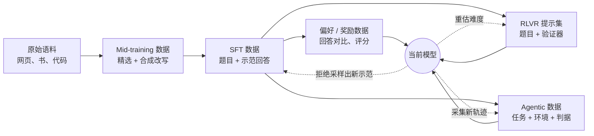
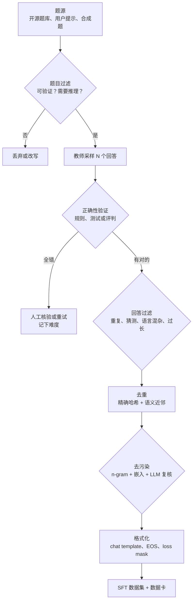
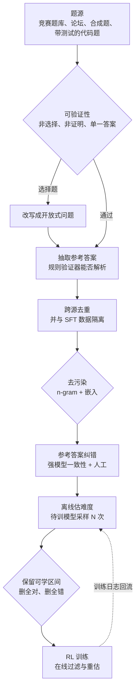
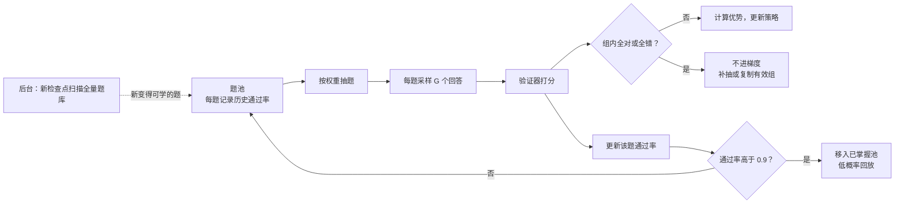
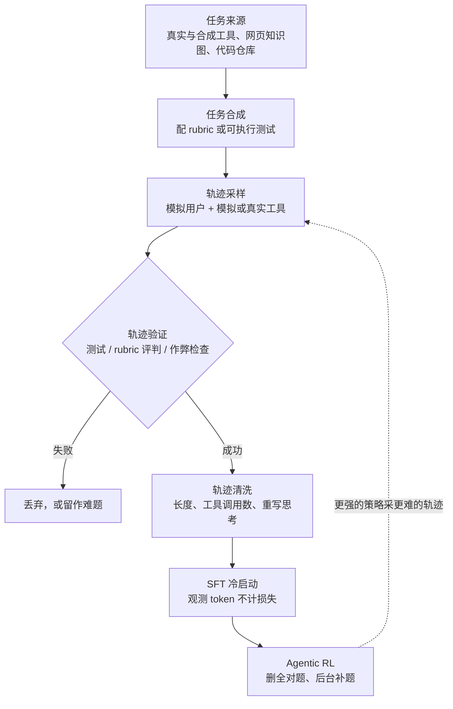
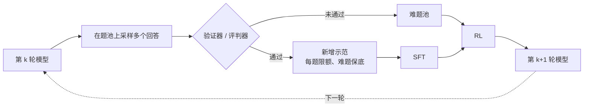

# 数据工作流：从语料到奖励信号

::: tldr
- 越往后的阶段，数据越不是“收集”来的，而是“生成 + 验证”出来的：数据工程的重心从写答案转向造验证器、控难度。
- 每批数据都要过三道门：能不能验证、是不是重复、有没有泄题；RL 题集再加一道：难度对不对。
- 二值奖励下全对或全错的组没有奖励梯度，单题的期望梯度还带着 $p(1-p)$ 这个权重：通过率居中的题最值钱；难度要用待训模型本身来估，并在训练中持续重估。
- 训练集去污染管不到基座预训练阶段的泄漏；“少即是多”一类结论要换一个模型族、换基座发布后的新题复核。
- 如果只读一节：读[难度与课程](#difficulty)。
:::

后训练的数据工作流，是把原始语料、人工示范和模型自己的输出，逐步加工成每个阶段真正吃进去的东西——SFT 的示范、偏好对、RL 的“提示 + 验证器”、智能体的“任务 + 环境”。每一步都要过同样三道门：**能不能验证、是不是重复、有没有泄题**；到了 RL 阶段再加一道：**难度对不对**。

::: human
训练像教学生，数据工作流就是备课：选题、写标准答案、删掉重复题和考试原题，再按学生当前的水平排好顺序。算法决定怎么讲，备课决定讲什么。
:::

各阶段的数据细节在对应专题里：[中训练语料](/topics/mid-training)、[SFT 数据配方](/topics/sft#data-recipes)、[环境合成](/topics/multi-env#synthesis)。这一页只讲横跨阶段的**流程**：有哪些步骤，每一步要做什么决定、设什么质量门，依据来自哪些工作。

## 一张图看数据怎么流 {#map}

| 阶段 | 数据单元 | 最关键的质量门 | 细节 |
|---|---|---|---|
| Mid-training | 高质量语料、合成改写、长文档 | 质量打分、去重、配比 | [中训练](/topics/mid-training) |
| SFT | （题目，示范回答） | 回答正确性、风格一致、去污染 | [本页](#sft-pipeline)、[SFT](/topics/sft#data-recipes) |
| 偏好 / 奖励 | （题目，较好回答，较差回答）或评分 | 判别者是否可靠、长度偏置 | [奖励设计](/topics/rl-for-llm#reward-design) |
| RLVR | （题目，参考答案或测试，验证器） | 可验证性、难度落在可学区间 | [本页](#rlvr-pipeline) |
| Agentic | （任务，环境，判据） | 环境可复现、整条轨迹可验证 | [本页](#agentic-data)、[多环境](/topics/multi-env#anatomy) |

从左往右看，数据越来越不是“收集”来的，而是“生成 + 验证”出来的：SFT 的回答来自教师模型，RL 的回答来自模型自己，智能体的轨迹来自模型与环境的交互。数据工程的重心也随之从“写答案”转到“造验证器、控难度”。

还有一个跨阶段的约束：同一道题在不同阶段的角色不同。MiniMax-M1 专门把 RL 题与 SFT 数据严格隔离，理由是 SFT 阶段见过的题泄漏到 RL，会“妨碍探索、削弱训练效果”[^mm1]；Qwen3 也要求推理 RL 的题没有在冷启动阶段用过[^qwen3]。

## SFT 数据流水线 {#sft-pipeline}

SFT 数据的作用是**示范**：教模型格式、风格和推理模式。<Term t="long-cot">长 CoT</Term> 时代，SFT 数据几乎都是“题目来自人类或合成，回答来自教师模型”，所以质量门主要设在回答一侧。

### 题目：先问“值不值得教”

- **来源**：开源题库（如 [NuminaMath](/library/?id=numinamath)）、真实用户提示，以及<Term t="synthetic-data">合成</Term>题目。合成题目的两条经典路线：[Self-Instruct](/library/?id=self-instruct) 从少量种子任务出发让模型扩写新指令[^selfinstruct]；[Magpie](/library/?id=magpie) 只给对齐模型喂 chat template 里“用户发言之前”的前缀，让它自己补出用户问题。
- **过滤**：Qwen3 冷启动数据的题目过滤有三条规则——删掉不易验证的（含多个子问题、泛泛的文本生成），删掉不写 CoT 也能答对的，按领域打标签保持平衡[^qwen3]。第二条值得单独强调：不需要推理就能答对的题，教不会模型推理。
- **选择**：对强基座，少量精选题就够（见[数据效率](#data-efficiency)）；s1 按难度、多样性、质量三条标准只挑出 1,000 题[^limo-s1]。

### 回答：蒸馏、拒绝采样与过滤

- **<Term t="rejection-sampling">拒绝采样</Term>**：教师对每题采样多次，只留验证正确的回答。DeepSeek-R1 用推理 RL 收敛后的检查点这样做，得到约 60 万条推理 SFT 数据[^r1]（后续用法见[数据飞轮](#flywheel)）。
- **按领域选验证方式**：数学用规则验证器（如 [Math-Verify](/library/?id=math-verify)），代码用单元测试（KodCode 对每题采样 3 次、按测试拒绝[^kodcode]），规则判不了的交给生成式评判（DeepSeek-R1 这一阶段的部分数据用 DeepSeek-V3 做判定[^r1]）。
- **回答过滤**：Qwen3 列出六条剔除标准——最终答案错误、大量重复、明显靠猜、思考与总结不一致、语言混杂或风格突变、与验证集过于相似[^qwen3]；DeepSeek-R1 还滤掉了语言混杂、超长段落和夹杂代码块的思维链[^r1]。
- **教师总失败的题别急着扔**：Qwen3 对 QwQ-32B 一直做错的题交给人工核验[^qwen3]；KodCode 给难题最多 10 次重试，用成功率标难度，10 次都失败才丢弃[^kodcode]。一次失败就扔，数据集会整体滑向简单题。

### 去重、去污染与格式化

- **<Term t="deduplication">去重</Term>**：KodCode 在每个子集内用 all-mpnet-base-v2 嵌入 + FAISS 近邻检索做语义去重[^kodcode]；[Big-Math](/library/?id=big-math) 用 SemDeDup。多个开源集合并时还要跨源去重。
- **<Term t="decontamination">去污染</Term>**：Open-R1 沿用 s1 的做法，把题目小写、规整空白后做词级 8-gram 匹配，对照 AIME 2024/2025、MATH-500、GPQA、LiveCodeBench 删除命中样本[^openr1]。完整流程见[去污染](#contamination-case)。
- **格式化**：<Term t="chat-template">chat template</Term>、EOS 与思考标签是最常见的“静默 bug”。Open-R1 的提醒很具体：Qwen 基座自带模板，SFT 时 EOS 必须设成 `<|im_end|>`；R1-Distill 的默认模板会丢弃 `<think>` 与 `</think>` 之间的内容并预填 `<think>`，拿它做 GRPO 前要改写模板，否则格式奖励失真[^openr1]。

## RLVR 数据流水线 {#rlvr-pipeline}

RL 提示集和 SFT 数据看着像，要求却不同：RL 不需要示范回答，只需要**题面 + 能自动判定的参考**。它最怕两件事：<Term t="verifier">验证器</Term>判错（假阳性可被钻空子，假阴性压制正确写法），以及难度不对（全对或全错都没有梯度，见[下一节](#difficulty)）。工业报告的数据章节几乎都围绕这两点展开。

### 题源：竞赛题、程序合成题与带测试的代码题

- **竞赛数学**：DAPO 从 AoPS 网站和官方竞赛主页爬取并人工标注[^dapo]；Open-Reasoner-Zero 汇集了 AIME（只取到 2023 年）、MATH、NuminaMath、Tulu3 MATH、OpenR1-Math-220k 等来源[^orz]；MiniMax-M1 从公开来源和官方竞赛整理出数十万道竞赛级题目，再层层筛到约 5 万[^mm1]。
- **程序合成题**：逻辑谜题用“生成器 + 验证器”批量产出、难度可调。Seed-Thinking-v1.5 覆盖 24 点、迷宫、数独等 22 类任务，约 1 万题[^seed]；MiniMax-M1 用 [SynLogic](/library/?id=synlogic) 合成 41 类任务，约 5.3 万题[^mm1]。这类题天然不会撞上旧基准，答案可验证，难度参数可以随训练调高。更多程序化环境见[多环境](/topics/multi-env#synthesis)。
- **代码**：竞赛题库自带测试最省事；合成题（如 [KodCode](/library/?id=kodcode)）要连测试一起合成并互验；测试缺失时再生成，见下文“代码题”。

### 可验证性：先删掉能蒙对的题

- **删题型**：Kimi k1.5 剔除选择、判断和证明题[^k15]，MiniMax-M1 剔除含多个子问题、证明和判断题[^mm1]，MiMo 与 Open-Reasoner-Zero 剔除证明题和选择题[^mimo][^orz]。选择题也可以改写成开放式问题回收，Big-Math、MiniMax-M1、Seed-Thinking-v1.5 都这么做[^mm1][^seed]。
- **删“易 hack”的题**：有些难题的答案本身很好猜。Kimi k1.5 对通用问答题让模型不写 CoT 直接猜，8 次以内猜中就删掉[^k15]。
- **确认规则能读懂答案**：MiniMax-M1 先用内部模型从参考解中抽出最终答案，只保留规则检查器能正确解析的样本[^mm1]。

### 答案归一化与验证器 {#answer-normalization}

规则验证分三步：**抽取**（从回答里找出最终答案，通常优先 `\boxed{}`）→ **<Term t="answer-normalization">归一化</Term>**（清洗 LaTeX、单位、百分号，转成 SymPy 等统一表示）→ **比较**（字符串、符号等价、数值容差依次尝试）。每一步都在决定奖励的假阴性和假阳性。

- **假阴性有多严重**：Hugging Face 把 Open LLM Leaderboard 的数学判分器换成 Math-Verify 后重评了 3,751 个模型，平均每个模型多判对 61 题、MATH-Hard 分数平均涨 4.66 分；Qwen 系列分数翻倍以上，DeepSeek 系列接近三倍——后者习惯把答案写进 `\boxed{}`，旧判分器抽不出来[^mv]。放到 RL 里，这就是一个惩罚正确写法的奖励。
- **假阳性要靠刻意的不对称**：Math-Verify 在参考答案是不等式、模型给出区间时判对，反过来则判错，防止模型把题目里的不等式原样抄回来骗分[^mvrepo]。
- **参考答案解析失败时跳过**：Open-R1 在参考答案无法解析时把奖励记为 `None`、跳过该样本，而不是给 0 分[^openr1]——否则是在惩罚数据错误。
- **数据侧的取舍**：DAPO 把答案统一改写成整数（例如答案形如 $\frac{a+\sqrt b}{c}$ 时，让模型改写题目使答案变为 $a+b+c$），得到 1.7 万题的 DAPO-Math-17K，答案用简单规则就能解析[^dapo]；Seed-Thinking-v1.5 也“尽可能”改成整数[^seed]。MiMo 反其道而行，保留原题不改写，理由是尽量减少奖励作弊[^mimo]。
- **规则覆盖不了时用模型验证器**：Kimi k1.5 的人工抽检中，传统 value-head 奖励模型判等价的准确率约 84.4，带 CoT 的奖励模型达 98.5[^k15]；Seed-Thinking-v1.5 的 Seed-Verifier 在人工标注测试集上为 82.7%，会思考的 Seed-Thinking-Verifier 为 99.3%[^seed]。

::: human
判卷前先统一写法：1/2、0.5、50% 都算同一个答案；但把题目条件原样抄一遍，不能算作答案。判卷规则一旦有漏洞，RL 会比学生更快找到它。
:::

### 代码题：测试用例就是奖励

代码 RL 的奖励完全由测试决定，测试的质量就是奖励的质量。

- **测试不够就生成，但要交叉验证**：Kimi k1.5 让基座模型借助 CYaRon 库为每题生成 50 组测试，每组都拿 10 份标准提交去跑，至少 7 份结果一致才算有效测试；至少 9 份标准提交全部通过的题才入库。1,000 道网络竞赛题里约 614 道不需要特判，463 个生成器产出了至少 40 组有效测试，最终入库 323 题[^k15]。
- **标准解也要被测试检验**：MiMo 删掉没有测试的题；有标准解的题，要求标准解通过全部测试；没有标准解的题，若强推理模型 16 次采样都过不了任何测试就删掉[^mimo]。MiniMax-M1 对缺测试的题用 MiniMax-Text-01 生成完整测试套件，再按通过率筛题[^mm1]。
- **判题是吞吐瓶颈**：MiMo 为每轮成千上万道题、每题可能数百个测试专门做了并行在线判题环境[^mimo]。开源侧可用 [SandboxFusion](/library/?id=sandbox-fusion) 或 Open-R1 支持的 E2B、Morph、Piston 等沙箱[^openr1]。

### 去重、隔离与参考答案纠错

- **跨源去重**：Guru 把 OR1（Skywork-OR1 数据）的 105,055 题与 DAPO 的 17,917 题合并，去重后剩 117,192 题，再删去答案超过 100 个字符的样本，剩 116,632 题[^guru]。MiniMax-M1 在所有 RL 数据源之间做嵌入去重[^mm1]。
- **去污染**：MiniMax-M1 同时用 n-gram 和嵌入对常用数学基准去污染[^mm1]；MiMo 做全局 n-gram 去重与去污染[^mimo]；DeepMath-103K 用语义匹配[^deepmath]。
- **参考答案纠错**：Seed-Thinking-v1.5 让强推理模型对每题作答多次；如果这些回答与参考答案不一致，但彼此高度一致、或只用了很少的推理 token，就判定参考答案可疑，交专家复核[^seed]。MiMo 先剔除强推理模型也做不出的题，因为它们“要么太难，要么答案有错”[^mimo]。即便如此仍会漏：DeepMath-103K 发布后发现 48 条题面泄露了答案，事后修正[^deepmath]。

## 难度与课程：为什么“一半对一半错”的题最值钱 {#difficulty}

### 全对或全错的组没有梯度

设奖励为二值 $r(x,y)\in\{0,1\}$，提示 $x$ 在当前策略下的<Term t="pass-rate">通过率</Term>为 $p=\Pr_{y\sim\pi_\theta(\cdot\mid x)}[r(x,y)=1]$。<Term t="grpo">GRPO</Term> 对 $x$ 采样 $G$ 个回答，组内优势 $\hat A_i=\big(r_i-\operatorname{mean}(r)\big)/\operatorname{std}(r)$。如果 $G$ 个回答全对或全错，组内奖励没有差异，所有 $\hat A_i=0$，这道题对奖励项的梯度贡献为零。$G$ 次独立采样结果全部相同的概率是

$$
P_0(p)=p^{G}+(1-p)^{G}
$$

| 通过率 $p$ | 0.05 | 0.1 | 0.3 | 0.5 | 0.7 | 0.9 | 0.95 |
|---|---|---|---|---|---|---|---|
| $G=8$ 时整组白算的概率 | 66% | 43% | 5.8% | 0.8% | 5.8% | 43% | 66% |
| $G=16$ 时整组白算的概率 | 44% | 18.5% | 0.3% | ≈0 | 0.3% | 18.5% | 44% |

两端很陡：$G=8$ 时，通过率 0.9 的题有 43% 的概率整组白算，$p=0.5$ 时只有 0.8%。加大 $G$ 能缓解，但采样成本随之线性增长。

“不为零”还不够。把单道题的梯度拆开看（推导见下方）：

$$
\nabla_\theta\, p_\theta(x)=p\,(1-p)\,\big(\mu_+-\mu_-\big)
$$

其中 $\mu_+$、$\mu_-$ 分别是答对、答错的回答上得分函数 $\nabla_\theta\log\pi_\theta(y\mid x)$ 的条件均值，可以理解为“往答对方向走”和“往答错方向走”的平均方向。前面的 $p(1-p)$ 是伯努利方差：$p=0.5$ 时为 0.25，$p=0.05$ 时只有 0.0475，约为前者的五分之一。组内估计量的期望权重是 $(1-1/G)\,p(1-p)$，同样在中间最大。所以中等难度的题同时占两头：几乎不会整组白算，每组携带的“对错对比”也最强。Online Difficulty Filtering 一文对在线<Term t="difficulty-filtering">难度过滤</Term>做了形式化分析，论证了为什么中等难度的题带来更大的期望改进，并用实验验证了效果[^odf]。

::: derive 从 p(1−p) 到动态采样的成本
**① 总体梯度。** 记 $s(y)=\nabla_\theta\log\pi_\theta(y\mid x)$，$\mu_+=\E[s\mid r=1]$，$\mu_-=\E[s\mid r=0]$。由<Term t="log-derivative-trick">对数导数技巧</Term>，$\nabla_\theta p=\E_y[\,r\,s(y)\,]=p\,\mu_+$。又因为 $\E[s]=p\,\mu_++(1-p)\,\mu_-=0$，得 $\mu_-=-\frac{p}{1-p}\,\mu_+$，代回：

$$
p(1-p)(\mu_+-\mu_-)=p(1-p)\,\mu_++p^{2}\mu_+=p\,\mu_+=\nabla_\theta p
$$

**② 组内估计。** 设 $G$ 个回答里答对 $K$ 个，$\hat p=K/G$，$\hat s_+$、$\hat s_-$ 为组内答对、答错回答的 $s$ 均值（$0<K<G$ 时有定义）。以组均值为基线、不除标准差时：

$$
\hat g=\frac{1}{G}\sum_{i=1}^{G}(r_i-\hat p)\,s_i=\hat p\,(1-\hat p)\,(\hat s_+-\hat s_-)
$$

对 $K\sim\mathrm{Binomial}(G,p)$ 取期望：$\E[\hat p(1-\hat p)]=p-\big(p^2+\frac{p(1-p)}{G}\big)=\big(1-\frac1G\big)\,p(1-p)$。

**③ 除以标准差。** GRPO 再除以组内标准差 $\hat\sigma=\sqrt{\hat p(1-\hat p)}$（忽略有偏/无偏估计的常数因子），得到 $\tilde g=\sqrt{\hat p(1-\hat p)}\,(\hat s_+-\hat s_-)$。$G=8$ 时，“1 对 7 错”组与“4 对 4 错”组的权重比从 0.44 变成 0.66：归一化相对放大了接近全对、全错的组，这正是 Dr. GRPO 指出的题目级难度偏置[^drgrpo]。但对 $K\in\{0,G\}$ 的组，两种写法都是零，归一化救不回来。

**④ 动态采样的代价。** 要凑满 $B$ 道“组内有差异”的题，期望要抽 $B/\bar q$ 道，其中 $\bar q=\E_{x\sim\mathcal D}\big[1-p_x^{G}-(1-p_x)^{G}\big]$。例如 $G=8$、题库里 60% 的题通过率约 0.95、40% 约 0.5，则 $\bar q\approx0.60$，每步要多采约 67% 的题。训练越往后，已掌握的题越多，这个倍数越大。

**⑤ 离线估计的噪声。** 用 $N$ 次采样估计的 $\hat p$ 标准误为 $\sqrt{p(1-p)/N}$（$N=8$、$p=0.5$ 时约 0.18）。真实 $p=0.1$ 的题被观测成 $0/N$ 的概率是 $0.9^{N}$：$N=8$ 时 43%，$N=16$ 时 18.5%，$N=32$ 时 3.4%。对称地，$p=0.9$ 的题也有同样概率被误当成“全对”删掉。

以上在序列级、二值奖励下推导，忽略了裁剪、KL 与 token 级归一化。这些细节不改变“全对、全错组的奖励梯度为零”这一结论（KL 等正则项仍然有梯度）。
:::

::: human
全班都会或全班都不会的题，考了等于没考：分不出谁对谁错，老师就不知道该表扬什么、纠正什么。一半人会的题，最能看出差别。
:::

### 离线过滤：七份配方的难度门

| 工作 | 用谁、怎么估难度 | 保留或剔除 | 训练中怎么更新 |
|---|---|---|---|
| [Kimi k1.5](/library/?id=kimi-k1-5) | SFT 模型高温采样 10 次 | 预先滤掉大部分平凡题；通用问答题中不写 CoT 猜 8 次能中的删掉 | 先全集热身再专攻难题；按 $1-s_i$ 优先采样[^k15] |
| [Seed-Thinking-v1.5](/library/?id=seed-thinking-1-5) | Doubao-Pro 1.5 多次采样 | 最差一次也答对（worst-of-N 为 1）的题删掉 | 逻辑谜题按模型表现逐步调难度[^seed] |
| [MiniMax-M1](/library/?id=minimax-m1) | 强推理模型 pass@10 | 数学题只留通过率严格介于 0 与 0.9 之间的，约 5 万题 | 合成逻辑题随训练提高难度[^mm1] |
| [MiMo-7B](/library/?id=mimo) | 先用强模型剔除做不出的题，再用 SFT 版采样 16 次 | 删通过率高于 90% 的题（报告称由此移除约 50% 的简单题） | 全对题进“简单池”，以 10% 概率回放[^mimo] |
| [Skywork-OR1](/library/?id=skywork-or1) | 按目标模型（1.5B/7B/32B）各采样 16 次 | 只留 1–15/16 | 在线剔除已全对的题，并拒绝零优势组[^skywork] |
| [POLARIS](/library/?id=polaris) | 待训模型采样 8 次 | 删 8/8 全对的题 | 每阶段结束删准确率高于 0.9 的题[^polaris] |
| [Open-Reasoner-Zero](/library/?id=open-reasoner-zero) | LLM 估计通过率 | 删通过率过高或为零的题 | 从 32B 训练记录里挖出 64 次对不到 4 次的约 1.3 万题，最后 100 步专攻[^orz] |

这张表背后有四条共识：

1. **难度是相对模型的。** POLARIS 用 R1-Distill 的 1.5B 和 7B 各采 8 次评估 DeepScaleR-40K：1.5B 看到的是大量 0/8 的“镜像 J 形”，7B 看到的是大量 8/8 的“J 形”，同一份数据对 7B 太简单[^polaris]。所以要用**待训模型本身**估难度，Skywork-OR1 甚至为每个尺寸单独筛一份[^skywork]。
2. **上限比下限更有讲究。** 删全对题几乎总是对的；但在 POLARIS 的对照里，只保留通过率不超过 4/8 的题反而变差[^polaris]：剩下的题大量整组全错，而 5/8–7/8 这类仍然携带梯度的题也被一并删掉了。
3. **估计本身有噪声。** $N$ 太小时边界题会被误删（见推导 ⑤）。MiMo 发现把全对题整体删掉会让策略更新不稳定，改成保留一个“简单池”按 10% 概率回放[^mimo]。
4. **通过率为 0 不一定是太难。** 也可能是参考答案错了；MiMo、Seed-Thinking-v1.5 都先用强模型把这类题捞出来再判断[^mimo][^seed]。Kimi K2 与 Qwen3 的表述更概括：前者用 SFT 模型的 pass@k 只选中等难度的题[^k2]，后者要求题目“对冷启动模型可学、同时尽可能难”[^qwen3]。

### 在线过滤与课程

离线过滤只管开局。模型每训练一段就变强一截，题目的难度随之漂移，所以工业配方都会在训练中持续重估。

- **<Term t="dynamic-sampling">动态采样</Term>**：DAPO 过采样后丢掉准确率为 0 或 1 的组，一直采到批次里全是“组内有差异”的题为止[^dapo]。代价是推导 ④ 里的 $1/\bar q$，训练后期会显著上升，MiMo 就观察到了“采样效率急剧下降”[^mimo]。算法细节见[算法谱系](/lenses/algorithms#dapo)。
- **更省的变体**：WebSailor 的 DUPO 在训练前先删掉 8 次全对的题，训练中用同一批次里标准差非零的组复制补位，比 DAPO 的动态采样快约 2–3 倍[^websailor]；GRESO 利用训练动态预测哪些题这一轮大概率仍是零方差，在 rollout 之前就跳过它们[^greso]。
- **<Term t="curriculum-learning">课程</Term>与优先采样**：各家做法见上表最后一列。Kimi k1.5 按 $1-s_i$ 的比例抽题（$s_i$ 是第 $i$ 题的历史成功率）[^k15]；POLARIS 除了每阶段剔除高准确率的题，还逐阶段调高采样温度[^polaris]。
- **后台补池**：[Tongyi DeepResearch](/library/?id=tongyi-deepresearch) 用中间检查点在全量题库上重新采样，把“新变得中等难度”的题攒进备用池；训练到一定步数或奖励进入平台期时，剔除已掌握的题、换入备用池里的新题，整个过程不打断主训练[^tongyi]。

一个可选的设计：按 $1-s_i$ 加权会把最大权重给 $s_i\approx0$ 的题。题池里若有大量暂时做不出的题，可以先用 $0<s_i<1$ 过滤再加权，或直接按 $s_i(1-s_i)$ 这类偏向中间的权重抽题——它与上面的 $p(1-p)$ 分析一致。

## Agentic 数据：任务、环境与轨迹 {#agentic-data}

智能体数据的基本单元不再是（题，答案），而是（任务，<Term t="environment">环境</Term>，判据）：环境负责给观测，判据负责判成败。数据工作流因此多出两道工序——**造任务和环境**、**验证整条<Term t="trajectory">轨迹</Term>**。环境本身的工程（沙箱、并发、可复现）见[多环境与环境工程](/topics/multi-env#synthesis)。

### 任务与环境合成

- **工具使用**：[Kimi K2](/library/?id=kimi-k2) 从 GitHub 抓取 3,000 多个真实 MCP 工具，再按“类别 → 应用领域 → 工具”层级演化出 2 万多个合成工具；给不同工具组合配上系统提示，得到数千个智能体；每个任务都配 rubric，写明成功标准、预期的工具用法和检查点[^k2]。
- **信息检索**：[WebSailor](/library/?id=websailor) 在真实网页上随机游走构建知识图，采样子图出题，再把精确信息模糊化（如把具体年份改成“5 世纪中叶”），造出初始不确定性很高的难题[^websailor]；WebShaper 反过来“先形式化任务、再按形式化结构让智能体扩写问题”，避免先搜资料再拼题带来的结构错位[^webshaper]。
- **软件工程**：[SWE-Gym](/library/?id=swe-gym) 取自 11 个 Python 仓库的约 2,400 个真实任务[^swegym]；[R2E-Gym](/library/?id=r2e-gym) 的 SWE-GEN 直接从 commit 反推可执行环境，不依赖人写的 PR 和测试，得到 13 个仓库的 8,100 多道题[^r2egym]；[SWE-smith](/library/?id=swe-smith) 通过在仓库里合成 bug 批量造出约 5.2 万个任务实例[^swesmith]。

### 轨迹合成与拒绝采样

- **Kimi K2**：LLM 生成的用户画像与智能体多轮对话；工具调用交给一个“功能上等价于世界模型”的模拟器执行，它维护状态、并引入可控随机性制造部分失败和边界情况；LLM 评判按 rubric 只留成功轨迹，报告称这相当于大规模拒绝采样。编程与 SWE 场景则换成真实沙箱，以测试通过率为准[^k2]。
- **WebSailor**：专家推理模型的原始思考冗长且风格强烈，直接模仿会带来“风格污染”和上下文爆炸。它只保留成功轨迹的“动作-观测”序列，再用另一个模型为每一步补写简短的思考。RFT 冷启动只用了 2,000 多条轨迹，过三道筛：最终答案正确、长度不超过 32k token、工具调用多于 5 次[^websailor]。
- **SWE-Gym**：用 GPT-4o 和 Claude 3.5 Sonnet 采样的不到 500 条成功轨迹微调 32B 模型，在 SWE-Bench Verified 上带来 14 个百分点的绝对提升[^swegym]。

### 轨迹验证与 RL 阶段的题池运营

- **判据分层**：可执行测试最硬，其次是 rubric + LLM 评判，纯 LLM 评判最软。Kimi K2 在指令遵循任务里额外加了一层 hack 检查，专抓“声称已完成、实际没做”的回答[^k2]。
- **观测不计损失**：训练时把环境返回的 token 从损失中屏蔽（WebSailor[^websailor]；细节见 [loss mask](/topics/agentic-rl#loss-mask)）。
- **题池运营**：DUPO 训练前删掉 8 次全对的题[^websailor]；Tongyi DeepResearch 过滤“总是失败或总是成功”的题，并在后台持续补充新变得中等难度的题。它的报告给出一条经验：智能体 RL 的成败更取决于数据质量和训练环境的稳定性，而不是具体算法[^tongyi]。

::: insight 智能体的难度控制为什么更要前置
一次智能体 rollout 可能包含几十次工具调用，全对或全错的组浪费的是分钟级的环境时间，而且同步重采样会让慢样本拖住整个批次。所以智能体配方普遍把难度过滤移到训练之前，训练中用复制有效组、后台补池来代替同步重采样。
:::

## 数据效率：少即是多的边界 {#data-efficiency}

| 工作 | 现象 | 能推出 | 推不出 |
|---|---|---|---|
| [LIMO](/library/?id=limo) / [s1](/library/?id=s1)（SFT） | 817 / 1,000 条精选长 CoT 让 32B 模型推理能力大涨 | 基座已有知识时，选题和回答质量比数量重要 | 小模型、弱基座也能这样（LIMR 发现 7B 上 SFT 版本明显变差[^limr]，另见 [small-models-struggle](/library/?id=small-models-struggle)） |
| [1-shot RLVR](/library/?id=one-shot-rlvr) | 1 道题就让 Qwen2.5-Math-1.5B 在 MATH500 上大幅提升[^oneshot] | RLVR 在很大程度上是激发、重塑已有能力 | 题目不重要；换模型族、换干净基准同样成立 |
| [LIMR](/library/?id=limr) | 8,523 题中挑出的 1,389 题追平全量，同规模随机子集明显更差[^limr] | RL 题集冗余很多，按学习动态选题有效 | 选题是免费的（LIM 要先完整训练一次）；结论能迁移到其他模型族 |
| [Qwen3](/library/?id=qwen3) | 推理 RL 只用了 3,995 个“题目-验证器”对，235B 模型 170 步内 AIME’24 从 70.1 升到 85.1[^qwen3] | 题目“可学且尽量难”时，题量可以很小 | 题少就省算力（它用了大批量和每题大量 rollout） |

这些“少即是多”的结果都依赖强基座和精挑细选的题，而且大多是在 Qwen2.5 系列和 MATH/AIME 上得到的——恰好是下一节污染问题最集中的组合。对工程实践更稳妥的读法是：**先把题集做“对”（可验证、难度匹配、去冗余），再决定要多少**。LIMR 的学习影响度（LIM）给出了一个可操作的“对”：在全量题上先训一遍，按每题奖励曲线 $r_i^{k}$ 与平均曲线 $\bar r^{k}$ 的吻合度打分，

$$
s_i=1-\frac{\sum_{k=1}^{K}\big(r_i^{k}-\bar r^{k}\big)^2}{\sum_{k=1}^{K}\big(1-\bar r^{k}\big)^2}
$$

其中 $k$ 是训练轮次，$K$ 是总轮数；取 $s_i>0.6$ 得到 1,389 题[^limr]。

## 去污染：从一场争论到一套流程 {#contamination-case}

2025 年春夏，几项“RL 几乎不需要好数据”的结果集中出现在 Qwen2.5-Math 与 MATH-500 这类组合上：随机甚至错误的奖励也能让 Qwen2.5-Math-7B 大幅涨分，换成 Llama、OLMo 则基本无效（[伪奖励](/library/?id=spurious-rewards)）[^spurious]；而 Qwen2.5 只看半截题面，就能续写出 MATH-500 等基准的原题，对它发布之后才出现的基准则做不到[^memo]。“激发已有先验”与“预训练见过考题”这两种解释的争论见[原理视角](/lenses/principles#spurious-rewards)，续写探针等检测手段见[评测视角](/lenses/eval#contamination)。

对数据工作流，这场争论留下的结论是：**训练集去污染管不到基座预训练阶段的<Term t="contamination">数据污染</Term>**。你能控制的只有两件事：训练数据别再加一层泄漏；评测别只用可能被见过的基准，要用基座发布之后的新题、可程序生成的题，并至少换一个模型族交叉验证。下面是训练数据一侧的流程。

### 一套可执行的去污染流程

1. **列清单**：所有要对外报告的基准及其变体，例如不同年份的 AIME、MATH-500 与 MATH 测试集、LiveCodeBench 的时间窗口。
2. **词级 n-gram**：文本小写、规整空白后做 8-gram 匹配，命中即删（Open-R1 与 s1 的做法[^openr1]）。AI2 的 open-instruct 脚本用 Elasticsearch 建索引，按“测试题中被单个训练样本覆盖的 token 比例”打分；注意它默认每次只取 100 个命中，去污染时要调大并事后复查[^openinstruct]。
3. **语义层**：用嵌入检索召回相似的训练样本（MiniMax-M1 用 n-gram + 嵌入[^mm1]，DeepMath-103K 用语义匹配[^deepmath]）。
4. **LLM 复核**：对召回的候选让 LLM 判断是不是同一道题，专抓改写和翻译过的题。LMSYS 的实验表明，只做 n-gram 时，13B 模型在改写过的测试题上训练后能在多个基准上逼近 GPT-4[^llmdecon]。
5. **查合成数据**：教师模型生成的数据同样可能带出基准题[^llmdecon]；Qwen3 在过滤回答时专门剔除与验证集过于相似的样本[^qwen3]。
6. **查模型**：对基座做“半截题补全”探针，并在基座发布之后的新题上复测[^memo]。
7. **留一份从未参与筛选的验证集**：Qwen3 在生成候选回答之前就预留了验证查询[^qwen3]。

## 数据飞轮 {#flywheel}

RL 让模型变强，变强的模型又能拒绝采样出更好的 SFT 数据，再训出更强的模型——这就是<Term t="data-flywheel">数据飞轮</Term>。学术原型是 STaR：让模型写推理、只留答对的、微调、再循环[^star]；ReST-EM 把它写成 EM 算法：E 步采样并按二值奖励过滤，M 步在过滤后的数据上微调，实验发现这样的自训练明显优于只用人类数据微调[^restem]。

工业界的几个实例：

- **DeepSeek-R1**：推理 RL 收敛后，从检查点拒绝采样约 60 万条推理数据，加上约 20 万条非推理数据，用这约 80 万条样本重新微调 DeepSeek-V3-Base 两个 epoch，再做全场景 RL；同一份数据还用来蒸馏小模型[^r1]。
- **Qwen3**：第三阶段“思考模式融合”所需的思考数据，由第二阶段的 RL 模型在第一阶段的题目上拒绝采样生成，目的是让新增的 SFT 不损害 RL 学到的能力[^qwen3]。
- **Kimi K2**：把上文的[智能体轨迹合成](#agentic-data)当作大规模拒绝采样，rubric 过滤后的轨迹进 SFT，之后再接 RL[^k2]。
- **[Llama 3](/library/?id=llama3)**：多轮后训练，每轮用上一轮最好的检查点对提示采样多个回答、由奖励模型挑出最好的进入 SFT，再做 DPO[^llama3]。

飞轮转得快，也容易转偏。五个常见风险与对应的控制：

1. **越转越窄**：拒绝采样只留下模型已经会的解法，多样性逐轮下降。控制：每题接收的样本数设上限，按解法和长度去重，监控 distinct-n 等多样性指标（POLARIS 用 distinct 4-gram 衡量 rollout 多样性[^polaris]）。
2. **越转越简单**：只收成功样本，简单题的占比会上升。控制：按题而不是按样本配额，给难题保底，失败的题转给 RL 或下一轮。
3. **验证器误差被放大**：假阳性样本会被当成示范学进去。控制：用一个独立的验证器复核（规则 + 模型），并抽样人工核对。
4. **风格污染**：直接学教师的冗长思考，会连风格一起继承。WebSailor 的做法是丢掉原始思考、重写简短思考[^websailor]。
5. **自我污染**：飞轮一旦碰到评测题，泄漏会被逐轮放大。控制：每一轮都重跑去污染，而不是只在开头做一次。

## 关键工作精读 {#key-works}

<EntryGrid :ids="['math-verify', 'open-r1', 'kodcode', 'deepmath-103k', 'big-math', 'polaris', 'limr', 'guru', 'llm-decontaminator', 'sandbox-fusion']" />

- **Math-Verify**：开源数学 RLVR 最常用的判卷器之一（Open-R1、verl、MiMo 都在用）。它最值得学的是设计取舍：格式上尽量宽容（减少假阴性），关键比较上刻意不对称（堵住假阳性）。
- **Open-R1**：一份可以照着跑的推理数据配方，蒸馏、验证、去污染、通过率过滤、沙箱奖励一应俱全；更可贵的是 README 里那些踩过的坑（模板、EOS、格式奖励）。
- **KodCode**：代码数据“自带判卷器”的范式——题、解、测试三者互相验证，并用重试成功率给难题留活路。
- **DeepMath-103K / Big-Math**：两份开源数学 RL 题集，前者偏难、做了语义去污染，后者把“什么题适合 RL”写成了可执行的过滤信号。
- **POLARIS**：把“难度相对模型”讲得最清楚的公开配方，镜像 J 形分布与每阶段剔除高准确率题的做法可以直接照搬。
- **LIMR**：说明 RL 题集存在大量冗余，但 LIM 的成本与适用范围要读清楚再用。
- **Guru**：多领域 RLVR 数据的公开样板，跨领域迁移的结论能指导配比。
- **LLM Decontaminator**：去污染的第三道防线，专治改写题。
- **SandboxFusion**：代码 RLVR 的奖励后端，verl 已内置对接。

各家工业报告的数据章节是本页多数结论的出处，值得对照原文读：

<EntryGrid :ids="['kimi-k1-5', 'seed-thinking-1-5', 'minimax-m1', 'mimo', 'skywork-or1', 'qwen3', 'deepseek-r1', 'kimi-k2']" />

::: takeaway
1. **先保证可验证，再扩规模**：删掉选择、判断、证明、多小问和不写 CoT 也能猜中的题；参考答案解析失败的样本直接跳过，不要判 0 分。
2. **用待训模型估难度**：每题至少采样 8 次，边界题 16 次以上；删掉全对和全错的题，但不要只留最难的题。
3. **训练中持续重估**：每阶段结束剔除通过率高于 0.9 的题，后台用新检查点把“变得可学”的题补回来；已掌握的题留少量回放，避免训练不稳。
4. **RL 题与 SFT 数据隔离、跨源去重**，题面和合成回答都做 n-gram + 嵌入两级去污染；对外报告的基准再加一层 LLM 复核。
5. **数据效率结论要复核**：至少换一个模型族，并在基座发布之后的新题上重测。
6. **拒绝采样回流 SFT 时**，按题设配额、给难题保底、用独立验证器复核，防止飞轮越转越窄。
:::

::: pitfall
- 奖励和评测用了不同的答案抽取规则：训练曲线在涨，榜单不涨，或者反过来。
- 只采 8 次就按通过率一刀切：真实通过率 0.1 的题有 43% 的概率被当成“全错”删掉。
- 一次性删掉所有全对题：MiMo 观察到策略更新因此变得不稳定[^mimo]。
- 把答案改写成整数之后不复核：改写可能改变题意，也可能引入新的捷径。
- 直接用 R1-Distill 的默认模板做 GRPO：思考内容被模板丢弃、`<think>` 被预填，格式奖励失真[^openr1]。
- 只做 n-gram 去污染就宣称“无泄漏”：改写题和翻译题根本查不出来[^llmdecon]。
:::

## 延伸阅读 {#further-reading}

- 资料库里所有数据相关条目：[按“数据”筛选](/library/?facet=data)；只看数据集：[数据集](/library/?kind=dataset)
- 各阶段的数据细节：[Mid-training 语料](/topics/mid-training)、[SFT 数据配方](/topics/sft#data-recipes)、[环境合成与混合](/topics/multi-env#synthesis)
- 相关视角：[DAPO 与动态采样的推导](/lenses/algorithms#dapo)、[评测中的污染](/lenses/eval#contamination)、[伪奖励与污染之争](/lenses/principles#spurious-rewards)、[奖励设计](/topics/rl-for-llm#reward-design)
- 动手：[数学 RLVR：GRPO → DAPO](/practice/rlvr-math)、[SWE 智能体 RL](/practice/swe-agent)、[搜索智能体 RL](/practice/search-agent)

[^mm1]: MiniMax-M1: Scaling Test-Time Compute Efficiently with Lightning Attention，§4.1 — [arXiv 2506.13585](https://arxiv.org/abs/2506.13585)
[^qwen3]: Qwen3 Technical Report，§4.1–4.3 — [arXiv 2505.09388](https://arxiv.org/abs/2505.09388)
[^selfinstruct]: Self-Instruct: Aligning Language Models with Self-Generated Instructions — [arXiv 2212.10560](https://arxiv.org/abs/2212.10560)
[^limo-s1]: s1: Simple test-time scaling — [arXiv 2501.19393](https://arxiv.org/abs/2501.19393)；LIMO: Less is More for Reasoning — [arXiv 2502.03387](https://arxiv.org/abs/2502.03387)
[^r1]: DeepSeek-R1: Incentivizing Reasoning Capability in LLMs via Reinforcement Learning，§2.3.3 — [arXiv 2501.12948](https://arxiv.org/abs/2501.12948)
[^kodcode]: KodCode: A Diverse, Challenging, and Verifiable Synthetic Dataset for Coding，§2 — [arXiv 2503.02951](https://arxiv.org/abs/2503.02951)
[^openr1]: Open-R1 README（数据生成、去污染、GRPO 与代码奖励各节）及 src/open_r1/rewards.py — [github.com/huggingface/open-r1](https://github.com/huggingface/open-r1)
[^k15]: Kimi k1.5: Scaling Reinforcement Learning with LLMs，§2.1、§2.3.4–2.3.5 与 §3.5（课程采样消融）— [arXiv 2501.12599](https://arxiv.org/abs/2501.12599)
[^mimo]: MiMo: Unlocking the Reasoning Potential of Language Model – From Pretraining to Posttraining，§3.1–3.3 — [arXiv 2505.07608](https://arxiv.org/abs/2505.07608)
[^orz]: Open-Reasoner-Zero: An Open Source Approach to Scaling Up Reinforcement Learning on the Base Model，§2.1 — [arXiv 2503.24290](https://arxiv.org/abs/2503.24290)
[^seed]: Seed1.5-Thinking: Advancing Superb Reasoning Models with Reinforcement Learning，§2.1 与 §3.1 — [arXiv 2504.13914](https://arxiv.org/abs/2504.13914)
[^mv]: Fixing Open LLM Leaderboard with Math-Verify（Hugging Face 博客，2025-02-14）— [huggingface.co/blog/math_verify_leaderboard](https://huggingface.co/blog/math_verify_leaderboard)
[^mvrepo]: Math-Verify README，FAQ“Why is verify function not symmetric?” — [github.com/huggingface/Math-Verify](https://github.com/huggingface/Math-Verify)
[^dapo]: DAPO: An Open-Source LLM Reinforcement Learning System at Scale，§3.2 与 §3.5 — [arXiv 2503.14476](https://arxiv.org/abs/2503.14476)
[^guru]: Revisiting Reinforcement Learning for LLM Reasoning from A Cross-Domain Perspective — [arXiv 2506.14965](https://arxiv.org/abs/2506.14965)；数学数据合并与去重记录见 [Reasoning360 data_preprocess](https://github.com/LLM360/Reasoning360/tree/main/data_preprocess)
[^deepmath]: DeepMath-103K README（2025-05-08 更新说明）— [github.com/zwhe99/DeepMath](https://github.com/zwhe99/DeepMath)
[^odf]: Online Difficulty Filtering for Reasoning Oriented Reinforcement Learning — [arXiv 2504.03380](https://arxiv.org/abs/2504.03380)
[^drgrpo]: Understanding R1-Zero-Like Training: A Critical Perspective — [arXiv 2503.20783](https://arxiv.org/abs/2503.20783)
[^skywork]: Skywork Open Reasoner 1 Technical Report — [arXiv 2505.22312](https://arxiv.org/abs/2505.22312)；按模型难度筛题的脚本见 [or1_scripts/data_preprocess](https://github.com/SkyworkAI/Skywork-OR1)
[^polaris]: POLARIS: A Post-Training Recipe for Scaling Reinforcement Learning on Advanced Reasoning Models（HKU NLP 博客，2025-06-20）— [hkunlp.github.io/blog/2025/Polaris](https://hkunlp.github.io/blog/2025/Polaris)
[^k2]: Kimi K2: Open Agentic Intelligence，§3.1.1 与 §3.2.1 — [arXiv 2507.20534](https://arxiv.org/abs/2507.20534)
[^websailor]: WebSailor: Navigating Super-human Reasoning for Web Agent，§3–4 — [arXiv 2507.02592](https://arxiv.org/abs/2507.02592)
[^greso]: Act Only When It Pays: Efficient Reinforcement Learning for LLM Reasoning via Selective Rollouts — [arXiv 2506.02177](https://arxiv.org/abs/2506.02177)
[^tongyi]: Tongyi DeepResearch Technical Report（Agentic RL 一节的 Automatic Data Curation）— [github.com/Alibaba-NLP/DeepResearch](https://github.com/Alibaba-NLP/DeepResearch)
[^webshaper]: WebShaper: Agentically Data Synthesizing via Information-Seeking Formalization — [arXiv 2507.15061](https://arxiv.org/abs/2507.15061)
[^swegym]: Training Software Engineering Agents and Verifiers with SWE-Gym — [arXiv 2412.21139](https://arxiv.org/abs/2412.21139)
[^r2egym]: R2E-Gym: Procedural Environment Generation and Hybrid Verifiers for Scaling Open-Weights SWE Agents — [arXiv 2504.07164](https://arxiv.org/abs/2504.07164)
[^swesmith]: SWE-smith: Scaling Data for Software Engineering Agents — [arXiv 2504.21798](https://arxiv.org/abs/2504.21798)
[^limr]: LIMR: Less is More for RL Scaling，§2.2 与表 1 — [arXiv 2502.11886](https://arxiv.org/abs/2502.11886)
[^oneshot]: Reinforcement Learning for Reasoning in Large Language Models with One Training Example — [arXiv 2504.20571](https://arxiv.org/abs/2504.20571)
[^spurious]: Spurious Rewards: Rethinking Training Signals in RLVR — [arXiv 2506.10947](https://arxiv.org/abs/2506.10947)
[^memo]: Reasoning or Memorization? Unreliable Results of Reinforcement Learning Due to Data Contamination — [arXiv 2507.10532](https://arxiv.org/abs/2507.10532)
[^openinstruct]: open-instruct decontamination README（AI2）— [github.com/allenai/open-instruct](https://github.com/allenai/open-instruct/tree/main/decontamination)
[^llmdecon]: Rethinking Benchmark and Contamination for Language Models with Rephrased Samples — [arXiv 2311.04850](https://arxiv.org/abs/2311.04850)
[^star]: STaR: Bootstrapping Reasoning With Reasoning — [arXiv 2203.14465](https://arxiv.org/abs/2203.14465)
[^llama3]: The Llama 3 Herd of Models，§4（后训练中的拒绝采样与 DPO 迭代）— [arXiv 2407.21783](https://arxiv.org/abs/2407.21783)
[^restem]: Beyond Human Data: Scaling Self-Training for Problem-Solving with Language Models（ReST-EM，TMLR 2024）— [OpenReview](https://openreview.net/forum?id=lNAyUngGFK)
