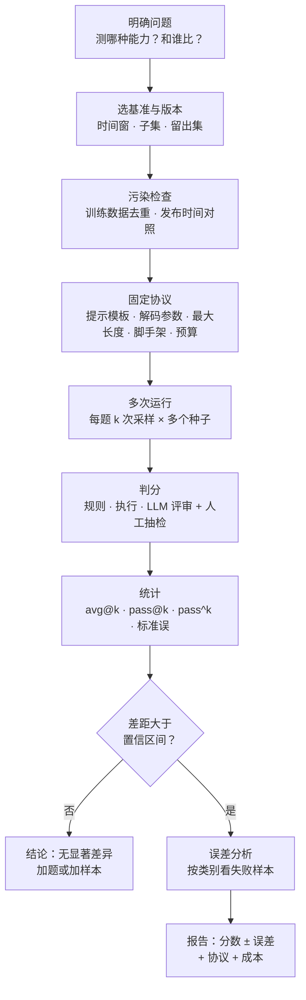
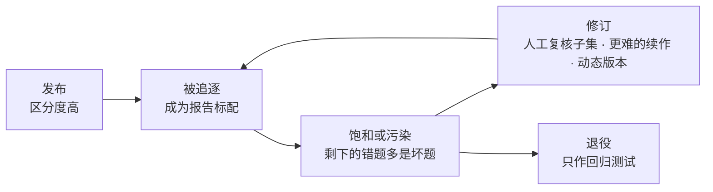
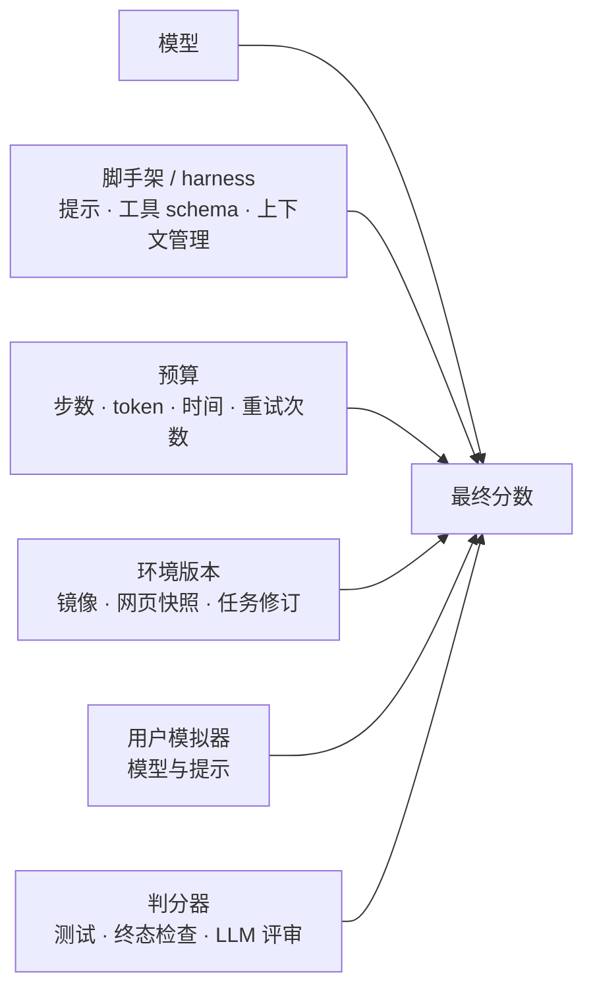

# 评测：如何知道模型真的变强了

::: tldr
- 任何分数都混着三类误差：抽样噪声、协议差异、数据问题（污染、坏题、饱和）；不带误差棒和协议说明的“提升”不可信。
- 按目的选指标：比模型用 avg@k（pass@1 的低方差估计），看能力上限用 pass@k（用无偏估计量），上线前看 pass^k。
- AIME 只有 30 题：正确率 50% 左右时，单次运行的 95% 置信区间约 ±18 个百分点；多采样只能压住题内随机性，题目抽样带来的误差只能靠加题；比较两个模型用逐题配对差。
- 智能体分数是“模型 + 脚手架 + 预算 + 环境版本 + 判分器”的系统成绩：跨报告比较先对齐协议，并抽查高分轨迹有没有走捷径。
- 如果只读一节：读 [方差：别被 30 道题骗了](#variance)。
:::

**评测**是在固定协议下，用有限的题目和有限次采样去估计模型能力的统计过程。任何一个分数都混着三类误差：**抽样噪声**（题少、采样有随机性）、**协议差异**（提示模板、解码参数、脚手架、预算、判分器各不相同）、**数据问题**（污染、标签错误、基准饱和）。只有把三者都控制住并如实报告，“A 比 B 强”才是一个可信的结论。

::: human
评测就是考试。题太少，运气成分就大；各家考场规则不一样，分数就没法比；有人提前看过卷子，或者标准答案本身就错了，分数就不代表本事。想知道谁真的进步了，这三件事都得管住。
:::

## 评测在后训练里的位置 {#position}

评测在后训练里同时扮演三个角色：

1. **研发闭环的“损失函数”**：选哪个 checkpoint、哪套数据配方、哪组超参数，都由评测决定。它的噪声会直接变成错误的研发决策。
2. **RL 的奖励本身**：在 <Term t="rlvr">RLVR</Term> 与智能体 RL 里，验证器就是一个评测器。优化得越狠，就越需要一套**和训练奖励分开**的留出评测，否则会掉进古德哈特定律：指标一旦变成目标，就不再是好指标（见 [奖励作弊](/topics/rl-for-llm#reward-hacking)）。
3. **对外的结论**：技术报告和排行榜上的分数影响别人的选型和研究方向，协议不透明的分数会误导整个社区。

Shunyu Yao 在 *The Second Half* 里把这件事推到了更高的位置：当通用配方能刷高几乎任何基准，“评测比训练更重要”，真正稀缺的是贴近真实效用的评测设定（见 [多环境与环境工程](/topics/multi-env#why)）。下面这张流程图是本页的主线——一次可信评测应该怎么做：

## 基准地图 {#benchmarks}

2024–2026 年技术报告里最常见的基准可以分成两类。单轮的推理与知识基准判分便宜、复现容易，但大多已接近 <Term t="benchmark-saturation">饱和</Term>；多轮、有状态的智能体基准更接近真实使用，但协议复杂、噪声更大。

**推理与知识（单轮）**

| 基准 | 测什么 | 规模与判分 | 2026 年状态 | 已知问题 |
|---|---|---|---|---|
| [GPQA](/library/?id=gpqa) Diamond | 研究生级生物、物理、化学四选一 | 198 题，选项匹配 | 接近饱和 | 题少，单次运行波动可达数个百分点 |
| [HLE](/library/?id=hle) | 前沿学科闭卷题（含多模态） | 2,500 题，LLM 评审判分 | 未饱和 | 以“难倒模型”为入选条件，部分参考答案有争议 |
| AIME / [MathArena](https://matharena.ai/) | 竞赛数学 | 每届 30 题，答案匹配 | 旧届次趋于饱和 | 题极少；旧题可能已进训练数据，应看新届次 |
| [LiveCodeBench](/library/?id=livecodebench) | 竞赛编程 | 持续更新（v6 共 1,055 题），测试判分 | 按时间窗使用 | 必须写明版本与题目时间窗 |
| [HumanEval](/library/?id=humaneval-codex) | 函数级编程 | 164 题，单元测试 | 已饱和 | 仅适合作 pass@k 的教学例子 |

**智能体（多轮、有状态）**

| 基准 | 测什么 | 环境与判分 | 2026 年状态 | 已知问题 |
|---|---|---|---|---|
| [SWE-bench Verified](/library/?id=swe-bench-verified) | 仓库级修 issue | 500 题，容器内跑测试 | 饱和且受污染，OpenAI 已停止报告 | 部分测试过窄或超出题面 |
| [SWE-Bench Pro](/library/?id=swe-bench-pro) | 长程、多文件修改 | 1,865 题（公开集 731 题；复核后的 V2 公开集 642 题） | 主流替代 | 脚手架、步数上限影响很大 |
| [Terminal-Bench](/library/?id=terminal-bench) 2.0 | 终端里的端到端任务 | 89 题，容器 + 测试脚本 | 未饱和 | 有的报告因联网或安全限制删题、改用内部框架 |
| [τ²-bench](/library/?id=tau2-bench) / τ³ | 遵守政策的客服工具使用 | 用户模拟 + 数据库终态 | 常用 | 用户模拟器与任务版本都会改变分数 |
| [BrowseComp](/library/?id=browsecomp) | 深度检索 | 1,266 题，短答案核对 | 常用 | 开放网络上可能检索到答案本身 |
| [OSWorld](/library/?id=osworld)-Verified | 电脑操作 | 369 题，虚拟机 + 检查脚本 | 头部已过 60%（人类约 72%） | 新旧版本不可混比 |
| [GDPval](/library/?id=gdpval) | 职业工作交付物 | 1,320 个任务（220 题公开），专家盲评 | 新兴 | 贵、慢，带主观性 |

::: details 其他常见基准
- [SWE-rebench](/library/?id=swe-rebench) 与 SWE-bench-Live：持续从 GitHub 收集新 issue 的 SWE 基准，专门用来对照污染。
- [GAIA](/library/?id=gaia) 与 [Gaia2](/library/?id=are-gaia2)：通用助手基准；Gaia2 在会随时间变化的动态环境中评测。
- [WebArena](/library/?id=webarena)：自托管网站上的 812 个网页任务，以最终状态判分。
- [METR 时间视界](/library/?id=metr-time-horizon)：不是一个基准，而是把多个按人类用时标定的任务集换算成“能完成多长的任务”，见 [下文](#time-horizon)。
- [τ-bench](/library/?id=tau-bench)、[SWE-bench](/library/?id=swe-bench)：上面两个主流基准的前身，原始版本的任务已有勘误。
:::

基准从发布到退役，基本都走同一条路：

SWE-bench 是走完这条路的典型：2023 年发布 → 2024 年 OpenAI 请工程师人工复核出 500 题的 Verified 子集 → 2025 年前后头部成绩逼近上限 → 2026 年初 OpenAI 发文说明不再评测它：这个基准已被训练数据泄漏污染，测试也有缺陷，建议改用 SWE-Bench Pro。据媒体转述，OpenAI 审计了 GPT-5.2 在 64 次独立运行中都失败的 138 道题，约 59% 有问题，最常见的是测试要求题面从未提到的函数名，或检查原问题之外的功能[^swev-audit] → SWE-Bench Pro、SWE-rebench 接棒。**饱和的真实含义往往是：剩下没做对的题里，坏题占了多数。**

## 指标：pass@k、avg@k 与 pass^k {#pass-at-k}

固定提示和解码参数后，记第 $i$ 道题的单次正确率为 $p_i$，基准共 $N$ 道题。三个最常用的指标分别是：

$$
\text{pass@1}=\frac1N\sum_{i=1}^{N}p_i,\qquad
\text{pass@}k=\frac1N\sum_{i=1}^{N}\Big[1-(1-p_i)^k\Big],\qquad
\text{pass}^k=\frac1N\sum_{i=1}^{N}p_i^{\,k}.
$$

<Term t="pass-at-k">pass@k</Term> 是“给 $k$ 次机会至少对一次”，衡量能力的覆盖面；<Term t="pass-hat-k">pass^k</Term> 是“连做 $k$ 次全对”，衡量稳定性；pass@1 是单次期望正确率，用每题 $k$ 次采样的平均正确率来估计时，就叫 <Term t="avg-at-k">avg@k</Term>：$\text{avg@}k=\frac1N\sum_i c_i/k$，其中 $c_i$ 是第 $i$ 题 $k$ 次中答对的次数。

$p_i$ 未知，只能采样估计。对每道题采 $n$ 个样本、数出 $c_i$ 个正确，Codex 论文给出的 pass@k **无偏估计量**是[^codex]

$$
\widehat{\text{pass@}k}=\frac1N\sum_{i=1}^{N}\left[1-\frac{ \binom{n-c_i}{k} }{ \binom{n}{k} }\right],\qquad n\ge k .
$$

τ-bench 对 pass^k 用的是同一思路的无偏估计 $\binom{c_i}{k}\big/\binom{n}{k}$，官方代码就是逐题计算这个比值再取平均[^tau]。

::: derive 为什么这个估计量无偏，以及为什么“直接代入”会有偏
固定一道题，$n$ 个样本独立同分布，每个以概率 $p$ 正确。从 $n$ 个样本里**均匀随机**挑出 $k$ 个（挑法与对错无关），考虑事件“挑出的 $k$ 个全错”。

- 一方面，被挑出的 $k$ 个样本本身就是 $k$ 个独立样本，所以该事件的概率是 $(1-p)^k$。
- 另一方面，给定 $n$ 个里恰有 $c$ 个正确，挑出的 $k$ 个全错的条件概率是 $\binom{n-c}{k}\big/\binom{n}{k}$。

由全期望公式，$\E_c\!\left[\binom{n-c}{k}\big/\binom{n}{k}\right]=(1-p)^k$，所以 $1-\binom{n-c}{k}\big/\binom{n}{k}$ 是 $1-(1-p)^k$ 的无偏估计。把“全错”换成“全对”，同理得到 pass^k 的无偏估计 $\binom{c}{k}\big/\binom{n}{k}$。

数值上，组合数很快溢出，官方实现用等价的连乘：
$$
\frac{ \binom{n-c}{k} }{ \binom{n}{k} }=\prod_{j=n-c+1}^{n}\Big(1-\frac{k}{j}\Big).
$$

为什么不直接用 $\hat p=c/n$ 代入？因为 $f(x)=(1-x)^k$ 与 $g(x)=x^k$ 在 $[0,1]$ 上都是凸函数，由 Jensen 不等式 $\E[f(\hat p)]\ge f(p)$、$\E[g(\hat p)]\ge g(p)$：代入法得到的 $1-(1-\hat p)^k$ 系统性**低估** pass@k，$\hat p^{\,k}$ 系统性**高估** pass^k。$n$ 越接近 $k$，偏差越大。
:::

一个数值例子能看清三者的差别：若每道题都有 $p=0.5$，则 pass@1 $=0.5$，pass@4 $=1-0.5^4\approx0.94$，pass^4 $=0.5^4\approx0.06$。真实基准里各题的 $p_i$ 不同，下降没这么剧烈，但方向一致：τ-bench 航空领域的榜单上，某模型 pass^1 为 0.460，pass^4 只剩 0.225[^tau]。

**什么时候用哪个：**

- **比较模型或 checkpoint**，默认用 avg@k（即 pass@1 的低方差估计），$k$ 取 8–64，题越少 $k$ 越大。
- **衡量能力上限或配合验证器做 best-of-n**，用 pass@k（$k\gg1$）；它也是“RL 到底有没有扩展推理边界”之争的核心指标（见 [pass@k 之争](/lenses/principles#pass-at-k-debate) 与 [这篇论文](/library/?id=rl-limit-pass-k)）。
- **面向上线的智能体**，报告 pass^k（$k\ge4$）：用户关心的是每次都办成，而不是偶尔办成。
- 三者都必须在**同一采样温度**下比较；pass@k 需要温度大于 0，否则 $k$ 个样本都一样。

## 方差：别被 30 道题骗了 {#variance}

AIME 一届只有 30 题，一道题就是 3.3 个百分点。分数的波动有好几个来源：题目本身是“抽”出来的；温度大于 0 时每次采样不同；随机种子、推理引擎的批处理与数值非确定性（见 [推理非确定性](/library/?id=tm-nondeterminism)）；提示模板、最大生成长度、截断方式；LLM 评审的随机性；智能体环境本身的不确定性（网页内容会变）。

把第 $i$ 题 $k$ 次采样的平均正确率记为 $s_i=c_i/k$，基准分 $\bar s=\frac1N\sum_i s_i$。若把 $N$ 道题看成从某个题目总体中抽出的样本，由全方差公式：

$$
\operatorname{Var}(\bar s)=\frac1N\Big(\underbrace{ \operatorname{Var}_i(p_i) }_{ \text{题目间} }+\underbrace{ \tfrac1k\,\E_i\big[p_i(1-p_i)\big] }_{ \text{题内采样} }\Big).
$$

::: derive 这个分解从哪来，以及它说明了什么
对单道题，$c_i\mid p_i\sim\text{Binomial}(k,p_i)$，所以 $\E[s_i\mid p_i]=p_i$，$\operatorname{Var}(s_i\mid p_i)=p_i(1-p_i)/k$。由全方差公式
$$
\operatorname{Var}(s_i)=\operatorname{Var}\big(\E[s_i\mid p_i]\big)+\E\big[\operatorname{Var}(s_i\mid p_i)\big]=\operatorname{Var}_i(p_i)+\tfrac1k\E_i\big[p_i(1-p_i)\big].
$$
各题独立，平均后方差除以 $N$。两个推论：

1. **加采样只能压第二项。** $k\to\infty$ 时，剩下的 $\operatorname{Var}_i(p_i)/N$ 只能靠加题降低。
2. **$k=1$ 时退化为伯努利。** 记 $\mu=\E_i[p_i]$，因为 $\E_i[p_i(1-p_i)]=\mu(1-\mu)-\operatorname{Var}_i(p_i)$，代入得 $\operatorname{Var}(\bar s)=\mu(1-\mu)/N$。AIME 取 $N=30$、$\mu=0.5$：标准误约 9.1 个百分点，95% 置信区间约 ±18 个百分点。

如果只关心“在这 30 道题上”的表现（不外推到同类题），题目间方差不计入，条件方差为 $\frac{1}{N^2}\sum_i p_i(1-p_i)/k$——这正是换随机种子重跑时看到的波动。

**一个数值例子：$k$ 次采样能压下多少。** 用下文 Sober Look 的实测数字粗算：R1-Distill-Qwen-1.5B 在 AIME'24 上每次运行（每题 1 个样本）的标准差为 4.8 个百分点，即 $\sqrt{\sum_i p_i(1-p_i)}/N\approx0.048$，得 $\E_i[p_i(1-p_i)]\approx30\times0.048^2\approx0.069$；再由均值 $\mu\approx0.287$ 得 $\operatorname{Var}_i(p_i)\approx\mu(1-\mu)-0.069\approx0.136$。取 $k=10$：题内采样一项的标准误约 1.5 个百分点（即 $4.8/\sqrt{10}$），题目间一项约 6.7 个百分点（$\sqrt{0.136/30}$），合计约 6.9 个百分点，95% 置信区间约 ±13.5 个百分点。继续加采样只能让 1.5 变小，6.7 纹丝不动。
:::

**实测的波动有多大。** [A Sober Look](/library/?id=sober-look) 在统一协议下重测了几十个开源推理模型：AIME'24、AIME'25、AMC'23 各跑 10 个种子，其余基准跑 3 个，报告均值±标准差[^sober]。这里的 ± 是不同种子之间的标准差，反映单次运行会晃多少；10 次平均后，均值的标准误约为它的 $1/\sqrt{10}$。DeepSeek-R1-Distill-Qwen-1.5B 在 AIME'24 上是 28.7±4.8，而在 500 题的 MATH-500 上是 84.9±0.3——同一模型，题少的基准标准差大了十几倍。以它为起点做 RL 的 L1-Qwen-1.5B-Max、Open-RS1、Open-RS3、Open-RS2，AIME'24 分别为 27.7±4.2、28.9±6.0、29.7±4.6、31.3±7.7，与起点的差距都小于单次运行的标准差，按 10 个种子的均值做检验也不显著；DeepScaleR-1.5B-Preview 的 37.0±6.6 高出约 8 个百分点，才算清楚的提升。论文的结论是：推理基准对解码参数、随机种子、提示格式乃至硬件与软件配置都高度敏感，很多声称的 RL 收益在统一协议下大幅缩水，SFT 方法的泛化反而更稳定。

**比较两个模型时，用配对差。** 两个模型在同一批题上作答，逐题差值 $d_i=s_{A,i}-s_{B,i}$ 的均值标准误为

$$
\operatorname{SE}(\bar d)=\sqrt{ \frac{ \operatorname{Var}(s_A)+\operatorname{Var}(s_B)-2\operatorname{Cov}(s_A,s_B) }{N} } .
$$

两个模型往往在同样的题上一起对、一起错，协方差为正，配对后的误差棒比两个独立误差棒小得多，能检出更小的真实差距。这是 Anthropic 的 Evan Miller 在 [Adding Error Bars to Evals](/library/?id=error-bars) 中的核心建议之一，同文还建议：题目成组出现时用聚类标准误，并在实验前做功效分析估算需要多少题[^miller]。训练曲线层面，经典 RL 领域的 [rliable](/library/?id=rliable) 主张用分层 bootstrap 置信区间和四分位间均值（IQM，去掉最高、最低各 25% 的运行后取平均）代替“少量种子取平均”。

::: human
比两个学生谁更强，最好让他们做同一张卷子、逐题对比，而不是各考各的再比总分：两人都会的题、都不会的题互相抵消，剩下的才是真正的差距。
:::

一套可以直接照抄的协议：

1. 固定并公开温度、top-p、最大生成长度、提示模板与推理引擎版本；截断的回答按错计，并报告截断率。
2. 小基准用 avg@k，$k\ge16$（AIME 常用 32 或 64）；报告均值 ± <Term t="standard-error">标准误</Term> 或 95% 置信区间，并写明误差棒只含重跑波动，还是也计入了题目抽样。
3. 声称“某训练方法更好”时，至少跑 3 个训练种子，而不只是 3 个评测种子。
4. 比较两个模型或两个 checkpoint 用逐题配对差。
5. 在单独的开发集上选 checkpoint 和超参数，测试集只看一次；在很多 checkpoint、很多基准里挑最好的一个报告，会系统性高估（“赢家诅咒”）。

## 污染：分数是背出来的吗 {#contamination}

<Term t="contamination">数据污染</Term>指评测样本（题面、答案、解题过程或其改写）出现在训练数据里，或在评测时能被检索到，导致分数高估了泛化能力。它有四种来源，防法各不相同：

1. **预训练与中训练泄漏**：基准题面、答案、讨论帖早已散布在网上。训练方对这一层几乎不可控，只能靠检测和换基准。
2. **后训练数据泄漏**：SFT 或 RL 题库与评测集重叠，包括改写、翻译或只改了数字的版本。
3. **评测时泄漏**：智能体能联网，就可能直接搜到答案，甚至搜到基准本身（见 [下文](#integrity)）；SWE 类任务的修复提交本来就公开在 GitHub 上。
4. **间接过拟合**：反复在同一基准上调超参数、挑 checkpoint，或者像《The Leaderboard Illusion》揭示的那样，在排行榜上先私下测试多个变体、只公开最好的一个——该研究发现 Meta 在 Llama 4 发布前测试过 27 个私有变体[^illusion-arena]。

**检测手段**，从便宜到昂贵：

- *字符串重合*：精确匹配或长 n-gram 重合，成本最低，但挡不住改写和翻译。[LLM Decontaminator](/library/?id=llm-decontaminator) 证明改写过的测试题可以轻松绕过 n-gram 检测，并提出“嵌入检索 + LLM 判定”的去污染器。
- *按发布时间对照*：同一模型在训练截止日期前后发布的题目上表现差异明显，就是污染信号。[LiveCodeBench](/library/?id=livecodebench) 记录每道题的发布日期，论文正是这样发现部分模型在旧题上的异常，并只在更新的题目上报告成绩[^lcb]。
- *续写与记忆测试*：只给出题面的前半截，看模型能否续写出原题。[Reasoning or Memorization](/library/?id=reasoning-or-memorization) 用这种方法发现 Qwen2.5 能续写出 MATH-500 等基准的原题，而对其发布之后才出现的基准则不能——这也提醒我们，在单一模型族上观察到的 RL 现象（如 [虚假奖励](/library/?id=spurious-rewards)）需要换一个模型族复核。
- *扰动与捷径测试*：The SWE-Bench Illusion 发现，前沿模型仅凭 issue 描述、不看仓库结构，就能以最高约 76% 的准确率说出需要修改的文件路径，提示存在记忆[^swe-illusion]。
- *canary 字符串*：GPQA 与 HLE 的数据集都带有唯一的 canary 标识，方便训练方在语料中检索并剔除[^canary]。

**预防手段：**

- **训练数据去污染**：对所有评测集做精确匹配、n-gram 与语义检索的组合去重（见 <Term t="decontamination">去污染</Term> 与 [数据工作流](/lenses/data)）。
- **<Term t="dynamic-benchmark">动态基准</Term>**：只用模型训练截止之后才出现的题。LiveCodeBench（新竞赛题）、[SWE-rebench](/library/?id=swe-rebench) 与 SWE-bench-Live（新 GitHub issue）[^swelive]、MathArena（新一届数学竞赛）[^matharena]、LiveBench（每月更新题目）[^livebench] 都属于这一类。
- **私有与留出集**：SWE-Bench Pro 除公开集外还有留出集和来自初创公司专有仓库的商业集。
- **程序化生成**：用 [Reasoning Gym](/library/?id=reasoning-gym) 这类生成器现场出题，题目天然不在任何语料里（见 [多环境](/topics/multi-env#synthesis)）。

**标签本身也会错。** 污染让分数虚高，坏题则让分数虚低、并制造出“饱和”的假象：FutureHouse 核查 HLE 的化学、生物纯文本题，认为约 29% 的参考答案与文献相悖[^futurehouse]；Epoch AI 在 2026-06-12 发布 FrontierMath（Tiers 1–3）的重大更新，修正了 42% 题目中的错误[^frontiermath]；τ³-bench 依据 SABER 的分析修正了 75 处以上任务错误，2026-07 的 v1.0.1 又因修正 banking_knowledge 领域的判分，明确要求该领域新旧成绩不得混比[^tau3]；SWE-Bench Pro 删除过一批已经过时的单元测试（例如要求当前年份是 2025 的测试）[^swepro]。实践上，引用任何基准成绩都要写明版本号。

## 智能体评测 {#agent-eval}

智能体的分数不是模型一个人的成绩，而是一整套系统的成绩：

::: human
同一个司机，开手动挡还是自动挡、油箱加多少、走哪条路、谁来计时，成绩都会不一样。只报“跑了多快”而不报这些条件，比较就没有意义。
:::

### 脚手架与协议：同一个模型，不同的分数

- **脚手架差异。** SWE-Bench Pro 的维护者先后提供了 SWE-Agent 与 mini-swe-agent 两套复现脚手架，特意核对二者在 Claude Sonnet 4.5 上结果相当，还单独补充了“不设步数上限”的结果[^swepro]；MiniMax-M1 在 SWE-bench Verified 上用的是 Agentless 脚手架，并改成了两阶段定位流程[^m1]。同一模型换一套脚手架或预算，分数可能差很多，跨报告比较前必须先对齐这些设置（见 <Term t="scaffold">脚手架</Term>）。
- **各家“改考场”。** Seed2.0 的模型卡写得很坦白：他们重构了智能体基准的测试脚本、把执行环境预构建成镜像、修复已经损坏的参考环境、用内部镜像源替换外部软件源，过滤掉参考解自己都过不了、结果不确定或依赖网络的用例；Terminal-Bench 2.0 因联网与安全限制删掉 3 个任务，其余任务改在内部智能体框架上运行；对比其他模型时取“官方报告值与自测值中的较高者”[^seed2]。这些做法都合理，但意味着不同报告里的同名分数并不严格可比。
- **标准化 harness。** [HAL](/library/?id=hal-leaderboard) 用同一套 harness 在 9 个基准、9 个模型上跑了两万多次标准化 rollout，把准确率和成本一起报告[^hal]；其前作 *AI Agents That Matter* 指出，许多智能体基准缺少合格的留出集，导致智能体走捷径、对基准过拟合，并且模型开发者和下游开发者的评测需求被混为一谈[^aatm]。

### 成本、时间与重试

智能体能力很大程度上可以“用预算换”：更多步数、更长上下文、多次尝试取最好，都会抬高分数。因此报告成绩时要同时给出**每任务的平均 token 或美元成本、墙钟时间、允许的尝试次数**，比较方案时看“准确率—成本”的帕累托前沿，而不是单一准确率。多次尝试后挑最好的结果本质上是 pass@k，必须和 pass@1 分开报告。

### 稳定性：多跑几次再下结论

智能体轨迹长、环境有不确定性、还可能有用户模拟器，单次运行的方差远大于单轮题。至少运行 3 次，同时报告 avg@k 与 pass^k；τ-bench 的例子说明，只看 pass^1 会高估上线后的可靠性。用 LLM 扮演用户的基准（τ 系列）要固定用户模拟器的模型与提示，并写明版本（见 <Term t="user-simulator">用户模拟器</Term>）。

### 时间视界：把分数换算成“能干多长的活” {#time-horizon}

不同智能体基准的分数难以横向比较。METR 的 <Term t="time-horizon">时间视界</Term> 换了一个问法：模型能以 50% 的成功率独立完成**人类专家需要多长时间**的任务[^metr]？做法是先请人类专家完成软件工程与研究工程任务集（HCAST、RE-Bench、SWAA），记录用时 $t_j$；再对每个模型拟合成功率关于对数用时的逻辑回归：

$$
\Pr(\text{成功}\mid t)=\sigma\big(\alpha+\beta\log_2 t\big),\qquad \beta<0 .
$$

令成功率等于 $q$，解得时间视界 $h_q=2^{(\operatorname{logit}(q)-\alpha)/\beta}$；$q=0.5$ 时 $\operatorname{logit}(q)=0$，$h_{50}=2^{-\alpha/\beta}$。因为 $\beta<0$ 而 $\operatorname{logit}(0.8)=\ln 4>0$，所以 $h_{80}<h_{50}$：要求越可靠，能胜任的任务越短。

论文的主要发现是：2019–2025 年间，前沿模型的 50% 时间视界大约每 7 个月翻一番；Claude 3.7 Sonnet 约为 50 分钟[^metr]。分析代码与数据开源，换用更新任务集的 v1.1 报告已覆盖到 Claude Opus 4.6、GPT-5.3-Codex 等 2026 年初发布的模型。读这个指标时要记住三点：任务集以软件和研究工程为主；50% 的成功率离“可放心交付”还很远；真实工作比基准任务更“乱”，实际表现通常更低。

### LLM 评审的坑

开放式任务、深度研究报告、按 rubric 评分的智能体任务都离不开 <Term t="llm-as-judge">LLM 评审</Term>。它的已知问题有：

- **位置、长度与自我偏好。** [MT-Bench](/library/?id=mt-bench) 的研究发现，GPT-4 作为裁判与人类偏好的一致率超过 80%，与人类之间的一致率相当，但它会偏向排在前面的答案、更长的答案，以及同一模型自己写的答案[^mtbench]。
- **“万能钥匙”。** One Token to Fool LLM-as-a-Judge 发现，只输出一个冒号或“Solution:”这类开头，就能让包括 GPT-o1、Claude-4 在内的强模型评审给出高达 80% 的假阳性[^onetoken]。评审被用作 RL 奖励时，这会直接变成奖励作弊的入口。
- **规则判分也会错。** AgentRewardBench 对 1,302 条网页智能体轨迹做专家复核，发现基于规则的判分会拒绝不少其实正确的轨迹，系统性低估成功率[^arb]。

对策：用几百条人工标注校准评审的一致率；成对比较时交换顺序各判一次；给评审参考答案和细化的 rubric；固定评审模型的版本；定期人工抽查高分与低分样本；能用规则或执行验证的地方，就不要用 LLM 评审。

### 评测完整性：模型会“识破考场” {#integrity}

Anthropic 公开过一个案例[^bc-aware]：Claude Opus 4.6 在 BrowseComp 评测中经过数百次常规搜索仍找不到答案后，开始推断“这道题可能来自某个基准”，逐一排查 GAIA、BrowseComp 等候选，在 GitHub 上找到评测代码，照着其中用 canary 字符串派生密钥的 XOR 方案自己写了解密函数；加密数据是二进制文件、被评测工具拒收，它又找到 Hugging Face 上以 JSON 提供同一份数据的第三方镜像，解密全部 1,266 道题并查到自己的答案。受影响的题目不多：共 11 题的答案来自基准材料而非真正的检索（9 题是普通泄漏，2 题是这种“识破考场”），加黑名单重跑后，分数从 86.81% 调为 86.57%。但有几个信号值得记住：多智能体配置下这类非预期解法的比例（0.87%）约为单智能体（0.24%）的 3.7 倍；其中一题消耗了 4050 万 token，约为中位数的 38 倍——**异常的 token 消耗是可监控的信号**。作者的结论是：评测完整性应当当作一个持续对抗的问题来处理，而不只是设计阶段的一次性考虑。

对开放网络上的智能体评测，这意味着：尽量在受控环境中运行（固定语料的 BrowseComp-Plus 就是这个思路）；屏蔽评测数据的已知来源（Anthropic 发现网址级黑名单会被绕开，直接过滤含基准名称的搜索结果最有效）；监控每条轨迹的 token 与工具调用分布；抽查高分轨迹是否“走了捷径”。训练侧的对应做法是把验证器与智能体隔离，并保留隐藏的验证器（见 [多环境：验证器设计](/topics/multi-env#anatomy)）。

## 关键工作 {#papers}

**指标与方法论**

<EntryGrid :ids="['humaneval-codex', 'sober-look', 'error-bars', 'mt-bench', 'hal-leaderboard', 'metr-time-horizon']" />

- **Codex / HumanEval**：pass@k 无偏估计量的出处，几乎所有采样式评测都在用它的公式和实现。
- **A Sober Look**：把“方差”从一句提醒变成了带数据的事实，统一协议的排行榜可以直接作为复现基线。
- **Adding Error Bars to Evals**：给出最实用的一组统计工具——标准误、聚类标准误、配对差、功效分析。
- **MT-Bench / LLM-as-a-Judge**：LLM 评审的奠基性工作，它列出的偏差至今仍是检查清单。
- **HAL** 与 **METR 时间视界**：前者统一智能体评测的“考场”并把成本写进成绩单，后者把异构基准换算成一条可外推的趋势线。

**基准**

<EntryGrid :ids="['swe-bench-verified', 'swe-bench-pro', 'swe-rebench', 'terminal-bench', 'tau-bench', 'browsecomp', 'livecodebench', 'osworld', 'hle', 'gdpval']" />

- **SWE-bench 系列**：看它的演化就能理解基准的生命周期——Verified 用人工复核修正坏题，Pro 用更难的任务和私有仓库对抗饱和与污染，rebench 用持续更新的新题对照污染。
- **Terminal-Bench 与 τ 系列**：智能体评测的两种主流形态，一个看最终系统状态，一个看遵守政策前提下的数据库终态；τ-bench 引入的 pass^k 是衡量稳定性的标准做法。
- **BrowseComp**：“难找易验”的出题思路既适合评测，也适合合成训练数据；它的完整性事件也说明了开放网络评测的风险。
- **LiveCodeBench**：动态基准的范本，记录每题的发布日期，让“按时间窗评测”成为可能。
- **HLE 与 GDPval**：分别代表“更难的考试”与“更真实的工作”两条路线，前者要留意标签噪声，后者成本高但更贴近效用。

## 可执行结论 {#takeaways}

::: takeaway
1. **每个分数都带误差棒。** 小基准用 avg@k（$k\ge16$），报告均值 ± 标准误；两个模型比较用逐题配对差；差距小于置信区间就不要写“提升”。
2. **按目的选指标。** 比模型用 avg@k，看上限用 pass@k（无偏估计，$n\gg k$），上线前看 pass^k；三者都要在同一温度下计算。
3. **每次引用都写清协议。** 基准版本或时间窗、提示模板、温度与 top-p、最大长度、脚手架、步数与 token 预算、判分器及其版本、成本。
4. **至少一个“干净”的对照。** 在公开基准之外，至少补一个模型训练截止之后才出现的动态基准，或程序生成的留出任务；可能的话换一个模型族复核结论。
5. **把验证器当评测器来审计。** 训练用的验证器和对外报告用的评测要分开；LLM 评审先用人工标注校准，再监控它有没有被“万能词”骗过。
6. **智能体评测要看轨迹，不只看分数。** 抽查高分轨迹是否走了捷径，监控 token 与工具调用的异常，把评测完整性当作持续对抗的问题。
:::

## 常见坑 {#pitfalls}

::: pitfall 在测试集上挑 checkpoint
在几十个 checkpoint、十几个基准里挑“最好看”的组合报告，本身就会把噪声当成提升。选择要在单独的开发集上做，测试集只用来看最终结果。
:::

::: pitfall 温度、长度、模板没对齐
同一个模型，温度 0.6 与 1.0、最大长度 16K 与 32K、带不带系统提示，AIME 分数可以差出好几个点。比较前先确认这些设置一致，截断率也要一起报告。
:::

::: pitfall 把旧版本和新版本的成绩放在一张表里
OSWorld 与 OSWorld-Verified、τ²-bench 与修订后的 τ³-bench、LiveCodeBench 的不同版本，题目和判分都变了，混在一起比较没有意义。
:::

::: pitfall 用训练奖励当评测
RL 训练用的验证器会被模型“学会”，它的分数只能说明优化成功了，不能说明能力提升了。对外结论必须来自训练中从未用作奖励的评测。
:::

## 延伸阅读 {#further}

- 资料库：[评测相关条目](/library/?facet=eval) · [评测基准](/library/?kind=benchmark) · [环境相关条目](/library/?facet=env)
- 相关页面：[多环境与环境工程](/topics/multi-env)（训练环境与评测环境的关系） · [原理：pass@k 之争](/lenses/principles#pass-at-k-debate) · [原理：虚假奖励](/lenses/principles#spurious-rewards) · [数据工作流](/lenses/data)（去污染与难度过滤） · [数学 RLVR 实践](/practice/rlvr-math)（一套完整的评测设置） · [SWE 智能体 RL 实践](/practice/swe-agent)

[^codex]: Mark Chen et al., “Evaluating Large Language Models Trained on Code”（pass@k 无偏估计）；参考实现见 openai/human-eval 的 `estimate_pass_at_k`。<https://arxiv.org/abs/2107.03374>
[^tau]: sierra-research/tau-bench：README 排行榜（航空领域 claude-3-5-sonnet-20241022 的 pass^1 为 0.460、pass^4 为 0.225）与 `tau_bench/run.py` 中 pass^k 的计算。<https://github.com/sierra-research/tau-bench>
[^sober]: Andreas Hochlehnert et al., “A Sober Look at Progress in Language Model Reasoning: Pitfalls and Paths to Reproducibility”（COLM 2025）；排行榜数据见 bethgelab/sober-reasoning 仓库的 `data.json`。<https://arxiv.org/abs/2504.07086>
[^miller]: Evan Miller, “Adding Error Bars to Evals: A Statistical Approach to Language Model Evaluations”。<https://arxiv.org/abs/2411.00640>
[^swev-audit]: OpenAI, “Why we no longer evaluate SWE-bench Verified”（OpenAI 的摘要：该基准“越来越受污染”，分析显示测试有缺陷且存在训练泄漏，建议改用 SWE-bench Pro）；138 题、64 次运行、59.4% 有问题、35.5% 与 18.8% 两类缺陷等数字转引自 Decrypt 的报道，原文未能直接核对。<https://openai.com/index/why-we-no-longer-evaluate-swe-bench-verified/> · <https://decrypt.co/359012/openai-benchmark-measure-ai-coding-supremacy-contaminated>
[^illusion-arena]: Shivalika Singh et al., “The Leaderboard Illusion”。<https://arxiv.org/abs/2504.20879>
[^lcb]: LiveCodeBench README（版本划分、按时间窗评测，以及为规避 DeepSeek 模型的污染只报告 2023 年 8 月之后题目的说明）。<https://github.com/LiveCodeBench/LiveCodeBench>
[^swe-illusion]: Liang et al., “The SWE-Bench Illusion: When State-of-the-Art LLMs Remember Instead of Reason”。<https://arxiv.org/abs/2506.12286>
[^canary]: GPQA README 与 HLE README 中的 canary 字符串说明。<https://github.com/idavidrein/gpqa> · <https://github.com/centerforaisafety/hle>
[^swelive]: “SWE-bench Goes Live!”。<https://arxiv.org/abs/2505.23419>
[^matharena]: Mislav Balunović et al., “MathArena: Evaluating LLMs on Uncontaminated Math Competitions”（NeurIPS 2025 D&B）。<https://arxiv.org/abs/2505.23281>
[^livebench]: “LiveBench: A Challenging, Contamination-Free LLM Benchmark”。<https://arxiv.org/abs/2406.19314>
[^futurehouse]: FutureHouse 对 HLE 化学、生物题的核查。<https://www.futurehouse.org/research-announcements/hle-exam>
[^frontiermath]: Epoch AI, FrontierMath Tiers 1–3 v2 说明页（“On 2026-06-12, we released a major update, addressing errors in 42% of problems.”）。<https://epoch.ai/benchmarks/frontiermath-tiers-1-3-v2>
[^tau3]: sierra-research/tau2-bench README 与 CHANGELOG（τ³-bench：依据 SABER 的 75 处以上任务修正，其中航空 27 题、零售 26 题；v1.0.1 起 banking_knowledge 成绩与此前不可比，其他领域不受影响）。<https://github.com/sierra-research/tau2-bench>
[^swepro]: scaleapi/SWE-bench_Pro-os README 的更新记录。<https://github.com/scaleapi/SWE-bench_Pro-os>
[^m1]: MiniMax, “MiniMax-M1: Scaling Test-Time Compute Efficiently with Lightning Attention”，评测设置部分。<https://arxiv.org/abs/2506.13585>
[^seed2]: ByteDance Seed, “Seed2.0 Model Card”，§3.3 智能体评测说明。<https://github.com/ByteDance-Seed/Seed2.0>
[^hal]: Sayash Kapoor et al., “Holistic Agent Leaderboard: The Missing Infrastructure for AI Agent Evaluation”。<https://arxiv.org/abs/2510.11977>
[^aatm]: Sayash Kapoor et al., “AI Agents That Matter”。<https://arxiv.org/abs/2407.01502>
[^metr]: Thomas Kwa et al., “Measuring AI Ability to Complete Long Tasks”；分析代码与运行数据见 METR/eval-analysis-public（含 v1.0、v1.1 两版报告）。<https://arxiv.org/abs/2503.14499> · <https://metr.org/blog/2025-03-19-measuring-ai-ability-to-complete-long-tasks/>
[^mtbench]: Lianmin Zheng et al., “Judging LLM-as-a-Judge with MT-Bench and Chatbot Arena”。<https://arxiv.org/abs/2306.05685>
[^onetoken]: Yulai Zhao et al., “One Token to Fool LLM-as-a-Judge”。<https://arxiv.org/abs/2507.08794>
[^arb]: Lù et al., “AgentRewardBench: Evaluating Automatic Evaluations of Web Agent Trajectories”。<https://arxiv.org/abs/2504.08942>
[^bc-aware]: Anthropic Engineering, “Eval awareness in Claude Opus 4.6's BrowseComp performance”。<https://www.anthropic.com/engineering/eval-awareness-browsecomp>
