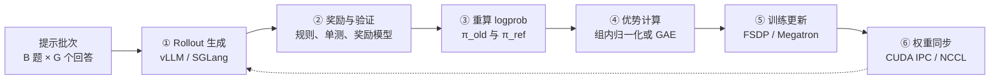
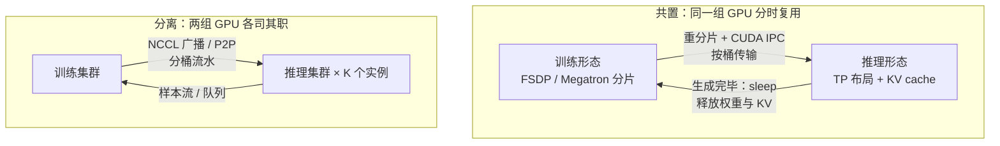
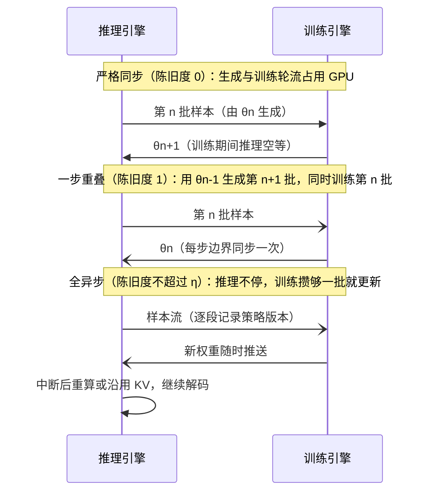
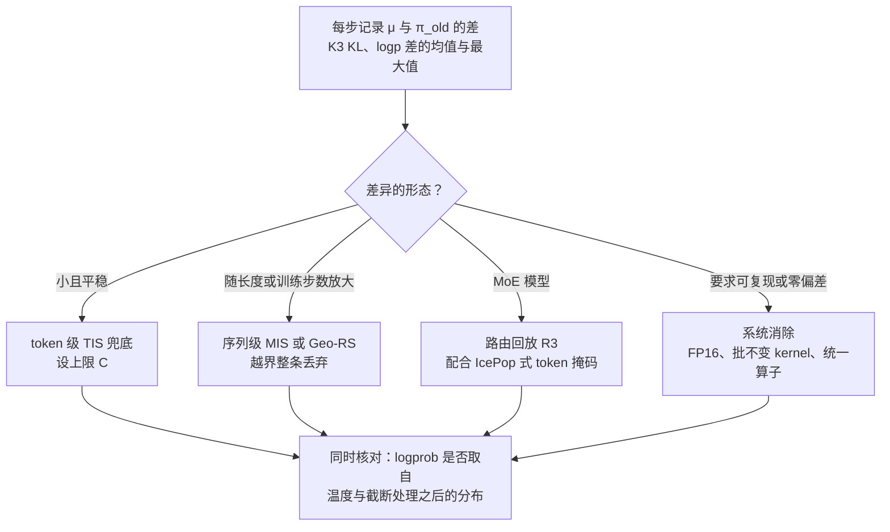

# 训练系统：RL 的瓶颈在工程

::: tldr
- 一步 RL 的墙钟时间大头通常在生成，生成的大头又在最长的那几条回答：先按阶段测出时间分解，再决定优化哪一段。
- 异步是用策略陈旧度换 GPU 利用率：从一步重叠起步，用陈旧度上限加解耦 PPO（或 IS 修正）守住算法正确性。
- 推理引擎和训练引擎算出的概率本就不同，名义上的 on-policy 其实是 off-policy：默认监控训推差异并开启 token 级 TIS，长序列上差异放大时改用序列级掩码。
- MoE 的路由会把微小的数值差异放大成离散跳变，R3 路由回放已是大 MoE RL 的常用配置。
- 如果只读一节：读[训推不一致](#mismatch)。
:::

大模型 RL 的训练系统，要把两种性格相反的负载缝进同一个闭环：**自回归生成**（逐 token 解码、访存受限、长度不可预测）和**反向传播训练**（计算密集、要大批次、对数值稳定性敏感）。2025 年以来，决定一次 RL 跑多快、能不能跑稳的，越来越不是损失函数里的某个系数，而是这道缝：整个集群在等最长的那条回答，几百 GB 的权重要在几秒内送到推理端，推理引擎算出的概率和训练引擎对不上，MoE 的路由在两边选了不同的专家。

::: human
把 RL 想成一家边营业边改菜谱的餐厅：前厅（推理引擎）不停出菜给顾客打分，后厨（训练引擎）按评分改菜谱。难的不是菜谱怎么改，而是前后厅怎么排班、新菜谱怎么最快送到前厅，以及前厅照着做出来的菜，和后厨以为的是不是同一道菜。
:::

本页沿一条主线展开：先拆开一步 RL 看时间花在哪（[解剖](#anatomy)），再看生成与训练放在哪（[放置](#colocate)）、要不要异步（[异步](#async)），然后是 2025 年下半年最受关注的两个稳定性问题——[训推不一致](#mismatch)与 [MoE 路由](#moe)，最后是 [agent rollout](#agent-rollout) 的特殊性和[框架选型](#frameworks)。重要性采样、裁剪等算法侧推导统一放在[算法谱系 · 离策略修正](/lenses/algorithms#off-policy)，本页只讲系统侧的成因与工程解法。记号沿用全站约定，另记 $s_t=(x,y_{<t})$ 为第 $t$ 个 token 的前缀状态，$\mu$ 为推理引擎里实际采样的分布。

## 一步 RL 的解剖 {#anatomy}

以 GRPO / PPO 为例，一个训练步（step）在系统层面包含六个阶段。算法论文通常只画出第 ④⑤ 步，但墙钟时间的大头往往在其余几步。

- **① 生成**由 <Term t="rollout-engine">rollout 引擎</Term>完成。连续批处理、分页 KV cache 与前缀缓存让它的吞吐远高于训练框架自带的 `generate`；agent 任务在这一步还要和环境多轮交互。
- **② 奖励**：数学题是规则比对，代码题要在沙箱里跑单测，偏好类任务要调奖励模型——后两者本身就是需要调度的分布式服务。
- **③ 重算 logprob**：训练引擎对生成的序列再做一次前向，得到 $\log\pi_{\theta_\text{old}}$（PPO 裁剪的锚点）和 $\log\pi_\text{ref}$（KL 正则）。这一步的存在，本身就埋下了[训推不一致](#mismatch)的伏笔。
- **④⑤ 优势与更新**：GRPO 只做组内归一化，PPO 还要 critic 前向；之后是若干个 mini-batch 的前向、反向与优化器步。
- **⑥ 权重同步**：把新权重送回推理引擎。共置时走本机，分离时走网络，见[权重同步](#weight-sync)。

### 时间花在哪 {#time-breakdown}

公开数据一致指向：**生成是大头**。OpenRLHF 的文档估计 RLHF 训练约 80% 的时间花在样本生成上[^openrlhf]；verl 的 one-step-off 训练器文档给出，DAPO 32B 训练中 rollout 约占 70%，而且加卡并不能缩短 rollout[^verl-1step]。同一文档里有一组 7B 模型的实测拆分：

| 设置（共置同步，最长 20K token） | 单步总时长 | 生成 | 重算 logprob | 训练更新 |
|---|---|---|---|---|
| Qwen2.5-Math-7B · DAPO · 16×H20 · vLLM + FSDP2 | 749 s | 321 s | 88 s | 286 s |

模型越大、回答越长，生成占比越高；小模型、短回答时，训练与 logprob 重算同样不可忽视。**先测出这张表，再决定优化哪一段**——这是本页所有建议的前提。

### 长尾：同步训练的隐形税 {#long-tail}

生成阶段的墙钟时间不由平均长度决定，而由**最长的那条**决定。Decode 每一步都要把整份权重和 KV cache 从显存读一遍，是访存受限的；批里的短回答陆续结束后，剩下几条长回答独占整组 GPU，算力大量闲置，这就是<Term t="long-tail-rollout">长尾 rollout</Term>。设一批共 $N$ 条回答、长度为 $L_1,\dots,L_N$，在“每个 decode 步耗时近似恒定”的粗略假设下，生成阶段的有效利用率约为

$$
U_\text{gen}\approx\frac{\frac1N\sum_{i=1}^{N}L_i}{\max_i L_i}
$$

长 CoT 的长度分布往往重尾：假如平均 8K、最长 32K，这个比值只有约 25%。AReaL 团队还指出了另一面：同步系统把生成摊到所有卡上，每张卡的 decode 批次变小，更深地陷入访存受限区，**再加卡也几乎不提升生成吞吐**[^areal-blog]。

::: insight 时间的大头在生成，生成的大头在尾巴
后面几乎所有系统设计——异步、部分 rollout、超额采样后中止、按长度调度——都在对付同一件事：别让整个集群陪最长的那条回答空等。
:::

::: human
一桌人吃饭，上菜速度取决于最慢的那道菜。同步 RL 就是“菜不上齐不许动筷子”，异步 RL 则是“先上的先吃”。
:::

## 放在哪：共置还是分离 {#colocate}

生成与训练用的是同一个模型的两种“形态”。最基本的系统决策是：它们放在同一组 GPU 上轮流用，还是各占一组。

### 共置：同一批卡，两种身份

<Term t="colocate">训推共置</Term>把 actor 的训练引擎和 rollout 推理引擎放在同一组 GPU 上分时复用。它可以追溯到 DeepSpeed-Chat 的 <Term t="hybrid-engine">Hybrid Engine</Term>：同一份 actor 在 ZeRO 训练模式与张量并行推理模式之间切换[^dschat]。verl（HybridFlow）把它发展为 3D-HybridEngine，在训练并行布局与推理并行布局之间就地重分片权重，消除显存冗余并降低切换时的通信[^hybridflow]。

共置能跑起来，靠的是显存腾挪：

- **推理侧睡眠**：vLLM 的 sleep mode 分两级——level 1 把权重卸到 CPU、丢弃 KV cache；level 2 连权重也丢掉，唤醒后由训练端同步新权重重建，正好适合 RL 的全量权重更新[^vllm-sleep]。verl 默认用 level 2，只有 LoRA 适配器、MTP 草稿头这类“同步不覆盖全部权重”的情况才退回 level 1。
- **训练侧卸载**：<Term t="fsdp">FSDP</Term> 或 DeepSpeed 把参数、梯度与优化器状态卸到 CPU，把显存让给生成。
- **本机同步**：权重经 CUDA IPC 句柄零拷贝交给推理进程，或按桶（bucket）分批传输，控制峰值显存。

共置的优点是**严格 on-policy、调度简单、不用拆分集群**；OpenRLHF 的文档直接把它标为“最稳定”的模式，推荐用于算法研究与复现[^openrlhf]。缺点同样直接：生成与训练只能串行，长尾会让所有卡一起等。

### 分离：两组卡，一条管道

<Term t="disaggregated">分离式部署</Term>让推理集群与训练集群各司其职，经网络同步权重、经队列传递样本。它是异步训练的前提——只有两边物理上分开，生成与训练才能真正重叠。另有两个常被低估的好处：两边可以**独立扩缩、使用不同硬件**（verl 的 NIXL 后端面向异构硬件的 rollout，slime 可以把 rollout 交给外部独立部署的 SGLang 服务）；推理实例挂掉或新加入时，训练不必重启。

代价是要调卡的配比：推理太少，训练端饿着；推理太多，推理端闲着。verl 的全异步训练器专门记录 `trainer/idle_ratio` 与 `rollouter/idle_ratio`，用来指导配比调整[^verl-async]。

### 权重同步：几百 GB，几秒送达 {#weight-sync}

分离部署下，<Term t="weight-sync">权重同步</Term>是一个独立的工程问题：发送端是按训练并行方式切片的权重，接收端是按推理张量并行方式切片的另一个集群。成熟方案有三个共同点：

1. **分桶 + 流水**：把参数打包成固定大小的桶，让拷贝与通信重叠。月之暗面开源的 checkpoint-engine 把一次更新拆成 H2D 拷贝、在参数服务进程间广播、推理引擎按需重载三段流水；README 称在数千张 GPU 上原地更新 1T 参数的 Kimi K2 约需 20 秒，在 256 张 H20（16 个 TP16 实例）上更新 FP8 版 Kimi-K2 的实测约 16 秒[^ckpt]。
2. **分片到分片**：只传接收端需要的那一片，不广播完整张量。NeMo-RL 的实验性 NCCL reshard refit 让每个训练 rank 只发本地分片、每个生成 rank 只收自己那一片[^nemo-refit]。
3. **广播为主、P2P 补位、能省则省**：同步更新用 NCCL 广播；新加入或重启的推理实例经 P2P（Mooncake、NIXL）从已有实例拉取，不打扰正在服务的实例。跨集群、跨数据中心时还可以只传增量：slime 的 delta weight sync 只发送两次同步之间变化了的字节[^slime-delta]。

量级上，小模型的同步几乎可以忽略（verl 报告 7B 模型的 NCCL 同步大多在 300 ms 以内[^verl-1step]）；把 Qwen3-30B-A3B 的权重从训练端同步到同集群 30 个 rollout 进程约需 7 秒[^verl-ckpt]；1T 级模型则要上面的全套优化才能压到十几秒——这时同步耗时会反过来约束异步设计里“多久同步一次”。

<EntryGrid :ids="['deepspeed-chat', 'verl', 'checkpoint-engine']" />

DeepSpeed-Chat 是共置思路的起点，今天更多作为历史参照；verl 把共置做成了工业标杆，同时通过 checkpoint engine 抽象支持 NCCL、NIXL、Mooncake 以及月之暗面的 kimi_ckpt_engine 等多种同步后端[^verl-ckpt]；checkpoint-engine 则说明，到了万亿参数规模，权重同步本身就值得一个独立的中间件。

## 同步还是异步：用陈旧度换利用率 {#async}

<Term t="async-rl">异步 RL</Term>本质上是一笔交易：允许训练使用**旧版本策略**生成的数据，换取生成与训练的重叠。样本落后当前策略的版本数叫<Term t="staleness">策略陈旧度</Term>。从严到松，工业界形成了四档节奏：

1. **严格同步**：第 $n$ 步只用 $\theta_n$ 生成的数据，共置即可实现，陈旧度为 0。
2. **一步重叠**：训练第 $n$ 批的同时，推理用上一版权重生成第 $n+1$ 批，陈旧度恒为 1。Asynchronous RLHF 较早系统验证了它在 LLM 上可行[^asyncrlhf]；prime-rl 把它作为默认模式，verl 的 one-step-off 训练器在 7B 实验中带来约 23%–40% 的端到端提速[^verl-1step]。
3. **部分 rollout**：Kimi k1.5 给每轮生成设 token 预算，超长轨迹存进回放缓冲区、下一轮接着生成，从而切掉长尾[^kimi15]。<Term t="partial-rollout">部分 rollout</Term> 意味着一条轨迹可能由多个策略版本拼成；SGLang 为此与 AReaL 团队设计了 `/abort_request` 接口，可以中止请求并回收已生成的部分[^slime-blog]。
4. **全异步**：推理端持续生成，训练端攒够一批就更新。AReaL 用陈旧度上限 $\eta$ 控制版本差（$\eta=0$ 退化为同步，$\eta=1$ 即一步重叠），更新权重时中断 rollout、丢弃旧 KV cache，用新权重重算后续写[^areal-blog]；PipelineRL 走得更远，每个优化器步后就把新权重<Term t="in-flight-update">飞行中</Term>推给推理服务器，生成不停、已有的 KV cache 直接沿用，实验表明这并不破坏稳定性[^pipelinerl]。

规模上最有分量的旁证来自 Meta 的 LlamaRL：单控制器、原生 PyTorch 的全异步框架，论文称用于 Llama 3 后训练，在 405B 策略模型上比 DeepSpeed-Chat 类同步系统最高快 10.7 倍[^llamarl]。Mistral 的 Magistral、StreamRL、AsyncFlow 等也走了异步或流式路线，verl 的全异步训练器把它们与 AReaL 一起列为借鉴对象[^verl-async]。

### 异步的算法护栏：陈旧度上限 + 解耦目标

异步带来两个算法问题：数据是旧策略生成的；一条轨迹里的不同片段可能来自不同策略版本。AReaL 的回答是两件套[^areal-blog]：

- **陈旧度上限**：只接受满足 $v(\theta)-v_\text{behav}(y)\le\eta$ 的样本，$v(\cdot)$ 表示策略版本号。
- **解耦 PPO**：区分真正采样的行为策略 $\pi_\text{behav}$ 与作为裁剪锚点的近端策略 $\pi_\text{prox}$（通常是训练端在本轮更新前重算的最新快照）[^hilton]：

$$
\mathcal J(\theta)=\E_{y\sim\pi_\text{behav}}\Big[\frac{1}{\lvert y\rvert}\sum_{t}\frac{\pi_\text{prox}(y_t\mid s_t)}{\pi_\text{behav}(y_t\mid s_t)}\min\Big(u_t(\theta)\hat A_t,\ \clip\big(u_t(\theta),1-\varepsilon,1+\varepsilon\big)\hat A_t\Big)\Big],\qquad u_t(\theta)=\frac{\pi_\theta(y_t\mid s_t)}{\pi_\text{prox}(y_t\mid s_t)}
$$

裁剪锚定在 $\pi_\text{prox}$ 上，所以无论行为数据多旧，每步更新幅度都受控；行为策略与近端策略之间的差距交给前面的重要性权重。行为策略的概率必须**按 token 记录**：部分 rollout 与飞行中更新下，同一条回答的不同 token 可能来自不同版本。若直接令 $\pi_\text{prox}=\pi_\text{behav}$（verl 称为 bypass 模式），可以省掉一次前向，但裁剪就同时承担了“控步长”和“补差异”两份工作。推导与消融（AReaL 在最大陈旧度为 4 时，朴素 PPO 明显掉点、解耦目标基本不掉）见[算法谱系 · 离策略修正](/lenses/algorithms#off-policy)。

::: human
改卷时既要知道“这道题当初是谁出的”（行为策略），也要知道“现在的标准答案长什么样”（近端策略）。前者用来换算分数，后者用来限制一次改多少，两件事分开管才不会乱。
:::

### 提速数字怎么看

::: details 各系统报告的提速（基线各不相同，不能横向比较）
| 系统 | 设置 | 报告的收益 |
|---|---|---|
| verl one-step-off | Qwen2.5-Math-7B，DAPO，16×H20 | 端到端 +23%（FSDP2）/ +40%（Megatron）[^verl-1step] |
| verl fully async | Qwen2.5-Math-7B，DAPO，128 卡 | 2.35×–2.67×；只做流式约 1.6×[^verl-async] |
| AReaL | 数学与代码推理，至多 32B | 吞吐最高 2.57×，线性扩展到 512 卡[^areal] |
| ROLL Flash | RLVR / agentic 任务 | 最高 2.24× / 2.72×[^rollflash] |
| PipelineRL | 长推理，128×H100 | 学习速度约 2×[^pipelinerl] |
| LlamaRL | 8B / 70B / 405B | 405B 上相对 DeepSpeed-Chat 类系统最高 10.7×[^llamarl] |
:::

同一框架内的消融比跨框架对比更可信。verl 在 128 卡上把陈旧度阈值从 0 调到 0.3，单步时间从约 231 s 降到约 146 s；再调到 0.5 却几乎不再变快（约 151 s），文档把原因归于训练中回答长度变化剧烈、训练不够稳定[^verl-async]。

::: insight 异步不是免费午餐
吞吐的提升要用样本效率来还：陈旧度越大，重要性权重的方差越大，每个样本携带的有效信息越少。评估异步收益要看“达到同一验证分数的墙钟时间”，而不是每秒生成多少 token。
:::

<EntryGrid :ids="['async-rlhf', 'areal', 'pipelinerl', 'llamarl']" />

AReaL 的贡献不只在系统：它把“陈旧度上限 + 解耦目标”这对组合讲清楚，让异步从工程技巧变成有算法护栏的方案，此后 verl、NeMo-RL 的异步模式都带着同样两个旋钮。PipelineRL 证明了“沿用旧 KV cache”这种看似粗糙的做法在实践中够用，飞行中更新随之成为各框架的标配选项——NeMo-RL 的 Async GRPO 甚至把“更新后是否重算 KV cache”做成了开关[^nemo-async]。LlamaRL 是少见的来自 405B 级生产训练的证据，但没有开源，只能从论文核对。

## 训推不一致：同一组权重，两个分布 {#mismatch}

<Term t="train-infer-mismatch">训推不一致</Term>指的是：同一组权重、同一个 token 序列，推理引擎采样时的概率 $\mu(y_t\mid s_t)$ 与训练引擎重算的 $\pi_{\theta_\text{old}}(y_t\mid s_t)$ 并不相等。它让名义上的 <Term t="on-policy">on-policy</Term> 训练悄悄变成了 <Term t="off-policy">off-policy</Term>。

### 差异从哪来

- **kernel 不同**：推理引擎为小批量 decode 优化（分页注意力、融合算子、CUDA graph），训练框架为大批量前向 + 反向优化；两边的矩阵形状完全不同，会选到不同的 kernel。
- **归约顺序随批大小变化**：浮点加法不满足结合律，为小批量优化的 kernel 常把归约再切分，切法随批大小变化，而推理服务的批大小又随负载波动。Thinking Machines 指出，这种<Term t="batch-invariance">批不变性</Term>的缺失才是推理非确定性的主因[^tm]。
- **数值精度**：BF16 只有 7 位尾数，舍入误差大；FP8/INT8 量化 rollout 更甚；LM head 与 logits 的精度也有影响——MiniMax-M1 把 LM head 提到 FP32 来缓解[^trl-mismatch]。
- **采样处理**：温度与 top-p/top-k 截断改变了实际采样分布；如果引擎返回的是处理前的 logprob，修正公式的分母本身就是错的[^trl-vllm]。
- **MoE 路由**：logits 的微小差异会让两边选中不同专家，把连续的小误差放大成离散的跳变，见 [MoE](#moe)。

量级上，Miles 团队测得稠密模型的训推 K3 KL 通常在 $10^{-5}$ 到 $10^{-3}$，MoE 在 $10^{-3}$ 到 $10^{-1}$；而且差异并非恒定——他们在 Qwen3-4B-Base 上观察到约 600 步之后 K3 KL 明显上升，而奖励曲线看起来仍然正常[^miles-mismatch]。

### 为什么小差异会拖垮训练

2025 年 8 月，Feng Yao、Liyuan Liu 等人（UCSD 与微软研究院）在博客 *Your Efficient RL Framework Secretly Brings You Off-Policy RL Training* 中把问题点破[^tis]；同一团队的 FlashRL 用 INT8/FP8 量化 rollout 提速，而量化只会把训推差异进一步放大。核心论点是：在“vLLM 生成 + FSDP 训练”的混合系统里，样本来自 $\mu$，PPO 却以训练端重算的 $\pi_{\theta_\text{old}}$ 为基准，同一组权重下两者的 token 概率可以差得很远；标准 PPO 对这段差异不做任何修正。他们给出的<Term t="truncated-is">截断重要性采样</Term>（Truncated Importance Sampling，TIS）只在原目标前乘一个有上限的权重：

$$
\mathcal L_\text{TIS}(\theta)=-\E_{y\sim\mu}\Big[\frac{1}{\lvert y\rvert}\sum_t\min\Big(\frac{\pi_{\theta_\text{old}}(y_t\mid s_t)}{\mu(y_t\mid s_t)},\,C\Big)\min\Big(\rho_t(\theta)\hat A_t,\ \clip\big(\rho_t(\theta),1-\varepsilon,1+\varepsilon\big)\hat A_t\Big)\Big]
$$

这里 $\rho_t(\theta)=\pi_\theta(y_t\mid s_t)/\pi_{\theta_\text{old}}(y_t\mid s_t)$ 是常规 PPO 比率；截断权重只依赖 $\theta_\text{old}$，不回传梯度；上限 $C$ 只截高端，权重可以自由小于 1。它的说服力来自简单：诊断清楚、改动只有一个乘法、几乎零开销。随后 verl、OpenRLHF、slime 等主流框架都实现了同类修正，TRL 更是对 vLLM 生成默认开启 TIS[^trl-mismatch]；2025 年下半年一整波“训推不一致”研究由此展开。

::: derive 为什么差异会变成偏差，又为什么随长度放大
记 $g(y)=\sum_t\nabla_\theta\log\pi_\theta(y_t\mid s_t)\hat A_t$。PPO 代理目标在 $\theta=\theta_\text{old}$ 处的梯度是 $\E_{y\sim\mu}[g(y)]$（因为 $\rho_t(\theta_\text{old})=1$，且 $\nabla\rho_t=\rho_t\nabla\log\pi_\theta$），而我们想要的是 $\E_{y\sim\pi_{\theta_\text{old}}}[g(y)]$。两者之差满足

$$
\big\lVert\E_{\mu}[g]-\E_{\pi_{\theta_\text{old}}}[g]\big\rVert=\Big\lVert\sum_y\big(\mu(y)-\pi_{\theta_\text{old}}(y)\big)g(y)\Big\rVert\le 2\,\mathrm{TV}\big(\mu,\pi_{\theta_\text{old}}\big)\,\sup_y\lVert g(y)\rVert
$$

其中 TV 是整条序列分布之间的总变差距离。对自回归分布，序列级 TV 不超过逐 token TV 之和的期望：$\mathrm{TV}(\mu,\pi)\le\E_{y\sim\mu}\big[\sum_t\mathrm{TV}\big(\mu(\cdot\mid s_t),\pi(\cdot\mid s_t)\big)\big]$。所以即使每个 token 只差一点点，长回答上累积起来的偏差也可能很大——这正是长 CoT 与多轮 agent 对训推不一致格外敏感的原因。

TIS 用每个 token 自己的比率代替整条序列的比率，本身仍有近似误差；严格的序列级比率 $\prod_t\pi(y_t\mid s_t)/\mu(y_t\mid s_t)$ 没有这个误差，但方差随长度指数增长。更完整的一阶近似分析见[算法谱系 · 离策略修正](/lenses/algorithms#off-policy)。
:::

### 算法补偿：从 token 级到序列级

TIS 之后的改进，都在回答同一个问题：修正权重在哪个粒度上算、越界了怎么办。

- **序列级掩码重要性采样（Masked IS，MIS）与几何平均过滤（Geo-RS）**：Jiacai Liu、Yingru Li 等人的三篇系列博客 *When Speed Kills Stability*（2025 年 9 月）用 TV 距离刻画偏差、$\chi^2$ 散度刻画方差，论证训推差异不小时 token 级修正的偏差随长度增长，并给出“比率越界就整条丢弃”的 MIS，以及按几何平均比率过滤、与长度无关的 Geo-RS[^rlcollapse]。verl 的 rollout correction 以它为理论文档，内置了相应预设[^verl-rollcorr]。
- **token 级区间掩码（IcePop）**：蚂蚁 Ling 团队为 MoE 提出，比率落在 $[C_\text{low},C_\text{high}]$ 之外的 token 直接不参与梯度，prime-rl、AReaL、OpenRLHF 都提供了现成配置[^icepop]。
- **离策略序列掩码**：[DeepSeek-V3.2](/library/?id=deepseek-v3-2) 只屏蔽“优势为负且偏离过大”的序列，公式见[算法谱系 · 离策略修正](/lenses/algorithms#off-policy)。
- **统一解释**：Qwen 团队的[稳定性公式化工作](/library/?id=stabilizing-rl-llm)说明，token 级代理目标只在训推差异与策略陈旧度都很小时才是序列级目标的好近似，IS 修正、裁剪与路由回放各自压住其中一部分误差[^qwen]。

几种权重的写法对比如下（设 $w_t=\pi_{\theta_\text{old}}(y_t\mid s_t)/\mu(y_t\mid s_t)$，$\rho(y)=\prod_t w_t$）：

$$
w^\text{TIS}_t=\min(w_t,C),\qquad w^\text{Seq-MIS}=\rho(y)\cdot\mathbb 1\big[\rho(y)\le C\big],\qquad m^\text{Geo-RS}=\mathbb 1\big[C_\text{low}\le\rho(y)^{1/\lvert y\rvert}\le C_\text{high}\big]
$$

其中 TIS 逐 token 截断；Seq-MIS 把整条序列的比率越界视为“不可信”，整条丢弃；Geo-RS 只做过滤（$m=0$ 的序列不参与梯度），常与 token 级 TIS 组合使用。为什么要用几何平均？设每个 token 的比率都是 1.1：10 个 token 的序列乘积约为 2.6，100 个 token 就约为 $1.4\times10^4$。按乘积设阈值，长回答会被系统性丢弃，模型等于被训练成“少想一点”；几何平均把两者都还原成 1.1[^verl-rollcorr]。

Miles 团队的大量实验给了一个务实的参照：在不崩溃的常规训练里，打开 TIS / MIS 不损害效果；在他们跑了数百次才复现出的一个 MoE 崩溃案例里，收紧上限的 token 级 TIS 加几何平均 MIS 压住了崩溃，只开 token 级 TIS 仍然崩溃。因此他们建议把 IS 修正当作默认开启的保险，训推差异大时再加上序列级掩码[^miles-mismatch]。

### 系统消除：精度、批不变与比特一致

算法补偿承认差异、事后修正；另一条路是从系统上让 $\mu=\pi$。

- **FP16 替代 BF16**：Sea AI Lab 与新加坡国立大学的论文把根源归到 BF16 的舍入误差：它范围大、精度粗，而 RL 后训练用不到那么大的范围。训练与推理统一改用 FP16（10 位尾数）后，训推差异大幅下降，这一结论在 VeRL 与 Oat 两套框架、多种算法与模型族上都得到复现；verl 随后加入了 FSDP 与 Megatron（稠密模型）的 FP16 训练支持[^fp16]。这个结论有些反直觉——BF16 成为默认正是因为它的范围——因此引发了不少讨论。
- **批不变 kernel**：Thinking Machines Lab 的 Horace He 等人在 Connectionism 博客首篇（2025 年 9 月）中论证，推理非确定性的主因不是笼统的“GPU 并发 + 浮点误差”，而是 kernel 缺乏批不变性；他们给出批不变的 RMSNorm、矩阵乘与注意力，并演示了训推 KL 恒为 0 的真 on-policy RL[^tm]。代价是速度：SGLang 的博客引述其初版实现慢约 61.5%；SGLang 自己的实现在兼容 CUDA graph、前缀缓存的同时把平均开销降到约 34%，并与 slime 合作做到两次独立 RL 运行的曲线完全一致[^sglang-det]。
- **训推比特一致**：vLLM 与 TorchTitan 团队逐个核对前向中的每一次 kernel 调用，为 vLLM 的融合算子补写反向，让 Qwen3 1.7B 的 RL 训推 KL 恒为 0，比关闭批不变时步数更少、奖励更高，但整体慢了 2.4 倍[^vllm-bitwise]。Miles 用 FlashAttention-3、DeepGEMM、批不变 kernel 与 `torch.compile` 在稠密模型上做到了严格为 0 的训推差异，但也坦言：在他们的系统里稠密模型从未因训推不一致崩溃，打开比特一致后奖励曲线也没有更好[^miles-mismatch]。
- **取对 logprob**：让引擎返回经温度与截断处理后的 logprob（TRL 文档给出的 vLLM 启动参数是 `--logprobs-mode processed_logprobs`）[^trl-vllm]；使用 top-p/top-k 时还要把采样时的截断掩码带回训练端，训练端在同一掩码上重新归一化——即 DeepSeek-V3.2 的 Keep Sampling Mask，prime-rl 会自动完成这一回放[^prime-inference]。

::: evidence 这一波工作的证据强度
TIS 与 MIS 的证据主要来自中小规模复现与框架维护者的实验，但几乎被所有主流框架采纳，属于“成本低、共识高”的默认项；FP16 的结论跨两套框架、多种算法复现，在稠密模型上可信，MoE 支持仍在完善；训推比特一致已被 vLLM × TorchTitan、Miles 等团队在稠密模型上独立做到（公开演示以小模型为主），但吞吐代价显著，目前更适合做对照实验和排查问题，而非大规模生产训练。
:::

<EntryGrid :ids="['tis-offpolicy', 'rl-collapse-mismatch', 'fp16-mismatch', 'tm-nondeterminism', 'stabilizing-rl-llm']" />

## MoE：路由把噪声变成跳变 {#moe}

稠密模型里，训推之间的数值差异会平滑地传到输出概率上；MoE 不一样。每个 token 在每一层都要由 router 选出 top-k 个专家，这是一个离散决策：两个专家的打分只要足够接近，一点数值噪声就能让选择翻转，这个 token 随后走过的是另一组参数，输出概率的变化与噪声大小不成比例。

路由不一致有两个来源：

- **训推之间**：推理引擎与训练引擎算出的 router logits 本就不完全相同，同一个 token 可能在两边选中不同专家。
- **梯度步之间**：同一批数据做多个 mini-batch 更新时，参数一变，路由也跟着变。GSPO 论文报告，在 48 层的 Qwen3-30B-A3B-Base 上，每次梯度更新后，同一条 rollout 激活的专家约有 10% 发生变化，token 级重要性比率因此剧烈波动[^gspo]。

应对思路分成两派。一派在目标函数上绕开：[GSPO](/lenses/algorithms#gspo) 把重要性比率提到序列级并做长度归一化，对个别 token 的比率跳变不敏感，因而不再需要额外的路由稳定措施[^gspo]。另一派直接固定路由，即<Term t="routing-replay">路由回放</Term>：

- **R2（vanilla routing replay）**：更新时回放训练引擎用旧策略算出的路由，主要压住梯度步之间的漂移，但解决不了训推差异。
- **R3（rollout routing replay）**：推理引擎在采样时记录每个 token 在每层选中的专家，训练前向直接复用。小米等提出 R3 的论文显示，它能显著降低训推 KL、避免训练崩溃，在他们的 MoE 实验中优于 GSPO 与 TIS，而且几乎不影响速度[^r3]。

回放只固定“选谁”，门控权重仍由训练端计算。以 softmax 门控为例，设训练端的 router logits 为 $s$，回放得到的 top-k 掩码为 $I^\text{ref}\in\{0,1\}^{E}$（$E$ 为专家数），则第 $i$ 个专家的门控权重为

$$
g_i=\frac{I^\text{ref}_i\exp(s_i)}{\sum_{j=1}^{E}I^\text{ref}_j\exp(s_j)}
$$

专家选择由参考掩码决定，softmax 仍在训练端 logits 上计算，所以 router 照常得到梯度[^roll-rr]。

::: human
MoE 像一家有几十个专科的医院，分诊台（router）决定每个病人（token）去看哪两个科。推理时和训练时的分诊台因为一点点数值误差，把同一个病人分到了不同科室，后面的诊断自然对不上。R3 就是让训练时照抄推理时的分诊单。
:::

工业上，路由回放已从论文技巧变成大 MoE RL 的常用配置：[DeepSeek-V3.2](/library/?id=deepseek-v3-2) 的 Keep Routing 在训练中强制沿用推理框架采样时的专家路由[^dsv32]；verl 的文档称 DeepSeek-V3.2、GLM-5、MiMo-V2 等都采用了 R3 式路由回放[^verl-r3]；prime-rl 的文档称它能把训推差异降低一个数量级[^prime-inference]。落地时注意三点工程代价：

1. 每个 token × 每层 × top-k 的专家索引要随样本从推理端传到训练端（ROLL 会按专家数自动选 uint8 / int16 以节省带宽）；
2. 推理与训练两侧必须同时开启，只开一侧没有效果，参考模型的前向则不应回放；
3. 反向传播若启用激活重算，重算时也要回放同一组路由；ROLL 暂不支持 R3 与 sequence packing 同时开启[^roll-rr]，prime-rl 在 P/D 分离部署下也有兼容限制（如 llm-d 路由器不支持返回路由专家）[^prime-inference]，上线前先查所用框架的兼容表。

<EntryGrid :ids="['rollout-routing-replay', 'gspo', 'deepseek-v3-2']" />

## Agent rollout：多轮、沙箱与超时 {#agent-rollout}

Agent RL 的 rollout 不是一次 `generate`，而是“生成 → 解析工具调用 → 在环境里执行 → 把观察拼回上下文 → 再生成”的循环。对黑盒 agent，AReaL 与 slime 都提供 OpenAI 兼容接口，把 agent 的 `base_url` 指过来即可采集训练数据。系统上多出五个问题（任务建模与信用分配见 [Agentic RL · rollout](/topics/agentic-rl#rollout)）：

1. **按轨迹异步，而不是按批同步**：环境延迟（编译、跑测试、网页请求）高且方差大，批同步会被最慢的环境拖住。ROLL Flash 把环境交互做成环境级异步并配合队列调度，在 agentic 任务上报告最高 2.72 倍提速[^rollflash]；prime-rl 的编排器给每个环境开独立子进程和可伸缩的 worker 池[^prime-overview]。
2. **token 进、token 出**：多轮拼接时不要把文本解码后再重新分词——重分词可能改变 token 边界，存下的 logprob 就和训练时的 token 对不上了。OpenRLHF 的 agent 执行器、prime-rl 的编排器都以 token 为单位拼接轨迹；Miles 团队还发现，Search-R1、ReTool 一类示例会对模型输出做字符串后处理，这同样会破坏 IS 所需的 token 与 logprob 的对应[^miles-mismatch]。环境返回的观察 token 要用 <Term t="loss-mask">loss mask</Term> 排除在梯度之外。
3. **沙箱池**：容器冷启动慢、占资源，需要预热池与快照（rLLM 支持 Docker、Daytona、Modal 等沙箱，并提供快照与预热池加速[^rllm]），让环境跑在 CPU 节点上、与 GPU 解耦。
4. **长尾与超时**：设最大轮数与墙钟预算。超时轨迹要么截断后屏蔽损失、要么记为失败，但一定要单独统计，避免“超时即负奖励”把模型推向更短、更保守的行为。也可以超额发起请求，凑够一批就中止其余请求，未完成的部分留到下一轮继续——APRIL 在 slime 上实现了这种主动式部分 rollout[^april]。
5. **路由与缓存**：让同一条轨迹的各轮落到同一个推理实例上（会话亲和或一致性哈希），才能复用前缀缓存；slime 通过 router 策略支持这一点[^slime-readme]。

## 演化脉络 {#lineage}

<LineageGraph graph="rl-systems" />

- **2023：先跑起来。** DeepSpeed-Chat 在同一组卡上切换训练与推理模式；OpenRLHF 把生成交给 vLLM、用 Ray 编排多个模型。
- **2024：灵活且高效。** verl 用单控制器写算法流程、多控制器执行计算，3D-HybridEngine 就地重分片，成为共置方案的工业标杆。
- **2025 上半年：对付长尾。** 长 CoT 让生成长尾成为主要矛盾，异步化集中爆发：一步重叠、部分 rollout、有界全异步、飞行中更新。
- **2025 下半年：对齐数值。** 系统跑快了，数值问题浮出水面：TIS 点破隐性 off-policy，随后是序列级修正、FP16、批不变 kernel、MoE 路由回放，以及把它们统一起来的一阶近似解释。
- **2026：全部做成开关。** 主流框架都把异步阈值、IS/MIS 修正、router replay、确定性模式做成了配置项；与此同时，Tinker 式“训练即服务”的 API 出现了 SkyRL、verl 的自托管实现，竞争重心转向 agent 环境与超大 MoE 的工程可用性。

## 框架地图 {#frameworks}

选框架时，比功能列表更重要的是三个问题：训练后端能否撑住你的模型规模（<Term t="fsdp">FSDP</Term> 还是 <Term t="megatron">Megatron</Term>），rollout 引擎是否支持你需要的推理特性，异步与 agent 是一等公民还是外挂。下表只填公开文档可以核实的信息（按 2026 年 9 月各仓库的 README 与文档核对），拿不准的格子用“—”；框架迭代很快，落地前请以最新文档为准。

| 框架 | 训练后端 | Rollout 引擎 | 异步 | Agent / 多轮 | 公开的工业落地 |
|---|---|---|---|---|---|
| [verl](/library/?id=verl) | FSDP/FSDP2、Megatron | vLLM、SGLang | one-step-off；全异步（含部分 rollout） | AgentLoop 多轮工具调用 | 字节 Seed（Seed-Thinking-v1.5 等）；Skywork-OR1 |
| [OpenRLHF](/library/?id=openrlhf) | DeepSpeed ZeRO-3 | vLLM | 异步队列；可选部分 rollout | 单轮 / 多轮 agent 执行器 | Open-Reasoner-Zero（阶跃星辰 · 清华） |
| [TRL](/library/?id=trl) | Accelerate（DDP / DeepSpeed / FSDP） | vLLM（共置或 server） | 实验性 AsyncGRPOTrainer（`max_staleness` 上限） | 工具调用与环境接口（`environment_factory`，可接 OpenEnv） | Hugging Face Open-R1 |
| [NeMo-RL](/library/?id=nemo-rl) | DTensor（FSDP2）、Megatron | vLLM、Megatron 推理、SGLang | Async GRPO（轨迹年龄上限） | NeMo-Gym 集成 | NVIDIA Nemotron 3 系列 |
| [slime](/library/?id=slime) | Megatron | SGLang | 全异步 rollout | 自定义生成函数、多轮与 SWE 示例 | 智谱 GLM-4.5 至 GLM-5 系列 |
| [AReaL](/library/?id=areal) | Megatron、FSDP2、Archon | SGLang、vLLM | 全异步（陈旧度上限 $\eta$ + 解耦 PPO） | 多轮 agentic RL、黑盒 agent 接入 | 蚂蚁 ASearcher、AReaL-SEA |
| [ROLL](/library/?id=roll) | Megatron-Core、FSDP2 | vLLM、SGLang | ROLL Flash | agentic 流水线、ROCK 环境套件 | 阿里 ROME |
| [SkyRL](/library/?id=skyrl) | FSDP、Megatron、JAX | vLLM | 全异步 + 飞行中更新 | SkyRL-Agent、SkyRL-Gym | Mercor 的 397B 训练指南 |
| [prime-rl](/library/?id=prime-rl) | FSDP2（EP / CP） | vLLM | 默认一步重叠 | verifiers 环境、Environments Hub | INTELLECT-2、INTELLECT-3.x |
| [rLLM](/library/?id=rllm) | 经 verl；或 Tinker、Fireworks | 经 verl（vLLM / SGLang） | 可选全异步训练 | 包装现成 agent harness、多种沙箱 | DeepSWE（与 Together AI 合作） |
| [Tinker](/library/?id=tinker) | 托管服务（LoRA） | 托管采样 | cookbook 支持有界 off-policy | cookbook 多轮 / 工具示例 | Thinking Machines 自有产品 |

推理引擎一侧，[vLLM](/library/?id=vllm) 与 [SGLang](/library/?id=sglang) 是事实上的两个选择：vLLM 覆盖面最广，为 RL 提供了 sleep mode、在线权重更新与批不变模式；SGLang 的前缀复用对同题多采样和多轮 agent 格外友好，slime 与 AReaL 默认用它。历史上的 [DeepSpeed-Chat](/library/?id=deepspeed-chat) 已很少被新项目直接采用，但它的 Hybrid Engine 仍是理解共置设计的最佳起点。

怎么选：

- **算法研究、单机到百卡**：verl 或 OpenRLHF 的共置模式最稳；TRL 适合小模型与教学。
- **大 MoE、要 Megatron 全套并行**：slime（及其企业版 Miles）、verl 的 Megatron 后端、NeMo-RL、ROLL。
- **长 CoT 或 agent、长尾严重**：优先选把有界异步与部分 rollout 做成一等公民的框架，如 AReaL、verl fully async、SkyRL、prime-rl、ROLL Flash。
- **已有成熟 agent，只想训练它**：rLLM、SkyRL-Agent，或 AReaL 的黑盒 agent 接入。
- **只想写算法、不想管集群**：Tinker 这类托管 API，或 SkyRL、verl 提供的 Tinker 兼容自托管后端。

<EntryGrid :ids="['verl', 'slime', 'areal', 'openrlhf', 'roll', 'nemo-rl']" />

::: takeaway
1. **先测时间分解再动手**：按阶段记录生成、logprob 重算、训练、同步的耗时，以及回答长度分布；生成占比过半且长尾明显时，异步才值得做。
2. **默认开启训推差异监控与 IS 修正**：每步记录 $\mu$ 与 $\pi_{\theta_\text{old}}$ 之间的 K3 KL 与 logprob 差；token 级 TIS 作为兜底，长序列上差异放大时升级到序列级 MIS 或 Geo-RS。
3. **异步从一步重叠开始**：陈旧度上限从 1 起步、逐步放大，配合解耦 PPO 或 IS 修正，并始终以“达到同一验证分数的墙钟时间”对照同步基线。
4. **MoE 默认开启 R3 路由回放**：或者至少使用 GSPO 这类序列级比率；同时监控路由一致率与训推 KL。
5. **共置用于研究，分离 + 异步用于生产**：研究与复现选共置（严格 on-policy、最稳），长 CoT 与 agent 的生产训练选分离 + 异步；权重同步用分桶流水，按两侧 idle 比例调卡的配比。
6. **agent rollout 坚持 token 进 token 出**：不对模型输出做字符串后处理，环境与 GPU 解耦，设置超时与最大轮数，超时样本单独统计。
:::

::: pitfall
- **把训练端重算的 logprob 当成行为策略**：推理引擎和训练引擎并不是同一个分布，这等于默认 IS 权重恒为 1，训推差异被悄悄当成了“策略没变”。
- **引擎返回的是处理前的 logprob**：用了温度或 top-p/top-k，却拿原始 logits 算出的概率做分母，修正越修越偏；截断采样时还要把采样掩码带回训练端。
- **对输出做后处理再重新分词**：截掉标签、补全格式之后重新分词，token 与 logprob 就对不上了；多轮 agent 尤其容易踩这个坑。
- **只看吞吐调陈旧度**：陈旧度调大、每秒 token 变多，样本效率却可能在下降；verl 的消融里，陈旧度阈值从 0.3 调到 0.5 已几乎不再提速。
- **睡眠级别与更新范围不匹配**：vLLM 的 sleep level 2 会丢弃全部权重，只同步 LoRA 适配器或部分权重时必须用 level 1，否则未被覆盖的权重就丢了。
- **R3 只开了一半**：路由回放要推理与训练两侧同时开启，激活重算时也要回放；和 sequence packing、P/D 分离一起用之前，先确认框架是否支持。
:::

## 延伸阅读

- [资料库 · Infra 视角的全部条目](/library/?facet=infra)
- [算法谱系 · 离策略修正](/lenses/algorithms#off-policy)：三个策略、TIS / MIS / IcePop 与一阶近似的完整推导；[GSPO](/lenses/algorithms#gspo)：序列级比率如何绕开 MoE 路由波动
- [Agentic RL · rollout](/topics/agentic-rl#rollout)：多轮交互的建模、loss mask 与信用分配
- [LLM 强化学习](/topics/rl-for-llm)：各家工业配方里的系统选择
- 实践单元：[数学 RLVR：GRPO → DAPO](/practice/rlvr-math)、[SWE 智能体 RL](/practice/swe-agent)

[^openrlhf]: OpenRLHF README（生成约占 80% 时间的估计；共置、异步、异步 + 部分 rollout 三种模式的对比表）：<https://github.com/OpenRLHF/OpenRLHF>
[^verl-1step]: verl 文档 *Recipe: One Step Off Policy Async Trainer*（美团搜索团队）：<https://github.com/verl-project/verl/blob/main/docs/advance/one_step_off.md>
[^verl-async]: verl 文档 *Recipe: Fully Async Policy Trainer*（含 7B 128 卡实验与陈旧度消融）：<https://github.com/verl-project/verl/blob/main/docs/advance/fully_async.md>
[^areal-blog]: AReaL v0.3 技术博客（异步动机、可中断 rollout、陈旧度 η 与解耦 PPO）：<https://github.com/areal-project/AReaL/blob/main/blog/AReaL_v0_3.md>
[^areal]: Fu et al., *AReaL: A Large-Scale Asynchronous Reinforcement Learning System for Language Reasoning*，arXiv:2505.24298（NeurIPS 2025）；“训练吞吐最高 2.57 倍、线性扩展到 512 卡”见引言，端到端训练时间最多缩短 2.77 倍见摘要与主实验
[^dschat]: Yao et al., *DeepSpeed-Chat: Easy, Fast and Affordable RLHF Training of ChatGPT-like Models at All Scales*，arXiv:2308.01320
[^hybridflow]: Sheng et al., *HybridFlow: A Flexible and Efficient RLHF Framework*，arXiv:2409.19256（EuroSys 2025）；代码 <https://github.com/verl-project/verl>
[^vllm-sleep]: vLLM 文档 Sleep Mode：<https://github.com/vllm-project/vllm/blob/main/docs/features/sleep_mode.md>
[^ckpt]: MoonshotAI/checkpoint-engine README（架构与基准表）：<https://github.com/MoonshotAI/checkpoint-engine>
[^nemo-refit]: NeMo-RL 设计文档 *NCCL Reshard Refit*：<https://github.com/NVIDIA-NeMo/RL/blob/main/docs/design-docs/nccl-reshard-refit.md>
[^slime-delta]: slime 文档 *Delta Weight Sync*：<https://github.com/THUDM/slime/blob/main/docs/en/advanced/delta-weight-sync.md>
[^verl-ckpt]: verl *Checkpoint Engine* README（各同步后端与基准）：<https://github.com/verl-project/verl/blob/main/verl/checkpoint_engine/README.md>
[^asyncrlhf]: Noukhovitch et al., *Asynchronous RLHF: Faster and More Efficient Off-Policy RL for Language Models*，arXiv:2410.18252
[^kimi15]: Kimi Team, *Kimi k1.5: Scaling Reinforcement Learning with LLMs*，arXiv:2501.12599（Partial Rollouts 一节）
[^slime-blog]: *slime: An SGLang-Native Post-Training Framework for RL Scaling*，LMSYS 博客（2025-07-09）：<https://lmsys.org/blog/2025-07-09-slime/>
[^pipelinerl]: Piché et al., *PipelineRL: Faster On-policy Reinforcement Learning for Long Sequence Generation*，arXiv:2509.19128；HF 博客 <https://huggingface.co/blog/ServiceNow/pipelinerl>
[^llamarl]: Wu et al., *LlamaRL: A Distributed Asynchronous Reinforcement Learning Framework for Efficient Large-scale LLM Training*，arXiv:2505.24034
[^hilton]: Hilton et al., *Batch size-invariance for policy optimization*，arXiv:2110.00641
[^nemo-async]: NeMo-RL 文档 *Train with Async GRPO*：<https://github.com/NVIDIA-NeMo/RL/blob/main/docs/guides/async-grpo.md>
[^rollflash]: *Part II: ROLL Flash — Accelerating RLVR and Agentic Training with Asynchrony*，arXiv:2510.11345
[^tm]: Horace He, Thinking Machines Lab, *Defeating Nondeterminism in LLM Inference*（2025-09）：<https://thinkingmachines.ai/blog/defeating-nondeterminism-in-llm-inference/>；批不变算子库 <https://github.com/thinking-machines-lab/batch_invariant_ops>
[^trl-mismatch]: TRL 文档 *GRPO Trainer · Dealing with the Training-Inference Mismatch*（默认开启 TIS；MiniMax-M1 的 FP32 LM head）：<https://github.com/huggingface/trl/blob/main/docs/source/grpo_trainer.md>
[^trl-vllm]: TRL 文档 *vLLM Integration*（`--logprobs-mode processed_logprobs`、共置与 server 两种模式）：<https://github.com/huggingface/trl/blob/main/docs/source/vllm_integration.md>
[^miles-mismatch]: SGLang RL 团队与 Miles 社区，*Let Speed Be With Stability: All-In-One Solution to Training-Inference Mismatch with Miles*：<https://github.com/zhaochenyang20/Awesome-ML-SYS-Tutorial/blob/main/rlhf/slime/mismatch/blog-en.md>
[^tis]: Feng Yao, Liyuan Liu, Dinghuai Zhang, Chengyu Dong, Jingbo Shang, Jianfeng Gao, *Your Efficient RL Framework Secretly Brings You Off-Policy RL Training*（2025-08）：<https://fengyao.notion.site/off-policy-rl>；代码 <https://github.com/yaof20/Flash-RL>
[^rlcollapse]: Jiacai Liu, Yingru Li et al., *When Speed Kills Stability: Demystifying RL Collapse from the Training-Inference Mismatch*（2025-09）：<https://richardli.xyz/rl-collapse>
[^verl-rollcorr]: verl 文档 *Mathematical Formulations of Rollout Correction Methods*（Yingru Li）：<https://github.com/verl-project/verl/blob/main/docs/algo/rollout_corr_math.md>
[^icepop]: IcePop 博客 <https://ringtech.notion.site/icepop>，后收入 Ring-1T 技术报告 arXiv:2510.18855；prime-rl 的实现说明见 <https://github.com/PrimeIntellect-ai/prime-rl/blob/main/docs/algorithms.md>
[^qwen]: Qwen 团队，*Stabilizing Reinforcement Learning with LLMs: Formulation and Practices*，arXiv:2512.01374
[^fp16]: Qi et al., *Defeating the Training-Inference Mismatch via FP16*，arXiv:2510.26788；代码与 verl 支持说明 <https://github.com/sail-sg/Precision-RL>
[^sglang-det]: SGLang 团队，*Towards Deterministic Inference in SGLang and Reproducible RL Training*（2025-09-22）：<https://lmsys.org/blog/2025-09-22-sglang-deterministic/>
[^vllm-bitwise]: vLLM 与 TorchTitan 团队，*No More Train-Inference Mismatch: Bitwise Consistent On-Policy Reinforcement Learning with vLLM and TorchTitan*（2025-11-10）：<https://blog.vllm.ai/2025/11/10/bitwise-consistent-train-inference.html>
[^prime-inference]: prime-rl 文档 *Inference*（Router Replay、Sampling Replay 与 DeepSeek-V3.2 的 Keep Sampling Mask）：<https://github.com/PrimeIntellect-ai/prime-rl/blob/main/docs/inference.md>
[^gspo]: Qwen 团队，*Group Sequence Policy Optimization*，arXiv:2507.18071（MoE 训练一节）
[^r3]: Ma et al., *Stabilizing MoE Reinforcement Learning by Aligning Training and Inference Routers*，arXiv:2510.11370
[^dsv32]: DeepSeek-AI，DeepSeek-V3.2 技术报告，arXiv:2512.02556（§3.1：Keep Routing 与 Keep Sampling Mask）
[^verl-r3]: verl 昇腾迁移指南 · “MoE 大模型通用路由稳定方案”：<https://github.com/verl-project/verl/blob/main/docs/ascend_tutorial/zh/dev_guide/model_dev/transfer_to_npu_guide.md>
[^roll-rr]: ROLL 文档 *Router Replay*（R2 / R3 定义、回放公式与兼容性）：<https://github.com/alibaba/ROLL/blob/main/docs_roll/docs/User%20Guides/Advanced%20Features/router_replay.md>
[^prime-overview]: prime-rl 文档 *Overview*（推理、编排器、训练器三进程架构）：<https://github.com/PrimeIntellect-ai/prime-rl/blob/main/docs/overview.md>
[^rllm]: rLLM README：<https://github.com/rllm-org/rllm>
[^april]: Zhou et al., *APRIL: Active Partial Rollouts in Reinforcement Learning to Tame Long-tail Generation*，arXiv:2509.18521
[^slime-readme]: slime README（SGLang 部署、router 策略与会话亲和）：<https://github.com/THUDM/slime>
