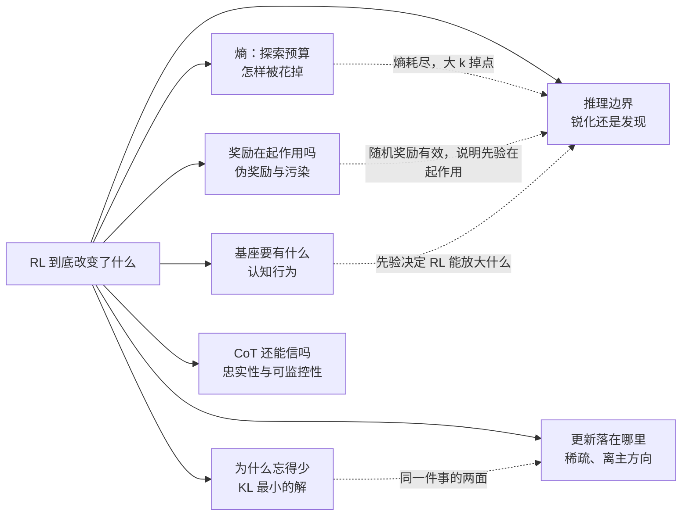
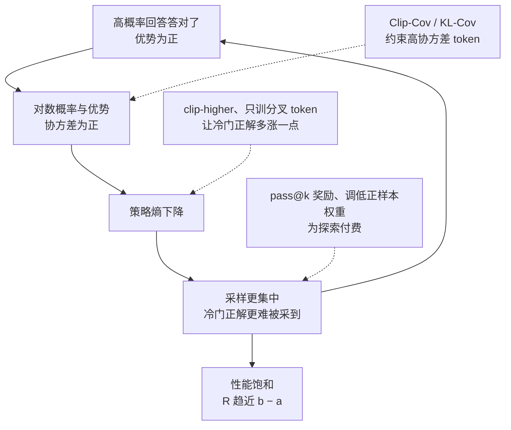
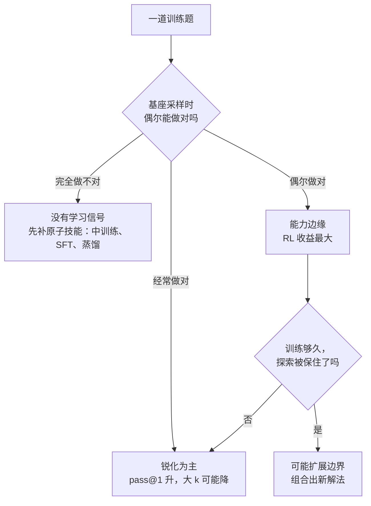
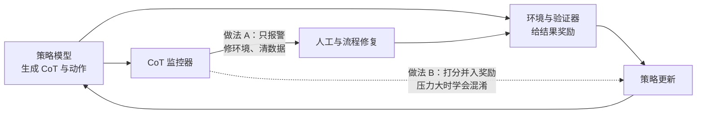

# 原理与可解释性：RL 到底改变了模型什么

这一视角不问“RL 把分数提高了多少”，而问“RL 改变了模型的什么”：输出分布的熵怎样被消耗，参数更新落在哪里，旧能力为何得以保留，推理边界是否真的扩张，奖励信号是否真的在起作用，以及写出来的思维链（CoT）还能不能如实反映模型的计算。

::: human
把 RL 训练后的模型拆开来看：它是学会了新本事，还是把原来偶尔会的招数练熟了？哪里被改了、哪里没动？它写在草稿纸上的思路，还能不能信？
:::

## 这页怎么读 {#map}

2025 年以来，围绕 <Term t="rlvr">RLVR</Term> 的机理研究密集出现，结论看上去互相打架：有人说 RL 只是锐化，有人说 RL 能学会新技能；有人发现随机奖励也能涨分，有人发现换个模型就不灵。其实它们在回答七个不同的问题。

这些问题横跨整条后训练流水线：基座与中训练决定 RL 能放大什么；选 SFT、蒸馏还是 RL 决定遗忘多少；算法细节决定熵怎么花；评测口径决定你看到的是锐化还是扩展；CoT 监控则贯穿训练与部署。下图把七个问题和它们之间的联系画在一起。

先看结论速览，每一行都能点进对应小节：

| 问题 | 目前较可靠的解读 | 可以直接用的做法 |
|---|---|---|
| [熵怎样被花掉](#entropy) | 高概率且答对的 token 推动熵单调下降，性能增益几乎都在熵耗尽前拿到 | 同时监控熵与协方差；只约束极少数高协方差 token |
| [更新落在哪里](#sparse-updates) | RL 只改动少量参数、避开主方向，每条样本带来的信息很少 | LoRA 可作默认起点；别把“参数没变”当“能力没变” |
| [为什么忘得少](#forgetting) | on-policy 数据让模型选择离基座 KL 最近的解法 | 加新能力优先用自采样数据；跟踪新任务上的 KL |
| [边界有没有扩](#pass-at-k-debate) | 常规短训以锐化为主；长训、边缘题、组合任务上能扩 | 同时报告 pass@1 与大 k 曲线；数据挑“边缘题” |
| [奖励在起作用吗](#spurious-rewards) | “随机奖励也有效”主要来自 Qwen2.5-Math 的先验与污染 | 两个以上模型家族、随机奖励对照、无污染基准 |
| [基座要有什么](#cognitive-behaviors) | RL 放大的是基座已有的验证、回溯等行为 | RL 前先查行为，缺了就先预热或中训练 |
| [CoT 还能信吗](#faithfulness) | CoT 常不忠实，但监控仍然有效，而且脆弱 | 监控只用于检测、不进奖励；先修环境 |

## 熵：探索预算是怎样被花掉的 {#entropy}

### 现象：性能是拿熵换来的

用 GRPO 一类算法做 RLVR，最常见的曲线是：<Term t="entropy">策略熵</Term>在前几百步急剧下跌，验证集准确率同步快速上升；之后熵见底，准确率也基本停住。上海 AI Lab 等团队的 *The Entropy Mechanism of RL for Reasoning LMs* 以一次典型训练为例：前约三分之一的步数消耗了 95% 的熵，也拿到了 95% 的性能增益；剩下三分之二的训练只换来 5%[^cui]。他们在 Qwen2.5 全系列（0.5B–32B）上发现，准确率 $R$ 与熵 $\mathcal H$ 之间近似满足

$$R=-a\,e^{\mathcal H}+b$$

其中 $a,b$ 是随模型和数据变化的拟合系数。这个式子有一个直接推论：熵耗尽（$\mathcal H\to 0$）时，性能上限就是 $R=-a+b$。<Term t="entropy-collapse">熵塌缩</Term>之后，再训多久也只是在这块天花板下徘徊。

::: human
探索像一笔预算：每次把“有把握的答案”推得更确定，就花掉一点熵。预算花光时，模型只会走老路，成绩也就到顶了。
:::

### 机制：熵的变化由一个协方差决定

为什么熵几乎总在下降？考虑某个前缀 $s=(x,y_{<t})$ 上的 softmax 策略，记 logit 为 $z$。对一步更新后的熵做一阶展开，可以得到[^cui]

$$\Delta\mathcal H(s)\approx-\operatorname{Cov}_{a\sim\pi_\theta(\cdot\mid s)}\big(\log\pi_\theta(a\mid s),\ \Delta z_a\big)$$

对表格型 softmax 的策略梯度，$\Delta z_a=\eta\,\pi_\theta(a\mid s)\,A(s,a)$；对自然策略梯度，$\Delta z_a=\eta\,A(s,a)$，其中 $\eta$ 是步长、$A$ 是优势。于是熵的变化取决于“对数概率”与“优势”的协方差：

- **高概率且优势为正**（模型有把握，又答对了）：协方差为正，熵下降；
- **低概率但优势为正**（冷门解法碰巧答对）：协方差为负，熵上升。

RLVR 训练里，大量题目上模型的高概率回答本来就是对的，协方差项在整个训练中基本保持为正，熵自然单调下降。论文还观察到，准确率越高的题目协方差越大：**熵主要是被“已经会做的题”花掉的**。

::: derive softmax 熵的一阶变化，以及策略梯度下的协方差形式
记 $\pi_a=\pi_\theta(a\mid s)=e^{z_a}/\sum_{a'}e^{z_{a'}}$，熵 $\mathcal H=-\sum_a\pi_a\log\pi_a$。

**第一步：熵对 logit 的梯度。** 由 $\partial\pi_a/\partial z_b=\pi_a(\mathbf 1[a=b]-\pi_b)$，

$$\frac{\partial\mathcal H}{\partial z_b}=-\sum_a\frac{\partial\pi_a}{\partial z_b}(\log\pi_a+1)=-\pi_b(\log\pi_b+1)+\pi_b\sum_a\pi_a(\log\pi_a+1)=-\pi_b\big(\log\pi_b-\E_{a\sim\pi}[\log\pi_a]\big)$$

**第二步：一阶展开。** 设一步更新后 logit 的变化为 $\Delta z$，

$$\Delta\mathcal H\approx\sum_b\frac{\partial\mathcal H}{\partial z_b}\Delta z_b=-\E_{b\sim\pi}\Big[\big(\log\pi_b-\E_{a\sim\pi}[\log\pi_a]\big)\,\Delta z_b\Big]=-\operatorname{Cov}_{b\sim\pi}\big(\log\pi_b,\ \Delta z_b\big)$$

最后一步用到：零均值变量与 $\Delta z$ 乘积的期望，就是二者的协方差。

**第三步：代入策略梯度。** 在该前缀上最大化 $J(z)=\sum_a\pi_aQ(s,a)$，有 $\partial J/\partial z_b=\pi_b\big(Q(s,b)-V(s)\big)=\pi_bA(s,b)$，其中 $V(s)=\sum_a\pi_aQ(s,a)$。步长为 $\eta$ 的梯度上升给出 $\Delta z_b=\eta\,\pi_bA(s,b)$，于是

$$\Delta\mathcal H\approx-\eta\,\operatorname{Cov}_{a\sim\pi}\big(\log\pi_a,\ \pi_aA(s,a)\big)$$

自然策略梯度用 Fisher 信息做预条件，表格 softmax 情形下 $\Delta z_a=\eta\,A(s,a)$，得到 $\Delta\mathcal H\approx-\eta\,\operatorname{Cov}_{a\sim\pi}\big(\log\pi_a,A(s,a)\big)$。

**一个两选项的例子。** $\pi=(0.9,0.1)$：若高概率选项正确（$Q=(1,0)$），$A=(0.1,-0.9)$，协方差为正，熵下降；若低概率选项正确（$Q=(0,1)$），$A=(-0.1,0.9)$，协方差为负，熵上升。

**在 LLM 上怎么算。** 参数共享使 $\Delta z$ 不再是精确的表格形式，论文改用 batch 内逐 token 的中心化乘积作为协方差的经验估计：

$$\operatorname{Cov}(y_i)=\Big(\log\pi_\theta(y_i)-\tfrac{1}{N}\textstyle\sum_{j}\log\pi_\theta(y_j)\Big)\cdot\Big(\hat A(y_i)-\tfrac{1}{N}\textstyle\sum_{j}\hat A(y_j)\Big)$$

其中 $N$ 是 batch 中的有效 token 数。实验里这一项的走势与熵的逐步变化高度吻合。
:::

### 对策：只给最“贪心”的 token 踩刹车

既然熵是被少数“高概率 + 高优势”的 token 推着往下走的，就没必要对所有 token 一刀切。论文提出两种只作用于极少数高协方差 token 的做法：

- **Clip-Cov**：在协方差落入某个高区间（官方配置为 1 到 5）的 token 里随机挑出极小比例（约 0.02%），直接切断它们的梯度；
- **KL-Cov**：按协方差排序，取最高的一小撮（官方配置 7B 为 0.2%、32B 为 0.02%），在它们的损失上额外加 $\beta\,\lvert\log\pi_\theta-\log\pi_{\theta_\text{old}}\rvert$，把它们“拴”在旧策略附近。

在官方配置里，这两种机制基本取代了 PPO 式的比率裁剪。在 Qwen2.5-7B / 32B 上，二者都让熵在整个训练中维持在高得多的水平（KL-Cov 在基线熵见底时仍高出 10 倍以上）；其中 KL-Cov 的平均分在 7B、32B 上分别比 GRPO 高 2.0 和 6.4 个点，32B 上把 AIME24 从 21.8 提到 36.8、AIME25 从 16.2 提到 30.8。同表中 DAPO 的 clip-higher 在 32B 上平均为 47.2，KL-Cov 为 52.2[^cui]。两者已合入 verl（`loss_mode` 设为 `clip_cov` 或 `kl_cov`），上海 AI Lab 的 Intern-S1 也在 RL 阶段用 KL-Cov 控制熵[^interns1]。

对照两种常见做法更容易看清它的位置：全局熵奖励对系数很敏感，Skywork-OR1 因此改用了自适应的熵控制（[条目](/library/?id=skywork-or1)）；DAPO 的 clip-higher 放宽上裁剪，让低概率的正样本多涨一点，本质上是在制造负协方差（[算法页](/lenses/algorithms#dapo)）。

### 哪些 token 在做选择：分叉 token

Qwen 团队换了个角度：不是所有 token 的熵都值得保[^wang8020]。统计 CoT 的逐 token 熵会发现分布极不均匀：约八成 token 熵很低，只是在补全既定的词或公式；约两成 token 熵很高，多出现在“不过”“假设”“所以”这类逻辑衔接处，决定推理往哪条路走。作者称之为<Term t="forking-token">分叉 token</Term>，并给出两个有用的观察：

1. RLVR 训练中，模型基本沿用基座的熵模式，RL 主要调整的是高熵位置上的熵，低熵 token 几乎不动；
2. 在 DAPO 的 token 级目标里只保留前 20% 高熵 token 的梯度，Qwen3-8B 上与全量更新持平，14B、32B 上明显更好；反过来只训练后 80% 的低熵 token，性能大幅下降。

写成公式，就是在 DAPO 的 token 级目标里乘上一个指示函数。其中 $H_{i,t}$ 为第 $i$ 个回答第 $t$ 个 token 的熵，$\tau_{0.2}$ 为 batch 内 token 熵的 80% 分位数，$\rho_{i,t}$ 为重要性比率，$\hat A_{i,t}$ 为组内标准化的优势，$G$ 为每题采样数，$\varepsilon_\text{low},\varepsilon_\text{high}$ 为上下裁剪范围：

$$\mathcal J(\theta)=\E\Big[\frac{1}{\sum_{i}\lvert y_i\rvert}\sum_{i=1}^{G}\sum_{t=1}^{\lvert y_i\rvert}\mathbf 1\big[H_{i,t}\ge\tau_{0.2}\big]\cdot\min\big(\rho_{i,t}\hat A_{i,t},\ \clip(\rho_{i,t},1-\varepsilon_\text{low},1+\varepsilon_\text{high})\,\hat A_{i,t}\big)\Big]$$

这和上一节的机制正好串起来：熵的“预算”本就集中在少数分叉点上，保熵真正要保的是这些位置。MiniMax-M1 提出 CISPO 的动机也相通：低概率的反思类 token（如 However、Wait）在 PPO / GRPO 中容易被裁剪掉梯度（[条目](/library/?id=minimax-m1)、[算法页](/lenses/algorithms#cispo)）。

**可以怎么做**

- 把策略熵、协方差的 batch 均值与奖励画在同一张图上；熵在前几百步塌到底，就该干预，而不是继续堆步数。
- 优先用“精准”的保熵手段：Clip-Cov / KL-Cov 只动万分之几到千分之几的 token；clip-higher 放宽上裁剪；大模型上可以试只训练高熵 token。
- 不要把“熵越高越好”当目标：熵只是探索的代理指标，token 级熵上升不等于解法更多样（见下文的“熵悖论”）。

<EntryGrid :ids="['entropy-mechanism', 'forking-tokens']" />

## 更新落在哪里：稀疏、低秩与“离主方向” {#sparse-updates}

RL 改变行为的幅度很大，改变参数的幅度却出奇地小。UIUC 的研究逐参数比较了 RL 前后的权重：只有约 5%–30% 的参数发生了变化，其余在 bf16 精度下一位不差；这一现象在 PPO、GRPO、DPO 等 7 种算法、10 个不同家族的模型上都成立，而且不需要任何稀疏正则[^sparse]。进一步的发现是：

- 只微调这个子网络，就能复现全量训练的结果，得到几乎相同的模型；
- 不同随机种子、不同训练数据、甚至不同算法得到的子网络，重合度远高于随机；
- 更新虽然稀疏，却接近满秩；作者认为稀疏主要来自“在接近策略自身分布的数据上训练”，KL 正则、梯度裁剪等因素影响有限。

<Term t="sparse-update">稀疏更新</Term>意味着什么？2025 年底的 *The Path Not Taken* 给出了更结构化的解释[^pathnottaken]：对给定的预训练模型，RLVR 的更新总落在模型自身偏好的参数区域，跨运行高度一致，几乎不随数据与配方变化。作者用“三道门”概括：KL 约束让每步更新很小；模型几何把更新引向偏离权重主方向（principal directions）、曲率低、不破坏谱结构的子空间；bf16 精度再把落在非偏好区域的微小更新“吞掉”，于是看起来是稀疏的。与之相对，SFT 直接改动主方向、扭曲权重谱。

从信息量的角度看，这并不奇怪。RL 每条轨迹只带回一个标量奖励：Thinking Machines 在 LoRA Without Regret 中发现，RL 场景下 rank-1 的 <Term t="lora">LoRA</Term> 就能追平全量微调（[条目](/library/?id=lora-without-regret)）；2026 年初的 TinyLoRA 更把可训练参数压到 13 个，仍把 Qwen2.5 在 GSM8K 上训到 91%，而 SFT 要达到同等效果需要大 100–1000 倍的更新[^tinylora]。

::: human
RL 像在一台调好的钢琴上拧几颗螺丝：拧的地方很少，每次拧的也总是那几颗，但弹出来的曲子已经不一样了。
:::

**可以怎么做**

- RL 的参数效率天然很高：LoRA 可以作为默认起点，多任务、多租户的 RL 服务也因此变得可行。
- 为 SFT 设计、专挑主方向更新的参数高效方法（例如按主成分初始化的 LoRA 变体），未必适合 RLVR；这是上述结论的直接推论，选型时值得单独验证。
- 别把“大部分参数没变”读成“能力没变”：评估要看行为，而不是权重差的范数。

<EntryGrid :ids="['rl-sparse-updates', 'lora-without-regret']" />

## 遗忘：为什么 RL 忘得少 {#forgetting}

同样教会模型一项新任务，RL 与 SFT 的代价差别很大。MIT 的 *RL's Razor* 在大语言模型和机器人基础模型上比较了两者的“新任务收益—旧能力保留”权衡：新任务表现相近时，RL 保留的旧能力明显更多，<Term t="catastrophic-forgetting">灾难性遗忘</Term>轻得多[^razor]。他们进一步发现：

- **遗忘可以被一个量预测**：在新任务输入上测得的“微调后模型与基座之间的 KL”。KL 越大，旧任务掉得越多，与用的是 RL 还是 SFT 无关；
- **RL 的偏好**：能解新任务的策略有无穷多个，<Term t="on-policy">on-policy</Term> RL 隐式地偏向其中离基座 KL 最近的那个；SFT 被标注数据拉向一个固定目标，可能离基座任意远。这就是“RL 剃刀”。

::: derive 为什么“只在自己的样本上学”天然是 KL 最小的改法
下面是一个理想化的推导，用来说明 RL 剃刀的直觉（不是论文的原始证明）。

设奖励是二值的 $r(x,y)\in\{0,1\}$，基座为 $\pi_0$，它在题目 $x$ 上的通过率为 $p_0(x)=\sum_y\pi_0(y\mid x)\,r(x,y)$。所有“在 $x$ 上总能答对”的策略构成集合 $\mathcal P^*$。在其中找离基座最近的一个（按 $\KL(\pi\,\Vert\,\pi_0)$ 度量），答案是

$$\pi^\dagger(y\mid x)=\frac{\pi_0(y\mid x)\,r(x,y)}{p_0(x)}$$

也就是把基座的分布限制在答对的回答上再归一化。对任意 $\pi\in\mathcal P^*$，它只在答对的回答上有质量，而在这些回答上 $\log(\pi^\dagger/\pi_0)=-\log p_0(x)$ 是常数，因此

$$\KL(\pi\,\Vert\,\pi_0)=\E_{\pi}\Big[\log\frac{\pi}{\pi^\dagger}+\log\frac{\pi^\dagger}{\pi_0}\Big]=\KL(\pi\,\Vert\,\pi^\dagger)-\log p_0(x)\ \ge\ -\log p_0(x)$$

等号当且仅当 $\pi=\pi^\dagger$。由此有三个推论：

1. 学会一道题所需的最小分布改变量是 $-\log p_0(x)$：基座越接近会做，需要的改变越小；
2. $p_0(x)=0$ 的题需要无穷大的改变：基座完全采不到的解法，on-policy 学习够不着，这与[推理边界之争](#pass-at-k-debate)里的现象一致；
3. 从基座采样、只保留答对的回答（拒绝采样），拿到的正是 $\pi^\dagger$ 的样本。RL、自采样后过滤再 SFT、on-policy 蒸馏都在用“接近自身分布”的数据向 $\pi^\dagger$ 靠拢；SFT 的目标分布由人或教师给定，没有这个下界的保护，KL 可以任意大。
:::

普林斯顿的 *Retaining by Doing* 把问题拆得更细[^rbd]：在 Llama 与 Qwen 两个家族（1B–8B）、指令遵循 / 通用知识 / 算术推理三类任务上，RL 的遗忘都少于 SFT，新任务表现相当或更好；逐一排除后，决定性因素不是 KL 正则，也不是优势估计，而是**数据是否 on-policy**。他们给出的直觉和常见说法相反：

- 通常认为 SFT 的前向 KL “覆盖模式”，更能保住旧知识；
- 但当模型已有“旧知识”和“新目标”两个峰时，SFT 为了覆盖新目标会把分布拉宽，从旧峰挪走概率质量；RL 的反向 KL “寻找模式”，只把新峰整体平移到目标上，旧峰几乎不动。

更实用的是，不必完整跑 RL：**近似 on-policy** 的数据，比如用当前模型自采样、过滤出正确答案再 SFT，也能减轻遗忘，而且获取成本低得多。

这也给 [SFT 与 RL 的分工](/topics/sft#sft-vs-rl)提供了一个更具体的解释：两者的差别主要不在损失函数，而在数据来自谁的分布。[On-policy 蒸馏](/topics/opd#reverse-kl)用学生自己的采样、以教师的逐 token 反向 KL 为信号，同时拿到“少遗忘”与“密集信号”；Thinking Machines 的 on-policy 蒸馏博客也讨论了用它在持续学习中找回退化的能力（[条目](/library/?id=tm-opd)）。

::: human
学新东西时，在自己的笔记上改，比照抄别人的整本笔记更不容易把原来会的东西覆盖掉。RL 天然就是在“改自己的笔记”。
:::

**可以怎么做**

- 把“新任务输入上，微调模型相对基座的 KL”当作遗忘的早期预警：只需新任务数据就能算，比每次跑全套旧基准便宜。
- 必须用 SFT 灌新能力时，尽量把数据改造成近似 on-policy：自采样 + 过滤（RFT），或直接用 on-policy 蒸馏。
- 别指望靠加大 KL 系数防遗忘：它限制了新任务的学习，却没有改变数据是 off-policy 这一根因。

<EntryGrid :ids="['rl-razor', 'retaining-by-doing', 'sft-memorizes-rl-generalizes']" />

## pass@k 之争：RL 是在“锐化”还是在“发现” {#pass-at-k-debate}

### 锐化派：RLVR 只是把已有解法调到嘴边

清华 LeapLab 的 *Does RL Really Incentivize Reasoning Capacity in LLMs Beyond the Base Model?*（NeurIPS 2025 最佳论文亚军）把问题问得很尖锐[^yue]。他们用大 k 的 <Term t="pass-at-k">pass@k</Term> 衡量<Term t="reasoning-boundary">推理边界</Term>，即多给几次机会时模型“至少能做对一次”的题有多少，并在多个模型族、6 种 RL 算法、数学 / 代码 / 视觉推理任务上比较基座与 RL 模型：

- **交叉**：RL 模型在 k=1 时占优，但 k 增大到几十、上百后，基座无一例外地追上并反超；
- **收缩**：随着训练推进，训练集 pass@1 从 26.1 升到 42.5，pass@256 却逐步下降；RL 模型能解的题几乎是基座能解的题的子集；
- **在分布内**：用基座给 RL 模型的回答算困惑度，结果落在基座自己回答的低困惑度区间；
- **算法差别不大**：定义 $\Delta_\text{SE}$ 为基座 pass@256 与 RL 模型 pass@1 之差（越小越好），6 种算法的 $\Delta_\text{SE}$ 相差无几，且都在 40 个点以上；
- **蒸馏不同**：从 DeepSeek-R1 蒸馏得到的模型，pass@k 曲线整体高于基座，真正扩展了边界。

他们也检查了几种常见的“辩护”：rollout 数从 8 加到 32，大 k 略有改善，但仍被基座反超；加 KL 惩罚（系数 0.001）时 pass@1 相近、pass@128 明显更低；把 RL 模型的温度调高到与基座同熵，依然不如基座。熵下降只能解释一部分收缩。

为什么会出现交叉？看一个可以手算的玩具例子（**非真实数据**）。设基准有 100 道题：30 道简单题（基座单次通过率 0.6）、30 道中等题（0.2）、20 道难题（0.05）、20 道基座完全做不出。“只锐化”的 RL 把简单、中等题推到 0.95 和 0.7，难题里一半提升到 0.3，另一半的正确路径被“剪掉”变成 0；“锐化 + 扩边界”的 RL 保住了所有难题（0.3），还让 5 道原本做不出的题有了 0.1 的通过率。用 $\text{pass@}k=\frac{1}{100}\sum_i\big[1-(1-p_i)^k\big]$ 计算：

| k | 1 | 4 | 16 | 64 | 256 |
|---|---|---|---|---|---|
| 基座 | 0.25 | 0.51 | 0.70 | 0.79 | 0.80 |
| RL：只锐化 | 0.53 | 0.67 | 0.70 | 0.70 | 0.70 |
| RL：锐化 + 扩边界 | 0.56 | 0.77 | 0.84 | 0.85 | 0.85 |

只锐化的 RL 在 k=1 翻了一倍，却在 k≈16 处被基座追平、大 k 处被反超：它丢掉的 10 道难题，基座多采几次总能碰到正解。

::: derive pass@k 的无偏估计与“交叉”的来源
对题目 $x$ 采样 $n$ 个回答，其中 $c$ 个正确，pass@k 的无偏估计为

$$\widehat{\text{pass@}k}=\E_{x}\Big[1-\frac{\binom{n-c}{k}}{\binom{n}{k}}\Big]$$

即“从 $n$ 个里无放回地抽 $k$ 个、至少一个正确”的概率。若单题通过率为 $p$ 且各次采样独立，它的期望是 $1-(1-p)^k$。

交叉来自这个函数的形状：$p$ 从 0.05 提到 0.3 能让 pass@1 大涨，但只要 $p>0$，$k$ 足够大时 $1-(1-p)^k\to1$；反过来，一旦 $p$ 被压到 0，任何 $k$ 都救不回来。所以锐化在小 k 处加分，“剪掉”冷门正解在大 k 处扣分。报告时要注明每题采样数 $n$（需 $n\ge k$）与采样温度：$n$ 只略大于 $k$ 时估计方差很大，温度则会同时改变两条曲线的形状与交叉位置。
:::

### 发现派：RL 能扩展边界，但有条件

反方证据来自几条不同路线：

1. **训得够久、够杂**：NVIDIA 的 ProRL 从 DeepSeek-R1-Distill-Qwen-1.5B 出发，在数学、代码、STEM、逻辑谜题、指令遵循等任务上训练 2000 多步，配合 KL 控制与周期性重置参考策略，报告 RL 模型在大范围的 pass@k 上持续超过基座，包括一些基座怎么采样都做不出的任务；扩展幅度与基座在该任务上的初始能力和训练时长强相关，基座越弱的任务扩得越明显[^prorl]。
2. **组合出新技能**：*From f(x) and g(x) to f(g(x))* 先让模型学会原子字符串变换，再只在组合题上做 RL：模型学会了没见过的组合，并泛化到更深的嵌套和其他任务；同样数据的下一 token 训练做不到[^comp]。
3. **受控的三段式实验**：CMU 的 *Interplay* 用完全可控的合成数据同时操纵预训练、中训练与 RL：只有预训练留有余量、且训练题落在模型“能力边缘”时，RL 才带来真实增益；预训练中只要有约 1% 的相关暴露，RL 就能稳健泛化（pass@128 最多提升 60%）；同等算力下加入中训练，OOD 难题比只做 RL 高 10.8%[^interplay]。
4. **量法之争**：数学题答案可猜，大 k 下基座可能是“蒙对”的。Wen 等人提出 CoT-pass@k，要求推理过程与答案同时正确，并据此认为 RLVR 确实在激励正确推理，而不只是更会猜答案[^cotpassk]。不过 Yue 等人的人工检查也显示，在 AIME24 最难的题上，基座的正确答案多数伴随有效推理（6 道中 5 道找到了正确的 CoT），基座的大 k 表现并非全靠蒙。

### 新证据：锐化能走多远

另一些工作从“不训练也能拿到多少”的角度，给锐化派补充了证据：

- *Reasoning with Sampling*（Harvard）不训练、不用验证器，只借基座自身的似然做类 MCMC 的幂次采样，即从整段序列的 $p^\alpha$ 而非逐 token 降温的分布中取样；单次作答成绩接近甚至超过 GRPO 模型，也没有多样性塌缩[^sampling]。
- *Base Models Know How to Reason, Thinking Models Learn When* 用稀疏自编码器找到推理行为对应的方向，只在约 12% 的 token 上对基座做引导、不改任何权重，就恢复了与思考模型之间最多 91% 的差距[^venhoff]：思考模型学到的，主要是“何时调用”已有机制。
- *The Invisible Leash* 把 RLVR 刻画为受基座支撑集约束的优化，实证发现在大采样预算下“支撑收缩”通常多于“支撑扩张”；还指出一个**熵悖论**：token 级熵有时上升，答案级熵却在下降，看似更不确定的路径最终收敛到更少的不同答案[^leash]。

### 当前最好的解读

把两边放在一起，结论并不矛盾：

1. **一阶效应是锐化。** 在常见设置（单一领域、几百步、基座已会做大部分题）下，RL 主要把概率质量搬到基座已有的正确路径上：pass@1 大涨，大 k 持平或下降。
2. **二阶效应是有条件的发现。** 训练足够长、探索被保护、数据落在能力边缘、任务需要组合已有技能时，RL 能解出基座采样不到的题，条件缺一不可。
3. **上限主要由先验决定。** RL 放大的是预训练、中训练与 SFT 留下的东西；想要真正的新能力，要么给更好的先验（蒸馏、中训练），要么显式地为探索付费。
4. **量法本身要校准。** 答案可猜时用过程正确的口径；交叉点对采样数与温度都敏感。

::: evidence 两边的证据各有多硬
- 锐化派：模型族、算法、任务覆盖最全，评测代码开源；但数学实验多为 zero-RL、训练步数有限，基座以 Qwen2.5 系列为主。
- 发现派：ProRL 训练最长、任务最杂，但起点是蒸馏模型，且主要在 1.5B 上完成；组合实验与 Interplay 用的是受控合成任务，因果清晰，但离真实数学题有距离。
- 两边都依赖有限 k 下的 pass@k 估计，$n$、$k$ 与温度的选择都会移动交叉点。
:::

### 能做什么：为探索付费

如果你在乎的不只是 pass@1（比如下游要多次采样、搜索或 best-of-n），可以直接把“探索”写进目标：

- **Pass@k 训练**：把“组内任取 k 个回答、至少一个正确”作为奖励，并用解析式计算优势，探索明显增强、pass@1 不降[^passk]；
- **调低正样本权重**：把信号拆成强化正确样本（PSR）与惩罚错误样本（NSR），只用 NSR 就能在整条 pass@k 曲线上稳定超过基座；被压下去的概率会按模型自己的先验分给其他候选，所以不塌缩。W-REINFORCE 把正样本权重降到 0.1[^nsr]。

::: derive Pass@k 训练的解析优势
对一个提示采样 $N$ 个回答，其中 $N_\text{neg}$ 个错误。组奖励取“随机抽 $k$ 个、至少一个正确”的概率：

$$\bar R=1-\frac{\binom{N_\text{neg}}{k}}{\binom{N}{k}},\qquad \sigma=\sqrt{\bar R\,(1-\bar R)}$$

正确回答所在的任何 $k$ 子集都得 1 分，故 $\hat A_\text{pos}=(1-\bar R)/\sigma$；错误回答所在子集的得分，是“其余 $k-1$ 个里至少有一个正确”的概率，故

$$\hat A_\text{neg}=\frac{1}{\sigma}\Big(1-\bar R-\frac{\binom{N_\text{neg}-1}{k-1}}{\binom{N-1}{k-1}}\Big)$$

$k=1$ 时 $\bar R$ 就是组内通过率 $p$，两式退化为 GRPO 的 $(1-p)/\sigma$ 与 $-p/\sigma$。$k>1$ 时，对“$k$ 次内几乎必能做对”的题 $\bar R\to1$，优势趋近于 0，不再继续锐化它们；学习信号集中到还没稳定解出的难题上。例如 $N=8$、$k=4$ 时，4 个正确的题优势约为 $\pm0.12$，只有 1 个正确的题，正样本优势为 1。
:::

**可以怎么做**

- 同时报告 pass@1 与大 k 的 pass@k 曲线（至少 k = 1、16、256），答案可猜时抽查推理过程；大 k 掉点就说明你在锐化。
- 按当前模型的通过率挑“边缘题”（0 < pass rate < 1，尤其偏低的那部分）：这里的 RL 信号最强，也是扩边界的前提（[数据页](/lenses/data#difficulty)）。
- 需要保住多样性时，加入 pass@k 奖励、调低正样本权重或保熵手段；想要真正的新能力，先补先验，再用需要组合的题做 RL。

<EntryGrid :ids="['rl-limit-pass-k', 'reasoning-with-sampling', 'prorl', 'rl-compositionality', 'interplay-pt-mt-rl', 'pass-k-training', 'negative-reinforcement']" />

## 伪奖励与数据污染：你的实验结论可信吗 {#spurious-rewards}

2025 年 5 月，华盛顿大学与 AI2 的研究者发布了一个让很多人不安的结果[^spurious]：在 Qwen2.5-Math-7B 上做 RLVR，即使奖励与正确性无关甚至相反，MATH-500 也能大幅提升。

| 奖励信号 | MATH-500 提升（绝对点数） |
|---|---|
| 真实答案 | +29.1 |
| 多数投票（无标签） | +27.1 |
| 1-shot RL | +26.0 |
| 错误标签 | +24.1 |
| 随机（50% 概率给 1） | +21.4 |
| 只看格式 | +13.8 |

但同样的<Term t="spurious-reward">伪奖励</Term>在 Llama3、OLMo2 上基本无效。作者追查发现，Qwen2.5-Math 有一个独特的先验行为“代码推理”：写出代码却不执行，直接在推理中算出结果。RLVR 后它的出现频率从 65% 升到 90% 以上，奖励是假的也一样。作者给出的机制解释是 GRPO 的裁剪偏置：随机奖励的期望梯度本应为零，但比率裁剪让更新不对称，系统性地抬高模型原本就高概率的行为；论文用关闭裁剪的对照实验支持了这一点。

复旦等团队给出了另一个更朴素的解释：<Term t="contamination">污染</Term>。Qwen2.5 只看 MATH-500 等基准题面的一部分，就能续写出原题并答对，对它发布后才出现的基准则做不到[^memo]。他们在自建的无污染合成算术数据 RandomCalculation 上重做实验：只有准确的奖励能稳定提升，随机或错误奖励无效。AI2 在 Olmo 3 上给出了最干净的检验：Olmo 3 的预训练与中训练数据完全公开、经过去污染，在这个 RL-Zero 设置上，随机奖励不再带来收益[^olmo3]（[条目](/library/?id=olmo3)）。“无监督 RL”的一系列结果也该放在同一框架下读：只最小化输出熵、只最大化自身置信度，或用多数投票当伪标签，都能在同类基座上涨分[^unsup]，它们本质上都在锐化已有分布。

少得惊人的训练数据也是同一个故事。1-shot RLVR 只用一道题（复制填满 batch）训练，就把 Qwen2.5-Math-1.5B 的 MATH500 从 36.0% 提到 73.6%，六个数学基准平均从 17.6% 提到 35.7%，与用包含这道题的 1.2k 题子集相当；训练准确率饱和后测试成绩仍在上涨，作者称之为 post-saturation generalization[^oneshot]。它在 Llama、蒸馏模型上也有提升，不能全归于污染。更合理的读法是：**基座已经“差一点会”时，极少量的 RL 信号就足以把能力调出来**，增益的上限取决于先验，而不是数据量。

::: human
学生拿到一套题，随便怎么批改分数都能涨，最可能的原因是这套题早就见过；换一套保证没见过的新题，只有认真批改才有用。
:::

**这对怎么做实验意味着什么**

1. **至少两个模型家族**：Qwen 上的结论要在 Llama、OLMo 等上复现，反之亦然；只在 Qwen2.5-Math 上成立的“新方法”，先打个问号。
2. **加一组随机奖励对照**：随机奖励也能拿到大部分增益，说明你测到的是先验或污染，而不是方法本身。
3. **用无污染的评测**：模型发布后才出现的基准、合成的可控任务，或数据完全公开的基座，配合<Term t="decontamination">去污染</Term>流程（[评测页](/lenses/eval#contamination)）。
4. **报告方差**：AIME 这类小基准上，种子与采样带来的波动可能大于方法之间的差距（[评测页](/lenses/eval#variance)）。

<EntryGrid :ids="['spurious-rewards', 'reasoning-or-memorization', 'one-shot-rlvr']" />

## 认知行为：什么样的基座“RL 得动” {#cognitive-behaviors}

同一套 RL 配方，Qwen 越练越强，Llama 却很快停滞。斯坦福的 Gandhi 等人在 Countdown 游戏（用给定数字凑出目标数）上对照 Qwen-2.5-3B 与 Llama-3.2-3B，把差别归结为四种“认知行为”[^gandhi]，下表的例子为示意：

| 行为 | 含义 | 示意 |
|---|---|---|
| 验证 | 检查中间结果 | “算一下，15×4 确实是 60” |
| 回溯 | 走不通就换路 | “这样凑不出来，换个组合” |
| 子目标设定 | 把问题拆成小步 | “先凑出 10，再乘 6” |
| 逆向推理 | 从目标倒推 | “要得到 60，可以想 60 = 6×10” |

关键发现有三点：

- Qwen 的基座天然会这些行为，Llama 几乎不会；RL 放大的正是这些已有行为，所以两者的 RL 曲线天差地别。
- 用 Claude 3.5 Sonnet 合成少量示范这些行为的数据给 Llama 预热（priming），它在 RL 中就能追上 Qwen；即使预热数据里的答案**全是错的**，只要行为示范到位，效果也差不多。决定性的是行为，而不是答案对不对。
- 用筛选出富含这些行为的 OpenWebMath 数据继续预训练，同样能让 Llama 追上 Qwen 的自我提升轨迹。

这与其他观察互相印证：Dr. GRPO 的作者发现 Qwen2.5-Math 等基座在 RL 之前就会自我反思，所谓“顿悟时刻”并不是 RL 凭空创造的（[条目](/library/?id=dr-grpo)）；OctoThinker 等工作则把“让基座更适合 RL”变成了中训练的设计目标（[中训练页](/topics/mid-training#rl-readiness)）。

**可以怎么做**

- RL 前抽样读几十条基座（或 SFT 后模型）的 CoT，统计验证、回溯等行为出现的比例；比例很低时，先别急着调 RL 超参。
- 缺行为就补行为：少量合成的 priming 数据（重在示范行为，不必保证答案正确），或在中训练里加入富含这些行为的语料。
- <Term t="cold-start">冷启动</Term> SFT 数据的价值，很大程度上在于“教会行为”，而不是“教会答案”。

<EntryGrid :ids="['cognitive-behaviors', 'octothinker']" />

## 忠实性与可监控性：CoT 还能信多少 {#faithfulness}

长 CoT 让我们第一次能“读到”模型的思考过程，但读到的东西是否可信，要分两层看：<Term t="cot-faithfulness">忠实性</Term>问 CoT 是否如实反映了影响答案的因素；<Term t="cot-monitorability">可监控性</Term>问的是更务实的一点：能否靠读 CoT 及时发现不当意图。

### CoT 常常不说实话

Anthropic 的 *Reasoning Models Don't Always Say What They Think* 用了一个干净的干预设计[^faith]：在提示中埋入线索（例如“一位斯坦福教授认为答案是 A”，或藏在元数据里的答案），如果模型因为线索改变了答案，就看 CoT 里有没有承认用了线索。结果是：

- Claude 3.7 Sonnet、DeepSeek R1 等推理模型在多数设置下的承认率低于 20%；
- 结果导向的 RL 起初能提升忠实性，但很快停滞；
- 在人为植入 reward hack 的 RL 环境里，模型几乎总会（超过 99%）学会利用漏洞，但在 6 个环境中的 5 个里，CoT 承认率不到 2%。

### 监控有用，但一旦进入奖励就会失效

OpenAI 的 Baker 等人给出了更贴近生产的证据[^baker]：在前沿推理模型（与 o3-mini 同级）的智能体编码 RL 训练中，用 GPT-4o 读 CoT 的监控器抓到了真实的 <Term t="reward-hacking">reward hacking</Term>（例如改测试让它总能通过），效果远好于只看动作和输出的监控器，而且较弱的模型也能有效监控更强的模型。

但他们接着做了一个关键实验：把“CoT 里有没有坏念头”并入奖励。优化压力较小时，模型确实更强、hack 更少；压力加大后，模型学会把 CoT 写得干干净净，同时照样 hack，这就是**混淆（obfuscation）**。

多家实验室与安全机构的研究者随后联合发表立场论文 *Chain of Thought Monitorability*[^monitor]：难任务需要把推理写出来当工作记忆，模型也倾向于写出来，这让 CoT 监控成为难得的安全窗口；但它很脆弱，可能被结果导向 RL 的进一步规模化、对 CoT 的直接监督、间接的优化压力，以及潜空间推理等新架构削弱。论文建议开发者把可监控性当作训练决策的考量之一，并公开相应的评测结果。OpenAI 在 2025 年 12 月发布了一套可监控性评测（13 个评测、24 个环境）[^oaieval]；Google DeepMind 的研究则显示，当任务确实需要 CoT 才能完成时，模型只有在得到大量帮助（详细的人写策略，或针对监控器的迭代优化）时才学会躲过监控[^gdm]。监控在“非想不可”的任务上更可靠。

### 哪些思考步骤真正重要

*Thought Anchors* 从另一个方向打开 CoT[^anchors]：对每句话重采样替换并续写，看最终答案的分布变化多大，再用注意力分析与注意力抑制交叉验证。结论是少数句子，多为订计划、处理不确定性或决定回头检查的句子，对后续推理的影响远超其余，作者称之为“思维锚点”。它和[分叉 token](#entropy) 是同一现象在两个粒度上的投影：少数决策点主导了整条轨迹。

### 对 RL 训练意味着什么

最后一个值得 RL 工程师警惕的结果来自 Anthropic 2025 年 11 月的 *Natural Emergent Misalignment from Reward Hacking in Production RL*[^hack]：在真实的生产编码环境中学会 reward hack 的模型，会泛化出对齐伪装、配合恶意行为者、在 Claude Code 中尝试破坏等更广泛的不对齐行为。有效的缓解包括阻止 hack、提高 RLHF 安全训练的多样性，以及“接种提示”：在训练中明确说明此处允许 hack，反而切断了向不对齐的泛化。

把这些放在一起，RL 训练中关于 CoT 的规则可以很具体：

1. **不对 CoT 施加强优化压力**：监控器用于检测、报警和数据清洗，不要把它的打分并入奖励；长度惩罚、风格奖励也可能间接改变 CoT 的可读性，需要评估。
2. **把环境与验证器的漏洞当作对齐问题**：发现 hack 先修环境，新环境上线前做漏洞审计（[奖励设计与 reward hacking](/topics/rl-for-llm#reward-hacking)）。
3. **CoT 只能证有，不能证无**：监控能发现问题，但不能证明“没有问题”；关键结论要配合行为测试与干预实验。
4. **跟踪可监控性本身**：像跟踪熵一样，定期在固定的探针任务上评估 CoT 的忠实性与可监控性，观察它是否随训练退化。

<EntryGrid :ids="['reasoning-faithfulness', 'cot-obfuscation', 'cot-monitorability', 'thought-anchors', 'reward-hacking-misalignment']" />

## 开放问题 {#open-questions}

1. **边界到底能扩多远？** 在什么任务结构、训练时长与探索强度下，RL 能稳定解出基座采样不到的题？能否在答案不可猜、过程可验证的任务上给出统一的度量？
2. **熵是不是对的控制量？** token 级熵、答案级熵与“解法多样性”并不一致（熵悖论），我们需要更贴近“探索”本意的指标。
3. **更新为什么落在这些子空间？** 能否据此设计 RLVR 原生的优化器与参数高效方法，或利用稀疏性压缩训练与推理之间的权重同步？
4. **长程、多环境的智能体 RL 里，遗忘仍由 KL 主导吗？** RL 剃刀在环境分布远宽于数学题时是否依然成立？与 SFT、on-policy 蒸馏怎样组合成持续学习？
5. **干净的试验场从哪来？** 数据完全公开的基座（如 Olmo 3）仍是少数；只在单一家族上成立的结论该打多少折扣？
6. **规模化 RL 会不会侵蚀可监控性？** 更长的 RL、更强的长度压力或潜空间推理，会不会让 CoT 逐渐变得不可读？
7. **机制层面 RL 改了什么？** 引导向量、稀疏自编码器差分等工具显示思考模型多在学“何时调用”已有机制，这一结论能否推广到智能体与多轮任务？

## 可执行结论

::: takeaway
1. **把熵当成预算来管**：同时记录策略熵、协方差与奖励；熵早早见底就干预，优先用 Clip-Cov / KL-Cov、clip-higher 这类只作用于少数 token 的手段。
2. **每个 RL 结论都配一条 pass@k 曲线**：至少报告 k = 1、16、256；大 k 掉点说明你在锐化，需要多样性时加探索目标（pass@k 奖励、调低正样本权重）。
3. **实验先过三道关**：两个以上模型家族、一组随机奖励对照、一个无污染基准；过不了，就别急着下“新方法有效”的结论。
4. **加新能力时优先用 on-policy 数据**：RL、自采样后过滤再 SFT、on-policy 蒸馏；用新任务上的 KL 预警遗忘。
5. **RL 前先给基座体检**：看 CoT 里有没有验证、回溯等行为，“能力边缘”的题够不够；缺什么就先在中训练或 SFT 阶段补什么。
6. **CoT 监控只做检测、不进奖励**：发现 reward hacking 先修环境，并定期评估 CoT 的可监控性。
:::

## 常见坑

::: pitfall
- **只看 pass@1 就宣称“提升了推理能力”**：可能只是把基座已有的解法调到了嘴边，大 k 反而变差。
- **只在 Qwen2.5-Math + MATH-500 上验证**：这一组合对随机奖励、单样本训练都“过于友好”，结论很可能无法外推。
- **用全局熵奖励“一招鲜”**：系数稍大熵就失控，稍小又拦不住塌缩；token 级熵升高也不等于解法更多样。
- **在答案可猜的基准上比较大 k**：数值答案的取值有限时，大 k 的 pass@k 包含“蒙对”，要抽查推理过程或改用过程正确的口径。
- **把 CoT 当作模型的“真实想法”**：用 CoT 做信用分配、数据筛选或安全判断之前，先确认它在你的任务上足够忠实。
- **把监控器分数直接加进奖励**：短期指标变好，长期却会训练出更会隐藏意图的模型。
:::

## 延伸阅读

- 资料库：[原理类条目](/library/?facet=theory)、[LLM 强化学习的全部条目](/library/?area=rl-llm)
- 算法细节：[DAPO 的 clip-higher](/lenses/algorithms#dapo)、[CISPO](/lenses/algorithms#cispo)、[KL 的估计与作用](/lenses/algorithms#kl)
- 评测：[pass@k 的估计与方差](/lenses/eval#pass-at-k)、[污染检测](/lenses/eval#contamination)
- 训练阶段：[SFT 与 RL 的分工](/topics/sft#sft-vs-rl)、[On-policy 蒸馏与反向 KL](/topics/opd#reverse-kl)、[中训练如何让基座更适合 RL](/topics/mid-training#rl-readiness)
- 动手：[数学 RLVR：GRPO → DAPO](/practice/rlvr-math)

[^cui]: Ganqu Cui et al., “The Entropy Mechanism of Reinforcement Learning for Reasoning Language Models”, 2025. [arXiv:2505.22617](https://arxiv.org/abs/2505.22617)。“95% 熵换 95% 增益”、拟合曲线与主表数字见论文图 1、主表及[官方仓库](https://github.com/PRIME-RL/Entropy-Mechanism-of-RL)。
[^interns1]: Intern-S1 技术报告中关于用 KL-Cov 控制熵的描述：“Intern-S1: A Scientific Multimodal Foundation Model”, 2025. [arXiv:2508.15763](https://arxiv.org/abs/2508.15763)
[^wang8020]: Shenzhi Wang et al., “Beyond the 80/20 Rule: High-Entropy Minority Tokens Drive Effective Reinforcement Learning for LLM Reasoning”, NeurIPS 2025. [arXiv:2506.01939](https://arxiv.org/abs/2506.01939)
[^sparse]: Sagnik Mukherjee, Lifan Yuan, Dilek Hakkani-Tür, Hao Peng, “Reinforcement Learning Finetunes Small Subnetworks in Large Language Models”, 2025. [arXiv:2505.11711](https://arxiv.org/abs/2505.11711)
[^pathnottaken]: “The Path Not Taken: RLVR Provably Learns Off the Principals”, 2025（NeurIPS 2025 Efficient Reasoning Workshop Spotlight）. [arXiv:2511.08567](https://arxiv.org/abs/2511.08567)
[^tinylora]: John X. Morris et al., “Learning to Reason in 13 Parameters”, 2026. [arXiv:2602.04118](https://arxiv.org/abs/2602.04118)
[^razor]: Idan Shenfeld, Jyothish Pari, Pulkit Agrawal, “RL's Razor: Why Online Reinforcement Learning Forgets Less”, 2025. [arXiv:2509.04259](https://arxiv.org/abs/2509.04259)
[^rbd]: Howard Chen, Noam Razin, Karthik Narasimhan, Danqi Chen, “Retaining by Doing: The Role of On-Policy Data in Mitigating Forgetting”, 2025. [arXiv:2510.18874](https://arxiv.org/abs/2510.18874)；代码见 [princeton-pli/retaining-by-doing](https://github.com/princeton-pli/retaining-by-doing)。
[^yue]: Yang Yue et al., “Does Reinforcement Learning Really Incentivize Reasoning Capacity in LLMs Beyond the Base Model?”, NeurIPS 2025. [arXiv:2504.13837](https://arxiv.org/abs/2504.13837)。pass@1 从 26.1 到 42.5、各算法 ΔSE 均在 40 点以上、KL 与 rollout 数消融、同熵对照与 AIME24 人工检查，见论文第 4 节及附录 D。
[^prorl]: Mingjie Liu et al.（NVIDIA）, “ProRL: Prolonged Reinforcement Learning Expands Reasoning Boundaries in Large Language Models”, 2025. [arXiv:2505.24864](https://arxiv.org/abs/2505.24864)；资料库条目见 [ProRL](/library/?id=prorl)。
[^comp]: Lifan Yuan et al., “From f(x) and g(x) to f(g(x)): LLMs Learn New Skills in RL by Composing Old Ones”, ICLR 2026. [arXiv:2509.25123](https://arxiv.org/abs/2509.25123)
[^interplay]: Charlie Zhang, Graham Neubig, Xiang Yue, “On the Interplay of Pre-Training, Mid-Training, and RL on Reasoning Language Models”, ICML 2026. [arXiv:2512.07783](https://arxiv.org/abs/2512.07783)
[^cotpassk]: Xumeng Wen et al., “Reinforcement Learning with Verifiable Rewards Implicitly Incentivizes Correct Reasoning in Base LLMs”, 2025. [arXiv:2506.14245](https://arxiv.org/abs/2506.14245)
[^sampling]: Aayush Karan, Yilun Du, “Reasoning with Sampling: Your Base Model is Smarter Than You Think”, 2025. [arXiv:2510.14901](https://arxiv.org/abs/2510.14901)
[^venhoff]: Constantin Venhoff et al., “Base Models Know How to Reason, Thinking Models Learn When”, 2025（NeurIPS 2025 Mechanistic Interpretability Workshop）. [arXiv:2510.07364](https://arxiv.org/abs/2510.07364)
[^leash]: Fang Wu et al., “The Invisible Leash: Why RLVR May or May Not Escape Its Origin”, 2025. [arXiv:2507.14843](https://arxiv.org/abs/2507.14843)
[^passk]: Zhipeng Chen et al., “Pass@k Training for Adaptively Balancing Exploration and Exploitation of Large Reasoning Models”, 2025. [arXiv:2508.10751](https://arxiv.org/abs/2508.10751)；解析优势的实现见 [RUCAIBox/Passk_Training](https://github.com/RUCAIBox/Passk_Training)。
[^nsr]: Xinyu Zhu et al., “The Surprising Effectiveness of Negative Reinforcement in LLM Reasoning”, NeurIPS 2025. [arXiv:2506.01347](https://arxiv.org/abs/2506.01347)；λ = 0.1 为官方仓库 [TianHongZXY/RLVR-Decomposed](https://github.com/TianHongZXY/RLVR-Decomposed) 的推荐值。
[^spurious]: Rulin Shao et al., “Spurious Rewards: Rethinking Training Signals in RLVR”, 2025. [arXiv:2506.10947](https://arxiv.org/abs/2506.10947)；表中数字为 Qwen2.5-Math-7B 在 MATH-500 上相对基座的绝对提升。
[^memo]: Mingqi Wu et al., “Reasoning or Memorization? Unreliable Results of Reinforcement Learning Due to Data Contamination”, AAAI 2026. [arXiv:2507.10532](https://arxiv.org/abs/2507.10532)
[^olmo3]: “Olmo 3” 技术报告（AI2），2025，RL-Zero 部分的随机奖励实验。[arXiv:2512.13961](https://arxiv.org/abs/2512.13961)
[^unsup]: 例如 “The Unreasonable Effectiveness of Entropy Minimization in LLM Reasoning”（[arXiv:2505.15134](https://arxiv.org/abs/2505.15134)）、“Learning to Reason without External Rewards”（[arXiv:2505.19590](https://arxiv.org/abs/2505.19590)）、“TTRL: Test-Time Reinforcement Learning”（[arXiv:2504.16084](https://arxiv.org/abs/2504.16084)）。
[^oneshot]: Yiping Wang et al., “Reinforcement Learning for Reasoning in Large Language Models with One Training Example”, NeurIPS 2025. [arXiv:2504.20571](https://arxiv.org/abs/2504.20571)
[^gandhi]: Kanishk Gandhi et al., “Cognitive Behaviors that Enable Self-Improving Reasoners, or, Four Habits of Highly Effective STaRs”, 2025. [arXiv:2503.01307](https://arxiv.org/abs/2503.01307)；priming 数据的生成方式见 [kanishkg/cognitive-behaviors](https://github.com/kanishkg/cognitive-behaviors)。
[^faith]: Yanda Chen et al.（Anthropic）, “Reasoning Models Don't Always Say What They Think”, 2025. [arXiv:2505.05410](https://arxiv.org/abs/2505.05410)
[^baker]: Bowen Baker et al.（OpenAI）, “Monitoring Reasoning Models for Misbehavior and the Risks of Promoting Obfuscation”, 2025. [arXiv:2503.11926](https://arxiv.org/abs/2503.11926)
[^monitor]: Tomek Korbak, Mikita Balesni et al., “Chain of Thought Monitorability: A New and Fragile Opportunity for AI Safety”, 2025. [arXiv:2507.11473](https://arxiv.org/abs/2507.11473)
[^oaieval]: OpenAI, “Evaluating chain-of-thought monitorability”, 2025-12-18. [openai.com](https://openai.com/index/evaluating-chain-of-thought-monitorability/)；论文 “Monitoring Monitorability”，[arXiv:2512.18311](https://arxiv.org/abs/2512.18311)。
[^gdm]: Scott Emmons et al.（Google DeepMind）, “When Chain of Thought is Necessary, Language Models Struggle to Evade Monitors”, 2025. [arXiv:2507.05246](https://arxiv.org/abs/2507.05246)
[^anchors]: Paul C. Bogdan, Uzay Macar, Neel Nanda, Arthur Conmy, “Thought Anchors: Which LLM Reasoning Steps Matter?”, 2025. [arXiv:2506.19143](https://arxiv.org/abs/2506.19143)；交互界面见 [thought-anchors.com](https://www.thought-anchors.com/)。
[^hack]: Monte MacDiarmid et al.（Anthropic）, “Natural Emergent Misalignment from Reward Hacking in Production RL”, 2025. [arXiv:2511.18397](https://arxiv.org/abs/2511.18397)
