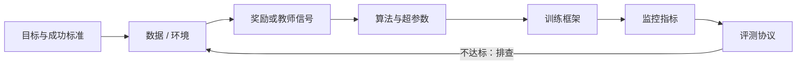

# 实践单元：最小可跑通的闭环

读懂原理之后，最快的学习方式是亲手跑通一个闭环。这里的每个**实践单元**都是一个在有限算力下能跑起来、结果可以验证的最小系统：有明确的目标、数据或环境、奖励、算法、训练框架和评测方式。

::: human
每个实践单元就像一道“能做完的实验题”：告诉你要准备什么、怎么跑、看哪些曲线、出了问题先查哪里。先跑通，再改进。
:::

## 每个单元都长这样 {#anatomy}

每个单元都会写清楚：

1. **目标**：训练完应该看到什么变化，怎样算成功。
2. **准备**：基座模型、数据或环境、算力规模。
3. **步骤**：从数据处理到启动训练的完整流程。
4. **监控**：哪些曲线正常、哪些是危险信号。
5. **排错**：最常见的问题、原因与处理办法。
6. **评测**：怎样评测才不会自欺欺人。

## 四个单元 {#units}

| 单元 | 你会得到 | 前置阅读 |
|---|---|---|
| [数学 RLVR：从 GRPO 到 DAPO](/practice/rlvr-math) | 一个在数学题上用可验证奖励训练的推理模型，以及一套监控与排错方法 | [LLM 强化学习](/topics/rl-for-llm)、[算法谱系](/lenses/algorithms) |
| [一次 On-Policy 蒸馏](/practice/opd) | 用强教师在学生自己的回答上逐词纠正，以很低成本给小模型提点 | [On-Policy 蒸馏](/topics/opd) |
| [搜索智能体 RL](/practice/search-agent) | 一个会多轮调用检索工具回答问题的模型 | [Agentic RL](/topics/agentic-rl) |
| [SWE 智能体 RL](/practice/swe-agent) | 在容器化代码仓库里修 bug、以测试通过为奖励的智能体 | [Agentic RL](/topics/agentic-rl)、[多环境](/topics/multi-env) |

## 怎么选 {#choose}

- **第一次做 RL**：从数学 RLVR 开始。奖励便宜可靠，问题出在哪一眼就能看出来。
- **手里有强模型、想要小模型**：先做 On-Policy 蒸馏，它通常比从头做 RL 省得多。
- **想做智能体**：先跑搜索智能体，环境简单、反馈快；再上 SWE 智能体，它对环境和 Infra 的要求高一个量级。

::: takeaway
- 先把奖励函数和评测跑通，再开始调算法；多数“算法问题”其实是奖励或数据问题。
- 每次只改一个变量，并固定随机种子；小规模上看到的趋势要在更大规模上复验。
- 把监控曲线当成实验记录的一部分：奖励、熵、回答长度、裁剪比例、KL，缺一不可。
:::
