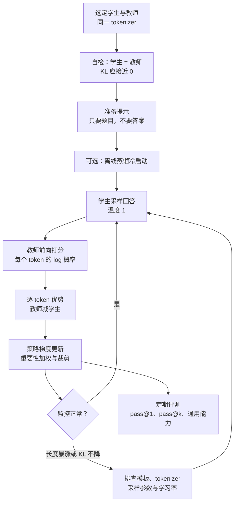

# 一次 On-Policy 蒸馏：最小可跑通配方

这个单元的目标：用一个同 tokenizer 的强教师，把一个已经会按格式作答的小模型在数学推理上“拉”上去。跑通之后你会得到三样东西：一个分数明显提升的学生、一套判断训练是否健康的监控曲线，以及一份能迁移到其他任务（代码、对话、专家合并）的配方。

::: human
流程只有四步：学生自己做题，老师把学生的答案读一遍、给每个字打分，按分数更新学生，再让学生接着做题。难点不在算法，而在“老师和学生说的是不是同一种话”。
:::

## 目标与成功标准 {#goal}

- **任务**：数学推理，提示来自带标准答案的题库；答案只用于评测，训练不需要。
- **成功**：在留出集上 pass@1 明显高于起点，并接近教师；回答长度与截断率平稳；通用能力（如指令遵循）没有明显回退。
- **参照系**：同样起点下，Qwen3-8B 做 OPD 用约 1/10 的 GPU 时超过了 RL[^qwen3]；TM 从 Qwen3-8B-Base 的 SFT 检查点出发，约 150 步就把 AIME'24 从 60% 提到 70%[^tm]。你的第一次运行不必复现这些数字，但方向应该一致：几十到几百步内就能看到提升。

## 准备：三档可选规模 {#setup}

下面三套配置都来自框架的官方示例或复现脚本，按手头资源选一套：

| 规模 | 学生 | 教师 | 提示数据 | 框架与入口 |
|---|---|---|---|---|
| 单卡试水 | Qwen2.5-0.5B-Instruct | Qwen2.5-1.5B-Instruct | UltraFeedback 提示 | TRL `DistillationTrainer`（文档快速上手） |
| 单机 8 卡 | Qwen3-8B | Qwen3-32B | GSM8K + MATH | verl `examples/on_policy_distillation_trainer/run_qwen3_8b_fsdp.sh` |
| 托管 LoRA | Qwen3.5-9B-Base（先 SFT） | Qwen3.5-9B | DeepMath | tinker-cookbook `recipes.distillation.on_policy_distillation` |

选模型时只有一条硬约束：**学生和教师必须共享 tokenizer 与词表**。slime、verl 和 TRL 的异步蒸馏都把学生的 token id 原样发给教师打分[^verl][^trl]，最省事的是同家族的大小模型。除此之外还要看“思维模式”是否兼容：用会长链思考的教师去教从没见过这种格式的学生，教师在学生前缀上的反馈会对不上，这时应先做一段离线蒸馏[^rethinking]。

## 步骤 {#steps}



### 1. 先做一次“学生等于教师”的自检 {#sanity}

把学生也设成教师模型跑几步，逐 token 反向 KL 应该接近 0（训练引擎与推理引擎之间的数值差异会留下一点残差）[^verl]。明显大于 0，说明两边看到的 token 序列不一致，最常见的原因是：

- **对话模板渲染不同**：教师打分用的提示格式必须和学生采样时一模一样。Tinker 的实现直接把学生的完整 token 序列交给教师，并在代码里提醒：教师若用不同的渲染器，需要自己改写这一步[^tinker]。
- **特殊 token**：`<think>` 之类的标记在师生之间切分或含义不同，会产生巨大的虚假 KL，先从损失里掩掉[^revisiting]。

### 2. 准备提示 {#prompts}

OPD 只需要提示。和 RL 不同，它不怕“全对”或“全错”的题——每个 token 都有信号，不存在组内优势全为 0 的问题；但提示最好落在**教师擅长**的分布里，否则教师自己的判断也不可靠[^rethinking]。数量上不必贪多：TM 的数学实验每步 512 条提示、每条 4 个样本，约 150 步用掉约 7.7 万条；他们还发现同一条提示反复训练也不容易过拟合[^tm]。

### 3. 可选：离线蒸馏冷启动 {#cold-start}

如果学生还不会教师的格式（例如没有思考段落），先用教师生成的回答做一轮 SFT。Qwen3 的强到弱蒸馏就是“离线再在线”两段式[^qwen3]；TM 的推理实验也是先在 OpenThoughts3 上 SFT，再做 OPD[^tm]。

### 4. 学生采样 {#rollout}

温度设为 1.0，不加 top-p、top-k 截断。OPD 的梯度推导假设样本来自学生自己的分布，截断采样会改变这个分布；确实要用 top-p（Revisiting OPD 这样做以减少离谱前缀）时，要清楚这是有意引入的偏差[^revisiting]。每条提示采 1–4 个样本即可：优势来自教师，不需要组内基线，GLM-5 甚至把组大小设为 1[^glm5]。

### 5. 教师打分 {#teacher}

把“提示 + 学生回答”整段送进教师做一次前向，取每个回答位置上学生采样 token 的 log 概率。几点实现细节：

- 教师放在独立的推理服务上最灵活（slime 的 SGLang 模式、verl 的教师资源池、TRL 的 HTTP 教师），打分可以和其他样本的采样重叠进行。
- 只取采样 token 的 log 概率最便宜。要做 top-k 截断 KL 时，注意 vLLM 默认最多只返回 20 个 logprob，需要显式调大上限（TRL 异步蒸馏文档用 `--max-logprobs -1`）[^trl]。
- 现有推理服务通常只能返回“采样 token + 教师 top-k”的概率，不能按任意 token id 取值，所以框架里的 top-k 损失一般是教师 top-k 上的前向 KL，而不是学生 top-k 上的反向 KL[^verl]。

### 6. 损失 {#loss}

默认实现是“采样 token 的反向 KL 当优势、折扣为 0、奖励 stop-gradient”，再套上 PPO 式的重要性比值与裁剪，处理训推不一致和旧样本：

```python
# 一步 OPD：单教师、只保留当前项（折扣 0）
batch = student_engine.generate(prompts, temperature=1.0, n=group_size)  # 同时记下采样时的 log μ
teacher_lp = teacher.score(batch.token_ids)            # 只做前向：每个回答 token 的 log πT
student_lp = student.logprobs(batch.token_ids)         # 训练引擎重算 log πθ（带梯度）

adv = kl_coef * (teacher_lp - student_lp.detach())     # 逐 token 优势 = 负的反向 KL 单样本估计
ratio = torch.exp(student_lp - batch.sample_lp)        # πθ / μ：修正训推差异与旧样本
loss = -torch.min(ratio * adv,
                  torch.clamp(ratio, 1 - eps_low, 1 + eps_high) * adv)
loss = (loss * mask).sum() / mask.sum()                # 按 token 平均；mask 掉提示、工具输出与特殊 token
loss.backward(); optimizer.step()
```

说明：Tinker 在优势里用的是采样时的 log 概率而不是训练引擎重算的值，两种写法在同步训练时几乎一样[^tinker]；MiMo-V2-Flash 不做裁剪，而是把比值越界的 token 直接丢掉[^mimo]。想同时用结果奖励，就把任务优势加到 `adv` 上（MiMo 的做法），或在 verl 里打开 `use_task_rewards`，并记得关掉参考模型 KL[^verl]。

### 7. 超参数起步值 {#hparams}

| 超参数 | 起步值 | 依据 |
|---|---|---|
| 采样温度 | 1.0，不截断 | TM、TRL、verl 的默认设置；改采样分布就要做修正 |
| 每条提示的样本数 | 1–4 | 不需要组内基线；GLM-5 用 1，Tinker 默认 4 |
| 每步提示数 | 128–512 | verl 示例 128；TM 数学实验 512 |
| 学习率 | 全参 1e-6 起；LoRA 1e-4 | verl 示例与 TRL 默认 1e-6；Tinker 的 LoRA 用 1e-4、全参 OPD 用 5e-5 |
| KL 系数 | 1.0 | Tinker、slime、verl 的默认值 |
| 折扣 γ | 0 | TM 试过大于 0，没有收益 |
| 最大回答长度 | 按任务 2K–16K | verl 示例 2048；TM 的 AIME 实验 16K |
| 裁剪范围 | 0.2 / 0.28 | verl 的 PG OPD 示例 |

不同框架的损失归一化方式不同（按 token 平均还是按序列求和、是否按长度归一化），学习率不能跨框架照搬，换框架时先用小学习率确认曲线方向。

## 监控 {#monitor}

| 指标 | 健康表现 | 危险信号与含义 |
|---|---|---|
| 逐 token 反向 KL 均值 | 平稳下降 | 从一开始就很大且不降：模板、tokenizer 或思维模式不匹配 |
| 单 token KL 的最大值 | 平稳 | 个别 token 极大：风格 token 或特殊 token 在主导梯度[^opsd] |
| 回答长度、截断率 | 缓慢变化 | 突然暴涨、截断样本占满批次：重复引起的长度膨胀[^stableopd] |
| 熵 | 缓慢下降 | 塌得很低：模式坍缩，pass@k 往往随之下降 |
| 师生 top-k 重叠率 | 逐步上升 | 停滞：信号没落到学生真正会走的状态上[^rethinking] |
| 重要性比值越界比例 | 很低 | 升高：推理引擎与训练引擎不一致，或样本太旧 |
| 真实任务指标 | 上升 | 与 KL 背离：学生在拟合教师的偏差，或评测本身有问题 |

框架里对应的日志项：Tinker 记录 `teacher_kl`；verl 在 `actor/distillation/*` 下记录损失、最大最小值以及 `overlap_ratio`、`teacher_mass`、`student_mass`；TRL 记录回答长度、截断比例 `completions/clipped_ratio` 和熵[^verl][^trl][^tinker]。注意单样本估计的 KL 可以是负数，看的是均值和趋势。

## 成本估算 {#cost}

用常见的粗略口径（前向约 $2N$、前向加反向约 $6N$ FLOPs 每 token，$N$ 为参数量）估一步 OPD 每个回答 token 的计算量。以 8B 学生、32B 教师为例：

| 环节 | 每 token FLOPs | 8B 学生 / 32B 教师 | 特点 |
|---|---|---|---|
| 学生采样 | $2N_S$ | 约 16 G | 自回归解码，受显存带宽限制，墙钟时间往往最长 |
| 教师打分 | $2N_T$ | 约 64 G | 一次 prefill，计算密集、高度并行 |
| 学生重算 log 概率 | $2N_S$ | 约 16 G | 部分框架可省（直接用采样时的值） |
| 学生训练 | $6N_S$ | 约 48 G | 与 RL 相同 |

教师前向约占总 FLOPs 的四成，但它是效率最高的那种计算；墙钟时间的大头通常仍是学生的长链解码，这一点和 RL 一样。OPD 省钱的地方不在单步，而在**步数和样本数**：每条提示只要 1–4 个样本（GRPO 类 RL 往往每题要采 8 个以上来估计组内基线），达到同样水平所需的步数也少得多。按 TM 数学实验的规模粗算（每步 512 条提示 × 4 个样本，假设平均每个回答约 4K token，合计约 840 万 token），一步约 $1.2\times10^{18}$ FLOPs，150 步约 $2\times10^{20}$ FLOPs，按 H100 BF16 峰值的 40% 折合一两百个 GPU 时的纯计算量，再加上解码利用率低带来的额外开销。这只是量级估计，实际取决于回答长度和实现，但可以和 Qwen3 报告中 8B 模型 OPD 的 1,800 GPU 时、RL 的 17,920 GPU 时对照着看[^qwen3]。

显存方面，32B 教师的 BF16 权重约 64 GB，在 80 GB 卡上通常用张量并行 2 卡一份；verl 的 8B 示例给教师分配 4 张卡、张量并行 2[^verl]。

## 框架怎么选 {#frameworks}

<EntryGrid :ids="['trl', 'tinker', 'verl', 'slime', 'nemo-rl']" />

| 框架 | 入口 | 关键开关 | 适合 |
|---|---|---|---|
| TRL（本文核对 v1.14.0） | `from trl import DistillationTrainer`；实验模块另有 `GKDTrainer`、`GOLDTrainer`、`MiniLLMTrainer`、`AsyncDistillationTrainer` | `beta`（0 为前向 KL，1 为反向 KL，默认 1）；`use_vllm`；GKD 的 `lmbda`、`seq_kd` | 单机起步、跨 tokenizer（GOLD）、复现 GKD 与 MiniLLM |
| tinker-cookbook | `python -m tinker_cookbook.recipes.distillation.on_policy_distillation` | `kl_penalty_coef`、`kl_discount_factor`、`group_size`、`groups_per_batch`、`lora_rank` | 复现 TM 博客；多教师与多轮工具调用也有配方 |
| verl | `distillation.enabled=true` 加教师资源池 | `loss_mode=k1` 配 `use_policy_gradient=true`（PG OPD），或 `forward_kl_topk`（GKD OPD）；`use_task_rewards`；按 `data_source` 路由多教师 | 已在用 verl 做 RL、要多教师或多模态 |
| slime | `--use-opd --opd-type sglang` 或 `megatron` | `--opd-kl-coef`；SGLang 模式下教师是独立服务 | Megatron 大规模训练，GLM 系列使用的 RL 框架 |
| NeMo-RL | `examples/run_distillation.py` | 默认 Qwen3-1.7B-Base 学生、Qwen3-4B 教师；可接 NeMo Gym 做多轮 | NVIDIA 生态，公开了 Nemotron 3 Ultra 的多教师流程 |

这些入口与参数均核对自各仓库当前的文档和示例脚本[^trl][^tinker][^verl][^slime][^nemo]。它们的核心差别只有两点：**信号用采样 token 还是整段分布**（PG OPD 对 GKD OPD），以及**教师放在哪里**（同进程、同集群的资源池，还是独立推理服务）。

## 把配方迁移到四种常见场景 {#variants}

上面的单教师数学配方跑通之后，改几处就能用到工业界最常见的四种场景：

**多教师合并。** 每个领域一个教师，按样本的领域字段路由（verl 用 `distillation.teacher_key`，默认按 `data_source`），各领域的逐 token 信号在同一个批次里合并训练。两个细节容易被忽略：数据要打乱，否则拼接起来的数据集会让同一个教师连续占用很长一段训练[^verl]；每个领域的 KL 要分开记录（Tinker 会按数据集分别记 `teacher_kl`）[^tinker]，否则一个领域的退步会被平均值掩盖。想让学生在某些领域超过教师，就把结果奖励的优势加进去[^mimo]。

**能力找回与个性化。** 领域微调或中训练之后通用行为变差时，教师就是**微调前的模型**，提示用与新知识无关的通用对话提示（TM 用的是 Tulu 3 提示），不必重新配比数据；TM 的复现说明里提到 IF-eval 约 100 步就恢复了[^tinker]。GLM-5 的做法类似，只是教师换成了前面各个训练阶段的最终检查点，并按比例混合各阶段的训练提示[^glm5]。

**多轮工具调用。** 学生在环境里多轮行动，教师对整条轨迹打分，但只有学生自己生成的 token 进入损失：系统提示、用户消息、工具返回都要掩掉。tinker-cookbook 的多轮配方就是把环境奖励设为 0、只保留对教师的 KL[^tinker]；NeMo-RL 则可以接 NeMo Gym 采集多轮轨迹[^nemo]。注意教师看到的必须是学生实际得到的那份工具输出，不能重新执行工具。

**自蒸馏（没有外部教师）。** 教师就是学生自己，只是提示里多了特权信息：参考解（OPSD）、一条示范（SDFT）或环境的文字反馈（SDPO）。实现上构造“题目 + 特权信息”的教师提示，把学生的回答 token 接在后面让教师打分：可以像普通 OPD 一样用“教师减学生”的逐 token 优势，也可以像 SDFT 原文那样在教师分布上做逐 token 的前向 KL。Tinker 的 SDFT 配方两种都支持，默认用教师 top-K 分布做交叉熵，并验证了 top-20 的近似与全词表效果相当[^tinker]。TRL 也提供了 `SDFTTrainer` 与 `SDPOTrainer`[^trl]。

## 排错 {#debug}

| 现象 | 先查什么 |
|---|---|
| 第一步 KL 就很大，且一直不降 | 自检（学生 = 教师）能否把 KL 压到接近 0；教师打分用的模板与学生采样是否逐 token 一致；特殊 token 是否需要掩掉 |
| 前几十步正常，之后长度暴涨、验证集下滑 | 重复与截断率；降低学习率；对参考模型加散度约束并混入其他来源的 rollout（StableOPD）；也可以借鉴 RL 的超长过滤，把被截断的样本排除出损失（经验做法） |
| 分数涨到一半就停 | 教师在这批提示上是否真的更强；提示是否落在教师擅长的分布；考虑叠加结果奖励 |
| 目标任务涨了，通用能力掉了 | 混入通用提示，并用训练前的模型当这部分的教师（TM 的个性化做法[^tm]），或改成多教师 |
| 训练吞吐很低 | 教师打分是否和采样重叠；是否只取了采样 token 的 log 概率；需要时改异步，并限制样本的最大陈旧步数 |

## 评测 {#eval}

- 用部署时的采样设置评测，报告多次采样平均的 pass@1，同时报告 pass@k：OPD 的反向 KL 偏向模式寻求，可能在提升 pass@1 的同时压缩多样性[^tts]。
- 同时测一两个通用能力基准（如指令遵循），确认没有被新训练“洗掉”。
- 与教师、与同起点的 RL 或 SFT 基线并排比较；不要把 KL 当作评测指标。

::: takeaway
- 开训前先跑“学生 = 教师”的自检：KL 压不到接近 0，后面的一切曲线都不可信。
- 温度 1、每题 1–4 个样本、折扣 0、KL 系数 1，是几个主流框架共同的起点。
- 学生没见过教师的格式时，先离线蒸馏再在线蒸馏。
- 长度、截断率、单 token 最大 KL 和真实任务指标要和 KL 均值一起看。
- 算力的大头仍是学生解码；OPD 省在样本数和步数，而不是单步。
:::

::: pitfall
- 教师打分时重新套了一遍对话模板，或思考模式开关与学生不同：KL 巨大且不降，训练却不会报错。
- 在 RL 框架里跑 OPD 却保留了参考模型 KL：学生同时被拉向参考模型和教师。
- 为了“稳”把采样温度调低：学生的样本不再来自自身分布，梯度估计有偏，多样性也会更快塌缩。
- 按 KL 均值挑检查点：重复和冗长的回答也能把 KL 刷低。
:::

## 延伸阅读 {#further}

- 原理与推导：[On-Policy 蒸馏专题](/topics/opd)，尤其是[精确与近似](/topics/opd#approximations)和[失效模式](/topics/opd#when-it-fails)
- 资料库：[OPD 全部条目](/library/?area=opd)、[TM 博客](/library/?id=tm-opd)、[Tinker](/library/?id=tinker)
- 相邻实践：[数学 RLVR：从 GRPO 到 DAPO](/practice/rlvr-math)，可以和本单元对照成本与曲线
- 训练系统：[训推不一致](/lenses/infra#mismatch)、[异步训练](/lenses/infra#async)、[训练框架对比](/lenses/infra#frameworks)

[^qwen3]: Qwen Team，*Qwen3 Technical Report*，§4.5 与 Table 21。https://arxiv.org/abs/2505.09388
[^tm]: Kevin Lu 与 Thinking Machines Lab，*On-Policy Distillation*，2025-10-27。https://thinkingmachines.ai/blog/on-policy-distillation/
[^tinker]: tinker-cookbook：`tinker_cookbook/distillation/train_on_policy.py` 与 `recipes/distillation`。https://github.com/thinking-machines-lab/tinker-cookbook
[^verl]: verl 文档 *On-Policy Distillation (OPD)* 与示例 `examples/on_policy_distillation_trainer/`。https://github.com/verl-project/verl/blob/main/docs/algo/opd.md
[^trl]: TRL 文档：Distillation Trainer、Async Distillation、GKD、GOLD、MiniLLM。https://github.com/huggingface/trl/tree/main/docs/source
[^slime]: slime 文档 *On-Policy Distillation* 与 `examples/on_policy_distillation`。https://github.com/THUDM/slime/blob/main/docs/en/advanced/on-policy-distillation.md
[^nemo]: NeMo-RL 文档 *On-policy Distillation*。https://github.com/NVIDIA-NeMo/RL/blob/main/docs/about/algorithms/on-policy-distillation.md
[^glm5]: Zeng et al.，*GLM-5: from Vibe Coding to Agentic Engineering*，On-Policy Cross-Stage Distillation 一节。https://arxiv.org/abs/2602.15763
[^mimo]: Xiaomi LLM-Core，*MiMo-V2-Flash Technical Report*，§4.4。https://arxiv.org/abs/2601.02780
[^rethinking]: Li et al.，*Rethinking On-Policy Distillation of Large Language Models*。https://arxiv.org/abs/2604.13016
[^revisiting]: Fu et al.，*Revisiting On-Policy Distillation: Empirical Failure Modes and Simple Fixes*，COLM 2026。https://arxiv.org/abs/2603.25562
[^opsd]: Self-Distilled Reasoner（OPSD）代码仓库更新说明。https://github.com/siyan-zhao/OPSD
[^stableopd]: Luo et al.，*Demystifying OPD: Length Inflation and Stabilization Strategies for Large Language Models*。https://arxiv.org/abs/2604.08527
[^tts]: Ge et al.，*Towards Understanding On-Policy Distillation through the Lens of Test-Time Scaling*（2026-08）。https://arxiv.org/abs/2608.11829
