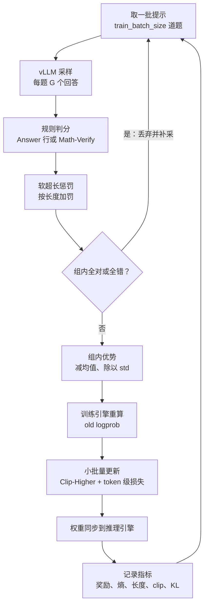

# 数学 RLVR：从 GRPO 到 DAPO 的最小闭环

::: tldr
- 数学 RLVR 适合作为第一次做 LLM RL 的练手项目：奖励只需要一个判分器，便宜、可靠，出了问题也容易定位。
- 先把判分器和评测协议做对，再调算法：判分器错几个百分点，后面所有曲线都不可信；评测用 avg@k 加多种子，并用非 Qwen 基座做对照。
- 从朴素 GRPO 出发，按“去 KL → Clip-Higher → 软超长惩罚 → token 级损失 → 动态采样”一次改一项，每一步都应在熵、长度或零优势比例的曲线上看到对应变化。
- 命令钉在 verl 的一个固定版本上；verl 迭代很快，换版本时以该版本的配置文件和官方示例为准。
- 如果只读一节：读 [框架与配置](#config)。
:::

在数学题上，用“最终答案对不对”这一<Term t="rlvr">可验证奖励</Term>，从一个基座模型出发跑通 GRPO，再逐项加上 DAPO 的四个修正；目标不只是得到一个更会解题的模型，而是学会**看曲线、查问题、做可信的评测**。它适合作为第一次做 LLM RL 的起点：奖励便宜可靠，问题出在哪也容易看出来。

::: human
找一批有标准答案的数学题，让模型每题做 8 到 16 遍，对的加分、错的扣分，比平均分好的做法多学一点。跑通之后，再一样一样加上前人踩坑总结出的补丁，看每个补丁到底改变了什么。
:::

## 目标与成功标准 {#goal}

跑完这个单元，你应该能拿出四样东西：

1. **一条健康的训练曲线**：训练奖励稳步上升，熵没有塌缩到接近 0，回答长度的增长伴随准确率的增长，而不是只长不涨。
2. **可信的提升**：在同一评测协议下，验证集（如 AIME、MATH-500）的 avg@k 明显高于基座，并且在至少 3 个随机种子上方向一致。
3. **一张消融表**：从朴素 GRPO 出发，每加一项 DAPO 修正，能说清它改变了哪条曲线、为什么。
4. **一份排错记录**：遇到过的异常、定位过程与处理办法。

::: evidence 参照系
DAPO 在 Qwen2.5-32B 基座上的逐项消融（AIME 2024 avg@32）：朴素 GRPO 30 → 加 Overlong Filtering 36 → 加 Clip-Higher 38 → 加软超长惩罚 41 → 加 token 级损失 42 → 加动态采样 50。小模型、小算力上各项的增益幅度会不同，但方向可以作为对照[^dapo]。
:::

## 算力分档 {#budget}

先在小模型上把流程跑通，再按需放大。下表的“参照”都是公开可查的配置：

| 档位 | 硬件 | 建议规模 | 公开参照 |
|---|---|---|---|
| 入门 | 1 张 80GB GPU | 0.5B 左右基座，回答上限 4k 以内，每题 8 个样本 | SimpleRL-Zoo：训练 Qwen2.5-0.5B 的最低要求是单张 80GB A100/H100[^simplerl] |
| 单机 | 8 × A100/H100 80GB | 1.5B–7B，回答上限 4k–8k | Dr. GRPO：Qwen2.5-Math-7B 在 8×A100 上约 27 小时[^drgrpo]；DeepScaleR 第一阶段（8k 上下文）在单机 8×A100-80GB 上训练 1.5B 模型[^deepscaler] |
| 多机 | 2–8 个节点 | 7B–32B，回答上限约 8k | SimpleRL-Zoo：7B/14B 用 2×8 H100 约 15 小时（约 100 步），32B 用 8×8 H100 约 1.5 天[^simplerl] |
| 论文复现 | 16 个节点（128 卡） | Qwen2.5-32B，回答上限 20k | verl 的 DAPO 复现：16×8 H800，AIME 2024 达 52%[^dapo-verl] |

长 CoT 的代价主要在生成：回答上限每翻一倍，最长样本的生成时间与 KV cache 至少跟着翻倍，而且会出现少数超长样本拖住整批的<Term t="long-tail-rollout">长尾</Term>现象。先用 4k–8k 的上限验证流程，再像 DeepScaleR 那样分阶段加长（8k → 16k → 24k）。

## 选基座模型 {#base-model}

**最常用：Qwen2.5-Math-1.5B/7B。** 数学先验强、社区结果多，便于对照。但有三个坑要提前知道：

- **上下文短**。它的原生上下文只有 4k，Dr. GRPO 的示例把生成上限设为 3000 token；verl-recipe 的 DAPO 7B 测试脚本特意提示下载后要把 `max_position_embeddings` 改成 32768。回答上限不宜一开始就开得很长。
- **“随机奖励也涨分”**。Spurious Rewards 发现，在 Qwen2.5-Math 上，随机奖励、只看格式的奖励甚至错误标签，都能明显提升 MATH-500，而同样的奖励在 Llama3、OLMo2 上往往带不来提升（[Spurious Rewards](/library/?id=spurious-rewards)）；也有工作指出 Qwen2.5 在公开数学基准上存在数据污染（[推理还是记忆](/library/?id=reasoning-or-memorization)）。**只在 Qwen2.5-Math 上成立的结论，不足以证明你的算法或奖励有效**——详见 [伪奖励之争](/lenses/principles#spurious-rewards)。
- **模板敏感**。Dr. GRPO 发现，不匹配的提示模板（例如在 Qwen2.5-Math-1.5B 上套 R1 模板）会先破坏模型的推理能力，RL 再把它“修回来”，表面上的提升因此被夸大[^drgrpo]。

**通用基座**：DAPO 用的是 Qwen2.5-32B Base；SimpleRL-Zoo 在 Llama3 8B、Mistral 7B/24B、DeepSeekMath 7B、Qwen2.5 0.5B–32B 等 10 个基座上跑过同一套配方，是跨模型家族对照的好参考[^simplerl]。

**对照组**：至少再选一个非 Qwen 家族的基座（如 Llama 或 OLMo）做对照，用来排除“伪奖励”和污染带来的假象。若起点是 DeepSeek-R1-Distill-Qwen-1.5B 这类蒸馏过的长 CoT 模型（DeepScaleR 的做法），回答上限要从 8k 起步。

## 数据 {#data}

| 数据集 | 规模 | 特点 | 适合 |
|---|---|---|---|
| [DAPO-Math-17k](/library/?id=dapo) | 约 1.7 万题 | 来自 AoPS 与官方竞赛页面，答案统一改写为整数，规则判分几乎没有歧义 | 默认起点 |
| [DeepScaleR-Preview-Dataset](/library/?id=deepscaler) | 数万题 | DeepScaleR-1.5B 的训练集，竞赛题为主 | 蒸馏模型继续 RL |
| [DeepMath-103K](/library/?id=deepmath-103k) | 约 10.3 万题 | 难度偏高（主要 5–9 级），做过针对常见基准的语义去污染 | 大规模、难题为主 |
| [Skywork-OR1-RL-Data](/library/?id=skywork-or1) | 数学与代码 | 附带按模型大小做难度过滤的脚本 | 按模型筛难度 |
| [ORZ 数据](/library/?id=open-reasoner-zero) | 5.7 万 + 7.2 万，另有 1.3 万难题 | 来自 AIME（截至 2023）、MATH、NuminaMath、Tulu3 MATH，扩展部分主要清洗自 OpenR1-Math-220k | 从零 RL |
| [SimpleRL-Zoo 数据](/library/?id=simplerl-zoo) | 8K 题 | 按难度分三档，Hard 档为 MATH 3–5 级 | 小算力起步 |

无论用哪一份，训练前都要做三件事（流程细节见 [数据工作流](/lenses/data#rlvr-pipeline)）：

1. **<Term t="decontamination">去污染</Term>**：与所有评测集（AIME 24/25、MATH-500 等）做 n-gram 与语义去重。
2. **<Term t="difficulty-filtering">难度过滤</Term>**：用基座模型对每题采样 8–16 次估计通过率，去掉全对和全错的题。它们在组相对优势下梯度为零，只会稀释批次。
3. **<Term t="answer-normalization">答案规范化</Term>**：答案要能被判分器解析（整数、分数、根式、区间），解析不了的题宁可丢掉。

DAPO-Math-17k 的提示模板是现成的，要求模型最后一行写出答案（verl 的 `math_dapo` 判分器就按这个格式提取）：

```text
Solve the following math problem step by step. The last line of your response should be of the form Answer: $Answer (without quotes) where $Answer is the answer to the problem.

<题目>

Remember to put your answer on its own line after "Answer:".
```

## 奖励函数 {#reward}

数学 RLVR 的奖励就是一个<Term t="verifier">验证器</Term>：从回答里抽出最终答案，与标准答案比较。

- **DAPO 的做法**：对 +1，错 −1。verl 的 `math_dapo` 判分器只看回答最后 300 个字符，用正则提取最后一个 `Answer:` 行，规范化后与标准答案比较；本页钉住的版本只认这种写法，更新的主干在提取失败时还会退回最后一个 `\boxed{}`[^math-dapo]。
- **Math-Verify**：Hugging Face 的 [Math-Verify](/library/?id=math-verify) 把答案解析成 SymPy 表达式再比较，支持集合、区间、矩阵、百分数等，能大幅减少“答对了却判错”的假阴性。注意 `verify(gold, answer)` 的参数顺序不能颠倒；verl 的 `math_verify` 封装会把标准答案包进 `\boxed{}` 再解析，并在子进程里带超时运行。

在 verl 中接入自定义奖励，用 `reward.custom_reward_function.path` 指向文件（本页钉住的版本也兼容旧写法 `custom_reward_function.path`），函数签名为 `(data_source, solution_str, ground_truth, extra_info=None)`[^reward-fn]。下面是一个示意实现（非官方代码，按需修改）：

```python
# 示意：±1 正确性奖励，用 Math-Verify 判分
# Math-Verify 的超时靠 signal.alarm，只能在主线程里用；奖励函数若在线程池里执行，
# 要么传 parsing_timeout=None / timeout_seconds=None 并自行限时，要么像 verl 的封装那样放进子进程。
from math_verify import parse, verify

def compute_score(data_source, solution_str, ground_truth, extra_info=None):
    gold = parse("\\boxed{" + ground_truth + "}")
    pred = parse(solution_str[-2000:])      # 只解析结尾：更快，也少把草稿里的中间结果当成答案
    ok = bool(gold) and bool(pred) and verify(gold, pred)
    return 1.0 if ok else -1.0
```

**要不要加格式奖励？** 单独给“格式正确”加分，早期能让模型快速学会输出可解析的答案，但它本身就是可被刷的信号：Spurious Rewards 的实验里，只奖励“答案写进 `\boxed{}`”也能在 Qwen2.5-Math 上涨分[^spurious]。更稳妥的做法是把格式当成硬门槛——解析不出答案就按答错处理——而把判分器做得足够宽容，而不是另设一项格式分。

## 框架与配置 {#config}

参考实现用 [verl](/library/?id=verl)：GRPO 用主仓库的入口 `verl.trainer.main_ppo`，DAPO 的完整配方在 verl-project/verl-recipe 的 `dapo` 目录。**verl 迭代很快，配置项会改名、会搬家**，所以下面的命令钉在一个版本上：verl-recipe `dapo/REQUIRED_VERL.txt` 列出的滚动版本（verl 提交 `bcb6386`，2026 年 4 月）。所有配置项都在该版本的配置文件与官方示例脚本里核对过[^dapo-verl]，数值是起步建议，按你的算力调整；复现论文数字则用同一文件里的 `REPRODUCTION_COMMIT` 和当时的脚本。

**第一步：朴素 GRPO 基线。** 刻意使用原始 GRPO 的设定（序列级聚合、std 归一化、k3 KL 损失；verl 里的 `low_var_kl` 就是 k3），作为后续消融的起点。下面的命令按单机 8 卡、Qwen2.5-Math-7B 设计，提示加回答控制在原生 4k 上下文之内；验证时的采样参数与 DAPO 一致（温度 1.0、top-p 0.7）：

```bash
python3 -m verl.trainer.main_ppo \
  algorithm.adv_estimator=grpo \
  algorithm.norm_adv_by_std_in_grpo=True \
  data.train_files=$HOME/verl/data/dapo-math-17k.parquet \
  data.val_files=$HOME/verl/data/aime-2024.parquet \
  data.train_batch_size=128 \
  data.max_prompt_length=1024 \
  data.max_response_length=3072 \
  data.filter_overlong_prompts=True \
  actor_rollout_ref.model.path=Qwen/Qwen2.5-Math-7B \
  actor_rollout_ref.actor.optim.lr=1e-6 \
  actor_rollout_ref.actor.ppo_mini_batch_size=32 \
  actor_rollout_ref.actor.use_kl_loss=True \
  actor_rollout_ref.actor.kl_loss_coef=0.001 \
  actor_rollout_ref.actor.kl_loss_type=low_var_kl \
  actor_rollout_ref.actor.loss_agg_mode=seq-mean-token-mean \
  actor_rollout_ref.actor.use_dynamic_bsz=True \
  actor_rollout_ref.rollout.name=vllm \
  actor_rollout_ref.rollout.n=8 \
  actor_rollout_ref.rollout.temperature=1.0 \
  actor_rollout_ref.rollout.val_kwargs.do_sample=True \
  actor_rollout_ref.rollout.val_kwargs.temperature=1.0 \
  actor_rollout_ref.rollout.val_kwargs.top_p=0.7 \
  trainer.val_before_train=True \
  trainer.test_freq=10 \
  trainer.total_training_steps=200 \
  trainer.n_gpus_per_node=8 \
  trainer.nnodes=1
```

`ppo_mini_batch_size` 按题目数计：每步 128 道题分成 4 个小批量，做 4 次梯度更新。验证时每题采样几次由 `actor_rollout_ref.rollout.val_kwargs.n` 控制，verl 把结果报告为 `mean@n`，也就是下文评测协议里的 avg@k；AIME 这类 30 题的小集合，k 至少取 16（先看一眼验证集里每道题是否已经复制了多份，免得重复采样）。

**第二步：逐项换成 DAPO。** 下表是 DAPO 配方相对上面的改动，一次只改一行（取值来自 DAPO 的 32B 脚本；软超长惩罚的写法取自该版本 verl 的官方示例）：

| DAPO 组件 | 配置项 | 取值 |
|---|---|---|
| 去掉 KL | `algorithm.use_kl_in_reward`、`actor_rollout_ref.actor.use_kl_loss` | 均为 False |
| Clip-Higher | `actor_rollout_ref.actor.clip_ratio_low`、`clip_ratio_high` | 0.2、0.28 |
| 软超长惩罚 | `reward.reward_manager.name=dapo`，加 `+reward.reward_kwargs.overlong_buffer_cfg.enable`、`len`、`penalty_factor` 与 `+reward.reward_kwargs.max_resp_len` | True、缓冲区长度（见下）、1.0、回答上限 |
| token 级损失 | `actor_rollout_ref.actor.loss_agg_mode` | `token-mean` |
| 动态采样 | `algorithm.filter_groups.enable`、`metric`、`max_num_gen_batches`，以及 `data.gen_batch_size` | True、`acc`、10；生成批是训练批的 3 倍 |
| Dual-clip | `actor_rollout_ref.actor.clip_ratio_c` | 10.0 |

几个容易踩的细节：

- **入口不同**：在本页钉住的版本上，动态采样要用 DAPO recipe 自己的入口 `recipe.dapo.main_dapo`（verl-recipe 作为 `recipe/` 子模块放进 verl 仓库）；其余各项用主入口 `verl.trainer.main_ppo` 就能跑。2026 年 9 月的 verl 主干已把分组过滤并入主入口，并改用 `max_inflight_gen_batches` 限制并发生成、不再理会 `max_num_gen_batches`；主入口也不再自动迁移旧的 `reward_model.*`、`custom_reward_function.*` 写法。DAPO 复现脚本里的 `reward_model.overlong_buffer.*` 同样是旧写法，只适用于复现提交。
- **缓冲区随回答上限缩放**：DAPO 用 20k 上限配 4096 的缓冲区，verl-recipe 的 7B 测试脚本用 8k 上限配 4096；像上面 3k 的上限，缓冲区取几百 token 即可（verl 要求它不超过 `max_resp_len`），否则大多数正常长度的回答都会挨罚。
- **长上下文要显式放开**：verl-recipe 的 7B 测试脚本在 Qwen2.5-Math-7B 上跑 8k 回答时，额外加了 `+actor_rollout_ref.model.override_config.max_position_embeddings=32768`；这属于超出原生长度的外推，收益与风险都要自己验证。
- **其余超参数**（取自 DAPO 32B 脚本）：学习率 1e-6、预热 10 步、weight decay 0.1、梯度裁剪 1.0、不加熵正则；每步 512 道题 × 16 个回答，小批量 32 道题，即每批 rollout 做 16 次梯度更新；训练采样温度 1.0、top-p 1.0，验证时 top-p 0.7。

## 分步运行计划 {#run-plan}

1. **准备数据**：下载 DAPO-Math-17k 与 AIME 2024（verl-recipe 的 `prepare_dapo_data.sh` 会把两个 parquet 放到 `~/verl/data`）；按上文做去污染与难度过滤。
2. **自检判分器**：抽 50–100 条基座输出人工核对判分，重点看 `Answer:` 与 `\boxed{}` 两种写法、分数与根式、带单位的答案。判分器错 5%，后面的所有曲线都不可信。
3. **测基座**：开 `trainer.val_before_train=True`，用最终评测协议记录基座分数。
4. **跑 GRPO 基线**：先跑 50–100 步，确认奖励上升、熵与长度走势正常，再决定是否跑满。
5. **逐项加修正**：按“去 KL → Clip-Higher → 软超长惩罚 → token 级损失 → 动态采样”的顺序，每次只改一项、固定种子，保存每次的曲线与验证分数。
6. **放大**：分阶段加长回答上限、加大批次或换更大的模型；每次放大都重新看一遍监控曲线。
7. **最终评测**：多种子、avg@k、去污染检查，见下文评测协议。

每加一项修正，应该在曲线上看到对应的变化；看不到，往往说明配置没生效或者问题不在这里。这个顺序与 DAPO 论文表 1 的消融顺序一致，只省去了 verl 没有实现、论文最好结果也没开的 Overlong Filtering。下表中 Clip-Higher 及以下四行的“预期”对应论文中的消融曲线；DAPO 从一开始就不带 KL，第一行是推导上的预期：

| 这一步 | 预期看到的变化 | 如果没看到 |
|---|---|---|
| 去掉 KL | 策略可以离参考模型更远，奖励曲线不再被 KL 项拖住；有可靠验证器时通常无害 | 确认 `use_kl_loss` 与 `use_kl_in_reward` 都已关闭 |
| Clip-Higher | 熵下降变慢或回升，同题回答更多样 | 查 `clip_ratio_high` 是否生效；熵仍塌缩时降低学习率 |
| 软超长惩罚 | 截断比例下降，长度在上限前被“软挡住” | 缓冲区是否按回答上限缩放 |
| token 级损失 | 熵与长度的增长更平稳，错误回答不再无谓变长 | 确认 `loss_agg_mode` 为 `token-mean` |
| 动态采样 | 每步有效提示数恒定，同样步数下提升更快；单步生成时间变长 | 看 `train/num_gen_batches` 是否频繁触顶，题目可能太易或太难 |



## 监控什么 {#monitor}

DAPO 论文的经验是：训练奖励只说明模型在拟合训练集，与验证准确率的相关性往往不高；真正要盯的是长度、熵与生成概率这些“过程指标”[^dapo]。下表的指标名来自 verl：

| 指标 | verl 中的名字 | 健康的样子 | 危险信号 |
|---|---|---|---|
| 训练奖励 | `critic/score/mean` | 稳步上升，偶有平台 | 突然跳升（先查判分漏洞），或长期不动 |
| 熵 | `actor/entropy` | 缓慢下降后趋稳，或缓慢上升（DAPO 发现熵保持缓慢上升有利于性能提升） | 快速降到接近 0（<Term t="entropy-collapse">熵塌缩</Term>），或持续暴涨（乱码、重复） |
| 回答长度 | `response_length/mean` | 随准确率一起增长，中途可能停滞甚至回落 | 只长不涨，或出现大量重复片段 |
| 截断比例 | `response_length/clip_ratio` | 低且平稳 | 持续上升，说明长度正在失控 |
| 裁剪比例 | `actor/pg_clipfrac` | 小而平稳 | 持续升高：更新太猛、数据复用太多；拿推理引擎的 logprob 当 $\pi_{\theta_\text{old}}$ 时还可能是训推不一致 |
| 新旧策略 KL | `actor/ppo_kl` | 很小 | 突然跳升 |
| 零优势比例 | 组内奖励全相同的提示占比；DAPO recipe 记录补采次数 `train/num_gen_batches` | 随训练缓慢上升 | 超过一半，或补采次数触顶报错 |

<Term t="clip-ratio">裁剪比例</Term>的含义和读法见 [算法谱系：PPO](/lenses/algorithms#ppo)。零优势比例一路走高，通常说明训练集对当前模型已经太简单——这正是动态采样和[难度课程](/lenses/data#difficulty)要解决的问题。

## 排错 {#troubleshooting}

| 症状 | 常见原因 | 先查什么 | 处理办法 |
|---|---|---|---|
| 熵塌缩：熵迅速降到接近 0，同题回答几乎一样 | 上界裁剪压住低概率 token；学习率偏大；题太简单 | `actor/entropy`、`actor/pg_clipfrac` | Clip-Higher（$\varepsilon_\text{high}$ 取 0.28）；降学习率；剔除全对题；可参考 [熵机制](/library/?id=entropy-mechanism) 中的 Clip-Cov、KL-Cov |
| 长度爆炸：长度猛涨、截断比例升高、出现重复 | 按序列平均带来的长度偏置；截断样本直接判错引入噪声 | `response_length/clip_ratio`、抽查长样本 | 改用 `token-mean`；开软超长惩罚；检查重复 |
| 奖励作弊：训练奖励跳升，验证分不涨 | 判分漏洞，例如提取规则被钻空子、格式分被刷 | 抽查高分样本 | 用 Math-Verify 并人工抽检；格式做硬门槛；验证集用独立判分器（见 [奖励作弊](/topics/rl-for-llm#reward-hacking)） |
| 大量零优势组 | 题太易或太难；每题样本数 G 太小 | 零优势比例 | 动态采样；难度过滤；增大 G；做难度课程 |
| 显存溢出（OOM） | 长回答乘以过大的微批 | 显存曲线、最长样本 | `use_dynamic_bsz=True` 并调小 `ppo_max_token_len_per_gpu`；梯度检查点；序列并行（`actor_rollout_ref.actor.fsdp_config.ulysses_sequence_parallel_size`）；参数与优化器 offload |
| 长尾拖慢：GPU 大量空转 | 少数超长回答拖住整批 | 每步生成耗时分布 | 收紧长度上限；部分 rollout 或异步训练（见 [异步 RL](/lenses/infra#async)） |
| 训练中途崩溃：奖励骤降、KL 飙升 | 训推不一致；MoE 路由漂移；学习率过大 | 训推 logprob 差（verl 的 `rollout_corr/` 指标） | 开启 IS 修正（TIS 或掩码）；MoE 用 Routing Replay 或 GSPO（见 [离策略修正](/lenses/algorithms#off-policy)） |

## 评测协议 {#eval}

数学基准题量小：AIME 一年只有 30 题，一道题就是 3.3 分。不控制评测噪声，任何“提升”都可能只是运气。

- **用 avg@k，而不是单次采样**。每题采样 $k$ 次、固定温度与 top-p，取平均正确率：$\text{avg@}k=\frac1N\sum_{j=1}^{N}\frac{c_j}{k}$，其中 $c_j$ 是第 $j$ 题 $k$ 次中答对的次数。DAPO 的设置是 AIME 2024 上 avg@32、温度 1.0、top-p 0.7。注意 avg@k 消除的只是采样噪声，30 道题本身的抽样噪声仍在。需要衡量“能力边界”时，再报告 <Term t="pass-at-k">pass@k</Term>（见 [评测：pass@k](/lenses/eval#pass-at-k)）。
- **多种子**。关键对比至少跑 3 个训练种子，报告均值与波动。[A Sober Look](/library/?id=sober-look) 发现，种子、硬件与解码参数带来的波动足以抹平许多论文声称的提升（见 [评测方差](/lenses/eval#variance)）。
- **协议一致**。基座与训练后模型用同一提示模板、同一长度上限、同一采样参数。温度为 0 时，结果甚至会随 GPU 型号与推理批大小变化——Spurious Rewards 的仓库专门说明了这一点。
- **污染检查**。训练数据对所有评测集去污染；优先用基座模型发布之后才出现的题（例如对 Qwen2.5 用 AIME 2025）；用非 Qwen 家族的基座做对照（见 [污染](/lenses/eval#contamination)）。
- **看分布外**。至少加一个非数学基准（如 GPQA 或代码题），确认提升不是以遗忘其他能力为代价（见 [遗忘](/lenses/principles#forgetting)）。

::: takeaway
- 先把判分器和评测协议做对，再调算法：判分器错几个百分点，后面所有曲线都不可信。
- 从朴素 GRPO 出发，按“去 KL → Clip-Higher → 软超长惩罚 → token 级损失 → 动态采样”的顺序一次改一项，每一步都能对应到 [算法页](/lenses/algorithms#dapo) 里的一条推导。
- 盯过程指标而不是训练奖励：熵、长度、截断比例、裁剪比例与零优势比例，比奖励更早暴露问题。
- 在 Qwen2.5-Math 上看到的提升，要用非 Qwen 基座和伪奖励对照复验，才算证据。
- 评测一律用 avg@k 加多种子；对 AIME 这种 30 题的集合，1–2 分的差异通常不构成结论。
:::

::: pitfall
- **Qwen2.5-Math 的上下文只有 4k**：一上来就把回答上限设到 16k 以上，得到的是大量截断和无意义的长度增长。
- **数据里混着评测题**：不做去污染，验证集分数会虚高，而且难以察觉。
- **只看训练奖励**：DAPO 明确指出训练奖励与验证准确率相关性不高，奖励涨了不代表推理变好了。
- **改了 std 归一化或聚合方式却不调学习率**：优势与损失的尺度都会变，同样的学习率等于换了一个优化器设置。
- **复现论文却用主干代码**：配置项与默认值会随版本变化，复现请钉住 recipe 指定的提交。
:::

## 延伸阅读

- 本单元用到的所有推导：[算法谱系与推导](/lenses/algorithms)，尤其是 [Dr. GRPO](/lenses/algorithms#dr-grpo)、[DAPO](/lenses/algorithms#dapo) 与 [离策略修正](/lenses/algorithms#off-policy)。
- RLVR 的历史与工业配方：[LLM 强化学习 · RLVR](/topics/rl-for-llm#rlvr)。
- 数据怎么选、怎么过滤：[数据工作流](/lenses/data#rlvr-pipeline)。
- 资料库中的相关工作：[LLM 强化学习](/library/?area=rl-llm) 与 [数据类工作](/library/?facet=data)。
- 下一个实践单元：[一次 On-Policy 蒸馏](/practice/opd)、[搜索智能体 RL](/practice/search-agent)。

[^dapo]: DAPO 论文（arXiv 2503.14476）表 1、第 4.1 与 4.3 节。
[^simplerl]: SimpleRL-Zoo 仓库 README 的硬件说明与模型列表：<https://github.com/hkust-nlp/simpleRL-reason>。
[^drgrpo]: Dr. GRPO（"Understanding R1-Zero-Like Training: A Critical Perspective"）仓库 README：<https://github.com/sail-sg/understand-r1-zero>。
[^deepscaler]: rLLM 仓库中的 DeepScaleR 训练脚本 `scripts/train/deepscaler_1.5b/run_deepscaler_1.5b_8k.sh`（注释写明单节点 8×A100-80GB），以及 8k → 16k → 24k 的分阶段说明：<https://github.com/agentica-project/rllm>。
[^dapo-verl]: verl-recipe 的 DAPO 目录（复现表、`run_dapo_qwen2.5_32b.sh`、`test_dapo_7b_math.sh`、`prepare_dapo_data.sh`，以及列出复现提交 `4f80e46` 与滚动版本 `bcb6386` 的 `REQUIRED_VERL.txt`）：<https://github.com/verl-project/verl-recipe/tree/main/dapo>；`reward.*` 新写法的软超长惩罚见该版本 verl 的示例脚本：<https://github.com/verl-project/verl/blob/bcb638649a50e58494a8ddd92085ad1174f674b8/examples/mtp_trainer/test_dapo_mimo_7b_with_mtp_math_megatron.sh>。
[^math-dapo]: verl `verl/utils/reward_score/math_dapo.py`：<https://github.com/verl-project/verl/blob/main/verl/utils/reward_score/math_dapo.py>。
[^reward-fn]: verl 文档 "Implement Reward Function for Dataset"：<https://github.com/verl-project/verl/blob/main/docs/preparation/reward_function.rst>。
[^spurious]: "Spurious Rewards: Rethinking Training Signals in RLVR"（arXiv 2506.10947），仓库中列出的奖励包括 `box_only_format` 与 `random0.5`：<https://github.com/ruixin31/Spurious_Rewards>。
