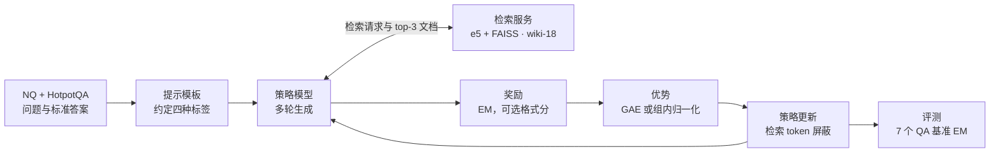

# 搜索智能体 RL：Search-R1 式最小闭环

::: tldr
- 最小闭环：Qwen2.5-3B/7B + 本地 wiki-18 检索（e5 + Flat 索引，top-3）+ EM 奖励 + PPO 或 GRPO，单机 8 卡跑约 1000 步，测试 EM 就能明显超过同检索器下的 RAG 基线。
- 检索结果和运行时插入的纠错提示都不是模型写的，必须从策略损失、熵和 KL 中屏蔽；Search-R1 修复这个 bug 后训练稳定性大幅提升。
- PPO 起步慢但稳，GRPO 收敛快但可能奖励崩塌；用 GRPO 要确认同一道题的样本真的分在同一组。
- 先在确定性的本地索引上调通，再考虑在线搜索：API 配额、费用和结果漂移都会污染奖励。
- 如果只读一节：读 [第四步：屏蔽检索 token](#masking)。
:::

这个实践单元的目标，是用一台 8 卡机器训练一个会“边想边搜”的问答模型：它自己决定什么时候检索、检索什么，读完结果再作答，只凭答案是否正确拿奖励。配方以 [Search-R1](/library/?id=search-r1) 的开源实现为准，文中的超参数与代码细节都来自其仓库，并在脚注里给出文件位置。

::: human
就像教实习生查资料：给他一个图书馆（检索器）和一堆问答题，只告诉他最后答没答对。练多了，他会自己学会“哪些题该查、查什么、查到了怎么用”。
:::

## 目标与成功标准 {#goal}

- **任务**：开放域问答，训练集为 NQ 与 HotpotQA 的训练集合并，测试覆盖 7 个数据集：NQ、TriviaQA、PopQA 三个单跳，HotpotQA、2WikiMultiHopQA、Musique、Bamboogle 四个多跳。
- **模型**：Qwen2.5-3B 或 7B，基座版与指令版都可以。
- **成功标准**：在同一检索器下，测试 EM 明显超过“先检索后生成”的 RAG 基线。论文报告的平均相对提升在 20% 以上（3B 约 20%，7B 更高；具体数字随 arXiv 版本更新有变化）[^1]；行为上，合法动作比例接近 100%，多跳题会主动发起多次搜索。

整个闭环如下：



## 第一步：搭检索环境 {#retrieval}

检索器是这个环境的全部。Search-R1 把它做成独立的 HTTP 服务（默认 `http://127.0.0.1:8000/retrieve`），训练进程批量发送查询；建议为它单独建一个 Python 环境[^3]。四种选择的取舍如下：

| 检索后端 | 硬件 | 准确度 | 确定性 | 成本与限制 |
|---|---|---|---|---|
| BM25 稀疏检索 | 只需 CPU | 通常不如稠密检索 | 完全确定 | 几乎免费 |
| e5 稠密检索 + Flat 索引 | 建议 GPU（faiss-gpu，可多卡分片） | 精确匹配，最准 | 完全确定 | 占用显存 |
| e5 稠密检索 + HNSW 索引 | 只需 CPU | 近似检索，top-k 较小时掉点 | 完全确定 | 便宜 |
| 在线搜索 API | 无 | 最接近真实使用 | 结果随时间变化 | 按次计费、有配额 |

论文配置用的是 2018 年英文维基百科语料（wiki-18）、`intfloat/e5-base-v2` 编码器、GPU 上的 Flat 索引，每次返回 top-3 文档[^3]。仓库文档特别提醒：Google 自定义搜索 API 每月有 1 万次的硬配额，不够支撑在线 RL，因此推荐 SerpAPI 一类的聚合接口[^3]。

**先算显存再选索引。** Flat 索引要把全部段落向量放进显存，体积约为“段落数 × 向量维度 × 4 字节”。e5-base-v2 输出 768 维向量，语料达到千万段落量级时，Flat 索引就是几十 GB，通常要多卡分片；显存不够就退到 CPU 上的 HNSW，代价是 top-k 较小时召回下降[^3]。检索服务与训练进程最好放在不同的卡上，避免互相抢显存。

算一笔账就知道为什么要谨慎用在线 API。每步 512 道题，GRPO 每题采 5 条轨迹，每条最多 4 次检索，单步检索请求的上限是 $512\times5\times4=10240$ 次；按 1005 步算，上限约一千万次。实际请求会少一些，因为不是每轮都检索，但量级不会变。ZeroSearch 正是从这里出发：真实搜索引擎的文档质量不可控、API 成本高得难以承受，于是改用一个微调过的 LLM 来模拟搜索引擎[^9]。

**确定性比你想的更重要。** 本地索引每次返回相同结果，奖励曲线的抖动只来自策略本身；在线搜索的结果随时间漂移，同一个问题今天搜得到、明天搜不到，训练中出现的波动就很难归因。所以常见的路线是：先在本地索引上把闭环跑通并调好超参数，再迁到真实搜索做最终训练——Tongyi DeepResearch 把基于 Wikipedia 的离线环境称为调算法的“风洞”[^12]；DeepResearcher 则证明，目标是开放网页任务时，在真实环境里训练会比只在本地 RAG 环境训练更好[^11]。

## 第二步：提示模板与动作格式 {#template}

Search-R1 的数据处理脚本默认（`template_type=base`）使用下面这段提示，基座与指令模型共用；原文照录，问题拼在最后，训练时再套上模型的聊天模板[^4]：

```text
Answer the given question. You must conduct reasoning inside <think> and </think> first every time you get new information. After reasoning, if you find you lack some knowledge, you can call a search engine by <search> query </search> and it will return the top searched results between <information> and </information>. You can search as many times as your want. If you find no further external knowledge needed, you can directly provide the answer inside <answer> and </answer>, without detailed illustrations. For example, <answer> Beijing </answer>. Question: ...
```

四种标签分工明确：`<think>` 里是推理，`<search>` 里是检索词，`<information>` 由环境填入检索结果，`<answer>` 里是最终答案。一轮 rollout 的执行逻辑是[^6]：

1. 模型每轮最多生成 500 个 token；输出里有 `</search>` 就截到第一个 `</search>`，否则截到第一个 `</answer>`，后面的内容丢弃。解码时并不设停止符，是事后截断，截掉的部分既不进上下文也不参与训练。
2. 用正则取出第一个 `<search>` 或 `<answer>` 标签里的内容。
3. 如果是搜索，就批量调用检索服务，把 top-3 文档格式化为 `Doc 1(Title: …) …`，包进 `<information>` 追加到上下文；观察最多保留 500 个 token，超出部分截断。
4. 如果是答案，这条轨迹结束。
5. 如果两者都没有，就追加一段纠错提示（“My previous action is invalid…”）让模型重试。
6. 达到最大轮数（论文配置为 4）后，再给一次不带检索的生成机会。

::: pitfall 模板里的示例答案会影响奖励抽取
提示词里带了一个示例 `<answer> Beijing </answer>`。由于奖励函数在“提示 + 回答”的整段文本上做正则匹配，Search-R1 的答案抽取函数要求至少出现两次 `<answer>` 标签，取最后一次；只出现一次（即只有示例）时视为没有作答[^5]。如果你改了提示、删掉了示例，却没改抽取逻辑，所有样本都会被判为“没作答”，奖励恒为 0。
:::

## 第三步：设计奖励 {#reward}

**主奖励是精确匹配（EM）。** 预测答案和每个标准答案都先做同样的归一化：转小写、去标点、去掉英文冠词、合并空白；只要与任意一个标准答案完全相同就得 1 分，否则 0 分[^5]。仓库里还有一个“子串匹配”版本，标准答案出现在预测里就给分。它更宽松，但模型可以靠罗列多个候选答案拿分，用之前要配合长度限制。

**格式奖励可选。** Search-R1 的后续实证研究（v0.3 配置）加入了格式分：在检查标签是否成对、顺序是否合法（思考 → 搜索 → 信息 → 思考 → … → 答案）的基础上，按下表打分[^5]：

| 情况 | 奖励 |
|---|---|
| 答对且格式合法 | 1.0 |
| 答对但格式不合法 | 0.8 |
| 答错但格式合法 | 0.2 |
| 答错且格式不合法 | 0.1 |
| 没有作答（抽不出答案） | 0 |

研究结论是：格式奖励能提升最终效果，尤其是从基座模型起步时；而“检索结果里是否出现了标准答案”这类中间检索奖励作用有限，默认配置里它的权重就是 0[^8]。

**什么时候换成 F1 或 LLM 评审？** 答案较长、表述多样时，EM 会漏判。ASearcher 从基座训练时用“格式 × 词级 F1”；微调推理模型时改用 LLM 评审并去掉格式分，因为这类模型本来就能守住格式[^10]。LLM 评审能判断语义等价，但要固定评审模型与提示，并定期人工抽检。

## 第四步：屏蔽检索 token {#masking}

这是最容易出错、也最关键的一步。检索文档是环境写进上下文的，不是模型生成的，必须从策略损失里去掉（原理见 [损失屏蔽](/topics/agentic-rl#loss-mask)）。Search-R1 的做法是在拼接每一轮时维护两份序列：一份是真实 token，一份把观察部分替换成填充符，由后者得到掩码。训练时（脚本开关为 `actor_rollout_ref.actor.state_masking=true`），策略损失、熵与 KL 惩罚都只在掩码为 1 的位置计算[^6]。核心逻辑可以简化成：

```python
ids, mask = [], []
for turn in trajectory:
    ids  += turn.model_tokens;  mask += [1] * len(turn.model_tokens)
    ids  += turn.obs_tokens;    mask += [0] * len(turn.obs_tokens)   # 检索结果、纠错提示
pg_loss = (per_token_loss * mask).sum() / mask.sum()                 # 只在模型 token 上平均
```

作者在 v0.2 修复了一个检索 token 屏蔽的 bug，并记录这一修复“能大幅提升 RL 训练稳定性”[^7]。训练日志里有一项 `state_tokens/coverage`，即模型 token 在回答部分中的占比；它在训练中剧烈变化时，先检查屏蔽和截断逻辑。

::: human
检索回来的资料就像老师发的参考书：学生可以看，但批改作业时只改他自己写的字。
:::

## 第五步：算法与超参数 {#algo}

下表是论文所用的 v0.2 配置（Qwen2.5 系列，单机 8 卡），PPO 与 GRPO 只在标注处不同[^2]：

| 项目 | PPO | GRPO |
|---|---|---|
| 训练数据 | NQ + HotpotQA 训练集 | 同左 |
| 每步题数 / mini-batch | 512 / 256 | 同左 |
| 每题采样条数 | 1 | 5 |
| 优势估计 | GAE（critic 学习率 1e-5） | 组内相对优势 |
| actor 学习率 | 1e-6，warmup 比例 0.285 | 同左 |
| KL | 奖励中扣除，系数 0.001 | low-var KL 损失，系数 0.001 |
| 采样温度 | 1.0 | 1.0 |
| 最大轮数 | 4 | 4 |
| 每轮生成 / 观察上限 | 500 / 500 token | 同左 |
| 检索 | e5-base-v2，top-3，wiki-18 | 同左 |
| 训练步数 | 1005 | 1005 |

论文对比得出三条可以直接用的结论[^1]：

1. **GRPO 收敛更快，PPO 更稳。** PPO 的 critic 需要预热，所以起步慢；GRPO 在部分设置下训练久了会出现奖励崩塌，PPO 则一直稳定。两者的最终训练奖励相当。
2. **指令模型起步更快，最终与基座相当。** 指令模型的初始表现更高、收敛更快，但训练足够久之后，两者的训练奖励非常接近。
3. **检索 token 屏蔽是稳定性的前提。** 屏蔽后效果更好、训练更稳。

还有一个容易被忽略的实现细节：GRPO 的优势要在“同一道题的 $G$ 条样本”之间比较。Search-R1 在 v0.2 除了修复屏蔽问题，还修复了 GRPO 的样本分组 bug[^7]：修复前，样本先按每题 5 条复制、再逐条分配随机 ID，同一道题的 5 条样本落进了 5 个单样本组。而 verl 对单样本组把均值记 0、标准差记 1，优势就等于原始奖励，GRPO 悄悄退化成没有基线的 REINFORCE：答错的样本得不到负信号，曲线却照样在涨，很难察觉。修复后改用数据集里的题目编号做分组 ID。自己实现时，务必断言每组样本的题目 ID 相同、组大小等于每题采样数。

实操建议：第一次跑用 PPO 或带 KL 的 GRPO；如果 GRPO 出现奖励骤降、梯度范数尖峰，先降学习率、加大每题采样数，或换回 PPO。组内采样数越小，组内全对或全错的比例越高，参见 [让奖励有方差](/topics/agentic-rl#reward)。

## 第六步：开跑前的五项检查 {#preflight}

正式训练前花半天做下面五件事，能省掉大部分“训了两天才发现是 bug”的情况：

1. **单测奖励函数。** 手写 5～10 条轨迹，覆盖答对、答错、没作答、格式错误、多个 `<answer>` 标签等情况，逐条核对得分。
2. **可视化掩码。** 取几条真实 rollout，把掩码为 1 的 token 标成一种颜色打印出来，肉眼确认检索结果与纠错提示都是 0。
3. **基座模型试跑。** 用未训练的模型采 100 条轨迹，统计合法动作比例、平均检索次数和作答率。合法动作比例太低时，先调提示或做少量 SFT 冷启动。
4. **压测检索服务。** 用训练时的并发量打检索接口，确认单次延迟和吞吐；检索延迟乘以轮数，就是每步 rollout 时间的下限。
5. **小规模试训。** 用 1/10 的数据跑 50 步，确认奖励、合法动作比例和验证 EM 的趋势正常，再放大规模。

## 第七步：监控 {#monitor}

除了常规的奖励、熵、KL、梯度范数、回答长度，搜索智能体还要多看五项。Search-R1 的生成循环会把其中大部分记进元信息[^6]：

- **合法动作比例**：每条轨迹里合法的搜索或作答占比。训练早期应快速升到接近 1；如果掉下来，多半是模板或截断逻辑出了问题。
- **有效搜索次数**：平均每条轨迹发起几次检索。论文观察到它随训练逐渐增加[^1]。
- **轮数分布与活跃轨迹数**：每轮之后还有多少轨迹没结束。大量轨迹用满最大轮数，说明模型在原地打转或轮数上限太小。
- **模型 token 占比**：即上一节的 `state_tokens/coverage`。
- **验证集 EM**：每 50–100 步在留出集上评一次，与训练奖励对照，防止只在训练分布上涨分。

正常的曲线大致是：训练奖励稳步上升；回答长度先降后升，论文的解释是模型先去掉冗余的填充内容，之后学会频繁调用搜索，检索回来的段落让回答变长[^1]；合法动作比例很快饱和。危险信号是：奖励突然断崖式下跌并伴随梯度范数尖峰（奖励崩塌）；同一个检索词在一条轨迹里反复出现；回答长度爆涨却不再发起检索。

## 第八步：评测 {#eval}

- **指标与协议**：7 个数据集都报告 EM，使用与训练相同的检索器和语料；NQ、HotpotQA 属于域内，其余属于域外，要分开报告。
- **公平对比**：基线（直接生成、RAG、IRCoT、Search-o1 等）必须用同一个检索器、同样的 top-k，否则分数差异里混进了检索质量的差异。
- **时间错配与污染**：wiki-18 是 2018 年的语料，涉及之后事件的问题本来就答不出来；换成在线搜索评测时，又要当心搜到基准题的原题与答案。
- **更难的基准**：想验证深度研究能力，可以加上 Frames、GAIA、xbench-DeepSearch、BrowseComp 等。ASearcher 在这类基准上只用 LLM 评审，并报告 Avg@4 与 Pass@4[^10]，方差分析见 [评测视角](/lenses/eval#agent-eval)。

## 从最小闭环走向深度研究 {#scale-up}

跑通这个闭环之后，往“深度研究智能体”走，需要改的主要是五个维度：

| 维度 | 最小闭环 | 深度研究配方 |
|---|---|---|
| 环境 | 本地 wiki-18 索引 | 真实搜索 + 网页访问（DeepResearcher[^11]），或 LLM 模拟搜索（ZeroSearch[^9]） |
| 数据 | NQ、HotpotQA | 自动合成的高不确定性难题：WebSailor 的 SailorFog-QA[^14]、ASearcher 从 1.4 万条种子扩展出的 13.4 万条问答[^10] |
| 轮数 | 4 轮 | ASearcher 7B/14B 用 32 轮、QwQ-32B 用 128 轮，并配全异步训练[^10] |
| 上下文 | 全部历史拼接 | 上下文管理或摘要（Tongyi DeepResearch[^12]、Kimi-Researcher[^13]） |
| 奖励 | EM（+ 格式） | LLM 评审、效率奖励（如 Kimi-Researcher 的 γ 衰减[^13]） |

<EntryGrid :ids="['search-r1', 'r1-searcher', 'zerosearch', 'deepresearcher', 'asearcher', 'websailor']" />

- **R1-Searcher** 用两阶段奖励（先奖励会调用检索，再奖励答对）从另一个角度解决冷启动，可以和格式奖励对照着看。
- **ZeroSearch** 适合 API 预算紧张的团队；**DeepResearcher** 适合目标就是开放网页的团队。
- **ASearcher** 与 **WebSailor** 分别回答“轮数上不去怎么办”和“难题从哪里来”。

::: takeaway
- 先在本地确定性索引（e5 + Flat，top-3）上跑通闭环，再考虑在线搜索；在线训练前务必估算检索请求量与费用。
- 检索结果与运行时插入的纠错提示都要屏蔽；上线前检查 `state_tokens/coverage` 和几条样本的逐 token 掩码。
- 改提示模板时同步检查答案抽取逻辑（示例标签会被计数），先用几条手写轨迹单测奖励函数。
- PPO 更稳、GRPO 更快；用 GRPO 时要配 KL 并监控奖励崩塌，出问题先降学习率或换回 PPO。
- 从基座起步可以加少量格式分；做过 SFT 冷启动后，只用结果奖励通常就够。
:::

::: pitfall 常见坑
- **检索服务成了瓶颈**：Flat 索引没开 GPU，或者查询没有批量发送，rollout 大部分时间都在等检索。
- **观察截断切断了关键信息**：观察上限 500 token 对 top-3 维基段落够用，换成网页全文时要先做摘要或抽取。
- **时间错配**：用 2018 年语料训练，却拿涉及近年事件的问题评测，模型再会搜也答不对。
- **子串匹配被钻空子**：用宽松匹配作奖励时，模型会学着罗列多个候选答案。
- **多卡填充副作用**：批次不能被卡数整除时，Search-R1 用第一条样本补齐、生成后再删除[^6]；自己实现时别让补齐样本混进奖励统计。
:::

## 延伸阅读 {#further}

- 原理：[Agentic RL 专题](/topics/agentic-rl)，重点看[损失屏蔽](/topics/agentic-rl#loss-mask)与[上下文管理](/topics/agentic-rl#context)
- 资料库筛选：[全部 Agentic RL 条目](/library/?area=agentic-rl)
- 下一个实践单元：[SWE 智能体 RL](/practice/swe-agent)
- 算法背景：[GRPO](/lenses/algorithms#grpo)、[PPO](/lenses/algorithms#ppo)；系统背景：[Infra：异步 RL](/lenses/infra#async)

[^1]: Jin et al., *Search-R1: Training LLMs to Reason and Leverage Search Engines with Reinforcement Learning*, arXiv:2503.09516（主结果、PPO 与 GRPO 对比、基座与指令模型对比、回答长度与搜索次数分析）：<https://arxiv.org/abs/2503.09516>
[^2]: Search-R1 论文复现脚本 `scripts/nq_hotpotqa/v0.2/train_ppo.sh` 与 `train_grpo.sh`：<https://github.com/PeterGriffinJin/Search-R1/tree/main/scripts/nq_hotpotqa>
[^3]: Search-R1 检索器文档 `docs/retriever.md` 与 `retrieval_launch.sh`（wiki-18 语料、e5 Flat / HNSW / BM25 索引、在线搜索配额说明）：<https://github.com/PeterGriffinJin/Search-R1/blob/main/docs/retriever.md>
[^4]: Search-R1 数据处理脚本 `scripts/data_process/nq_search.py` 中的提示模板：<https://github.com/PeterGriffinJin/Search-R1/blob/main/scripts/data_process/nq_search.py>
[^5]: Search-R1 奖励函数 `verl/utils/reward_score/qa_em.py`（EM 与子串匹配、答案抽取）与 `qa_em_format.py`（格式奖励），v0.3 脚本中 structure_format_score=0.2、final_format_score=0.1、retrieval_score=0：<https://github.com/PeterGriffinJin/Search-R1/tree/main/verl/utils/reward_score>
[^6]: Search-R1 多轮生成循环 `search_r1/llm_agent/generation.py`（事后截断、动作解析、观察截断、纠错提示、屏蔽序列、多卡补齐、统计量）：<https://github.com/PeterGriffinJin/Search-R1/blob/main/search_r1/llm_agent/generation.py>；训练端掩码见 `verl/trainer/ppo/ray_trainer.py`（`_create_loss_mask`、`apply_kl_penalty`）与 `verl/workers/actor/dp_actor.py`
[^7]: Search-R1 实验日志 `docs/experiment_log.md`：<https://github.com/PeterGriffinJin/Search-R1/blob/main/docs/experiment_log.md>；分组 bug 的修复见提交 `9ec2fa9`（“fix grpo id bug”，`verl/trainer/ppo/ray_trainer.py` 中的 `uid` 分配），单样本组的处理见 `verl/trainer/ppo/core_algos.py` 的 `compute_grpo_outcome_advantage`
[^8]: Jin et al., *An Empirical Study on Reinforcement Learning for Reasoning-Search Interleaved LLM Agents*, arXiv:2505.15117：<https://arxiv.org/abs/2505.15117>
[^9]: Sun et al., *ZeroSearch: Incentivize the Search Capability of LLMs without Searching*, arXiv:2505.04588：<https://arxiv.org/abs/2505.04588>
[^10]: Gao et al., *Beyond Ten Turns: Unlocking Long-Horizon Agentic Search with Large-Scale Asynchronous RL*, arXiv:2508.07976（奖励函数、训练细节、数据合成与评测协议）：<https://arxiv.org/abs/2508.07976>
[^11]: Zheng et al., *DeepResearcher: Scaling Deep Research via Reinforcement Learning in Real-world Environments*, arXiv:2504.03160：<https://arxiv.org/abs/2504.03160>
[^12]: Tongyi DeepResearch Team, *Tongyi DeepResearch Technical Report*, arXiv:2510.24701：<https://arxiv.org/abs/2510.24701>
[^13]: Moonshot AI, *Kimi-Researcher: End-to-End RL Training for Emerging Agentic Capabilities*：<https://moonshotai.github.io/Kimi-Researcher/>
[^14]: Li et al., *WebSailor: Navigating Super-human Reasoning for Web Agent*, arXiv:2507.02592：<https://arxiv.org/abs/2507.02592>
