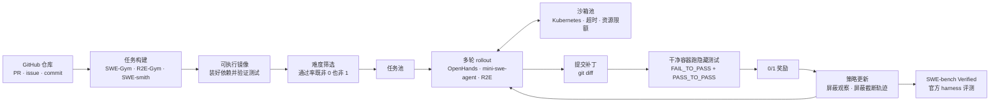

# SWE 智能体 RL：从环境到 SWE-bench

这个实践单元训练一个<Term t="swe-agent">软件工程智能体</Term>：在容器化的真实代码仓库里读代码、跑命令、改文件、跑测试，最后提交一个补丁，只有隐藏测试通过才拿到奖励。它和[搜索智能体](/practice/search-agent)用的是同一套 RL 原理，但对环境与基础设施的要求高出一个量级：每个任务都是一个几百 MB 的 Docker 镜像，每条轨迹要跑几十步、十几分钟甚至更久。

::: human
搜索智能体是在图书馆查资料，SWE 智能体是在真实的工地上修房子：得先把工地（代码仓库和依赖）搭起来，每个工人（轨迹）各占一块场地，修完还要请质检（隐藏测试）来验收。
:::

## 目标与成功标准 {#goal}

- **任务**：给定一个 GitHub issue 和对应仓库快照，产出能让隐藏测试通过的补丁。
- **起点**：一个已经会多轮工具调用的 14B～32B 模型（如 Qwen3 系列），最好先用少量智能体轨迹做过 SFT，或已具备较强的推理能力。
- **成功标准**：在 [SWE-bench Verified](/library/?id=swe-bench-verified) 上，用固定脚手架、官方评测工具测得的 Pass@1 明显提升，并与训练前在同一协议下对比。量级参考：SkyRL-v0 用约 300 道题、单机 8 卡训练 20 小时，把 Qwen3-14B 从 18% 提到 21.6%[^8]；DeepSWE 用 64 卡把 Qwen3-32B 训到 Pass@1 42.2%[^6]。

## 流水线总览 {#pipeline}

## 第一步：选环境 {#environments}

一个可用于 RL 的 SWE 任务至少要有四样东西：仓库快照、装好依赖的运行时镜像、自然语言任务描述，以及一组“修复前失败、修复后通过”的测试。公开的训练环境主要有四个：

| 环境 | 规模 | 构建方式 | 适合 |
|---|---|---|---|
| [SWE-Gym](/library/?id=swe-gym) | 2.4K 个真实任务，来自 11 个 Python 仓库，另有 234 题的 Lite 集 | 真实 PR 与 issue，提供预构建镜像[^1] | 起步、复现 SkyRL-v0 |
| [R2E-Gym](/library/?id=r2e-gym) | 8.1K 个问题，来自 13 个仓库 | SWE-GEN：直接从 commit 构造，不依赖人写的 PR 与测试[^2] | 复现 DeepSWE、更大规模 RL |
| [SWE-smith](/library/?id=swe-smith) | 5.2 万个任务实例，250 多个环境，每个仓库一个镜像 | 把任意仓库变成 SWE 环境，程序化合成任务[^3] | 大规模 SFT 轨迹与数据扩展 |
| Skywork-SWE 数据集 | 10,169 个实例，来自 2,531 个仓库 | 自动化流水线，每个实例一个运行时镜像并经单元测试校验[^4] | 数据规模研究 |

几个选型经验：

- **仓库多样性比实例数更难得。** SWE-Gym 与 R2E-Gym 只覆盖十来个仓库，单仓库内的题目相关性很高；Skywork-SWE 与 SWE-smith 的价值在于把仓库数做到了几百上千。
- **“修复前失败、修复后通过”要实测。** 构建环境时，要分别在原始代码和参考补丁上各跑一遍测试，确认前者失败、后者通过；否则奖励本身就是错的。
- **先算磁盘。** R2E-Gym 的每个可执行镜像约 300～500MB[^2]，几千个环境就是几 TB。DeepSWE 的训练集群每个节点配了 200 个 CPU 和 6TB 以上磁盘，专门用来缓存上千个镜像[^6]。

## 第二步：选脚手架 {#scaffold}

智能体<Term t="scaffold">脚手架</Term>决定了模型能做什么动作、看到什么历史。训练与评测最好用同一个脚手架；如果目标是让模型在多种脚手架下都好用，就要在训练中混入多种脚手架。

| 脚手架 | 动作空间 | 特点 | 代表用法 |
|---|---|---|---|
| OpenHands | 编辑器、bash、浏览器等工具 | 功能全，自带远程沙箱运行时 | SWE-Gym 基线、SkyRL-v0[^8] |
| mini-swe-agent | 只有 bash | 约 100 行代码；历史完全线性；每个动作用独立的 `subprocess.run` 执行，换成 `docker exec` 即可放进沙箱[^5] | 做 SFT/RL 时避免过拟合特定脚手架 |
| R2E-Gym 编辑智能体 | 文件查看、搜索、编辑、执行 | 与 R2E-Gym 环境一体，rLLM 直接封装为 SWEEnv | DeepSWE[^6] |
| Agentless 式流程 | 固定两阶段：定位文件、编辑代码 | 不是多轮智能体，RL 更便宜、更稳定 | SWE-RL[^11]、Kimi-Dev[^9] |

mini-swe-agent 的 README 直接写明，它适合“做微调或 RL、又不想过拟合到某个特定脚手架”的场景[^5]。它的“无状态动作”设计对 RL 尤其友好：每一步都是独立命令，沙箱崩溃后很容易从轨迹重放恢复。代价是没有持久 shell，`cd` 之类的状态要写进每条命令里。

Kimi-Dev 给出了另一条思路：先在 Agentless 的两阶段流程上用 RL 练出“定位 + 编辑 + 自我反思”的技能，再用约 5k 条公开轨迹做 SFT，就能把这些技能迁移到多轮 SWE-Agent 上[^10]。算力有限时，这比直接做长程多轮 RL 划算。

## 第三步：奖励与隐藏测试 {#reward}

**标准奖励是 0/1 的测试结果。** SWE-bench 的每个实例带两组测试：`FAIL_TO_PASS` 是 issue 对应的、修复前失败而修复后应通过的测试；`PASS_TO_PASS` 是原本就通过、修复后不能被破坏的测试。两组全部通过记 1 分，否则 0 分。Kimi-Dev 只用 Docker 中整套测试是否通过的 0/1 结果作为奖励，训练中不加任何格式或过程奖励[^9]。

**测试必须对模型隐藏，并在干净环境里运行。** 模型在沙箱里能改任何文件，包括测试本身。打分时要做三件事：

1. 只取模型对非测试文件的修改（`git diff`），或在应用补丁后把测试文件还原；
2. 在一个全新的容器里应用补丁、运行测试，不复用 rollout 用过的容器；
3. 给测试运行单独设超时，超时记 0 分，并记录原因以便排查。

**没有执行环境时的替代。** SWE-RL 用生成修改与参考补丁的序列相似度作为奖励、格式错误记 −1，完全不需要执行环境，Llama3-SWE-RL-70B 借此在 SWE-bench Verified 上达到 41.0%[^11]。它便宜、可扩展，但奖励的是“长得像参考答案”，而不是“真的修好了”，适合做预热或数据量很大时的补充。

::: pitfall SWE 奖励作弊的常见形态
- **改测试或跳过测试**：删掉断言、加 skip 装饰器、修改测试配置。对策是测试隐藏、打分前还原测试文件。
- **针对测试硬编码**：探测到测试用例后直接返回期望值。对策是 `PASS_TO_PASS` 与充足的 `FAIL_TO_PASS` 覆盖，并定期抽查高奖励补丁。
- **不稳定测试（flaky）**：同一补丁多次运行结果不同，会给奖励注入噪声。构建环境时对参考补丁重复运行几次，剔除结果不稳定的实例。
:::

## 第四步：按难度筛数据 {#filtering}

SWE 任务的通过率分布很极端：大量题目模型一次都做不对，少量题目每次都对。这两类题组内奖励没有方差，rollout 全部白跑。若某题成功率为 $p$、每组 $G$ 条轨迹，整组无信号的概率是 $p^G+(1-p)^G$；$p=0.05,\ G=8$ 时约为 66%。

做法是先用初始模型对每道题采 $k$ 条轨迹估计通过率 $\hat p$，只保留 $0<\hat p<1$ 的题，训练中再定期重估：

- **Kimi-Dev**：剔除多次采样零成功的题，这样才能有效利用大 batch；按课程逐步引入更难的题；训练末期把近期成功的样本混回当前 batch，巩固成功模式[^9]。
- **SkyRL-v0**：训练集只有几百题——8B、14B 模型用 293 题，7B 模型分两阶段用 80 题和 220 题，都取自 SWE-Gym[^8]。小而精的题库配合多次采样，单机也能看到提升。
- **R2E-Gym-Subset**：DeepSWE 直接使用 R2E-Gym 发布的训练子集[^6]。

::: human
题太难，怎么练都拿不到分；题太简单，怎么练都满分。只有“有时对、有时错”的题，模型才知道自己哪次做得好。
:::

## 第五步：rollout 基础设施 {#infra}

SWE RL 的主要成本在沙箱，不在 GPU。几个必须提前定下来的参数：

- **并发**：同时运行多少条轨迹。SkyRL-v0 的 14B 配方同时运行 192 个智能体，每题 8 条轨迹、每批 32 题[^8]；DeepSWE 每步 8 题、每题 8 条，共 64 条[^6]。工业规模下，Kimi K2 的 SWE 环境基于 Kubernetes 支持 1 万以上并发沙箱[^12]，Qwen3-Coder 在阿里云上并行运行 2 万个独立环境[^13]。
- **步数与超时**：DeepSWE 单条轨迹最多 50 步、总时长上限 90 分钟（5400 秒）[^6]；SkyRL-v0 的 14B 配方最多 35 轮[^8]。所有工具调用也要有单独的超时，避免一个卡死的命令拖住整条轨迹。
- **截断轨迹怎么算**：DeepSWE 对超长、超步数或超时的轨迹做“compact filtering”，直接从损失中屏蔽，而不是当作负样本[^6]。这能避免模型学到“少做事、早提交”。
- **集群形态**：DeepSWE 建议在云上部署 Kubernetes 集群，每个节点 200 个 CPU、6TB 以上磁盘[^6]；SkyRL-v0 则通过 OpenHands 的远程沙箱运行时执行动作[^8]。本地可以用 kind 搭一个 Kubernetes 做功能验证，但它不足以支撑完整训练[^6]。
- **异步**：轨迹时长差异极大，同步批处理会让 GPU 长时间空等。框架层面的做法见 [Agentic RL：异步多轮生成](/topics/agentic-rl#async-rollout) 与 [Infra：异步 RL](/lenses/infra#async)。

::: insight 用“沙箱小时”而不是“GPU 小时”做预算
一个粗略的上限估计：每步沙箱占用 ≈ 并发轨迹数 × 平均轨迹时长。64 条轨迹、平均 20 分钟，每步就要约 21 个沙箱小时，再加上测试容器。先用小规模试跑测出平均轨迹时长与测试时长，再决定 CPU、内存和磁盘的采购比例。
:::

## 第六步：训练配方 {#recipes}

三份公开配方的关键设置对照如下（都来自官方脚本或博客）：

| 项目 | DeepSWE[^6] | SkyRL-v0（14B）[^8] | Kimi-Dev[^9] |
|---|---|---|---|
| 基座 | Qwen3-32B | Qwen3-14B（思考模式） | Qwen2.5-72B + 约 150B token 中训练 |
| 环境 / 脚手架 | R2E-Gym 子集，R2E 编辑智能体 | SWE-Gym 293 题，OpenHands | Agentless 两阶段，Docker |
| 算法 | 留一优势（RLOO 式），无 KL 损失、无熵项 | PPO + GAE（带 critic），KL 损失 0.001 | K1.5 式策略优化 |
| 每步规模 | 8 题 × 8 条 | 32 题 × 8 条 | — |
| 裁剪 | 上界 0.28（clip-higher） | 下界 0.2、上界 0.28 | — |
| 轨迹约束 | 最多 50 步，90 分钟超时，截断轨迹屏蔽 | 最多 35 轮，历史中移除思考 token | 只训练代码编辑阶段 |
| 奖励 | 测试通过为 1 | 测试通过为 1 | Docker 中整套测试通过为 1 |
| 结果 | Pass@1 42.2%，Pass@16 71.0%，测试时扩展 59% | 18% → 21.6%（8×H200，20 小时） | 60.4%（Agentless + 测试时自博弈） |

几个设计选择背后的理由：

1. **为什么去掉 KL。** SWE 任务需要模型大幅改变行为（学会系统地探索仓库、写复现脚本），KL 约束会把它拉回初始分布；DeepSWE 的配置关闭了 KL 损失与熵项，改用 clip-higher 保留探索[^6]。
2. **为什么用留一优势而不是 critic。** 轨迹极长、奖励只有 0/1 时，价值函数很难学准；留一基线不需要额外模型，方差也够低。SkyRL-v0 选择了 PPO + critic，说明两条路都能走通，但 critic 要额外占用显存和训练时间。
3. **历史思考保留还是删除。** SkyRL-v0 在拼接历史时移除思考 token 以节省上下文[^8]；MiniMax-M2 这类交错思考模型则要求保留[^14]。选哪种都行，但训练与部署必须一致。
4. **从 Agentless 起步。** 如果只有少量算力，先按 Kimi-Dev 的方式在固定流程上训练定位与编辑，再迁移到多轮智能体，比直接做 50 步的长程 RL 更容易看到收益[^10]。

<EntryGrid :ids="['deepswe', 'kimi-dev', 'swe-rl', 'skywork-swe']" />

- **DeepSWE** 是目前最完整的公开纯 RL 配方：脚本、数据、W&B 日志与集群要求全部公开，适合照着复现。
- **Kimi-Dev** 说明中训练与结构化任务上的 RL 可以作为智能体能力的“技能先验”。
- **SWE-RL** 是无执行环境时的起点，也是理解“代理奖励会奖励什么”的好例子。
- **Skywork-SWE** 用数据说明：SWE 训练数据的规模效应还远没有饱和，环境构建值得投入。

## 第七步：监控与排错 {#monitor}

除了奖励、熵、KL、梯度范数，SWE RL 还要按“终止原因”拆分统计每一批轨迹：正常提交、达到最大步数、超时、上下文超长、沙箱错误。这张分布表是最有用的诊断工具：

- **沙箱错误比例上升**：镜像拉取失败、磁盘写满、容器数超限。先查基础设施，别急着调算法。
- **超时与超步数比例上升**：模型在原地打转（反复打开同一个文件、重复运行同一条命令），或者轮数上限太小。
- **正常提交却几乎全是 0 分**：检查测试是否在干净容器里运行、补丁是否被正确应用、测试文件是否被模型改动。
- **奖励上升但验证集不涨**：可能在少数仓库上过拟合，或者学会了钻测试的空子；抽查高奖励补丁。
- **回答长度与轮数突然暴涨**：先看是否有大量截断轨迹被当作负样本，再看熵是否在上升。

## 第八步：在 SWE-bench Verified 上评测 {#eval}

[SWE-bench Verified](/library/?id=swe-bench-verified) 是 SWE-bench 的一个 500 题子集，每道题都经过软件工程师确认可解[^16]。评测协议要写清楚四件事：

1. **用官方 harness。** SWE-bench 官方评测完全容器化，推荐在 x86_64 机器上预留至少 120GB 磁盘、16GB 内存、8 核 CPU，并发数不超过 min(0.75 × CPU 核数, 24)[^16]。R2E-Gym 的评测脚本也只负责生成补丁，最终分数要交给官方 harness 计算[^2]。
2. **固定脚手架与预算。** 同一个模型换脚手架，分数可能差很多；MiniMax-M2.5 专门报告了模型在不同编码脚手架下的 SWE-bench Verified 表现[^14]。报告时写明脚手架、最大步数、上下文长度与超时。
3. **区分 Pass@1 与测试时扩展。** DeepSWE 的 Pass@1 是 42.2%，加上验证器选优后是 59%[^7]；Skywork-SWE 是 38.0% 与 47.0%[^4]；CWM 是 53.9% 与 65.8%[^15]。两类数字不能混着比。Pass@1 最好对多次运行取平均。
4. **当心数据污染。** SWE-bench 的仓库与修复提交都公开在 GitHub 上，预训练和中训练数据很可能已经见过答案。Kimi-Dev 在中训练阶段专门剔除了 SWE-bench Verified 涉及的仓库[^9]；想要更干净的对比，可以参考持续收集新任务的 [SWE-rebench](/library/?id=swe-rebench)，污染问题的一般讨论见 [评测视角](/lenses/eval#contamination)。

::: pitfall 官方 harness 会按 run_id 缓存结果
SWE-bench 的评测按 `run_id` 与 `instance_id` 缓存结果：同一个 `run_id` 下重复评测同一实例，即使补丁不同，也会直接复用第一次的结果[^16]。在训练循环里周期性评测时，每次都要换新的 `run_id`，否则曲线会“卡住不动”。
:::

## 工业级配方长什么样 {#industry}

公开资料显示，工业团队与上面的开源配方在原理上一致，差别主要在规模和数据：

- **环境规模**：Qwen3-Coder 并行运行 2 万个环境[^13]；Kimi K2 基于 Kubernetes 支持 1 万以上并发沙箱，SWE 环境由 GitHub 的 PR、issue 与可执行单元测试构成[^12]；MiniMax-M2.5 在 10 多种编程语言、20 万以上真实环境中训练[^14]。
- **中训练打底**：Kimi-Dev 用约 150B token 的 issue 与 PR 数据中训练[^9]；Meta 的 CWM 在 RL 之前用执行轨迹与约 300 万条容器环境中的智能体交互轨迹做中训练，再做覆盖多轮 SWE 环境的多任务 RL[^15]。
- **跨脚手架泛化**：MiniMax 的 Forge 框架支持接入任意智能体脚手架进行训练[^14]。

更完整的对照见 [Agentic RL 专题的工业实践一节](/topics/agentic-rl#industry)。

::: takeaway
- 环境构建先于一切：每个实例都要实测“修复前失败、修复后通过”，并剔除不稳定测试。
- 按通过率筛题，只保留“有时对、有时错”的题；几百道精选题配合多次采样，单机也能看到提升。
- 奖励只用干净容器里的隐藏测试结果；打分前还原测试文件，定期抽查高奖励补丁。
- 超时、超步数、上下文超长的轨迹从损失中屏蔽，并按终止原因拆分监控。
- 训练与评测的脚手架、历史处理方式、上下文长度保持一致；报告时区分 Pass@1 与测试时扩展，写明脚手架与预算。
:::

::: pitfall 常见坑
- **磁盘先于 GPU 爆满**：镜像缓存没有容量规划和回收策略，训练跑到一半节点磁盘写满。
- **僵尸容器**：超时或异常退出的轨迹没有回收沙箱，并发数被慢慢耗尽。
- **沙箱能联网**：模型可能从网上找到修复提交；训练和评测时都应限制网络访问，只放行必要的包镜像。
- **评测缓存**：复用 `run_id` 导致 SWE-bench 评测复用旧结果。
- **只在一个脚手架上训练**：换个脚手架分数大跌，用户接入自己的框架后效果很差。
:::

## 延伸阅读 {#further}

- 原理：[Agentic RL 专题](/topics/agentic-rl)，重点看[信用分配](/topics/agentic-rl#credit-assignment)与[超时与截断轨迹](/topics/agentic-rl#max-turns)
- 环境：[多环境与环境工程](/topics/multi-env)；资料库：[全部 Agentic RL 条目](/library/?area=agentic-rl)
- 评测：[智能体评测](/lenses/eval#agent-eval)、[数据污染](/lenses/eval#contamination)
- 系统：[Infra：异步 RL](/lenses/infra#async)；上一个实践单元：[搜索智能体 RL](/practice/search-agent)

[^1]: *Training Software Engineering Agents and Verifiers with SWE-Gym*, arXiv:2412.21139（ICML 2025），仓库 README：<https://github.com/SWE-Gym/SWE-Gym>
[^2]: *R2E-Gym: Procedural Environments and Hybrid Verifiers for Scaling Open-Weights SWE Agents*, arXiv:2504.07164，仓库 README（规模、SWE-GEN、镜像大小、评测说明）：<https://github.com/agentica-project/R2E-Gym>
[^3]: *SWE-smith: Scaling Data for Software Engineering Agents*, arXiv:2504.21798（NeurIPS 2025 D&B），仓库 README：<https://github.com/SWE-bench/SWE-smith>
[^4]: *Skywork-SWE: Unveiling Data Scaling Laws for Software Engineering in LLMs*, arXiv:2506.19290：<https://arxiv.org/abs/2506.19290>
[^5]: mini-swe-agent 仓库 README（仅 bash、线性历史、独立 subprocess 执行、适合 FT/RL）：<https://github.com/SWE-agent/mini-swe-agent>
[^6]: DeepSWE 训练脚本与说明，rLLM 仓库 `examples/swe/train_deepswe_32b.sh`、`examples/swe/README.md` 与 `docs/examples/swe.md`（2025 年 7 月版本）：<https://github.com/agentica-project/rllm/tree/main/examples/swe>
[^7]: Agentica & Together AI, *DeepSWE: Training a Fully Open-sourced, State-of-the-Art Coding Agent by Scaling RL*：<https://www.together.ai/blog/deepswe>
[^8]: SkyRL-v0 README 与复现脚本（commit a0d50c4，`examples/sky/`）：<https://github.com/NovaSky-AI/SkyRL/tree/a0d50c482436af7fac8caffa4533616a78431d66>
[^9]: Moonshot AI, *Introducing Kimi-Dev*（2025-06-16）：<https://moonshotai.github.io/Kimi-Dev/>
[^10]: *Kimi-Dev: Agentless Training as Skill Prior for SWE-Agents*, arXiv:2509.23045：<https://arxiv.org/abs/2509.23045>
[^11]: Wei et al., *SWE-RL: Advancing LLM Reasoning via Reinforcement Learning on Open Software Evolution*, arXiv:2502.18449；奖励实现见 `src/swerl/core/reward.py`：<https://github.com/facebookresearch/swe-rl>
[^12]: Kimi Team, *Kimi K2: Open Agentic Intelligence*, arXiv:2507.20534（§3.2.1 Coding & Software Engineering）：<https://arxiv.org/abs/2507.20534>
[^13]: Qwen Team, *Qwen3-Coder: Agentic Coding in the World*：<https://qwenlm.github.io/blog/qwen3-coder/>
[^14]: MiniMax-M2.5 仓库 README（编码环境规模、Forge、跨脚手架评测）与 MiniMax-M2 仓库 README（交错思考）：<https://github.com/MiniMax-AI/MiniMax-M2.5>、<https://github.com/MiniMax-AI/MiniMax-M2>
[^15]: Meta FAIR, *CWM: An Open-Weights LLM for Research on Code Generation with World Models*，模型卡（训练流程与 SWE-bench Verified 结果）：<https://github.com/facebookresearch/cwm/blob/main/MODEL_CARD.md>
[^16]: SWE-bench 官方仓库 README（SWE-bench Verified 500 题、Docker 化评测、硬件建议、按 run_id 缓存结果）：<https://github.com/SWE-bench/SWE-bench>
