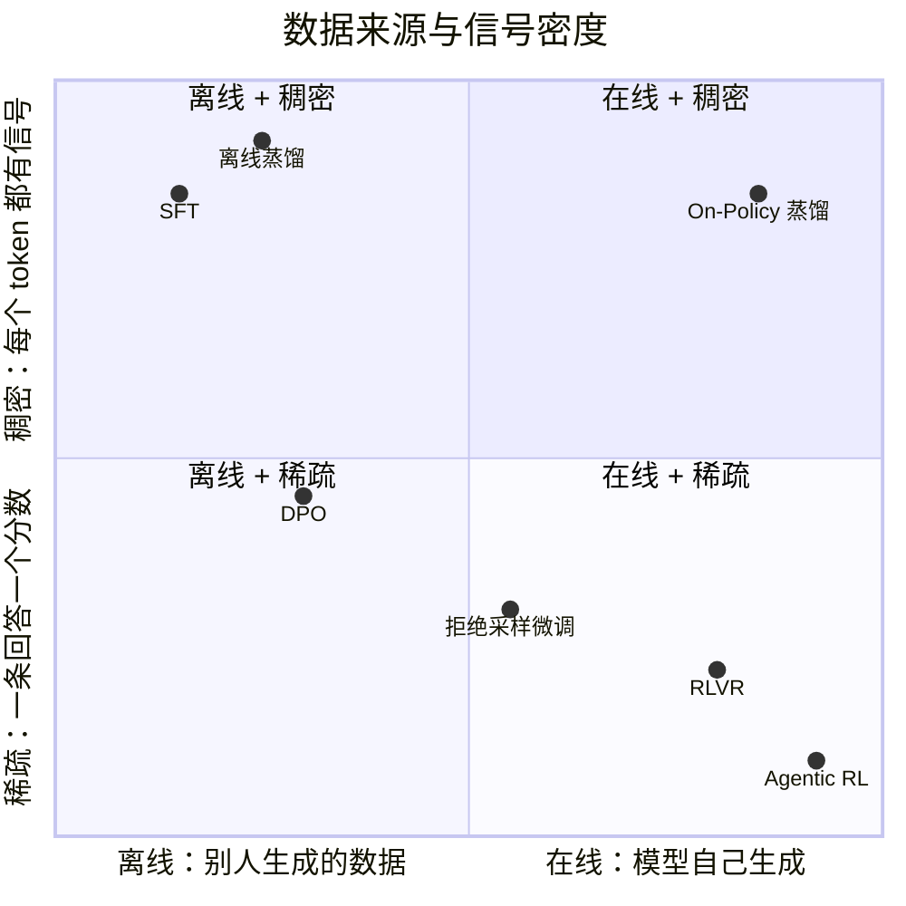

# 全景：后训练在做什么

预训练让模型读完了互联网，学会了语言和大量知识；**后训练**（post-training）决定它最终“会不会做事”：能不能听懂指令、能不能把一道难题想清楚、能不能在真实环境里多轮行动并完成任务。

::: human
预训练像读完了一整座图书馆，后训练像实习：先照着师傅做（SFT），再让师傅在旁边逐句纠正（On-Policy 蒸馏），最后自己上手干活、按结果拿反馈（强化学习）。Mid-training 则是实习前的“专项补课”。
:::

这一页给出整张地图：每个阶段在做什么、它们之间是什么关系、这几年发生了什么。细节都在对应专题里。

## 一张图看懂流水线 {#pipeline}

<PipelineMap />

实际的工业流程往往不是一条直线：SFT 和 RL 会交替多轮，On-Policy 蒸馏常用来把大模型的能力迁到小模型上，Agentic RL 则把前面所有阶段放进真实环境里再练一遍。

## 三个问题看清每个阶段 {#three-questions}

每个训练阶段都可以用三个问题来刻画：**数据是谁生成的**、**训练信号是什么**、**信号有多密**。

| 阶段 | 数据由谁生成 | 训练信号 | 信号密度 | 主要风险 |
|---|---|---|---|---|
| [Mid-training](/topics/mid-training) | 人类语料 + 精选/合成数据 | 下一个词 | 每个 token 都有 | 遗忘通用能力、评测泄漏 |
| [SFT](/topics/sft) | 人类或教师模型写的示范 | 示范答案的每个词 | 每个 token 都有 | 只会模仿、能力上限受示范约束 |
| [On-Policy 蒸馏](/topics/opd) | **学生自己**生成 | 教师对每个 token 的打分 | 每个 token 都有 | 师生差距过大、依赖教师 |
| [LLM 强化学习](/topics/rl-for-llm) | **模型自己**生成 | 奖励模型或验证器的分数 | 每条回答一个数 | 奖励作弊、训练不稳定 |
| [Agentic RL](/topics/agentic-rl) | 模型在**环境**里多轮行动 | 任务是否完成 | 整条轨迹一个数 | 环境工程成本、信用分配难 |

::: insight 为什么“谁生成数据”这么重要
在别人生成的数据上学（off-policy），模型从没见过自己犯错后的局面，一旦走偏就不知道怎么回来——这叫**暴露偏差**（exposure bias）。在自己生成的数据上学（on-policy），训练分布和使用时的分布一致，犯过的错会被直接纠正。On-Policy 蒸馏和强化学习的共同优势就在这里；两者的区别在于信号的密度。
:::

把这两个维度画成一张图，各种方法的位置就很清楚了：

从梯度的角度看，这些方法其实是同一个公式的不同特例：

$$
\nabla_\theta \mathcal L = -\E_{y\sim q}\Big[\sum_t w_t\,\nabla_\theta \log \pi_\theta(y_t \mid x, y_{<t})\Big]
$$

区别只在于**样本从哪个分布 $q$ 来**（示范数据、教师、还是模型自己），以及**每个 token 的权重 $w_t$ 是什么**（常数 1、奖励算出的优势、还是教师与学生的对数概率差）。完整的对照表和推导见 [算法谱系与推导](/lenses/algorithms#unified-view)。

::: human
所有方法都在做同一件事：挑一些句子，把其中“好”的词的概率调高，“差”的词的概率调低。不同方法只是在回答两个问题：句子从哪来，好坏由谁说了算。
:::

## 这几年发生了什么 {#timeline}

::: timeline
- **2022** 从“会说话”到“听指令”
  - InstructGPT 让 RLHF（人类反馈强化学习）成为对齐标配。
  - Constitutional AI 用 AI 反馈替代部分人工偏好标注。
- **2023** 偏好学习与数据质量
  - DPO 把偏好学习变成离线的监督式损失，不再需要在线采样和奖励模型。
  - LIMA 说明少量高质量 SFT 数据就能教会格式与风格。
- **2024** 推理 RL 的前夜
  - DeepSeekMath 提出 GRPO，去掉了 PPO 的价值网络。
  - OpenAI o1 展示了用 RL 训练长链思考的效果。
  - Tülu 3 提出 RLVR：用可自动验证的奖励做强化学习。
- **2025** 推理与智能体全面爆发
  - DeepSeek-R1 与 Kimi k1.5 公开推理 RL 的完整配方。
  - DAPO、Dr. GRPO 等开源修正相继出现，GSPO、CISPO 进入工业训练。
  - Search-R1 等工作把 RL 带进多轮工具调用；Kimi K2、GLM-4.5 把 Agentic RL 做进旗舰模型。
  - Thinking Machines 系统阐述 On-Policy 蒸馏，让它重新回到后训练的中心。
- **2026** 蒸馏走向系统化
  - On-Policy 蒸馏的综述、失效分析与改进工作集中出现。
:::

几条主线值得留意：

1. **从偏好到可验证奖励。** RLHF 依赖人类偏好训练的奖励模型，容易被“讨好”；数学、代码这类能自动判对错的任务让 RL 有了便宜又可靠的信号（RLVR），推理能力因此大幅提升。见 [LLM 强化学习](/topics/rl-for-llm)。
2. **算法在做减法。** 从 PPO 到 GRPO 去掉了价值网络，之后的每一次修正（Dr. GRPO、DAPO、GSPO、CISPO……）几乎都在修“损失怎么聚合、比率怎么裁剪”这类细节。见 [算法谱系与推导](/lenses/algorithms)。
3. **瓶颈转向工程与环境。** 生成占了 RL 训练的大部分时间，异步训练、训推一致性、MoE 路由成了一线问题；智能体训练则需要成千上万个可并行的环境。见 [训练系统](/lenses/infra) 与 [多环境](/topics/multi-env)。
4. **蒸馏回到舞台中央。** 对于小模型，让它在自己的回答上接受强教师逐词纠正，往往比从零做 RL 便宜得多。见 [On-Policy 蒸馏](/topics/opd)。

## 本站怎么读 {#how-to-read}

- **先专业，再说人话。** 每个概念先给准确表述，黄色的“说人话”盒子给新手版本；推导默认折叠，想看再展开。
- **术语悬浮。** 带虚线下划线的词可以悬停（手机上点按）查看解释，完整列表在 [术语表](/glossary)。
- **跳转不迷路。** 从正文、目录或侧边栏跳走后，右下角会出现“返回阅读点”，一键回到刚才读到的位置；再次打开读过一半的页面，会提示从上次的位置继续。
- **按需深入。** 每个专题末尾都有“可执行结论”和“踩坑提示”；想看全部相关工作，点进 [资料库](/library/) 按领域、视角、证据筛选。
- **随时搜索。** 按 <kbd>Ctrl</kbd> / <kbd>⌘</kbd> + <kbd>K</kbd> 全文搜索。

不知道从哪开始？挑一条 [阅读路线](/start/paths)。
