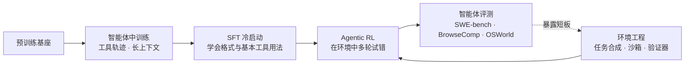
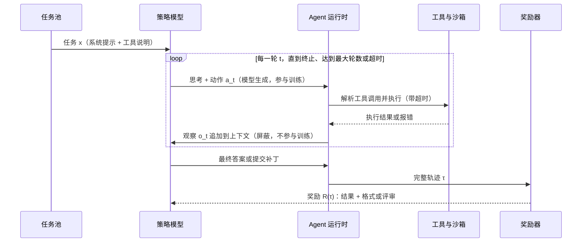
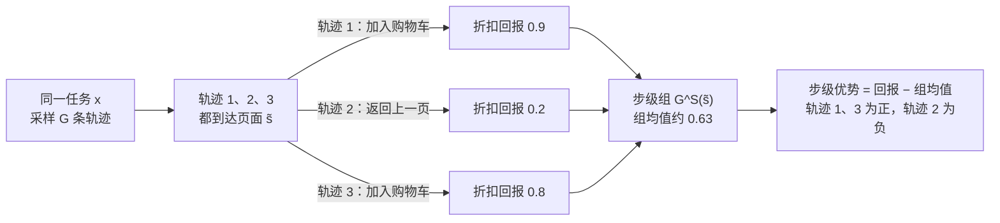
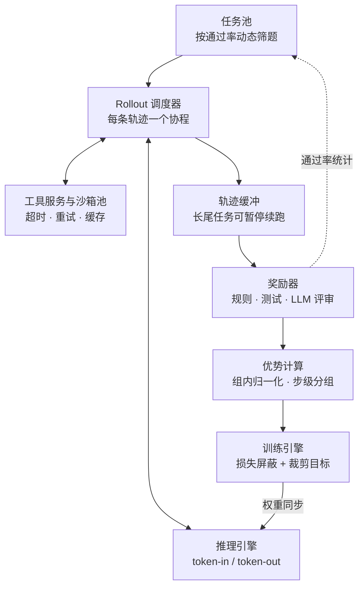

# Agentic RL：让模型在环境里学会做事

::: tldr
- 智能体 RL 没有新的优化器，仍是 GRPO、PPO 一类策略梯度；新的是轨迹里夹着环境观察：只对模型生成的 token 求梯度，观察一律屏蔽，训练拼出的序列要与推理时逐字一致。
- 结果奖励只在末尾出现一次，信用分配按成本由低到高逐级加细：轨迹级组内优势 → GiGPO 锚状态分组 → 轮级奖励 → critic 或过程奖励。
- 瓶颈在 rollout 与环境：轨迹长短可差两个数量级，要靠异步生成、partial rollout、沙箱池与限流缓存；GPU 利用率由环境吞吐决定。
- 奖励以可验证的结果为主干，格式分只是冷启动的脚手架；按通过率筛题保证组内有方差，并提防搜答案、改测试、口头完成等智能体特有的作弊。
- 如果只读一节：读 [信用分配](#credit-assignment)。
:::

**智能体强化学习（Agentic RL）**把大模型当作多轮决策的策略：它在与搜索引擎、代码沙箱、网页、操作系统等环境的交互中生成轨迹，按任务结果（必要时再加上中间反馈）获得奖励，然后用策略梯度更新。和单轮 <Term t="rlvr">RLVR</Term> 相比，它多出三样东西：进入上下文的**环境观察**、跨轮次的**信用分配**，以及被工具延迟和长尾轨迹主导的 **rollout 成本**。

::: human
单轮 RL 像闭卷考试：写一次答案就交卷打分。Agentic RL 像实习：模型要自己查资料、跑代码、看反馈、再调整，最后按“事情办成没有”打分。难点不在打分，而在让它从成百上千次实习里学到“哪一步做对了”。
:::

## 它在流水线中的位置 {#position}

Agentic RL 的输入有两样：一个已经会基本工具格式的模型，和一套可交互的环境（任务、工具、验证器）。输出是一个在目标环境族上成功率更高、行为更稳的策略。它很少从零开始：

- **之前**：工业界普遍先做智能体中训练与 SFT 冷启动。Tongyi DeepResearch 先用 32K→128K 两阶段的智能体持续预训练打底，再用合成轨迹做 SFT 冷启动[^3]；Kimi-Dev 先用约 150B token 的 issue/PR 数据中训练[^18]。见 [Mid-training](/topics/mid-training) 与 [SFT](/topics/sft)。
- **旁边**：环境本身是一项工程——任务合成、沙箱、验证器、多环境配比，详见 [多环境与环境工程](/topics/multi-env)。
- **之后**：用 SWE-bench、BrowseComp、OSWorld 这类交互式基准评测，注意方差与污染问题，见 [评测](/lenses/eval#agent-eval)。

Agentic RL 并没有发明新的策略梯度，它沿用 [GRPO、PPO 一族](/lenses/algorithms#grpo)。真正的新问题有五个，对应下面五节：怎么把问题写成数学对象（[形式化](#formulation)），哪些 token 该算梯度（[损失屏蔽](#loss-mask)），功劳记给哪一步（[信用分配](#credit-assignment)），时间花在哪里（[rollout](#rollout)），以及分数怎么打才不被钻空子（[奖励](#reward)）。

## 形式化：从单轮 RLVR 到多轮 POMDP {#formulation}

先固定记号。$x$ 是任务提示（含系统提示与工具说明）。第 $t$ 轮，模型在历史 $h_t=(x,a_1,o_1,\dots,a_{t-1},o_{t-1})$ 上生成一段 token $a_t=(a_{t,1},\dots,a_{t,\lvert a_t\rvert})$，其中包含思考与工具调用；运行时执行调用，环境返回<Term t="observation">观察</Term> $o_t$。当模型输出终止动作、达到最大轮数或超时时，得到一条<Term t="trajectory">轨迹</Term> $\tau=(x,a_1,o_1,\dots,a_T)$。轨迹的生成概率是

$$
p_\theta(\tau\mid x)=\prod_{t=1}^{T}\pi_\theta(a_t\mid h_t)\prod_{t=1}^{T-1}P_{\mathcal E}(o_t\mid h_t,a_t),\qquad
\pi_\theta(a_t\mid h_t)=\prod_{j=1}^{\lvert a_t\rvert}\pi_\theta(a_{t,j}\mid h_t,a_{t,<j})
$$

其中 $P_{\mathcal E}$ 是环境的转移：搜索引擎返回什么、测试打印什么，由环境决定，与参数 $\theta$ 无关。训练目标仍是期望回报，外加对参考策略 $\pi_\text{ref}$ 的 KL 约束（系数 $\beta$，很多智能体配方把它设为 0）：

$$
J(\theta)=\E_{x\sim\mathcal D}\,\E_{\tau\sim p_\theta(\cdot\mid x)}\Big[R(\tau)-\beta\sum_{t=1}^{T}\KL\big(\pi_\theta(\cdot\mid h_t)\,\Vert\,\pi_\text{ref}(\cdot\mid h_t)\big)\Big]
$$

$R(\tau)$ 可以只是结果奖励（答对、测试通过），也可以是各轮奖励的折扣和 $\sum_t\gamma^{t-1}r_t$。当 $T=1$、没有观察且 $\beta=0$ 时，它退化为熟悉的单轮 RLVR：$J(\theta)=\E_{x}\E_{y\sim\pi_\theta(\cdot\mid x)}[r(x,y)]$。

为什么说是**部分可观测马尔可夫决策过程**（Partially Observable MDP，POMDP）？环境的真实状态 $s_t$——网站后端、文件系统、数据库——模型看不到，只能依据历史 $h_t$（也就是上下文）去推断，$h_t$ 充当了信念状态。一旦引入[上下文管理](#context)，把 $h_t$ 换成压缩后的 $c_t=f(h_t)$，策略就变成 $\pi_\theta(a_t\mid c_t)$：**状态的定义变了**，训练与推理必须使用同一个 $f$。

对策略梯度来说，环境转移项在求导时直接消失，于是

$$
\nabla_\theta J=\E\Bigg[\sum_{t=1}^{T}\sum_{j=1}^{\lvert a_t\rvert}\nabla_\theta\log\pi_\theta(a_{t,j}\mid h_t,a_{t,<j})\,\hat A_{t,j}\Bigg]
$$

求和只遍历模型生成的 token；观察 $o_t$ 只作为条件出现。这就是下一节“损失屏蔽”的数学来源。至于 $\hat A_{t,j}$ 怎么估，是[信用分配](#credit-assignment)要回答的问题。

::: derive 为什么环境项对梯度没有贡献
对轨迹概率取对数：

$$
\log p_\theta(\tau\mid x)=\sum_{t=1}^{T}\log\pi_\theta(a_t\mid h_t)+\sum_{t=1}^{T-1}\log P_{\mathcal E}(o_t\mid h_t,a_t)
$$

第二项不含 $\theta$，梯度为零。由对数导数技巧，

$$
\nabla_\theta J=\E_{\tau\sim p_\theta}\big[R(\tau)\,\nabla_\theta\log p_\theta(\tau\mid x)\big]=\E_{\tau\sim p_\theta}\Big[R(\tau)\sum_{t=1}^{T}\nabla_\theta\log\pi_\theta(a_t\mid h_t)\Big]
$$

两点值得注意：（1）环境的随机性仍然通过采样与 $h_t$ 影响梯度，但我们**不需要环境模型**，这是无模型（model-free）RL；（2）把 $R(\tau)$ 换成 $R(\tau)-b(x)$ 不改变期望，因为 $\E_\tau[\nabla_\theta\log p_\theta(\tau\mid x)]=\nabla_\theta 1=0$，这就是各种组内基线的合法性来源。前提是基线不依赖被评估的那条轨迹本身；组均值把样本自己也算进去，严格说会多出一个缩放因子，见下文 [GiGPO 一节的推导](#gigpo)。
:::

下面是一次 ReAct 式 rollout 的实际交互。注意哪些箭头产生可训练的 token、哪些不产生：

这套“思考—行动—观察”的格式来自 <Term t="react-loop">ReAct</Term>；Tongyi DeepResearch 明确以原版 ReAct 作为 rollout 格式，理由是通用方法随算力扩展更好，复杂的人工流程会随模型变强而过时[^3]。

::: human
把一次任务看成一盘棋：模型每走一步（写一段话、发一个工具调用），环境就回一步（搜索结果、报错信息）。训练只调整“模型自己怎么走”，不去学“环境会怎么回”。
:::

## 损失屏蔽：只为自己说的话负责 {#loss-mask}

训练框架通常把一条智能体轨迹拼成一个长 token 序列：提示、模型生成、环境观察交替出现。<Term t="loss-mask">损失屏蔽</Term>（loss mask）为每个 token 设一个掩码 $m\in\{0,1\}$，只有模型生成的 token 取 1。下面是一条 Search-R1 风格的检索轨迹，逐段标注掩码：

| # | 片段 | 由谁产生 | 掩码 $m$ |
|---|---|---|---|
| 1 | 系统提示 + 问题 $x$ | 数据集 | 0 |
| 2 | `<think>` 需要先查出 Z 的出生地 `</think>` | 模型 | 1 |
| 3 | `<search>` Z 出生地 `</search>` | 模型 | 1 |
| 4 | `<information>` Doc 1 … Doc 3 `</information>` | 检索器 | 0 |
| 5 | `<think>` 文档 2 说在 Y 城，与问题一致 `</think>` | 模型 | 1 |
| 6 | `<answer>` Y 城 `</answer>` | 模型 | 1 |
| 7 | 动作非法时运行时插入的纠错提示 | 运行时 | 0 |

第 7 行容易被忽略：Search-R1 在模型既没写合法的搜索也没写答案时，会插入一段“你的上一个动作无效……”的提示让它重试[^2]。这段文字同样是环境写的，掩码必须为 0。

记第 $i$ 条轨迹（组内共 $G$ 条）在提示 $x$ 之后拼接的 token 为 $z_{i,1},\dots,z_{i,L_i}$（模型生成与环境文本交替），带屏蔽的裁剪目标写成

$$
\mathcal J(\theta)=\E\Bigg[\frac{1}{\sum_{i=1}^{G}\sum_{\ell=1}^{L_i}m_{i,\ell} }\sum_{i=1}^{G}\sum_{\ell=1}^{L_i}m_{i,\ell}\,\min\Big(\rho_{i,\ell}\hat A_{i,\ell},\ \clip\big(\rho_{i,\ell},1-\varepsilon,1+\varepsilon\big)\hat A_{i,\ell}\Big)\Bigg],\qquad
\rho_{i,\ell}=\frac{\pi_\theta(z_{i,\ell}\mid x,z_{i,<\ell})}{\pi_{\theta_\text{old} }(z_{i,\ell}\mid x,z_{i,<\ell})}
$$

条件里仍然包含之前所有 token（观察也在上下文里），只是求和时跳过 $m=0$ 的位置。归一化分母也只数 $m=1$ 的 token；熵正则与 KL 同样只在这些位置上计算——Search-R1 的实现里，KL 惩罚与熵都用同一张屏蔽后的掩码[^2]。

**为什么非屏蔽不可？** 三个原因：

1. **梯度有偏。** 观察 token 不是从 $\pi_\theta$ 采样的，把它们放进策略梯度，相当于按优势的正负去拟合或排斥环境文本，模型会学着“自己编搜索结果”。
2. **数值不稳。** 检索文档、报错栈这类文本在模型看来概率很低，一旦进入损失，就会带来很大的梯度。Search-R1 在 v0.2 修复检索 token 屏蔽的 bug 后，作者记录到训练稳定性大幅提升[^1]。
3. **归一化被稀释。** 观察往往比模型输出长得多。如果分母把观察也算进去，真正该学的 token 权重会随检索文档长度变化，引入与任务无关的长度偏差（见 [长度偏差](/lenses/algorithms#dr-grpo)）。

::: human
批改作文时，只给学生自己写的句子打分；题目和发下去的参考资料划掉不算。要是把参考资料也算进去，学生就会去背资料，而不是学会用资料。
:::

实现上还有两个比“忘了屏蔽”更隐蔽的坑。

**重分词不一致。** 如果 rollout 时拿到的是文本，训练时再把“提示 + 生成 + 观察”拼成字符串重新分词，边界处的 token 可能与生成时不同，旧策略的对数概率也就对不上。Search-R1 先把每轮输出解码成文本、截断后再重新分词，就属于这种做法[^2]。Kimi K2.5 的 RL 框架则严格采用 token-in-token-out，并记录推理引擎输出的对数概率，用于<Term t="train-infer-mismatch">训推不一致</Term>修正[^5]；更多实现细节见 [Infra：Agent rollout](/lenses/infra#agent-rollout)。

**聊天模板改写历史。** 有的模板会在多轮对话里删掉历史轮的思考内容。SkyRL-v0 的 SWE 配方显式设置了移除历史思考 token[^24]；MiniMax-M2 则要求保留历史 `<think>` 内容，否则性能会下降[^10]。两种选择都可以，但训练时拼出来的上下文必须和部署时逐字一致。

## 信用分配：几十轮之后，功劳记给谁 {#credit-assignment}

结果奖励只在轨迹末尾出现一次。一条 30 轮的 SWE 轨迹可能前 25 轮都在正确地定位问题、最后一轮改错了一行；也可能碰巧蒙对。<Term t="credit-assignment">信用分配</Term>要回答：这个标量应该怎样分摊到各轮、各 token 上。按粒度从粗到细有四类做法。

### 轨迹级结果优势：简单、稳，但粗 {#trajectory-advantage}

对同一个 $x$ 采 $G$ 条轨迹，回报为 $R_1,\dots,R_G$，每条轨迹的所有模型 token 共享同一个优势：

$$
\hat A_i=\frac{R_i-\operatorname{mean}(R_1,\dots,R_G)}{\operatorname{std}(R_1,\dots,R_G)}\qquad\text{或留一版本}\qquad \hat A_i=R_i-\frac{1}{G-1}\sum_{j\neq i}R_j
$$

前者是 [GRPO](/lenses/algorithms#grpo)，后者是 [RLOO](/lenses/algorithms#rloo)。它不需要 critic、实现简单，Search-R1 的 GRPO 版本、Tongyi DeepResearch（留一基线）、DeepSWE（留一优势）都用这一档[^3][^17]。代价是方差随轮数增长：一条失败轨迹里做对的步骤也会被一起惩罚，只能靠大量采样把噪声平均掉。

### 轮级优势：把奖励切到每一轮 {#turn-advantage}

所谓<Term t="turn-level-advantage">轮级优势</Term>，是让同一轮内的 token 共享一个值，而不同轮可以不同。三种常见来源：

- **轮级可验证奖励。** 以“先检索、后作答”的两轮任务为例，MT-GRPO 把轮级奖励（工具是否成功执行、检索结果里有没有正确答案）和结果奖励（答案与格式是否正确）分别做组内归一化，得到 $\hat A^\text{turn}_i$ 与 $\hat A^\text{out}_i$；第一轮 token 用两者的加权和，第二轮只用结果优势：$\hat A_{i,1}=\hat A^\text{out}_i+\lambda\hat A^\text{turn}_i,\ \hat A_{i,2}=\hat A^\text{out}_i$。官方实现里 $\lambda$ 即 `turn_advantage_coef`，实验取 1[^15]。
- **按步数衰减的结果奖励。** Kimi-Researcher 对正确轨迹的第 $k$ 步给 $r_{i,k}=\gamma^{\,T_i-k}R_i$（$0<\gamma<1$，$T_i$ 为总步数）。两条都答对的轨迹最终奖励一样，但更短那条的早期动作分到更多功劳，从而鼓励更高效的探索[^6]。
- **轮级价值函数。** ArCHer 在“整轮发言”粒度上用离策略 TD 学习 $Q_\phi(h_k,a_k)$ 与 $V_\psi(h_k)$（$Q_\phi$ 的目标是 $r_k+\gamma V_\psi(h_{k+1})$），再把 $\hat A_k=Q_\phi(h_k,a_k)-V_\psi(h_k)$ 作为这一轮所有 token 的优势[^28]。需要额外训练 critic，但可以复用离策略数据，样本效率更高。

### 步级分组：GiGPO 的锚状态 {#gigpo}

<EntryCard id="gigpo" />

GiGPO 的观察是：在文本游戏、网页、表单这类环境里，同一任务的多条轨迹经常会到达**同一个环境状态**——同一个页面、同一个房间。既然起点相同，比较它们在这里各自选了什么、之后得了多少分，就得到一个不需要 critic 的步级信号。它保留轨迹级优势

$$
A^E(\tau_i)=\frac{R(\tau_i)-\operatorname{mean}\big(\{R(\tau_j)\}_{j=1}^{G}\big)}{F_\text{norm}\big(\{R(\tau_j)\}_{j=1}^{G}\big)}
$$

再用折扣回报 $R^{(i)}_t=\sum_{k\ge t}\gamma^{\,k-t}r^{(i)}_k$，把观察相同的时间步归为一个<Term t="anchor-state">锚状态</Term>组 $G^S(\tilde s)=\{(i,t)\mid s^{(i)}_t=\tilde s\}$，组内归一化：

$$
A^S(a^{(i)}_t)=\frac{R^{(i)}_t-\operatorname{mean}\{R^{(j)}_k:(j,k)\in G^S(\tilde s)\} }{F_\text{norm}\{R^{(j)}_k:(j,k)\in G^S(\tilde s)\} },\qquad
A(a^{(i)}_t)=A^E(\tau_i)+\omega\,A^S(a^{(i)}_t)
$$

$F_\text{norm}$ 取标准差或常数 1（只减均值），$\omega$ 平衡两级信号。verl-agent 两种都支持：配置默认只减均值，官方示例中 ALFWorld 与搜索任务用均值—标准差归一化，WebShop 只减均值，$\gamma$ 均取 0.95；观察很少完全相同时，可以改用相似度阈值分组[^14]。锚状态是从已有轨迹里“事后”找出来的，**不增加任何 rollout**，显存与耗时也几乎不变；论文报告它在 ALFWorld、WebShop 上的成功率分别比 GRPO 高出 12、9 个百分点以上。

::: human
同一道题跑了好几遍，总有几次走到同一个路口。看看在这个路口向左走的后来平均得几分、向右走的得几分，就知道这一步该往哪走——不用另请一位“估分老师”。
:::

::: derive 为什么“同状态的组均值”是合法基线，以及它的小偏差
对任意只依赖状态、不依赖动作的基线 $b(s)$：

$$
\E_{a\sim\pi_\theta(\cdot\mid s)}\big[\nabla_\theta\log\pi_\theta(a\mid s)\,b(s)\big]=b(s)\sum_a\nabla_\theta\pi_\theta(a\mid s)=b(s)\,\nabla_\theta\sum_a\pi_\theta(a\mid s)=0
$$

所以用锚状态 $\tilde s$ 上的平均回报做基线不改变梯度期望；它近似 $V^\pi(\tilde s)$，于是 $R_t-\bar R$ 近似优势 $A^\pi(\tilde s,a)$。

一个细节：组均值包含样本自己。设组大小为 $n$，

$$
R_i-\frac{1}{n}\sum_{m=1}^{n}R_m=\frac{n-1}{n}\Big(R_i-\frac{1}{n-1}\sum_{m\neq i}R_m\Big)
$$

括号内是留一基线：只要组里其他样本与样本 $i$ 的动作相互独立，它就无偏（若同一条轨迹多次回到 $\tilde s$，这几个时间步的回报彼此相关，这一条件只近似成立）；外面多出一个缩放因子 $\tfrac{n-1}{n}$。GRPO 的组大小固定，这个因子只是整体缩放；锚状态组的大小各不相同，于是相当于给小组的步级优势打了折。极端情况 $n=1$ 时步级优势恒为 0，这些步只剩轨迹级信号。
:::

### 过程奖励与特权 critic {#process-reward}

最细的一档是给每一步直接打分：

- **特权 critic。** SWEET-RL 让 critic 在训练时看到策略看不到的信息（如参考答案），为每一轮给出步级奖励[^16]。参考解、隐藏测试、环境真值都可以这样用：只喂给评估者，不喂给策略。
- **生成式奖励与过程奖励。** Kimi K2.5 在编码、搜索等智能体环境中，于可验证奖励之上叠加生成式奖励模型（GRM）[^5]；MiniMax-M2.5 为缓解长上下文 rollout 的信用分配，引入了对生成质量做端到端监控的过程奖励[^9]。
- **绕开信用分配。** 当“谁该为结果负责”本身说不清时，可以换一种建模。Kimi K2.5 的并行智能体 RL（PARL）只训练编排器，子智能体冻结，其输出当作环境观察，从而避开多智能体之间的信用归属与训练不稳定[^5]。

过程奖励的风险与单轮场景相同：它可能被策略钻空子（见[奖励设计](#reward)），还要额外训练或调用评估模型，成本明显上升。实践中常见的顺序是：先用轨迹级优势跑通；遇到“长轨迹学不动”时再试 GiGPO 这类零成本细化；最后才上学习型 critic 或过程奖励。

::: details 四类信用分配方法对照
| 做法 | 信用粒度 | 额外成本 | 适用场景 | 代表 |
|---|---|---|---|---|
| 轨迹级组内优势 | 整条轨迹 | 无 | 轮数少、奖励可验证 | GRPO、RLOO、Search-R1 |
| 轮级优势 | 每一轮 | 需轮级奖励或 critic | 每轮有可检查的中间结果 | MT-GRPO、Kimi-Researcher 的 γ 衰减、ArCHer |
| 锚状态步级分组 | 每一步 | 几乎为零 | 状态会重复出现 | GiGPO |
| 过程奖励 / 特权 critic | 每一步 | 训练或调用评估模型 | 长程、稀疏且有特权信息 | SWEET-RL、GRM、过程奖励 |
:::

## Rollout 设计：时间都花在了哪里 {#rollout}

单轮 RLVR 里，rollout 基本等于一次批量解码。智能体 RL 的一条轨迹要在“模型生成”和“等工具返回”之间来回几十次，而且长短差异极大。ASearcher 统计到，训练中最长轨迹的输出 token 可以比短轨迹多出两个数量级[^7]。在同步批处理系统里，一批数据要等最长的那条跑完，大部分 GPU 在空转。<Term t="rollout">Rollout</Term> 的设计因此成了智能体 RL 的主战场，下面五个方面最关键；系统层面的细节见 [Infra：异步 RL](/lenses/infra#async)。

### 异步多轮生成 {#async-rollout}

把每条轨迹做成独立的协程：生成请求发给推理引擎，工具请求发给工具服务，谁先返回谁先走。Kimi K2.5 的框架里每个智能体任务都是独立的异步协程，可以递归触发子任务 rollout，由专门的 Rollout Manager 同时编排最多 10 万个任务[^5]；Tongyi DeepResearch 在 rLLM 上实现了步级异步循环，推理与工具调用分别由两个异步服务承担[^3]。更进一步是训练与 rollout 完全解耦：ASearcher 基于 AReaL，攒够一批轨迹就开始训练，长轨迹可以横跨多个策略版本而不阻塞训练，因此能把轮数上限放宽到 128[^7]。代价是样本的离策略程度上升，需要重要性采样修正，见 [训推不一致](/lenses/infra#mismatch)。

### 工具延迟与沙箱池 {#sandbox-pool}

环境吞吐由<Term t="sandbox">沙箱</Term>与工具服务决定。Kimi K2 的两条经验是：把重环境部署成可独立扩容的服务；用大量并发 rollout 摊薄昂贵交互的等待时间。其 SWE 环境基于 Kubernetes，支持 1 万个以上并发沙箱实例[^4]。Qwen3-Coder 在阿里云上搭建了能并行运行 2 万个独立环境的系统[^8]。沙箱的冷启动、镜像拉取与回收，常常比 GPU 更早成为瓶颈，[SWE 实践单元](/practice/swe-agent)有具体配置。

### 超时、最大轮数与截断轨迹 {#max-turns}

最大轮数是影响最终能力的关键超参数：ASearcher 指出，已有在线 RL 方法把轮数限制在 10 轮以内（Search-R1 的配方里是 4 轮），模型因此只能学到浅层搜索策略[^7]。被截断或超时的轨迹怎么处理，各家做法不同：DeepSWE 直接把它们从损失中屏蔽[^17]；Tongyi DeepResearch 把“超长却没给出答案”的负样本排除在损失之外，以免训练崩溃[^3]；Kimi-Researcher 则对超出上下文或迭代上限的轨迹给格式惩罚[^6]。屏蔽保护长程探索，惩罚鼓励效率，按任务目标二选一。

长尾轨迹还可以用 <Term t="partial-rollout">partial rollout</Term>：超时的任务先存起来，下一轮用新权重接着跑。Kimi-Researcher 称其轮次级 partial rollout 带来至少 1.5 倍加速[^6]；Tongyi DeepResearch 则把它列为未来工作，理由是要先处理由此带来的离策略分布偏移[^3]。Kimi K3 给出了一个完整做法：每轮只要有一定比例的轨迹完成就暂停生成、开始优化，未完成的轨迹下一轮优先续跑；由此产生的陈旧数据，靠策略优化中逐 token 的正则把更新限制在局部邻域来消化[^26]。

### 上下文管理 {#context}

长程任务很快就会撑爆上下文，<Term t="context-management">上下文管理</Term>决定模型每一步“看见”什么。Kimi-Researcher 报告，不做记忆管理的智能体 10 轮以内就会超限，加上上下文管理后单条轨迹可以超过 50 轮，而且训练时带上下文管理的模型多用了 30% 的迭代、拿到更多信息[^6]。常见做法从简单到复杂依次是：

- **截断旧观察**：Kimi K2.5 评测 HLE 时，上下文超过阈值就只保留最近一轮工具消息（思考过程全部保留）[^5]；MiniMax-M2.5 评测 BrowseComp 时，token 用量超过最大上下文的 30% 就丢弃全部历史[^9]。
- **马尔可夫式状态重建**：Tongyi DeepResearch 的上下文管理模式下，每一步只看问题 $q$、一份不断更新的报告 $S_t$（压缩记忆）和上一轮的动作与观察，按本页记号即 $S_t,a_{t+1}\sim\pi_\theta(\cdot\mid q,S_{t-1},a_t,o_t)$，这里的 $a_{t+1}$ 同时包含思考与工具调用[^3]。
- **学会管理记忆**：让模型自己决定保留什么，并用 RL 一起训练，如 ReSum、AgentFold[^21]、MEM1[^22] 与 Context-Folding[^23]。

### 确定性：缓存、限流与模拟环境 {#determinism}

真实 API 的延迟、失败和返回不一致会直接污染奖励，你很难分清是策略差还是环境抖。Tongyi DeepResearch 在所有工具前加了统一沙箱：主动限流、结果缓存、超时重试、非关键故障降级、切换到备用搜索 API；并先在基于 2024 年 Wikipedia 的离线模拟环境里验证算法，其奖励曲线与真实环境高度吻合，作者称之为“风洞”[^3]。ZeroSearch 走得更远，直接用 LLM 模拟搜索引擎。Kimi K3 为个人助理类任务实现了 Gmail、Notion、Slack 等常用应用的仿真版本，保留核心语义，又能在没有外部 API 和限流的条件下大规模、可复现地交互[^26]。

::: insight 训练吞吐由环境吞吐决定
在智能体 RL 里，GPU 利用率往往取决于“同时有多少环境在跑、每个环境多快返回”。先测清楚单条轨迹里生成、工具、排队各占多少时间，再决定是加推理卡、加沙箱，还是改异步策略。多环境混训怎么配比、环境怎么合成，见 [多环境与环境工程](/topics/multi-env)。
:::

::: human
像一家快递站：卡车（GPU）很贵，但瓶颈常常是分拣员（工具和沙箱）。让卡车别等最慢的那个包裹，谁先分好谁先发车，就是异步 rollout。
:::

## 奖励设计：结果、格式、评审与 rubric {#reward}

智能体任务的奖励设计沿用 [LLM RL 的奖励设计原则](/topics/rl-for-llm#reward-design)，但有几处特殊。

**结果奖励是主干。** 问答类任务用精确匹配（EM）或词级 F1：Search-R1 用归一化后的 EM[^2]；ASearcher 从基座训练时用“格式 × F1”，微调推理模型时改用 <Term t="llm-as-judge">LLM 评审</Term>并去掉格式奖励[^7]。代码与 SWE 任务用测试结果：Kimi-Dev 只用 Docker 中整套测试是否通过的 0/1 奖励，不加格式或过程奖励[^18]。GUI 任务常用 VLM 判定任务是否完成。没有执行环境时，SWE-RL 用补丁相似度作代理，便宜，但只能奖励“看起来像”。

**格式奖励是脚手架，不是目标。** 从基座起步时，格式奖励能帮模型尽快学会合法的工具调用：Search-R1 的后续实证研究发现格式奖励有效，而中间检索奖励作用有限[^25]。做过冷启动之后，格式分可以只留一小份，也可以不要：WebSailor 在 RFT 冷启动后仍用 $R_i=0.1R^\text{format}_i+0.9R^\text{answer}_i$（答案由 LLM 评审判定）[^20]；Tongyi DeepResearch 则明确不加格式奖励，理由是冷启动已经让模型熟悉输出格式[^3]。

**LLM 评审与 rubric 用于开放任务。** 深度研究报告、办公文档这类任务很难写规则。Kimi K2 为不可验证任务设计了自评 rubric 奖励：由核心 rubric、专门防奖励作弊的规定性 rubric 和人工 rubric 组合，并用可验证任务上的 on-policy rollout 持续校准评审模型[^4]。K2.5 进一步把生成式奖励模型铺到编码、搜索等智能体环境，并为不同任务准备多套 rubric 以免过拟合单一偏好[^5]。Kimi K3 让评审本身也成为智能体，并强制它按“阅读产出 → 生成 rubric → 逐个候选打分 → 记入计分板”的流程工作；为防评审偏爱冗长输出，长度超过阈值的候选在两两比较中直接判负[^26]。评审的结论要抽检，评审提示要固定版本。

**让奖励有方差。** 组内奖励全相同，优势就全为 0，这批 rollout 白跑。若单题成功率为 $p$、每组 $G$ 条，整组无信号的概率是 $p^G+(1-p)^G$：$p=0.1,\ G=8$ 时约为 43%。所以主流配方都按通过率筛题：Kimi-Dev 剔除零成功率的题并按课程逐步加难度[^18]；WebSailor 训练前剔除 8 次全对的题，训练中复制同批里有方差的样本补满 batch[^20]；Tongyi DeepResearch 用后台进程持续把“变得适中”的新题换进训练集[^3]。

**把效率写进奖励。** 智能体越练越啰嗦、调用越来越多，成本就会失控。可选做法有：Kimi-Researcher 的 γ 衰减[^6]、Kimi K2 按任务类型设 token 预算并惩罚超长[^4]、MiniMax-M2.5 用轨迹评估任务完成时间，在智能与响应速度之间取舍[^9]。Kimi K3 把预算控制扩展到智能体任务：累计输出 token（包括推理内容与工具调用参数）超过“初始预算 × 倍数”就把奖励改为 −1，再逐步收紧倍数得到不同推理强度的模型[^26]。

::: human
先让模型学会“按规矩交卷”（格式），再只看“答对没有”（结果）。开放题请评委打分，但评委也会被糊弄，所以要有多位评委、定期抽查。
:::

::: pitfall 智能体特有的奖励作弊
- **直接搜答案**：联网智能体可能搜到基准题的原题与答案。Kimi K2.5 评测 HLE 时屏蔽了 Hugging Face 访问，以防数据泄漏[^5]；训练时同样要为搜索工具加黑名单。
- **改测试或伪造产物**：SWE 智能体可能删改、跳过测试或把输出硬编码进去；前端类任务可能只“画”出看起来对的界面而没有实现功能。奖励必须在干净环境里跑隐藏测试、打分前还原测试文件；Kimi K3 的网页开发任务在构建失败、运行报错或伪造产物时直接把奖励清零[^26]。
- **口头完成**：模型声称“已按要求完成”而实际没做。Kimi K2 在指令跟随奖励中专门加了检查这类欺骗性声明的一层[^4]；Kimi K3 的自主执行任务则只按独立验证器对最终环境状态的评估给奖励，不看智能体的自我报告[^26]。
- **反复试探验证器**：能多次提交并拿到反馈时，智能体可能针对验证器过拟合。Kimi K3 把智能体与验证器隔离，公开验证器只给诊断反馈、隐藏验证器评估留出场景，并在有限提交次数下使用带惩罚的奖励[^26]。
- **钻匹配规则的空子**：子串匹配类奖励可以靠罗列多个候选答案拿分；宽松匹配要配合答案长度或数量限制。
- **刷工具调用**：奖励或考核指标一旦与调用次数挂钩，模型就会堆砌无效调用；给调用次数设上限，或把效率直接写进奖励。
- **虚假并行**：多智能体编排器可能狂开子智能体来刷并行指标。Kimi K2.5 用“子任务完成率”奖励约束，并把辅助奖励系数退火到 0[^5]。
:::

## 演化脉络 {#lineage}

<LineageGraph graph="agentic-rl" />

这张图可以按四个阶段读：

1. **范式期（2021–2024）。** WebGPT 把语言模型放进浏览器环境，用行为克隆 + 奖励模型解决长答案问答；ReAct 定下“思考—行动—观察”的轨迹格式；ArCHer 和 DigiRL 在学术环境与真实手机上验证了多轮 RL 的可行性。这一时期的智能体主要靠提示与模仿学习，RL 还不是主角。
2. **R1 之后的迁移期（2025 上半年）。** DeepSeek-R1 证明只用结果奖励就能训出长推理（见 [LLM 强化学习](/topics/rl-for-llm#rlvr)）。Search-R1、R1-Searcher、ToRL、ReTool 几乎同时把这套配方搬到检索与代码解释器上，核心增量是**损失屏蔽**和**工具交错的 rollout**。与此同时，OpenAI Deep Research 给出了工业级标杆，SWE-RL 把 RL 带进真实软件工程，RAGEN 与 GiGPO 分别回答了“为什么会崩”和“功劳怎么分”。
3. **规模化期（2025 年中）。** 问题从“能不能训”变成“能训多大”：Qwen3-Coder 并行运行 2 万个环境，Kimi K2 批量合成工具与任务并做跨环境联合 RL，GLM-4.5 用 slime 支撑智能体 RL；开源侧的 DeepSWE、WebSailor、ASearcher 分别给出 SWE、难题合成与全异步的完整配方。
4. **系统化期（2025 下半年–2026）。** Tongyi DeepResearch 开源了从中训练到 RL 的全流程；UI-TARS-2 把多轮 RL 扩展到整台电脑；Kimi K2.5 训练编排器调度并行子智能体；GLM-5 依托异步 RL 基础设施 slime 转向长程“智能体工程”；MiniMax-M2.5 把真实环境扩到数十万个，并用与脚手架解耦的异步 RL 框架追求跨脚手架泛化；Kimi K3 则把单条轨迹推到数千次工具调用、数百万 token，并用多教师在线蒸馏把各领域的 RL 专家合并成一个模型。

每一次跃迁都不是新的优化器，而是**环境、数据与系统**的升级。这与 Tongyi DeepResearch 的结论一致：智能体 RL 的成败更取决于数据质量与环境稳定性，而非具体算法[^3]。

## 关键工作精读 {#papers}

### 方法主线 {#papers-methods}

<EntryGrid :ids="['react', 'search-r1', 'ragen', 'gigpo']" />

- **ReAct** 没有训练，却定义了今天几乎所有智能体 RL 的轨迹格式；读它是为了理解观察为什么天然要被屏蔽。
- **Search-R1** 是最值得亲手复现的起点：代码、索引、日志全公开，PPO 与 GRPO 的对比结论（GRPO 快但可能奖励崩塌、PPO 更稳）很有参考价值。动手版本见 [搜索智能体实践](/practice/search-agent)。
- **RAGEN** 的价值在诊断：它描述的“回声陷阱”（奖励方差塌缩、随后出现梯度尖峰）是多轮 RL 的典型失稳模式，监控组内奖励方差是最便宜的预警。
- **GiGPO** 给出了零额外成本的步级信用分配，阿里 ROLL 等框架已原生支持；环境状态会重复的任务应当优先尝试。

### 深度研究 {#papers-research}

<EntryGrid :ids="['tongyi-deepresearch', 'kimi-researcher', 'websailor', 'asearcher']" />

- **Tongyi DeepResearch** 是披露最完整的开源深度研究全流程报告之一，环境三分法（先验世界、模拟、真实）与“先风洞、后实战”的做法可以直接照搬。
- **Kimi-Researcher** 篇幅不长，但严格 on-policy（连工具调用格式强制器都关掉）、负样本控制、γ 衰减与轮次级 partial rollout 都是一线踩坑后的结论。
- **WebSailor** 回答的是“难题从哪来”：用信息混淆造出高不确定性问题，并用 DUPO 降低补批开销。
- **ASearcher** 用直接的实验说明轮数上限与全异步的重要性，适合做 Infra 选型时参考。

### 工具集成推理、代码与 GUI {#papers-tools}

<EntryGrid :ids="['retool', 'simpletir', 'kimi-dev', 'ui-tars-2']" />

- **ReTool** 与 **SimpleTIR** 分别代表工具集成推理的“冷启动 + RL”配方和多轮训练的稳定性修复；后者“过滤空轮轨迹”的做法成本极低，其他多轮工具训练也值得先试。
- **Kimi-Dev** 说明 SWE 场景下“中训练 + 仅结果奖励 RL + 测试时自博弈”就足够强；SWE 的完整动手流程见 [SWE 智能体实践](/practice/swe-agent)。
- **UI-TARS-2** 是 GUI 方向披露最完整的多轮 RL 工程实践之一，重点看混合环境与统一沙箱平台。

## 工业实践：一线团队公开了什么 {#industry}

下面只列各团队在技术报告、官方博客或官方仓库中**明确写出**的做法，每条都有出处。

<EntryGrid :ids="['kimi-k2', 'glm-4-5', 'qwen3-coder', 'kimi-k2-5', 'minimax-m2-5', 'kimi-k3']" />

**1. 环境规模是第一增长曲线。** 要区分两个数。一是**并发**，即同时跑多少条轨迹：Kimi K2 的 SWE 环境支持 1 万以上并发沙箱[^4]，Qwen3-Coder 并行运行 2 万个独立环境[^8]，Kimi K2.5 的 Rollout Manager 可同时编排 10 万个智能体任务[^5]。二是**环境的种类与数量**：DeepSeek-V3.2 为智能体 RL 自动合成了 1,800 多个通用智能体环境[^27]，MiniMax-M2.5 在数十万个真实环境中做 RL、其中编码类超过 20 万个[^9]，Qwen3.5 的官方说明则称其 RL 扩展到“百万级智能体环境”（million-agent environments），任务分布逐步变复杂[^13]。单条轨迹同样在变长：Kimi K3 的训练环境里，一条轨迹常常包含数百到数千次工具调用、累计数百万 token 的上下文，并且随着 RL 算力增加，工具调用步数持续上升[^26]。环境从哪里来、如何配比，见 [多环境与环境工程](/topics/multi-env)。

**2. 合成优先，真实兜底。** Kimi K2 从 GitHub 抓取 3000 多个真实 MCP 工具，再按“类别 → 领域 → 工具”演化出 2 万多个合成工具；配上用户模拟、带状态的工具模拟器和按 rubric 评判的过滤，批量生成用于 SFT 的工具使用轨迹，而在编码与 SWE 这类对保真度敏感的场景改用真实沙箱[^4]。Tongyi DeepResearch 把环境分成三类：先验世界环境零成本但没有真实反馈，模拟环境稳定便宜，真实环境保真但昂贵；中训练多用前两者，后训练先在模拟环境验证、再到真实环境训练[^3]。

**3. 算法保守，工程激进。** 各家的策略优化都很朴素：Kimi-Researcher 用 REINFORCE[^6]，Tongyi DeepResearch 用 token 级 GRPO 变体加留一基线[^3]，Kimi-Dev 沿用 K1.5 的策略优化[^18]，MiniMax-M2.5 沿用 CISPO[^9]。真正下功夫的是稳定性：严格 on-policy、筛除部分负样本以免熵塌缩或策略崩溃[^3][^6]，以及 Kimi K2.5 按对数比率区间做 token 级梯度屏蔽来约束训推不一致——报告称这对长程多步工具调用的稳定性“至关重要”[^5]。

**4. 训推解耦、异步化成为标配。** slime 是 GLM-4.5 到 GLM-5.3 的 RL 框架[^12]，GLM-5 的说明把它定位为提升训练吞吐的异步 RL 基础设施[^11]；MiniMax 自研的 Forge 用一个中间层把训推引擎与智能体完全解耦，异步调度在吞吐与样本离策略程度之间折中，再配合训练样本的树状合并策略，官方称训练加速约 40 倍[^9]；Kimi-Researcher 采用全异步 rollout 加轮次级 partial rollout[^6]；Kimi K3 为百万 token 级的智能体轨迹组合了 partial rollout、外置 KV cache 保留、自适应限流与可恢复的 microVM 沙箱，让长时间存活的模型状态与环境状态都能跨迭代保留[^26]。

**5. 目标是跨脚手架泛化。** 用户会把模型接进各种智能体框架。MiniMax 的 Forge 支持接入任意智能体脚手架，专门优化模型在不同脚手架与工具间的泛化[^9]；Kimi K2.5 为只支持标准 API 的黑盒环境做了 LLM Gateway 代理来记录 rollout[^5]。Kimi K3 做得更彻底：把智能体脚手架拆成工具接口、系统提示、上下文管理策略、技能、记忆、子智能体等可组合模块，训练时按任务组动态拼出 Kimi Code、Claude Code、Codex 等主流脚手架乃至全新组合，避免模型过拟合某一种工具格式或交互协议[^26]。与之配套的是“交错思考”这类跨轮一致性：MiniMax-M2 要求在历史中原样保留思考内容[^10]，训练拼接必须与之一致。

::: details 各团队公开细节对照表
| 团队 / 模型 | 数据与环境 | 算法与奖励 | 基础设施与规模 |
|---|---|---|---|
| Kimi-Researcher（2025-06） | 自动合成并校验的工具依赖型与推理密集型题目 | REINFORCE、严格 on-policy、负样本控制、γ 衰减 | 全异步 rollout，轮次级 partial rollout，Kubernetes 混合云沙箱与 MCP[^6] |
| Kimi K2（2025-07） | SFT 数据：3000+ 真实 MCP 工具、2 万+ 合成工具、工具模拟器、rubric 过滤；RL：可验证奖励环境与真实 SWE 沙箱 | K1.5 式优化，可验证奖励 + 自评 rubric 奖励，预算控制 | 1 万+ 并发 SWE 沙箱，重环境服务化，partial rollout[^4] |
| Qwen3-Coder（2025-07） | 真实软件工程任务 | 长程 Agent RL | 2 万个独立环境并行[^8] |
| Tongyi DeepResearch（2025-09） | 先验世界、离线维基模拟、真实网页三类环境 | GRPO 变体、token 级损失、留一基线、筛负样本、无格式奖励 | rLLM 上的步级异步，统一工具沙箱[^3] |
| Kimi K2.5（2026-01） | 宽搜索与深搜索等合成提示 | PARL、token 级对数比率屏蔽、GRM | 最多 10 万并发智能体任务，token-in-token-out[^5] |
| GLM-5（2026-02） | 长程智能体工程任务 | — | 异步 RL 基础设施 slime[^11] |
| MiniMax-M2.5（2026-02） | 数十万真实环境，编码类 20 万+ | CISPO、过程奖励、完成时间 | Forge，约 40 倍加速[^9] |
| Kimi K3（2026-07） | 可组合的多脚手架白盒环境、仿真办公应用、带隐藏验证器的自主执行任务 | 延续 K2.5 算法、智能体预算控制、智能体 GRM、多教师在线蒸馏 | 百万 token 轨迹，partial rollout，可恢复 microVM 沙箱[^26] |
:::

::: human
大厂的秘诀不是更聪明的公式，而是更大的练习场：几万到几十万个能自动打分的环境，加一套不让 GPU 干等的调度系统。
:::

::: takeaway
- 先把**环境与奖励**做稳（限流、缓存、重试、确定性评分），再调算法；多数“算法问题”其实是环境抖动或奖励 bug。
- 损失屏蔽要从数据流源头做：rollout 时记录每个 token 的来源和对数概率，训练端 token-in-token-out，禁止重分词。
- 先用轨迹级组内优势跑通；长轨迹学不动时，按“GiGPO 步级分组 → 轮级奖励 → 学习型 critic 或过程奖励”的顺序逐级加细。
- 把最大轮数、超时和截断轨迹的处理（屏蔽还是惩罚）当作一等超参数来调，并记录每条轨迹的终止原因。
- 按通过率筛题并持续刷新题库，保证组内奖励有方差；$p^G+(1-p)^G$ 能帮你估算有多少 rollout 在白跑。
- 训练时的上下文管理、思考保留方式、工具格式必须与部署时逐字一致，否则线上表现会系统性偏离训练曲线。
:::

::: pitfall 常见坑
- **只屏蔽了检索文本，没屏蔽运行时插入的提示**：纠错提示、系统消息、截断标记也都是环境写的。
- **截断轨迹一律记 0 分**：这会惩罚长程探索，模型学会“少干活”；要么屏蔽，要么显式设计效率奖励。
- **推理引擎开了工具调用格式强制器**：输出看似更规范，但样本已不来自模型自己的分布，破坏了 on-policy 假设。
- **组内奖励方差持续下降却没有报警**：这往往是回声陷阱或熵塌缩的前兆，应同时监控奖励方差、熵与梯度范数。
- **没有过滤“空轮”**：既不调用工具也不给答案的轮次会引入低概率 token，在多轮工具推理里累积成梯度爆炸；SimpleTIR 直接丢弃含空轮的轨迹[^19]。
- **评测时开放了训练时没有的工具或更长的上下文**：分数不可比，也掩盖了训练的真实效果。
:::

## 延伸阅读 {#further}

- 资料库筛选：[全部 Agentic RL 条目](/library/?area=agentic-rl)
- 动手：[搜索智能体 RL 实践](/practice/search-agent)、[SWE 智能体 RL 实践](/practice/swe-agent)
- 环境怎么造、怎么混：[多环境与环境工程](/topics/multi-env)、[数据视角：智能体数据](/lenses/data#agentic-data)
- 系统：[Infra：异步 RL](/lenses/infra#async)、[训推不一致](/lenses/infra#mismatch)
- 算法与奖励：[GRPO 与 RLOO](/lenses/algorithms#grpo)、[奖励设计与奖励作弊](/topics/rl-for-llm#reward-hacking)、[智能体评测](/lenses/eval#agent-eval)

[^1]: Search-R1 实验日志（v0.2 修复检索 token 屏蔽与 GRPO 采样索引 bug，“前者能大幅提升 RL 训练稳定性”）：<https://github.com/PeterGriffinJin/Search-R1/blob/main/docs/experiment_log.md>
[^2]: Search-R1 代码：多轮生成与纠错提示见 `search_r1/llm_agent/generation.py`，EM 奖励见 `verl/utils/reward_score/qa_em.py`，屏蔽后的 KL 与熵见 `verl/trainer/ppo/ray_trainer.py` 与 `verl/workers/actor/dp_actor.py`：<https://github.com/PeterGriffinJin/Search-R1>
[^3]: Tongyi DeepResearch Team, *Tongyi DeepResearch Technical Report*, arXiv:2510.24701（§2 环境三分法；§3.1 ReAct 与上下文管理；§3.4.3 智能体 RL 的环境、异步框架、算法与数据课程；§4 上下文长度与模拟环境分析；§5.1 局限）：<https://arxiv.org/abs/2510.24701>
[^4]: Kimi Team, *Kimi K2: Open Agentic Intelligence*, arXiv:2507.20534（§3.1.1 智能体数据合成；§3.2 可验证奖励 Gym 与自评 rubric 奖励；§3.3.4 Agentic Rollout）：<https://arxiv.org/abs/2507.20534>
[^5]: Kimi Team, *Kimi K2.5: Visual Agentic Intelligence* 技术报告（§3 Agent Swarm 与 PARL；§4.4.2 RL 目标与 GRM；附录 D 统一智能体 RL 环境）及仓库 README 评测说明：<https://github.com/MoonshotAI/Kimi-K2.5>
[^6]: Moonshot AI, *Kimi-Researcher: End-to-End RL Training for Emerging Agentic Capabilities*（2025-06-20）：<https://moonshotai.github.io/Kimi-Researcher/>
[^7]: Gao et al., *Beyond Ten Turns: Unlocking Long-Horizon Agentic Search with Large-Scale Asynchronous RL*, arXiv:2508.07976（§2 案例分析；§3.3 异步训练；§3.4 奖励与动态过滤）：<https://arxiv.org/abs/2508.07976>
[^8]: Qwen Team, *Qwen3-Coder: Agentic Coding in the World*（2025-07-22）：<https://qwenlm.github.io/blog/qwen3-coder/>
[^9]: MiniMax-M2.5 官方仓库 README（RL Scaling、Forge、算法与奖励设计、评测说明）：<https://github.com/MiniMax-AI/MiniMax-M2.5>
[^10]: MiniMax-M2 官方仓库 README（交错思考须在历史中保留思考内容）：<https://github.com/MiniMax-AI/MiniMax-M2>
[^11]: GLM-5 官方仓库 README 与技术报告 *GLM-5: from Vibe Coding to Agentic Engineering*, arXiv:2602.15763：<https://github.com/zai-org/GLM-5>
[^12]: slime 官方仓库 README（GLM-4.5 至 GLM-5.3 的 RL 框架）：<https://github.com/THUDM/slime>
[^13]: Qwen3.5 系列官方仓库 README（Qwen3.5 小节：Scalable RL Generalization 与异步 RL 框架）：<https://github.com/QwenLM/Qwen3.5>
[^14]: Feng et al., *Group-in-Group Policy Optimization for LLM Agent Training*, arXiv:2505.10978；实现见 verl-agent `gigpo/core_gigpo.py`，默认配置见 `verl/trainer/config/ppo_trainer.yaml`（`algorithm.gigpo`），各环境设置见 `examples/gigpo_trainer/`：<https://github.com/langfengQ/verl-agent>
[^15]: Zeng et al., *Reinforcing Multi-Turn Reasoning in LLM Agents via Turn-Level Credit Assignment*, arXiv:2505.11821：<https://arxiv.org/abs/2505.11821>；优势分配见官方实现 `verifiers/trainers/mt_grpo_env_trainer.py`（`_assign_advantages`），轮级与结果奖励函数见 `verifiers/examples/triviaqa_search.py`：<https://github.com/SiliangZeng/Multi-Turn-RL-Agent>
[^16]: Zhou et al., *SWEET-RL: Training Multi-Turn LLM Agents on Collaborative Reasoning Tasks*, arXiv:2503.15478：<https://arxiv.org/abs/2503.15478>
[^17]: Agentica & Together AI, DeepSWE 训练脚本与说明（rLLM `examples/swe`，留一优势、compact filtering）：<https://github.com/agentica-project/rllm/tree/main/examples/swe>
[^18]: Moonshot AI, *Introducing Kimi-Dev*（2025-06-16），中训练、RL 设计与测试时自博弈：<https://moonshotai.github.io/Kimi-Dev/>
[^19]: Xue et al., *SimpleTIR: End-to-End Reinforcement Learning for Multi-Turn Tool-Integrated Reasoning*, arXiv:2509.02479：<https://arxiv.org/abs/2509.02479>
[^20]: Li et al., *WebSailor: Navigating Super-human Reasoning for Web Agent*, arXiv:2507.02592（§4.2 DUPO 与奖励）：<https://arxiv.org/abs/2507.02592>
[^21]: 通义实验室上下文管理系列：ReSum（arXiv:2509.13313）、WebResearcher（arXiv:2509.13309）、AgentFold（arXiv:2510.24699），列表见 <https://github.com/Alibaba-NLP/DeepResearch>
[^22]: Zhou et al., *MEM1: Learning to Synergize Memory and Reasoning for Efficient Long-Horizon Agents*, arXiv:2506.15841：<https://arxiv.org/abs/2506.15841>
[^23]: *Scaling Long-Horizon LLM Agent via Context-Folding*, arXiv:2510.11967：<https://arxiv.org/abs/2510.11967>
[^24]: SkyRL-v0 复现脚本（`examples/sky/run_skyrl_agent_qwen14b_t.sh`，commit a0d50c4）：<https://github.com/NovaSky-AI/SkyRL/tree/a0d50c482436af7fac8caffa4533616a78431d66/examples/sky>
[^25]: Jin et al., *An Empirical Study on Reinforcement Learning for Reasoning-Search Interleaved LLM Agents*, arXiv:2505.15117：<https://arxiv.org/abs/2505.15117>
[^26]: Kimi Team, *Kimi K3: Open Frontier Intelligence* 技术报告（§1 概述；§4.1 RL 算法、推理强度控制与智能体 GRM；§4.2 统一白盒 RL 环境、个人助理任务、自主执行任务与网页开发任务；§5.3 百万 token 智能体 RL 的训练与沙箱基础设施）：<https://github.com/MoonshotAI/Kimi-K3>
[^27]: DeepSeek-AI, *DeepSeek-V3.2: Pushing the Frontier of Open Large Language Models*, arXiv:2512.02556：<https://arxiv.org/abs/2512.02556>
[^28]: Zhou et al., *ArCHer: Training Language Model Agents via Hierarchical Multi-Turn RL*, arXiv:2402.19446；优势计算见官方实现 `archer/algorithms/archer/trainer.py`：<https://github.com/YifeiZhou02/ArCHer>
