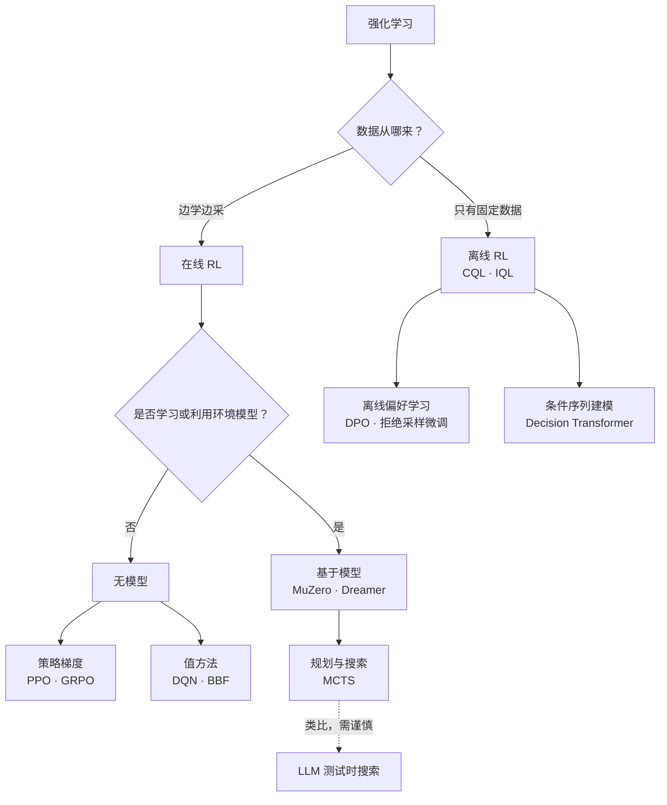
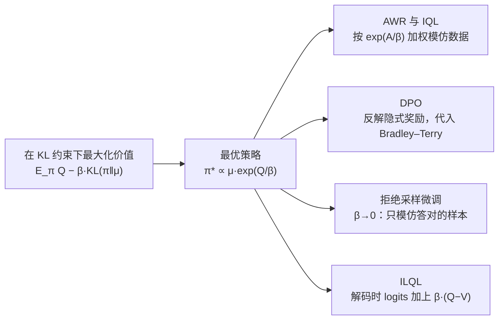
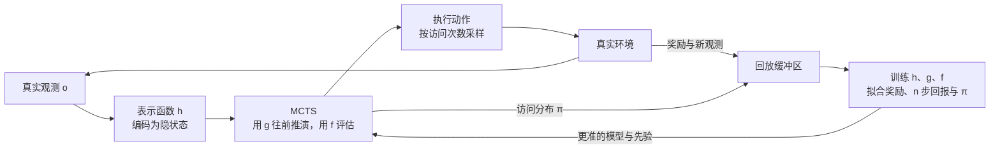

# 经典 RL 五年（2021–2026）：LLM 从业者需要知道的部分

**一句话定义**：一份写给大模型从业者的“迁移清单”，不是 RL 综述——过去五年的经典强化学习里，哪些思想、工程经验与失败教训真正进入了后训练，哪些只是看起来相似。

::: human
今天大模型用的 RL 大多是“老算法，新规模”：PPO 出自 2017 年，GAE 出自 2015 年，“别离参考太远地最大化奖励”的最优解也早有人推导过。先看清它们原本解决什么、在哪儿翻过车，再看 GRPO、DPO、测试时搜索，会少走很多弯路。
:::

## 为什么要回看经典 RL {#why}

后训练里的 RL 几乎每一块都能在经典 RL 里找到原型。下表同时是本页的导航：

| 经典 RL 里的东西 | 后训练中的对应物 | 本页位置 |
|---|---|---|
| 行为克隆（BC） | SFT | [离线 RL](#offline-rl) |
| 只克隆高回报轨迹（%BC） | 拒绝采样微调（RFT） | [离线 RL](#offline-rl) |
| 离线 RL（固定数据集） | DPO 等离线偏好学习 | [离线 RL](#offline-rl) |
| 在线 on-policy 策略梯度 | PPO、GRPO 做 RLHF 与 RLVR | [实现细节](#implementation) |
| 以回报为条件的序列建模 | 以质量标签或目标分数为条件的 SFT | [序列建模](#sequence-modeling) |
| 规划与搜索（MCTS） | best-of-N、树搜索、长思维链 | [搜索类比](#search-analogy) |
| 多步 MDP 与真实环境 | Agentic RL | [经验时代](#era-of-experience) |

先记住两条经验。**原理迁移得比算法好**：分布偏移、奖励被钻空子、实现细节左右结论、少种子评测不可信，几乎原样成立。**具体机制常要变形**：价值网络、回放缓冲、MCTS、探索奖励在 LLM 上要么被替代，要么只在特定条件下有效（见[迁移清单](#what-transfers)）。

## RL 速成：用 LLM 的眼光看五个概念 {#refresher}

这里只讲后文要用到的概念；策略梯度、PPO、GAE 的完整推导见[算法谱系与推导](/lenses/algorithms#policy-gradient)。

### MDP 与回报：把生成写成决策过程 {#mdp}

<Term t="mdp">马尔可夫决策过程</Term>（MDP）由状态 $s$、动作 $a$、转移 $P(s'\mid s,a)$、奖励 $r(s,a)$ 与<Term t="discount-factor">折扣因子</Term> $\gamma$ 组成。策略 $\pi(a\mid s)$ 与环境交互产生轨迹，目标是最大化期望<Term t="return">回报</Term>：

$$J(\pi)=\E_{\tau\sim\pi}\big[G_0\big],\qquad G_t=\sum_{k\ge 0}\gamma^{k}\,r_{t+k}$$

LLM 生成可以写成 token 级 MDP：提示 $x$ 加已生成前缀是状态，下一个 token 是动作，奖励通常只在回答结束时出现：

$$s_t=(x,\,y_{<t}),\qquad a_t=y_t,\qquad s_{t+1}=(x,\,y_{\le t}),\qquad r_t=\begin{cases}0, & t<T\\ r(x,y), & t=T\end{cases}$$

取 $\gamma=1$ 时，每个 token 的回报都等于最终奖励 $r(x,y)$。和 Atari、机器人相比，这个 MDP 有四个特殊之处：

1. **转移确定且已知**：下一状态就是把 token 接上去；单轮生成的“环境模型”是免费的，难的是价值与奖励。
2. **动作多、回合长、奖励稀疏**：词表约 $10^5$，长推理上万步，奖励常常只在末尾。
3. **能反复回到同一起点**：同一提示多次采样几乎没有额外成本，“同组比较”的基线（<Term t="grpo">GRPO</Term>、RLOO）因此可行。
4. **多轮智能体把不确定性带了回来**：工具、网页、用户都不受模型控制（见 [Agentic RL 的形式化](/topics/agentic-rl#formulation)）。

::: human
把写回答想成下棋：每写一个词局面就变一次，只有终局才知道输赢。不同的是这盘棋的规则现成且确定，难的只是判断“走到这一步，赢面有多大”。
:::

### 价值函数与贝尔曼方程 {#bellman}

<Term t="value-function">价值函数</Term>回答“从这里出发，平均还能拿多少分”：状态价值 $V^\pi(s)=\E_\pi[G_t\mid s_t=s]$，动作价值 $Q^\pi(s,a)=\E_\pi[G_t\mid s_t=s,a_t=a]$，<Term t="advantage">优势</Term> $A^\pi(s,a)=Q^\pi(s,a)-V^\pi(s)$。它们满足<Term t="bellman-equation">贝尔曼方程</Term>：

$$V^\pi(s)=\E_{a\sim\pi(\cdot\mid s)}\Big[r(s,a)+\gamma\,\E_{s'\sim P(\cdot\mid s,a)}V^\pi(s')\Big]$$

$$Q^*(s,a)=r(s,a)+\gamma\,\E_{s'\sim P(\cdot\mid s,a)}\Big[\max_{a'}Q^*(s',a')\Big]$$

前者评估给定策略；后者是最优方程，<Term t="q-learning">Q-learning</Term> 与 DQN 都在逼近它的不动点。TD 误差 $\delta_t=r_t+\gamma V(s_{t+1})-V(s_t)$ 是 <Term t="gae">GAE</Term> 的基本单元（见 [GAE 推导](/lenses/algorithms#gae)）。

在 token MDP 里有一个很有用的推论：中间奖励为 0、$\gamma=1$ 且转移确定时，$Q^\pi(s_t,a_t)=V^\pi(s_{t+1})$，于是

$$A^\pi(s_t,a_t)=V^\pi(s_{t+1})-V^\pi(s_t)$$

对 0/1 奖励，$V^\pi$ 就是“从这个前缀出发最终答对的概率”，所以**一个 token 的优势，就是它让答对概率变了多少**。过程奖励模型可以理解为在估计这种“进展”；而在每个前缀上都准的价值网络极难训练，所以 GRPO、RLOO 干脆让整条回答共享一个序列级优势（奖励减去同组均值）。

::: derive 从回报的定义推出贝尔曼期望方程，以及 token MDP 的推论
**第一步**：由定义 $G_t=r_t+\gamma G_{t+1}$，对 $s_t=s$ 取条件期望，按 $a_t$、$s_{t+1}$ 用全期望公式展开：

$$V^\pi(s)=\sum_a\pi(a\mid s)\Big[r(s,a)+\gamma\sum_{s'}P(s'\mid s,a)\,\E_\pi\big[G_{t+1}\mid s_t=s,\,a_t=a,\,s_{t+1}=s'\big]\Big]$$

**第二步**：由马尔可夫性，给定 $s_{t+1}=s'$ 后未来与过去无关，最后那个条件期望就是 $V^\pi(s')$，即得期望方程；同理 $Q^\pi(s,a)=r(s,a)+\gamma\,\E_{s'\sim P(\cdot\mid s,a)}V^\pi(s')$。

**第三步**：token MDP 的转移确定（$s'$ 唯一），$t<T$ 时 $r_t=0$，取 $\gamma=1$，得 $Q^\pi(s_t,a_t)=V^\pi(s_{t+1})$；末步 $Q^\pi(s_T,a_T)=r(x,y)$。

**注意**：若像 InstructGPT 那样把逐 token 的 KL 惩罚 $-\beta\log\frac{\pi_\theta(y_t\mid s_t)}{\pi_\text{ref}(y_t\mid s_t)}$ 并进奖励，中间奖励不再为 0，等式要加上这一项。
:::

### 在策略、离策略与离线 {#on-off-policy}

这三个词描述的是“训练数据从哪来”：

- **<Term t="on-policy">在策略</Term>（on-policy）**：数据由当前策略产生、用完即弃，如 PPO、GRPO；多轮小批量更新时数据已略微过期，裁剪就是护栏。
- **<Term t="off-policy">离策略</Term>（off-policy）**：数据来自旧策略、回放缓冲或其他模型，需要重要性采样修正，或用 Q-learning 这类天然离策略的方法。
- **<Term t="offline-rl">离线</Term>（offline）**：只有固定数据集，训练中不与环境交互，如 CQL、IQL、DPO。

LLM RL 名义上在策略，实际上总是“近似在策略”：异步 rollout 带来陈旧样本，训推数值差异让同一个策略算出不同的概率。常用的截断重要性采样修正与 IMPALA 的 V-trace（2018）一脉相承：截断权重，用少量偏差换低方差（见[离策略修正](/lenses/algorithms#off-policy)与[训推不一致](/lenses/infra#mismatch)）。

## 演化脉络 {#lineage}

<LineageGraph graph="classic-rl" />

读图时看三条线：AlphaZero 的“搜索 + 学习”从棋类分叉到算法发现与数学证明，又成为“经验时代”的论据；离线 RL 从 AWR、CQL 到 IQL，最后与 DPO 在同一个闭式解上汇合；工程一列的实现细节与样本效率研究，决定了一个结论到底能不能信。

## 实现细节决定结论：PPO 的 37 个细节与 CleanRL {#implementation}

2020 年的两项研究先把问题摆上桌面。Engstrom 等人发现，PPO 相对 TRPO 的优势很大程度来自论文没写的代码级优化，控制住这些细节后两者的目标函数表现相近[^1]；Andrychowicz 等人把 on-policy 算法拆成 50 多个设计选择、训练超过 25 万个智能体，逐个量化其影响[^2]。

2022 年 3 月发表在 ICLR 博客赛道的《The 37 Implementation Details of Proximal Policy Optimization》把这些研究变成了可执行的清单[^3]。作者 Shengyi Huang（CleanRL 作者）与 Stable-Baselines3 维护者 Antonin Raffin 等人先考证 openai/baselines 的历史版本，确定哪一版才算“官方实现”，再逐条列出 37 个细节（13 条通用核心，其余针对 Atari、连续控制、LSTM 等），每条附源码永久链接与相关文献结论，并用单文件实现复现了官方曲线。它随后成为复现 PPO 的标准参照：Hugging Face 的 Deep RL 课程把它列为必读，HF 在 2023 年复现 OpenAI 早期 RLHF 代码时也照搬了“逐条列细节 + 对齐学习曲线”的做法[^4]。

博客末尾的调试清单同样适用于 GRPO：

1. 第一个 epoch 的第一个 minibatch 里新旧策略相同，比率应恒为 1；不是 1，说明采样时的概率没被正确重建。
2. `approx_kl` 按作者经验通常低于 0.02；持续偏高意味着步子太大或有 bug。
3. 与参考实现对齐策略损失、价值损失、clipfrac 等曲线，而不只对齐最终分数。

这些细节在 LLM RL 里大多有对应物，坑的位置也惊人地相似：

| PPO 官方实现里的细节 | 在 LLM RL 里的样子 |
|---|---|
| 小批量级的优势归一化 | GRPO 的组内标准化、REINFORCE++ 的全局归一化；Dr. GRPO 指出除以组内标准差会引入难度偏置 |
| 价值损失裁剪 | 大规模消融认为它无益甚至有害[^2]；重启价值模型的 VAPO 改从价值预训练、解耦 GAE 入手 |
| 调试指标 `approx_kl`（k1）与更好的 k3 估计 | k3 $=r-1-\log r$ 成了 GRPO 类方法 KL 惩罚的事实标准（见 <Term t="kl-estimator">KL 估计量</Term>） |
| Adam 的 ε 等“看不见”的超参数 | HF 发现 PyTorch 与 TensorFlow 的 Adam 实现差异会让 RLHF 早期更新过猛[^4] |
| 算 logprob 前按采样温度缩放 logits、禁用 dropout、取 γ=1 | 都来自 OpenAI 2019 年的 RLHF 代码；漏掉温度缩放，KL 会涨得比预期快，效果变差[^4] |
| 熵奖励 | LLM RL 大多不加；熵塌缩改用 Clip-Higher 等手段处理 |

::: insight 细节就是算法的一部分
在 LLM RL 里，损失如何在 token 间聚合、优势按组还是按批归一化、裁剪上下界是否对称，同样会左右结论（见 [Dr. GRPO](/lenses/algorithms#dr-grpo) 与 [DAPO](/lenses/algorithms#dapo)）。比较两个算法之前，先把这些细节对齐。
:::

<EntryGrid :ids="['ppo-implementation-details', 'cleanrl', 'what-matters-on-policy']" />

**点评**：37 个细节博客是“读代码”的范本，该带走的是方法而不是某个超参数；CleanRL 把同样的哲学做成代码库，适合小规模快速验证；大规模消融则给了这些细节实证依据。三者合起来说明：**不报告实现细节的 RL 对比实验，很难被信任**。2024 年的续作把这套方法用到了完整的 RLHF 流程上[^5]。

## 离线 RL：从 CQL、IQL 到 DPO 与拒绝采样 {#offline-rl}

<Term t="offline-rl">离线 RL</Term> 只给一份由行为策略 $\mu$ 收集的数据集 $\mathcal D=\{(s,a,r,s')\}$。难点在贝尔曼备份里的 $\max_{a'}Q(s',a')$：它会查询数据里几乎没出现过的动作，这些 Q 值没有数据纠正，误差又恰好被 max 挑中，策略于是奔向“想象中的好动作”——这就是**分布偏移下的高估**。

### CQL：对没见过的动作保持悲观

CQL 在普通的贝尔曼误差上加一个正则（下式是论文中的 CQL(H) 变体）：

$$\min_Q\ \alpha\,\E_{s\sim\mathcal D}\Big[\log\sum_a\exp Q(s,a)-\E_{a\sim\mu(\cdot\mid s)}Q(s,a)\Big]+\frac12\,\E_{(s,a,s')\sim\mathcal D}\Big[\big(Q(s,a)-\hat{\mathcal B}^{\pi}\hat Q(s,a)\big)^2\Big]$$

其中 $\alpha$ 是正则强度，$\hat{\mathcal B}^{\pi}$ 是用样本估计的贝尔曼算子，$\hat Q$ 是上一轮的 Q。$\log\sum_a\exp Q$ 是对所有动作 Q 值的“软最大”，最小化它会压低被高估的动作，减去数据内动作的 Q 则把真实出现过的动作抬回来。论文证明这样学到的 Q 在期望意义上是策略真实价值的下界，并报告在复杂、多模态数据上常取得 2–5 倍的最终回报[^6]。

### IQL：干脆不碰数据外的动作

IQL 训练中从不查询数据外的动作：用 expectile 回归让 $V(s)$ 逼近“数据内动作 Q 值分布的上分位”，Q 则以 $V(s')$ 为 TD 目标：

$$L_V=\E_{(s,a)\sim\mathcal D}\Big[L_2^{\tau}\big(Q(s,a)-V(s)\big)\Big],\qquad L_2^{\tau}(u)=\big\lvert\tau-\mathbb{I}(u<0)\big\rvert\,u^2$$

$$L_Q=\E_{(s,a,s')\sim\mathcal D}\Big[\big(r(s,a)+\gamma V(s')-Q(s,a)\big)^2\Big]$$

$\tau=0.5$ 时就是普通均方误差（估均值），$\tau\to1$ 时逼近数据支撑内的最大值；官方配置在运动控制上取 0.7，在稀疏奖励的 AntMaze 上取 0.9[^7]。最后用优势加权回归（AWR）抽取策略，同样只用数据里的动作：

$$\max_\phi\ \E_{(s,a)\sim\mathcal D}\Big[\exp\big(A(s,a)/\beta\big)\,\log\pi_\phi(a\mid s)\Big],\qquad A=Q-V$$

（IQL 论文写成 $\exp(\beta' A)$，$\beta'=1/\beta$ 是逆温度；官方代码还把权重截断在 100 以内。）

::: human
CQL 像一位谨慎的面试官：简历上没写的本事一律先打低分。IQL 更彻底：只在“简历上真写了的经历”里比较，挑出表现偏好的那部分重点学。
:::

### 一个闭式解，四种后训练方法

离线 RL 与 LLM 后训练最深的连接，是“别离数据太远”约束下的最优策略。对每个状态 $s$：

$$\max_\pi\ \E_{a\sim\pi(\cdot\mid s)}\big[Q(s,a)\big]-\beta\,\KL\big(\pi(\cdot\mid s)\,\Vert\,\mu(\cdot\mid s)\big)\quad\Longrightarrow\quad\pi^*(a\mid s)=\frac{\mu(a\mid s)\,\exp\big(Q(s,a)/\beta\big)}{Z(s)}$$

其中 $Z(s)=\sum_a\mu(a\mid s)\exp\big(Q(s,a)/\beta\big)$ 是归一化常数，$\beta$ 越小越贪心。最优策略就是把行为策略按 $\exp(Q/\beta)$ 做一次“指数倾斜”。

::: derive 为什么最优解是指数倾斜，以及它怎样变成加权最大似然
**第一步：配方。** 展开到 $\pi^*$ 的 KL：

$$\KL\big(\pi\,\Vert\,\pi^*\big)=\sum_a\pi(a\mid s)\log\frac{\pi(a\mid s)}{\mu(a\mid s)}-\frac1\beta\sum_a\pi(a\mid s)\,Q(s,a)+\log Z(s)$$

两边乘以 $-\beta$ 并移项：

$$\E_{a\sim\pi}\big[Q(s,a)\big]-\beta\,\KL\big(\pi\,\Vert\,\mu\big)=\beta\log Z(s)-\beta\,\KL\big(\pi\,\Vert\,\pi^*\big)$$

右边第一项与 $\pi$ 无关，第二项在 $\pi=\pi^*$ 时取到最小值 0，所以 $\pi^*$ 就是最优解。

**第二步：投影回参数化策略。** 网络表示不了任意的 $\pi^*$，于是最小化 $\E_s\big[\KL\big(\pi^*(\cdot\mid s)\,\Vert\,\pi_\phi(\cdot\mid s)\big)\big]$。去掉与 $\phi$ 无关的熵项，等价于

$$\max_\phi\ \E_s\,\E_{a\sim\mu(\cdot\mid s)}\Big[\frac{\exp\big(Q(s,a)/\beta\big)}{Z(s)}\,\log\pi_\phi(a\mid s)\Big]$$

期望对 $\mu$ 取，正好可以用数据集里的样本估计——**全程不需要数据外的动作**。

**第三步：换成优势。** $\exp(Q/\beta)/Z(s)=\exp(A/\beta)\cdot\exp\big(V(s)/\beta\big)/Z(s)$，后一个因子只依赖状态，不改变同一状态内各动作的相对权重。AWR 与 IQL 忽略它（相当于改变了不同状态之间的权重，是一种近似），就得到正文里按 $\exp(A/\beta)$ 加权的最大似然。
:::

这一个公式，在后训练里至少以四种面目出现：

1. **AWR 与 IQL**：如上，按 $\exp(A/\beta)$ 加权模仿数据里的动作。
2. **DPO**：把状态换成提示 $x$、动作换成整条回答 $y$、行为策略换成参考模型 $\pi_\text{ref}$、价值换成奖励 $r(x,y)$，得到 $\pi^*(y\mid x)\propto\pi_\text{ref}(y\mid x)\exp\big(r(x,y)/\beta\big)$。反解出 $r=\beta\log\frac{\pi^*}{\pi_\text{ref}}+\beta\log Z(x)$ 代入 Bradley–Terry 偏好模型，$Z(x)$ 恰好消掉，就是 DPO 的损失（见 [DPO 推导](/lenses/algorithms#dpo)）。DPO 论文推导这一步时引用的，正是 reward-weighted regression 与 AWR 这条经典 RL 路线[^8]。
3. **<Term t="rejection-sampling">拒绝采样</Term>微调**：奖励只有 0/1 时让 $\beta\to0$，$\pi^*$ 退化为“参考模型在答对条件下的分布”，投影就变成只在答对样本上做 SFT。STaR、ReST、ReST-EM 都是它的迭代版本，ReST 论文直接自称受 growing batch RL 启发[^9]。
4. **ILQL**：把 IQL 搬到 token 级，再加 CQL 式正则压低没出现过的 token；解码时把 $\beta(Q-V)$ 加到语言模型的 logits 上，正是在从 $\pi^*$ 采样[^10]。

### 离线 RL 的教训如何映射到 LLM

三条教训几乎原样适用：

1. **奖励模型就是一个会被钻空子的 critic。** CQL 要防的“对数据外动作过度乐观”，在 RLHF 里表现为<Term t="reward-hacking">奖励黑客</Term>：策略离奖励模型的训练分布越远，分数越不可信（见[奖励黑客](/topics/rl-for-llm#reward-hacking)）。对参考模型的 KL 惩罚本质上是“策略约束”，与 TD3+BC 往策略目标里加一项行为克隆损失同一个思路——后者证明这一行改动就足以成为离线 RL 的强基线[^11]。
2. **纯离线有天花板。** DPO 只在固定偏好对上训练，同样受分布偏移困扰。Xu 等人（ICML 2024）发现调好的 PPO 在对话与代码任务上普遍优于 DPO[^12]；Tajwar 等人（ICML 2024）发现在策略采样的数据、以及对差样本施加的“负梯度”，是偏好微调见效的关键[^13]。迭代 DPO、在线 DPO 因此流行。
3. **什么时候值得用 RL 而不只是 SFT。** Kumar 等人（ICLR 2022）的结论是：在稀疏奖励、数据含噪等常见条件下，离线 RL 可以显著优于行为克隆，长程任务尤甚[^14]。换到 LLM：数据质量参差时，按结果筛选或加权比一视同仁地 SFT 更好。

<EntryGrid :ids="['cql', 'iql', 'ilql']" />

**点评**：CQL 与 IQL 代表“惩罚数据外动作”与“根本不查询数据外动作”两种思路，IQL 更简单也更稳，是离线 RL 的首选基线。ILQL 证明这套方法能落到 token 级，但工业界最终选了更简单的 [DPO](/library/?id=dpo) 与拒绝采样微调——同一个闭式解的特例，却省掉了价值网络。

## 序列建模：把 RL 写成条件生成 {#sequence-modeling}

2021 年 6 月，两篇论文几乎同时提出“RL 就是序列建模”。**Decision Transformer**（DT）把每条轨迹写成剩余回报、状态、动作交错的序列：

$$\tau=\big(\hat R_1,s_1,a_1,\ \hat R_2,s_2,a_2,\ \dots,\ \hat R_T,s_T,a_T\big),\qquad \hat R_t=\sum_{t'=t}^{T}r_{t'}$$

模型用因果 Transformer 读最近 $K$ 步（共 $3K$ 个 token），只在动作位置计算损失（离散动作用交叉熵，连续动作用均方误差）；测试时给出目标回报 $\hat R_1$，每执行一步减去实际拿到的奖励，再继续生成。**Trajectory Transformer**（TT）则把状态、动作、奖励逐维离散成 token，用 GPT 建模整条轨迹，再用按累计奖励打分的束搜索做规划——同一个模型既是世界模型，也是动作先验。

**它说对了什么。** 数据里存在好行为时，“条件化的模仿”就能把它取出来：在提示里写上目标分数或质量标签再做 SFT，与 DT 是同一个思想。DT 论文还做了一个常被忽略的对照：只克隆回报最高那部分数据的 %BC。数据充足时（D4RL），最好的 %BC 能追平甚至超过其他离线 RL 方法，DT 也只是与之相当；只有在 Atari 这种只用 1% 回放数据的低数据场景里，%BC 才明显吃亏[^15]。%BC 就是经典 RL 版的拒绝采样微调。

**它没说对什么。**

- **拼接**：把多条次优轨迹的好片段拼成更好的策略，是基于价值的动态规划天然具备的能力。DT 论文唯一的拼接证据来自一个图最短路径的玩具实验，而且用了其他实验都没用的回报先验（约 15.8% 的生成路径由次优片段拼成）[^15]。Brandfonbrener 等人（NeurIPS 2022）证明，以回报为条件的监督学习要找到最优策略，需要比动态规划强得多的假设：环境（近似）确定，且数据覆盖所要求的回报[^16]；Elastic DT、Q-learning DT 等后续工作正是为补上拼接能力而提出的[^17]。
- **随机性**：随机环境里高回报可能只是运气好，按回报做条件会学到“靠运气”的动作[^18]。
- **架构不是关键**：RvS（ICLR 2022）表明，以目标或回报为条件的简单 MLP 只要设计得当，就能达到很多同类结果[^19]。

映射到 LLM：单轮生成的转移是确定的，“运气”主要来自有噪声的奖励（判官模型打分、偶然通过的测试）；多轮智能体面对的工具与用户是随机的，条件化模仿更容易学到侥幸成功的轨迹。推理任务里的“拼接”，相当于把几条错误解答中各自正确的步骤组合成一条正确解答——条件化 SFT 做不到，这正是需要 RL 或价值学习的地方。

::: human
DT 像一个只会“照着高分录像学”的学生：录像里有完整的好示范时学得又快又稳；如果每段录像都只对一半，它不会自己把两段好的拼起来。
:::

<EntryGrid :ids="['decision-transformer', 'trajectory-transformer']" />

**点评**：DT 的价值在于打通了 RL 与语言建模的工具链，这也是它被高引的原因；但在需要拼接次优轨迹的任务上，它通常不如 IQL 这类价值方法。TT 更接近“学模型 + 搜索”，代价是推理慢得多。两者留下的最大遗产是一个清醒的认识：**条件生成不等于策略改进**。

## 模型与搜索：MuZero 家族、EfficientZero 与 DreamerV3 {#model-based}

<Term t="model-based-rl">基于模型的 RL</Term> 先学一个<Term t="world-model">世界模型</Term>，再用它规划或生成想象数据。五年里这条线有两个分支：MuZero 家族在学到的模型里做 <Term t="mcts">MCTS</Term>，Dreamer 家族在模型的想象中训练策略。

### MuZero 家族：在学到的模型里搜索

MuZero（2019）不需要知道游戏规则，它学三个函数：

$$s^0=h_\theta(o_{1:t}),\qquad \big(r^k,\,s^k\big)=g_\theta\big(s^{k-1},\,a^k\big),\qquad \big(p^k,\,v^k\big)=f_\theta\big(s^k\big)$$

表示函数 $h$ 把历史观测编码成隐状态，动力学函数 $g$ 在隐空间里往前推一步并预测奖励，预测函数 $f$ 输出策略先验与价值。训练时沿真实轨迹展开 $K$ 步，让预测的奖励、价值、策略分别拟合真实奖励、$n$ 步自举回报与 MCTS 的访问分布。隐模型不必重建画面，只需在“对决策有用”的量上准确。

之后的改进都围绕“更省”展开：

- **Sampled MuZero**（2021）：动作空间太大或连续时，只从策略里采样 $K$ 个候选动作，在子集上搜索并做相应修正[^20]。
- **Gumbel MuZero**（ICLR 2022）：原版在模拟次数很少、根节点没访问遍所有动作时可能改进不了策略；改用 Gumbel-Top-k 无放回采样候选、sequential halving 分配模拟次数，在动作价值估计准确时保证策略改进[^21]。DeepMind 的 JAX 搜索库 mctx 默认推荐它。
- **EfficientZero**（NeurIPS 2021）：加入自监督时间一致性、价值前缀、基于模型的离策略修正，在 Atari 100k（约两小时游戏经验）上达到人类平均分的 194.3%、中位数 109.0%；消融显示一致性损失最关键[^22]。

### Dreamer：在想象里练习

DreamerV3（2023 年初发布，2025 年发表于 Nature）学习世界模型，在想象出的轨迹上训练 actor-critic。卖点不是某个任务的最高分，而是**一套固定超参数**通用于 8 个领域、150 多个任务，并首次在不借助人类数据与课程的情况下从零在 Minecraft 挖到钻石[^23]。支撑这一点的是一组尺度鲁棒的技巧：对输入与预测目标做 symlog 变换；用第 5 到第 95 百分位的范围 $S$ 归一化回报，且只缩小不放大（除以 $\max(1,S)$）。论文特别指出，按标准差归一化在稀疏奖励下会因标准差接近 0 而放大噪声——这与 [Dr. GRPO](/lenses/algorithms#dr-grpo) 对组内标准差归一化的批评遥相呼应。2025 年 9 月的 Dreamer 4 更进一步：只用离线数据训练世界模型，完全在模型内部训练策略，也在 Minecraft 挖到了钻石[^24]。

### 与 LLM 测试时搜索的类比：哪里成立，哪里不成立 {#search-analogy}

o1、DeepSeek-R1 之后，<Term t="test-time-scaling">测试时计算</Term>常被类比为 AlphaGo 的搜索。这个类比只对了一半。

**成立的部分：搜索—学习闭环。** AlphaZero 的核心不是 MCTS 本身，而是专家迭代：搜索充当策略改进算子，产出比当前网络更强的动作分布，网络再去模仿它[^25]。LLM 里的对应物是：多次采样加验证器筛选（best-of-N、多数投票、形式化检查）充当改进算子，拒绝采样微调、STaR、ReST-EM 把改进蒸馏回模型；AlphaProof 的测试时 RL 是这个闭环的极端形态。也有工作直接把 AlphaZero 式树搜索用于 LLM 的解码与训练[^26]。

**不成立的部分**，DeepSeek-R1 论文的“失败尝试”一节说得很清楚[^27]：

1. **搜索空间**：棋类的动作集合明确，token 生成的搜索空间指数级更大；限制每个节点的扩展数，又容易陷入局部最优。
2. **价值模型**：AlphaGo 依赖一个逐步变强的价值网络，而为部分推理训练细粒度的价值模型本身就很难。R1 团队的结论是：配上预训练好的价值模型，MCTS 能在推理时提分，但靠自我搜索迭代提升模型仍是难题。
3. **验证器**：棋局终局的胜负精确又便宜，开放式推理却缺少可靠的中间评估（见 [Let's Verify Step by Step](/library/?id=lets-verify)）。Lean 证明、带测试的代码这类有精确验证器的领域才是搜索的主场，这也是 AlphaProof 成功的前提。

还有两点常被忽略。其一，单轮生成的“环境模型”是免费的，LLM 里真正的“基于模型”是学奖励、价值与验证器；到了智能体场景，工具、网页和用户不可控，世界模型才重新登场，例如 [ZeroSearch](/library/?id=zerosearch) 用一个 LLM 扮演搜索引擎。其二，长思维链把搜索“内化”了：回溯、验证、设定子目标出现在单条序列里（见[四种认知行为](/library/?id=cognitive-behaviors)），算力更多花在“想得更长”而非“搜得更宽”，两者如何分配取决于题目难度[^28]。

::: insight 经典 RL 真正该带走的，是“改进算子”这个视角
任何能稳定产出比当前策略更好样本的过程——树搜索、验证器筛选、更强的教师模型——都可以当作策略改进算子，再把结果蒸馏回模型。选哪种算子取决于有没有可靠的验证器，而不取决于它像不像 AlphaGo。
:::

<EntryGrid :ids="['efficientzero', 'gumbel-muzero', 'dreamerv3']" />

**点评**：EfficientZero 与 DreamerV3 对 LLM 的直接迁移有限，但处理奖励尺度、陈旧数据与模型误差的办法值得借鉴；Gumbel MuZero 是理解“小预算搜索仍能保证改进”的最好材料。

## 样本效率：BBF、可塑性与评测统计 {#sample-efficiency}

BBF（ICML 2023）回答了一个反直觉的问题：数据极少时能不能把价值网络做大？直接做大会过拟合早期数据、越学越僵，也就是失去“可塑性”。BBF 的配方是[^29]：

1. 编码器加宽到 4 倍，回放比（每步环境交互对应的梯度步数）拉到 8；
2. 周期性 shrink-and-perturb 重置：输出头重新初始化，编码器向随机权重插值一半；
3. 每次重置后，$n$ 步回报从 10 退火到 3，折扣从 0.97 升到 0.997；
4. 权重衰减、数据增强、自预测辅助损失等正则一起上。

结果是无模型的值方法在 Atari 100k 上达到超人水平。“高回放比让网络失去可塑性、重置能找回来”此前已由 D'Oro 等人（ICLR 2023）系统论证；Sutton 团队 2024 年在 Nature 上进一步指出，标准深度学习在持续学习中会逐渐丧失可塑性[^30]。

对 LLM 的启示有两层。其一，智能体 RL 的 rollout 很贵，复用数据（多个 PPO epoch、离策略复用）很诱人，但复用越狠越需要正则或重置来防止“学僵”。其二，LLM RL 里常说的“重置”（如 [ProRL](/library/?id=prorl) 定期重置参考策略）是在移动 KL 锚点，并不重置网络权重，别混为一谈。

样本效率研究还留下一份评测遗产。Agarwal 等人（NeurIPS 2021 杰出论文）指出，深度 RL 常用三五个种子报一个平均数，结论可能完全被噪声左右，主张用分层 bootstrap 置信区间、性能剖面与四分位均值（IQM）报告结果[^31]。LLM RL 的评测同样少种子、高方差：像 AIME 这样一年只有几十道题的基准，单次 pass@1 的波动就可能盖过方法间的差距（见[评测中的方差](/lenses/eval#variance)）。

<EntryGrid :ids="['bbf', 'rliable']" />

## RL 用于发现：AlphaTensor、AlphaDev、AlphaProof {#discovery}

如果说大模型 RL 的主战场是“把已有能力练熟”，DeepMind 的 Alpha 系列展示了另一种用法：**在人类尚未穷尽的组合空间里发现新东西**。三个工作共享同一个配方：

1. **游戏化**：状态是部分构造的解，动作是一步构造（减去一个秩一张量、追加一条汇编指令、执行一步 Lean 证明）。
2. **精确验证器给奖励**：正确性由构造或形式系统保证，效率用步数或实测延迟衡量。
3. **AlphaZero 式的搜索 + 学习**，靠大规模自我博弈积累经验。
4. **可独立核验的产出**：算法可证明正确，证明可被 Lean 检查，代码可合并进生产库。

**AlphaTensor**（Nature 2022）把矩阵乘法写成张量分解游戏 TensorGame：每步减去一个秩一张量、奖励 −1，逼智能体用最少步数（即乘法次数）把张量消成零。它在模 2 算术下首次改进了 Strassen 1969 年的两层算法（4×4 矩阵 47 次乘法对 49 次）；把终局奖励换成目标硬件（V100 GPU、TPU v2）上的实测运行时间，同一套方法就能为特定硬件找更快的算法[^32]。

**AlphaDev**（Nature 2023）把写排序汇编变成 AssemblyGame：每步追加一条指令，奖励综合测试输入上的正确性与实测延迟。它发现的短序列排序例程优于人类基准，已并入 LLVM 的标准 C++ 库 libc++[^33]，是 RL 发现的算法直接替换生产代码组件的罕见案例。

**AlphaProof**（2024 年 7 月首次公开，2025 年 11 月发表于 Nature）把这套配方搬到了数学证明上[^34]：用基于 Gemini 的自动形式化把自然语言题目翻译成 Lean 命题，得到数百万道训练题；AlphaZero 式的证明智能体在 Lean 里尝试证明或证伪，由 Lean 判定对错；遇到最难的题，就在测试时生成数百万个相关变体并在线训练，即测试时 RL（Test-Time RL）。IMO 2024 上，它解出 5 道非几何题中的 3 道，包括全场最难的一题；加上 AlphaGeometry 2 解出的几何题，总分达到银牌线——但耗时数天，两道组合题也没解出。

**AlphaEvolve**（2025）常被放进同一张图，但它**不是经典 RL**：Gemini 模型反复提出代码修改，自动评估器打分，进化算法保留与组合好程序；LLM 充当变异算子，本身不做梯度更新[^35]。它的成果同样建立在精确的评估器上，例如只用 48 次标量乘法的 4×4 复矩阵乘法算法，以及一个在 Google 生产环境平均回收约 0.7% 全球算力的 Borg 调度启发式。前身 FunSearch（Nature 2023）用同样的“LLM + 进化 + 评估器”，在 cap set 问题上找到了新构造[^36]。

对 LLM 后训练的启示有三条：**验证器决定上限**，能精确、廉价地判对错，搜索与 RL 才敢放开做大规模自我提升，RLVR 的环境工程本质上就是在造验证器（见[多环境与环境工程](/topics/multi-env#anatomy)）；**效率也可以是奖励**，代码优化类任务应把实测延迟放进奖励；**测试时训练是另一种算力分配**，前提是能自动构造相关且可验证的变体。

<EntryGrid :ids="['alphatensor', 'alphadev', 'alphaproof']" />

## 经验时代：Silver 与 Sutton 怎样框定 Agentic RL {#era-of-experience}

2025 年 4 月，David Silver（AlphaGo 的主要负责人）与 Richard Sutton（2024 年图灵奖得主之一、经典教材《强化学习》作者）发布立场文章《Welcome to the Era of Experience》，这是 MIT Press 文集《Designing an Intelligence》中一章的预印本[^37]。核心论点：靠模仿人类数据取得的进展正在放缓，数学、代码、科学等领域的高质量人类数据即将耗尽；下一代智能体将**主要从自身经验中学习**，并由此超越人类。文章用四个维度刻画这个时代：

1. **经验流**：智能体活在长期、连续的经验流里，而不是一问一答的短片段；一步行动的收益可能很久以后才显现。
2. **扎根的动作与观测**：通过调用 API、操作计算机、使用传感器与环境交互，而不只是和人对话。
3. **扎根的奖励**：奖励来自环境中可测量的结果，而不是人类的预先判断——后者会给智能体设一道无法逾越的天花板。
4. **基于经验的规划与推理**：用预测行动后果的世界模型来规划，而不是只模仿人类的思维链。

文章以 AlphaProof 和 DeepSeek-R1 为例：前者从约十万条人类写的形式化证明出发，通过与证明系统持续交互又生成了上亿条证明；后者表明只要给出正确的激励，模型就能自主发展出高级解题策略。文章还批评 RLHF 用人类专家的判断代替了机器估计的价值，绕开了价值函数、探索、世界模型等经典问题，而这些问题将在经验时代重新变得核心。

**它怎样框定 Agentic RL。** 经验流对应多轮、长程任务与跨轮次的<Term t="credit-assignment">信用分配</Term>（见 [Agentic RL](/topics/agentic-rl#credit-assignment)）；扎根的动作对应工具调用、代码执行与计算机操作；扎根的奖励对应单元测试、任务完成判定这类可验证信号；基于经验的规划对应世界模型与模拟器，在 LLM 智能体里常由另一个模型扮演环境。

**它引发的讨论。** Moonshot AI 的 Kimi K2 技术报告在引言中以这篇文章作为 agentic intelligence 的立论依据[^38]。2025 年 9 月，Sutton 在 Dwarkesh Podcast 的访谈（标题是“RL 之父认为 LLM 是死路”）中把立场推得更远：LLM 主要在模仿人，既缺少目标，也缺少检验对错的依据。Karpathy 随后发文《Animals vs Ghosts》回应：今天的 LLM 更像从人类文本中“召唤”出的幽灵，而不是在经验中长成的动物；他承认这不完全符合“苦涩的教训”，但认为预训练是解决冷启动的现实办法[^39]。主流的“先预训练、再在环境中做 RL”路线，恰好落在两种观点之间。

::: evidence 证据强度
观点文章，没有新实验，论据来自 AlphaGo、AlphaProof 与 DeepSeek-R1 等案例。适合当作研究议程来读，而不是已被验证的结论。
:::

<EntryCard id="era-of-experience" />

## 迁移清单：什么搬过来了，什么没有 {#what-transfers}

| 经典 RL 里的东西 | 在 LLM 后训练中 | 判断 |
|---|---|---|
| 信任域与 KL 约束 | PPO 裁剪、对参考模型的 KL 惩罚、DPO 的 β | 直接迁移 |
| 实现细节与调试指标 | 优势归一化、损失聚合、approx_kl、clipfrac | 直接迁移 |
| 离线 RL 的分布偏移教训 | 奖励黑客、DPO 的离线天花板、迭代与在线化 | 直接迁移 |
| 专家迭代（搜索后蒸馏） | 拒绝采样微调、STaR、ReST-EM、测试时 RL | 变形迁移 |
| 价值网络与 GAE | PPO 类方法仍在用；GRPO、RLOO 用组内基线替代；VAPO 重新启用 | 部分迁移 |
| 显式 MCTS | 在有精确验证器的领域有效；开放式推理中多被长思维链内化 | 有条件迁移 |
| 探索机制（内在奖励、计数、Go-Explore） | 探索主要靠预训练先验与采样温度 | 基本未迁移 |

<Term t="exploration">探索</Term>是最典型的“没搬过来”的部分。经典 RL 有 ε-greedy、熵正则、计数与好奇心奖励、Go-Explore（Nature 2021）等一整套方法[^40]，但 LLM 的探索主要来自预训练先验与采样温度：模型压根不会的解法，RL 很难凭空探索出来。这正是 [pass@k 之争](/lenses/principles#pass-at-k-debate)与[熵塌缩](/lenses/principles#entropy)讨论的起点。

## 可执行结论

::: takeaway
1. **先对齐参考实现，再改算法。** 复现 PPO 或 GRPO 时先查“首个 minibatch 比率为 1”与 approx_kl 是否异常；发表对比时列出优势归一化粒度、损失聚合方式、裁剪范围等细节。
2. **只有离线数据时，从“数据内改进”起步。** 拒绝采样微调、加权 SFT、DPO 都是 KL 约束闭式解的特例，稳定又便宜；但要尽早规划迭代采样或在线化。
3. **把奖励模型当作会被钻空子的 critic。** 用对参考模型的 KL 拉住策略，并盯住“奖励在涨、独立评测不涨”的信号。
4. **先有验证器，再谈搜索。** 有精确验证器（Lean、单元测试）时，“采样或搜索 → 验证 → 蒸馏”的闭环最划算；没有时先投资验证器的可靠性，而不是树搜索本身。
5. **小心放大稀疏奖励。** 按分位数范围归一化并限制放大倍数（如 DreamerV3 的 $\max(1,S)$）；做 GRPO 时留意组内标准差很小的题被过度放大。
6. **评测报告 avg@k 与置信区间。** 少种子、少题目上的“显著提升”只是待验证的假设。
:::

## 常见坑

::: pitfall
- **把条件化 SFT 当成 RL。** 在提示里写“高分”再模仿，只能取出数据里已有的好行为；它不会拼接次优片段，在随机环境里还会学到“靠运气”的行为。
- **照搬经典 RL 的默认值。** 熵奖励、价值损失裁剪、GAE 的 λ=0.95 在 LLM 上未必有效，要重新消融；LLM RL 通常取 γ=1。
- **混淆两个 TTRL。** AlphaProof 的 Test-Time RL 为单道难题生成变体、由 Lean 验证后在线训练；2025 年的 LLM 论文 TTRL 用多数投票结果当奖励，在无标注测试题上训练[^41]。前者的奖励精确，后者的奖励本身可能是错的。
- **以为 MCTS 在 LLM 上必然更强。** DeepSeek-R1 的失败尝试表明，token 级搜索空间与价值模型都难扩展；先确认有没有可靠的价值或验证信号。
- **把名字相似的东西当成一回事。** AlphaEvolve 是 LLM 驱动的进化搜索，不是 RL；BBF 的权重重置为了恢复可塑性，ProRL 的参考策略重置为了移动 KL 锚点，作用完全不同。
:::

## 延伸阅读

- [资料库：经典 RL 条目](/library/?area=classic-rl)
- [LLM 强化学习](/topics/rl-for-llm)：RLHF、RLVR 与[奖励黑客](/topics/rl-for-llm#reward-hacking)
- [算法谱系与推导](/lenses/algorithms)：[策略梯度](/lenses/algorithms#policy-gradient)、[PPO](/lenses/algorithms#ppo)、[DPO](/lenses/algorithms#dpo)、[离策略修正](/lenses/algorithms#off-policy)
- [Agentic RL](/topics/agentic-rl) 与[多环境与环境工程](/topics/multi-env)
- [评测](/lenses/eval#variance)、[训练系统](/lenses/infra#async)与[原理与可解释性](/lenses/principles)

[^1]: Engstrom et al., [Implementation Matters in Deep Policy Gradients: A Case Study on PPO and TRPO](https://arxiv.org/abs/2005.12729)，ICLR 2020。
[^2]: Andrychowicz et al., [What Matters In On-Policy Reinforcement Learning? A Large-Scale Empirical Study](https://arxiv.org/abs/2006.05990)，ICLR 2021：50 多个设计选择、超过 25 万个智能体、5 个连续控制环境；价值损失裁剪无益甚至有害的结论见 37 个细节博客第 9 条的引述。
[^3]: Huang et al., [The 37 Implementation Details of Proximal Policy Optimization](https://iclr-blog-track.github.io/2022/03/25/ppo-implementation-details/)，ICLR 2022 Blog Track，2022-03-25；approx_kl 的 0.02 经验值与“比率为 1”检查出自其 Recommendations 一节，代码见 [vwxyzjn/ppo-implementation-details](https://github.com/vwxyzjn/ppo-implementation-details)。
[^4]: Huang, Liu, von Werra, [The N Implementation Details of RLHF with PPO](https://huggingface.co/blog/the_n_implementation_details_of_rlhf_with_ppo)，Hugging Face 博客，2023-10：温度缩放、禁用 dropout、γ=1、逐小批量的奖励与优势“白化”、PyTorch 与 TensorFlow 的 Adam 差异等细节均出自此文。
[^5]: Huang et al., [The N+ Implementation Details of RLHF with PPO: A Case Study on TL;DR Summarization](https://openreview.net/forum?id=kHO2ZTa8e3)，COLM 2024。
[^6]: Kumar et al., [Conservative Q-Learning for Offline Reinforcement Learning](https://arxiv.org/abs/2006.04779)，NeurIPS 2020；“2–5 倍”出自摘要。
[^7]: IQL 官方实现 [ikostrikov/implicit_q_learning](https://github.com/ikostrikov/implicit_q_learning)：`configs/mujoco_config.py` 与 `configs/antmaze_config.py` 中 expectile 分别为 0.7 与 0.9，temperature 分别为 3.0 与 10.0；`actor.py` 把指数权重截断在 100。
[^8]: Rafailov et al., [Direct Preference Optimization: Your Language Model is Secretly a Reward Model](https://arxiv.org/abs/2305.18290)，2023；推导闭式解时引用了 Peters & Schaal（2007，reward-weighted regression）与 Peng et al.（2019，[AWR](https://arxiv.org/abs/1910.00177)）等工作。
[^9]: Gulcehre et al., [Reinforced Self-Training (ReST) for Language Modeling](https://arxiv.org/abs/2308.08998)，2023；Singh et al., [Beyond Human Data: Scaling Self-Training for Problem-Solving with Language Models](https://arxiv.org/abs/2312.06585)（ReST-EM），2023；Zelikman et al., [STaR: Bootstrapping Reasoning With Reasoning](https://arxiv.org/abs/2203.14465)，2022。
[^10]: Snell et al., [Offline RL for Natural Language Generation with Implicit Language Q Learning](https://arxiv.org/abs/2206.11871)，ICLR 2023；CQL 式正则与解码时的优势加权见官方代码 [Sea-Snell/Implicit-Language-Q-Learning](https://github.com/Sea-Snell/Implicit-Language-Q-Learning) 的 `src/models/iql_model.py`。
[^11]: Fujimoto & Gu, [A Minimalist Approach to Offline Reinforcement Learning](https://arxiv.org/abs/2106.06860)（TD3+BC），NeurIPS 2021。
[^12]: Xu et al., [Is DPO Superior to PPO for LLM Alignment? A Comprehensive Study](https://arxiv.org/abs/2404.10719)，ICML 2024。
[^13]: Tajwar et al., [Preference Fine-Tuning of LLMs Should Leverage Suboptimal, On-Policy Data](https://arxiv.org/abs/2404.14367)，ICML 2024。
[^14]: Kumar et al., [When Should We Prefer Offline Reinforcement Learning Over Behavioral Cloning?](https://arxiv.org/abs/2204.05618)，ICLR 2022。
[^15]: Chen et al., [Decision Transformer: Reinforcement Learning via Sequence Modeling](https://arxiv.org/abs/2106.01345)，NeurIPS 2021：%BC 对照见第 5.1 节与表 3、表 4；图最短路径实验中约 15.8% 的生成路径由次优片段拼成，该实验使用了其他实验未用的回报先验（附录）。
[^16]: Brandfonbrener et al., [When does return-conditioned supervised learning work for offline reinforcement learning?](https://arxiv.org/abs/2206.01079)，NeurIPS 2022。
[^17]: Wu et al., [Elastic Decision Transformer](https://arxiv.org/abs/2307.02484)，NeurIPS 2023；Yamagata et al., [Q-learning Decision Transformer](https://arxiv.org/abs/2209.03993)，ICML 2023。
[^18]: Paster, McIlraith, Ba, [You Can't Count on Luck: Why Decision Transformers Fail in Stochastic Environments](https://arxiv.org/abs/2205.15967)，2022。
[^19]: Emmons et al., [RvS: What is Essential for Offline RL via Supervised Learning?](https://arxiv.org/abs/2112.10751)，ICLR 2022。
[^20]: Hubert et al., [Learning and Planning in Complex Action Spaces](https://arxiv.org/abs/2104.06303)（Sampled MuZero），2021。
[^21]: Danihelka et al., [Policy Improvement by Planning with Gumbel](https://openreview.net/forum?id=bERaNdoegnO)，ICLR 2022；实现见 [google-deepmind/mctx](https://github.com/google-deepmind/mctx)。
[^22]: Ye et al., [Mastering Atari Games with Limited Data](https://arxiv.org/abs/2111.00210)，NeurIPS 2021。
[^23]: Hafner et al., [Mastering Diverse Domains through World Models](https://arxiv.org/abs/2301.04104)，2023；Nature 版 [Mastering diverse control tasks through world models](https://www.nature.com/articles/s41586-025-08744-2)，2025。
[^24]: Hafner, Yan, Lillicrap, [Training Agents Inside of Scalable World Models](https://arxiv.org/abs/2509.24527)（Dreamer 4），2025。
[^25]: Anthony, Tian, Barber, [Thinking Fast and Slow with Deep Learning and Tree Search](https://arxiv.org/abs/1705.08439)（Expert Iteration），2017。
[^26]: Feng et al., [AlphaZero-like Tree-Search can Guide Large Language Model Decoding and Training](https://arxiv.org/abs/2309.17179)，2023。
[^27]: DeepSeek-AI, [DeepSeek-R1: Incentivizing Reasoning Capability in LLMs via Reinforcement Learning](https://arxiv.org/abs/2501.12948)，2025，“Unsuccessful Attempts”一节中关于 MCTS 的讨论。
[^28]: Snell et al., [Scaling LLM Test-Time Compute Optimally can be More Effective than Scaling Model Parameters](https://arxiv.org/abs/2408.03314)，2024。
[^29]: Schwarzer et al., [Bigger, Better, Faster: Human-level Atari with Human-level Efficiency](https://arxiv.org/abs/2305.19452)，ICML 2023；代码见 [google-research/bigger_better_faster](https://github.com/google-research/google-research/tree/master/bigger_better_faster)。
[^30]: D'Oro et al., [Sample-Efficient Reinforcement Learning by Breaking the Replay Ratio Barrier](https://openreview.net/forum?id=OpC-9aBBVJe)，ICLR 2023；Dohare et al., [Loss of plasticity in deep continual learning](https://www.nature.com/articles/s41586-024-07711-7)，Nature 2024。
[^31]: Agarwal et al., [Deep Reinforcement Learning at the Edge of the Statistical Precipice](https://arxiv.org/abs/2108.13264)，NeurIPS 2021（杰出论文奖）；工具库 [google-research/rliable](https://github.com/google-research/rliable)。
[^32]: Fawzi et al., [Discovering faster matrix multiplication algorithms with reinforcement learning](https://www.nature.com/articles/s41586-022-05172-4)，Nature 610（2022）；发现的算法与测速脚本见 [google-deepmind/alphatensor](https://github.com/google-deepmind/alphatensor)。
[^33]: Mankowitz et al., [Faster sorting algorithms discovered using deep reinforcement learning](https://www.nature.com/articles/s41586-023-06004-9)，Nature 618（2023）；AssemblyGame 伪代码与汇编程序见 [google-deepmind/alphadev](https://github.com/google-deepmind/alphadev)。
[^34]: Hubert et al., [Olympiad-level formal mathematical reasoning with reinforcement learning](https://www.nature.com/articles/s41586-025-09833-y)，Nature，2025-11；“数百万道自动形式化题目”“数百万个变体”与 IMO 成绩均出自摘要。2024 年 7 月的首次公开见 [Google DeepMind 博客](https://deepmind.google/discover/blog/ai-solves-imo-problems-at-silver-medal-level/)。
[^35]: Google DeepMind, [AlphaEvolve: A coding agent for scientific and algorithmic discovery](https://arxiv.org/abs/2506.13131)，2025。
[^36]: Romera-Paredes et al., [Mathematical discoveries from program search with large language models](https://www.nature.com/articles/s41586-023-06924-6)（FunSearch），Nature，2023-12。
[^37]: Silver & Sutton, [Welcome to the Era of Experience](https://storage.googleapis.com/deepmind-media/Era-of-Experience%20/The%20Era%20of%20Experience%20Paper.pdf)，2025-04；图灵奖见 [CACM 报道](https://cacm.acm.org/news/barto-sutton-announced-as-acm-2024-a-m-turing-award-recipients/)。
[^38]: Kimi Team, [Kimi K2: Open Agentic Intelligence](https://arxiv.org/abs/2507.20534)，2025，第 1 节。
[^39]: [Richard Sutton – Father of RL thinks LLMs are a dead end](https://www.dwarkesh.com/p/richard-sutton)，Dwarkesh Podcast，2025-09-26；Karpathy, [Animals vs Ghosts](https://karpathy.bearblog.dev/animals-vs-ghosts/)，2025-10。
[^40]: Ecoffet et al., [First return, then explore](https://www.nature.com/articles/s41586-020-03157-9)（Go-Explore），Nature 590（2021）。
[^41]: Zuo et al., [TTRL: Test-Time Reinforcement Learning](https://arxiv.org/abs/2504.16084)，2025。
