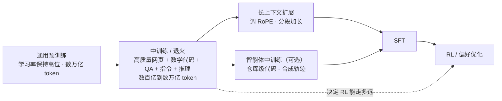
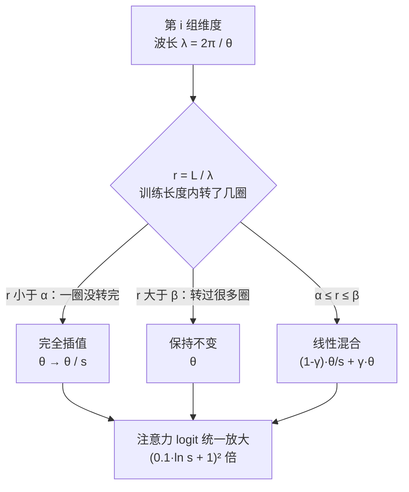

# Mid-training：给后训练打地基

::: tldr
- 中训练的目标仍是下一个 token 的交叉熵，变的只有数据和学习率：配比向后训练靠拢但保留通用网页，学习率进入衰减。
- 衰减期是参数“落定”的窗口，这段喂什么模型就往哪边靠；但 WSD 胜在灵活而非损失更低，调度要看后训练之后的指标来选。
- 配比的趋势是把后训练要用的格式都先喂一点：Olmo 3 的中训练里代码、数学各占两成，QA、指令与思维链合计近三成。
- 长上下文分段扩：先调 RoPE（调大基频或用 YaRN），每段混入约四成短数据，用 SFT 之后的长文任务验收。
- 如果只读一节：读[面向 RL 的中训练](#rl-readiness)——同一套 RL 在不同基座上效果悬殊，根源多在中训练。
:::

**中训练（mid-training）**指主体预训练之后、SFT 与 RL 之前的一段继续训练：目标仍是下一个 token 的交叉熵，但换成规模中等、面向目标能力的高质量数据配比，通常伴随学习率退火、上下文扩展与模型汤。它决定了后训练的起点——base 模型会什么、以什么格式会、能读多长。

::: human
预训练像“读完整座图书馆”，后训练像“针对考试刷题”。中训练是两者之间的“考前总复习”：换上精选教材、放慢节奏把知识沉淀下来，顺便把阅读范围拉长。复习得好，刷题事半功倍。
:::

## 定义与边界 {#definition}

形式上，中训练与预训练优化的是同一个目标，变的只有数据分布和学习率：

$$
\mathcal L_{\text{mid} }(\theta)=-\,\E_{x\sim\mathcal D_{\text{mid} } }\Bigl[\sum_{t}\log\pi_\theta(x_t\mid x_{\lt t})\Bigr],\qquad
\mathcal D_{\text{mid} }=\sum_k w_k\,\mathcal D_k
$$

$x$ 是一段训练文本，$x_{\lt t}$ 是它的前缀；$\mathcal D_k$ 是各数据源（高质量网页、代码、数学、QA、指令、推理轨迹……），$w_k$ 是<Term t="data-mixture">数据配比</Term>。几个常被混用的说法，边界如下：

| 说法 | 典型数据 | 学习率 | 主要目的 | 例子 |
|---|---|---|---|---|
| 退火 / 冷却 | 预训练末段，常换成更高质量的配比 | 降到很小或 0 | 收敛，把最后的数据“刻进去” | Llama 3 最后 40M token |
| 中训练 | 通用 + 专门数据混合，常含指令与推理格式 | 通常随退火下降 | 为后训练准备能力与格式 | OLMo 2、Olmo 3、SmolLM3 |
| 继续预训练 | 以目标领域或新数据为主 | 常需重新预热 | 补领域、语言或新行为 | Agentic CPT、SwallowCode 实验 |
| 领域适配 | 单一领域语料 | 视情况而定 | 得到专用模型 | 医学、法律模型 |

GLM-4.5 报告给了一个务实的定义：预训练之后那些“使用中等规模、领域特定数据（包括指令数据）”的训练阶段，统称中训练[^glm45]。CMU 的研究者把它描述为“在预训练末尾混入更高质量、常为指令格式的数据”[^bridges]。两种说法的共同点是：**数据分布向后训练靠拢，但仍保留通用数据，仍用语言建模目标**。

::: human
<Term t="continued-pretraining">继续预训练</Term>像“转专业”：只读新专业的书，容易把原来学的忘掉；中训练像“考前复习”：新旧内容一起读，重点向考试倾斜。
:::

## 在流水线中的位置 {#pipeline}

输入通常是一个稳定期检查点（学习率仍在高位），输出是交给 SFT 与 RL 的 base 模型。各家在三件事上的安排不同：

- **顺序**：Olmo 3 先中训练再扩长上下文；SmolLM3 先扩长上下文再做推理中训练[^olmo3][^smollm3]；GLM-4.5 把仓库级代码、合成推理、长上下文与智能体数据拆成三个递进阶段[^glm45]。
- **预算**：公开报告里从几十 B 到数 T token 不等——OLMo 2 7B 为 3×50B，Olmo 3 7B 为 100B（另加 50B 长上下文），Qwen3 的推理阶段约 5T，GLM-4.5 的中训练合计约 1.1T[^olmo2][^olmo3][^qwen3][^glm45]。
- **目标**：推理（数学、代码、思维链）、长上下文、智能体行为，或者三者兼顾。

## 学习率调度与退火 {#annealing}

### WSD：把“什么时候停”从开头解耦

余弦调度要求开训前就定好总步数，想多训一点就得从头再来。MiniCPM 提出的 <Term t="wsd">WSD</Term>（warmup–stable–decay）把训练显式拆成三段[^minicpm]：

$$
\eta(s)=\begin{cases}
\eta_{\max}\,\dfrac{s}{W}, & s\lt W\\[6pt]
\eta_{\max}, & W\le s\lt T\\[6pt]
\eta_{\max}\,f(s-T), & T\le s\le S
\end{cases}
$$

$s$ 是当前步数，$W$ 是预热结束步，$T$ 是稳定段结束步，$S$ 是总步数，$f$ 是从 1 单调下降的衰减函数（线性、余弦或指数均可）。论文的三个观察决定了后来的做法：

1. 一进入衰减段损失就**骤降**，最终与同长度的余弦调度持平甚至更低；
2. 衰减段约占总 token 的 **10%** 就够，2.5% 不够；
3. 稳定期检查点可以反复“分叉”：接着用高学习率训练，或随时衰减出一个成品。

第 3 点大幅降低了缩放律实验的成本：跑一条长的恒定学习率曲线，在不同位置做冷却，就得到不同训练长度的结果；EPFL 与 Hugging Face 的系统对比也表明“恒定 + 冷却”的表现可预测地与余弦相当[^cooldown]。工业界随之采用：Kimi K2 注明引用 MiniCPM，在 15.5T token 上用 WSD（10T 恒定 + 5.5T 余弦衰减），再接 400B token 退火与 60B token 的 32K 长上下文激活[^k2]；SmolLM3 在最后 10% 步数线性降到 0[^smollm3]。DeepSeek-V3 的曲线也是“长恒定 + 末段衰减”的形状：恒定学习率到 10T，再用 4.3T 余弦衰减，最后 500B 分两段常数[^dsv3]。

::: derive 为什么一降学习率，损失就骤降？
用最简单的模型看清机制。设一维二次损失 $\mathcal L(w)=\tfrac{h}{2}w^2$，随机梯度 $g_t=hw_t+\xi_t$，噪声 $\xi_t$ 零均值、方差 $\sigma^2$，且与 $w_t$ 独立。SGD 更新为

$$w_{t+1}=w_t-\eta g_t=(1-\eta h)\,w_t-\eta\,\xi_t .$$

记 $v_t=\E[w_t^2]$，交叉项因独立性为 0：

$$v_{t+1}=(1-\eta h)^2\,v_t+\eta^2\sigma^2 .$$

当 $0\lt\eta h\lt 2$ 时迭代收敛，令 $v_{t+1}=v_t$ 得稳态 $v^\star=\dfrac{\eta^2\sigma^2}{1-(1-\eta h)^2}=\dfrac{\eta\,\sigma^2}{h\,(2-\eta h)}$，于是

$$\E[\mathcal L]=\frac{h}{2}\,v^\star=\frac{\eta\,\sigma^2}{2\,(2-\eta h)}\approx\frac{\eta\,\sigma^2}{4}\qquad(\eta h\ll 1).$$

三个推论：

- **损失有一个与 $\eta$ 成正比的“噪声地板”**。稳定段里损失停在地板附近晃动；衰减把 $\eta$ 压小，地板随之下降——这就是衰减期的“骤降”。
- **衰减需要时间**。$v_t-v^\star$ 每步乘以 $(1-\eta h)^2\approx e^{-2\eta h}$，弛豫时间约 $1/(2\eta h)$ 步，$\eta$ 越小越慢。衰减段太短，参数来不及“落下去”，与“10% 够、2.5% 不够”的观察一致。
- **平均也能降地板**。若 $K$ 个结果独立地分布在同一极小值附近，平均后方差降为 $v^\star/K$。这给了下文“模型汤”一个直观解释。

真实损失面远非二次函数，这个推导只解释趋势，不给具体数值。
:::

### 退火期换数据：最后的 token 分量最重

既然衰减期是参数“落定”的阶段，这段时间喂什么就格外关键。MiniCPM 给出了一个干净的对照：同一个稳定期检查点，衰减期混入高质量数据与 SFT 数据、再做同样的 SFT，明显好于衰减期只用预训练数据、把 SFT 数据全留到最后；即使把后者的 SFT token 翻倍也补不回差距。作者据此主张：能力的专门化应当从衰减期就开始[^minicpm]。

Llama 3 把这件事做成了标准动作：405B 在最后 40M token 把学习率线性退火到 0，同时上采样质量最高的数据源，并对退火期间的检查点取平均，得到最终的 base 模型[^llama3]。报告还给了一个耐人寻味的对照：把 GSM8K 与 MATH 的训练集放进退火数据，8B 模型在两者验证集上分别提升 24.0% 与 6.4%，405B 却几乎不变——小模型更依赖“见过同类题”，大模型靠上下文学习已经够用。Llama 3 的正式退火数据则明确不含常用评测的训练集。

SmolLM3 的配比可以直接当模板：两段稳定期逐步引入 Stack-Edu、FineMath4+、MegaMath 等更高质量的代码与数学数据，衰减期把代码、数学上调到 24% 与 13%，并加入指令与推理数据[^smollm3]。

::: human
考前最后一周看什么，考场上就想起什么。所以最后一周要换成最好的复习资料，但不能把原题答案背进去——那样分数好看，本事没长。
:::

### 用短退火给数据做“体检”

退火对数据极敏感，这反过来成了评估数据的利器。Llama 3 的做法是：取一个训练到一半的 8B 检查点，用 40B token 把学习率线性退火到 0，新数据集占 30%、默认配比占 70%，再与只用默认配比的退火对比[^llama3]。这比为每个小数据集跑缩放律实验便宜得多。MiniCPM4 沿用同一思路（同样是 30% / 70%），在 1B 模型上把一次数据验证从约 1,200 GPU 时降到约 110 GPU 时[^minicpm4]；OLMo 仓库里则有一整套 microanneal 配置，逐个测试 TinyGSM-MIND、MathCoder2 合成数学、StackExchange 等候选数据源[^olmo2]。

### 模型汤：退火多跑几次再平均 {#soup}

同一个稳定期检查点、同一配比、只换数据顺序，几次退火的结果落在同一个盆地里，直接平均权重往往更好（对应上面推导中的 $v^\star/K$）。公开的<Term t="model-soup">模型汤</Term>做法有：

- **OLMo 2**：7B 用三个随机种子各退火 50B 再平均；13B 用 3×100B 加 1×300B 四次退火再平均[^olmo2]。
- **Olmo 3 32B**：两次独立的 100B 中训练结果取平均，长上下文阶段的最后三个检查点再平均一次[^olmo3]。
- **Llama 3**：退火期对检查点做 Polyak 平均[^llama3]。
- **SmolLM3**：推理中训练损伤了长上下文能力（RULER 下降），最后把偏好优化后的模型汤与一个长上下文强的中训练检查点按 0.9 / 0.1 线性合并，补回了 128K 以内的 RULER 分数[^smollm3]。

### 反方证据：衰减不是免费午餐

WSD 的核心价值是**灵活**，而不是一定更低的损失。三条值得认真对待的反例：

- **GLM-4.5** 早期实验发现，WSD 训练的模型在 SimpleQA、MMLU 等通用基准上更差，判断为稳定段欠拟合，于是改用余弦调度，学习率一路降到中训练结束；GLM-5 沿用了这一设置[^glm45][^glm5]。
- **Kimi K3** 为两种调度分别搜索最优超参（两者的最优峰值学习率与 batch 差别很大），在各自的最优设置下，余弦的最终损失始终低于 WSD，于是改以余弦为默认，不再沿用 K2 的 WSD[^k3]。
- **WSO**（warmup–stable–only，ICLR 2026）走得更远：在 1B 与 8B 的实验里，完全不衰减的调度在预训练指标上不如衰减调度，SFT 之后却一致更好；加入中训练阶段或做过量训练（over-training），结论依旧成立。作者用损失面曲率解释：衰减把模型推进更尖的极小值，不衰减则保持平坦、更容易被微调[^wso]。

::: insight 选调度看的是后训练之后的表现
衰减调度优化的是预训练损失，而真正要紧的是后训练之后的表现。选调度、定衰减长度时，至少要在一个小规模的“中训练 → SFT（→ RL）”闭环里比较最终指标；只看 base 模型的损失或 few-shot 分数，可能选错方向。
:::

## 数据：中训练到底喂什么 {#data}

中训练数据的主线可以概括为三步：**筛**（质量分类器）→ **改**（改写与合成）→ **配**（按目标能力调比例）。

### 筛：质量分类器

- **FineWeb-Edu**：让 Llama-3-70B-Instruct 给 50 万个网页样本打 0–5 分的“教育价值”，训练一个轻量回归分类器给 15T token 的 FineWeb 全量打分；保留下来的 1.3T token 在 MMLU、ARC 等知识与推理基准上显著优于其他开放语料[^fineweb]。
- **DCLM**：以 OpenHermes 2.5 与 ELI5 这类“指令 / 问答风格”的高质量文本为正样本训练 fastText 分类器，筛出的 DCLM-Baseline 让 7B 模型用 2.6T token 达到约 64% 的 MMLU[^dclm]。OLMo 2 中训练的网页部分，就是按 DCLM 分类器再筛出的高分子集（配置中标注为前 7%）[^olmo2]。
- **Nemotron-CC** 指出，这类激进过滤会丢掉约 90% 的数据，撑不起 15T 级别的训练；它用多个分类器集成分桶、减少启发式过滤，并对低质量数据做改写、对高质量数据做扩写，最终 6.3T token 的数据集在 MMLU 上与 DCLM 持平，独立真实 token 却多出 4 倍[^nemocc]。

<Term t="quality-classifier">质量分类器</Term>给出的是**排序**，不是真理。中训练预算小（几十到几百 B token），可以只取最高分的一小段；长训练则必须保量。

### 改：改写与合成 {#rephrasing}

高质量 token 不够用时，最直接的办法是多轮重复，但重复收益递减，还会过拟合。<Term t="rephrasing">改写</Term>把“重复”换成“换种说法再看一遍”：

| 做法（Kimi K2 早期检查点） | SimpleQA 准确率 |
|---|---|
| 原始维基文本，重复 10 轮 | 23.76 |
| 改写 1 次，重复 10 轮 | 27.39 |
| 改写 10 次，各训 1 轮 | 28.94 |

Kimi K2 的改写流水线有三个要点：按风格与视角多样化提示；长文分块、带着上文自回归地改写再拼接，避免丢信息；逐段做保真校验。推广到其他大规模知识语料时，每个语料最多改写两次。数学数据则仿照 SwallowMath 改写成“学习笔记”风格，并把其他语言的优质数学材料译成英文[^k2]。Kimi K3 沿用了同一套配方[^k3]。

其他几条典型路线：

- **合成为主**：Phi-4 预训练中合成数据占 40%（约 290B 独立 token，重复 13.8 轮）。实验发现，在合成数据上多跑几轮比换成新的网页 token 更利于推理；但纯合成模型在 TriviaQA 等知识题上明显落后、幻觉更多，所以仍保留 30% 的网页与网页改写[^phi4]。
- **改写后保留**：SwallowCode / SwallowMath 用 Llama-3.3-70B-Instruct 把 Stack-v2 的 Python 代码和 FineMath-4+ 重写成自包含、步骤清晰的版本；在 50B token 的继续预训练里，HumanEval 比 Stack-Edu 高 17.0，GSM8K 比 FineMath-4+ 高 12.4[^swallow]。
- **扩写成练习**：Nemotron-CC 为高质量文档生成多样 QA、知识抽取等<Term t="synthetic-data">合成数据</Term>[^nemocc]，Olmo 3 的中训练直接用了其中的合成 QA[^olmo3mix]。

::: insight 为什么改写有效：Physics of LMs 的机制解释
Allen-Zhu 与 Li 用可控的合成传记数据发现：一条知识如果在预训练里只以单一表述出现，模型能背出原句，却无法在问答中把它提取出来（准确率为 0%），事后的指令微调也救不回；只有预训练时见过多种改写、句序打乱的版本，知识才会“挂”在实体名的表示上，被线性探针读出。作者据此给出两条建议：用小模型改写预训练数据做知识增广；在“为时已晚”之前把更多指令数据混进预训练[^physics]。续作 Part 3.3 估计语言模型大约只能存 2 bit / 参数的知识，并发现给训练数据加上来源域名（如 wikipedia.org）能显著提高知识容量[^physics]。这些都是合成数据与中小模型上的结论，外推到大模型要谨慎。
:::

### 配：数学、代码、QA、指令与思维链

- **数学与代码是主菜**。MegaMath 汇集了 371B token 的开放数学语料（重新抽取的网页、数学相关代码与合成 QA）[^megamath]；OctoThinker 发现其 Web-Pro 子集能同时提升 base 与 RL 表现，FineMath-4+ 则不能[^octo]。Qwen3 的第二阶段约 5T token，专门上调 STEM、代码、推理与合成数据的比例，并加快学习率衰减[^qwen3]。
- **指令与推理格式要提前出现**。MiniCPM 在衰减期混入 SFT 数据[^minicpm]；OLMo 2 的 Dolmino 含 FLAN 与大量数学题[^olmo2]；SmolLM3 用 35B token 的推理轨迹训 4 轮（约 140B）做“推理中训练”[^smollm3]；Olmo 3 的中训练直接混入 R1、QwQ 等来源的思维链[^olmo3mix]。
- **通用数据不能停**。所有公开配方都保留相当比例的高质量网页，用来防遗忘、保知识。

### Olmo 3：一份可以逐项核对的配比 {#olmo3}

Olmo 3 7B 的官方脚本写明：5.93T token 预训练 → 100B token 中训练（序列长 8K，学习率线性降到 0）→ 50B token 长上下文[^olmo3]。OLMo-core 里还公开了 32B 中训练的来源配比，按类别汇总如下（dolma3 仓库中 7B 迭代到第 5 轮的配置，类别占比与之相同）[^olmo3mix]：

| 类别 | 占比 | 主要来源 |
|---|---|---|
| 高质量网页 | 22.5% | Common Crawl 高分子集，按主题分层采样 |
| STEM 定向爬取 | 5% | AI2 自爬的科学、教育类站点 |
| 代码 | 20% | Stack-Edu（FIM 格式）10%、CraneCode 10% |
| 数学 | 20% | CraneMath、合成数学、OpenMathReasoning 改写、MegaMatt |
| QA 与阅读理解 | 约 14% | Reddit 改写成问答卡片、Nemotron-CC 合成 QA、维基改写成阅读理解 |
| 思维链与元推理 | 7.5% | R1、QwQ、Gemini、Llama-Nemotron、OpenThoughts2 等推理轨迹 |
| 指令 | 6.1% | FLAN 5%，Tulu 3 SFT 数据约 1% |
| 高质量 PDF | 5% | olmOCR 解析的科学文献，按主题分层 |

表里的 CraneCode、CraneMath、MegaMatt 是 AI2 按 SwallowCode、SwallowMath 与 OctoThinker 的 MegaMath-Web-Pro-Max 配方，改用 Qwen 系模型重新生成的版本（原版用 Llama 生成，许可更严），可以看作这些配方被工业复用的直接证据。所有来源都先用 AI2 的 n-gram <Term t="decontamination">去污染</Term>工具 decon 滤掉了 MMLU、GSM8K 等评测内容。这份配比也说明了一个趋势：到 2025 年下半年，中训练已经从“多放点数学”演化为**把后训练需要的每种格式都预先喂一点**。

## 长上下文扩展 {#long-context}

### RoPE 为什么不能直接外推

<Term t="rope">RoPE</Term> 把每个注意力头的 $d$ 维向量两两分组旋转：第 $i$ 组（$i=0,\dots,d/2-1$）在位置 $m$ 旋转角度 $m\theta_i$，其中

$$\theta_i=b^{-2i/d},\qquad \lambda_i=\frac{2\pi}{\theta_i}=2\pi\,b^{2i/d}.$$

$b$ 是基频（常取 10000），$\lambda_i$ 是这组维度转一整圈需要的 token 数（波长）。query 在位置 $m$、key 在位置 $n$ 时，内积只依赖相对角度 $(m-n)\theta_i$。问题出在低频维度：以 $b=10000$、$d=128$、训练长度 $L=4096$ 为例，64 组维度里有 18 组的波长超过 4096——训练中它们连一圈都没转完。推理时位置一旦超过 $L$，这些维度就会出现从没见过的角度，注意力随之失常。

::: human
RoPE 像钟表上一组转速不同的指针。秒针（高频）在训练里早已转过成百上千圈，什么角度都见过；时针（低频）可能半圈都没走完。直接让模型读更长的文本，时针就会指向它从没见过的位置。
:::

### 三类改法：插值、调基频、YaRN {#yarn}

- **位置插值（PI）**：把位置压缩回训练范围，$m\mapsto m\,L/L'$。所有维度一视同仁，高频维度也被压扁，相邻 token 更难区分。
- **调大基频（<Term t="abf">ABF</Term>）**：把 $b$ 调大，让所有维度都转得更慢。简单有效，也最常见：Qwen2.5、Qwen3 与 GLM-4.5 在扩到 32K 时把 $b$ 从 $10^4$ 调到 $10^6$[^qwen25][^qwen3][^glm45]；Phi-4 调到 250K[^phi4]；ProLong 在 64K 与 512K 阶段分别用 $8\times10^6$ 与 $1.28\times10^8$[^prolong]。
- **<Term t="yarn">YaRN</Term>**：按波长区别对待每组维度[^yarn]。设扩展倍数 $s=L'/L$、比值 $r_i=L/\lambda_i$（即训练长度内这组维度转了几圈），用斜坡函数决定插值程度：

$$
\gamma(r)=\begin{cases}0, & r\lt\alpha\\[2pt] 1, & r\gt\beta\\[2pt] \dfrac{r-\alpha}{\beta-\alpha}, & \text{其他}\end{cases}
\qquad
\theta_i'=\bigl(1-\gamma(r_i)\bigr)\frac{\theta_i}{s}+\gamma(r_i)\,\theta_i .
$$

转不满一圈（$r\lt\alpha$）的低频维度完全插值；转过很多圈（$r\gt\beta$）的高频维度保持原样；中间线性过渡。此外，上下文变长后注意力分布会变“平”，YaRN 再给 logit 乘一个温度系数：

$$
\operatorname{softmax}\!\Bigl(\frac{\mathbf q_m^{\top}\mathbf k_n}{t\sqrt{d} }\Bigr),\qquad \sqrt{1/t}=0.1\ln s+1 .
$$

Llama 系推荐 $\alpha=1$、$\beta=32$；微调只需约 0.1% 的预训练 token（论文中为 400 步）[^yarn]。

::: derive 代入数字：Llama 形状的模型与 DeepSeek-V3
**分组**。取 $b=10000$、$d=128$、$L=4096$。$r_i\lt 1$ 等价于 $\lambda_i\gt L$，即 $2\pi\cdot 10^{i/16}\gt 4096$，解得 $i\ge 46$：18 组完全插值。$r_i\gt 32$ 等价于 $\lambda_i\lt 128$，解得 $i\le 20$：21 组保持不变。其余 25 组（$i=21,\dots,45$）按斜坡混合。实现上有个细节：官方代码（jquesnelle/yarn，以及 DeepSeek-V3 的 inference/model.py）先把 $r=\beta$、$r=\alpha$ 换算成维度下标（向下、向上取整后正好是 20 和 46），再在两者之间按下标 $i$ 线性过渡，而不是按 $r$ 线性过渡。三段的划分与上面一致，只是中间各组的混合权重略有不同；论文脚注也说明斜坡可以换成别的形式。

**温度**。DeepSeek-V3 取 $s=40$、$\alpha=1$、$\beta=32$；频率插值只作用在 MLA 解耦出来的 64 维 RoPE 分量上，温度缩放则乘在整个注意力 logit 上[^dsv3]。此时 $0.1\ln 40+1\approx1.369$，logit 被放大约 $1.369^2\approx1.87$ 倍；官方推理代码正是把 softmax 缩放乘以这个系数的平方。按同一公式，$s=8$（例如 8K 扩到 64K）时放大约 $1.208^2\approx1.46$ 倍。

**为什么是放大而不是缩小**。上下文变长后参与 softmax 的 key 更多，注意力熵上升、分布变平；放大 logit 相当于降低温度，把注意力重新“聚焦”。
:::

### 分阶段扩展：谁怎么扩

多数团队不一步到位，而是分段加长，每段都混入短数据：

| 模型 | 扩展路径与预算 | 位置编码 | 要点 |
|---|---|---|---|
| Llama 3 405B | 六段 8K→128K，约 800B token | RoPE base 500K | 每段验收：短文本评测完全恢复，目标长度大海捞针全对[^llama3] |
| DeepSeek-V3 | 4K→32K→128K，各 1000 步 | YaRN，s = 40 | V3.1 把两段分别加到 630B 与 209B token[^dsv3][^dsv31] |
| Qwen2.5-Turbo | 32K→64K→128K→256K | base 10M | 每段 40% 为当前最大长度，60% 更短[^qwen25] |
| Qwen3 | 数千亿 token，32K | base 1M，推理期加 YaRN 与 DCA | 75% 样本 16K–32K，25% 为 4K–16K[^qwen3] |
| Kimi K2 | 退火 400B（4K）→ 60B（32K） | YaRN 扩到 128K | 长上下文“激活”与退火连在一起[^k2] |
| SmolLM3 | 4K→32K→64K，各 50B | θ 1.5M → 5M；每 4 层有 1 层 NoPE | 额外上采样代码仓库、书籍等长数据没有收益[^smollm3] |
| Olmo 3 7B | 8K→64K，50B | YaRN，s = 8 | 文档内注意力掩码[^olmo3] |
| GLM-5 | 32K（1T）→128K（500B）→200K（50B） | — | 200K 阶段让 128K 以内的表现也提升[^glm5] |
| Kimi K3 | 预训练 8K→64K，冷却期 256K→1M | MLA 层 NoPE，位置信息靠 KDA 层 | 合成必须跨全窗口检索才能完成的任务[^k3] |

### ProLong 的消融：长上下文训练的五条规矩

普林斯顿的 ProLong 从 Llama-3-8B-Instruct 出发，用 40B token（64K 与 512K 两个阶段各 20B）训出 512K 上下文的模型，并把每个设计都做了对照[^prolong]：

1. **评测要看 SFT 之后的下游任务**（HELMET），困惑度和大海捞针都会误导；
2. **长数据首选代码仓库与书籍**；
3. **必须混短数据**：64K 阶段的配比是代码仓库 30%、书籍 30%，其余 40% 是 FineWeb-Edu、FineWeb、StackExchange、维基、数学与教材等高质量短数据；
4. **训练长度超过评测长度有益**；
5. **SFT 只用短指令数据就够**，不必合成长指令数据。

几份工业报告从不同角度印证了这些结论：Phi-4 发现天然长文档优于把短样本拼接凑长[^phi4]；GLM-5 的 200K 阶段让 128K 以内也变好[^glm5]；Kimi K3 强调“长度本身不等于长程能力”，专门合成只有跨全窗口检索才能完成的任务[^k3]。

## 面向 RL 的中训练 {#rl-readiness}

### 同一套 RL，为什么 Llama 不涨、Qwen 涨

2025 年上半年的一个普遍现象：同样的 <Term t="rlvr">RLVR</Term> 配方，在 Qwen2.5 上稳定提升，在 Llama 上常常原地踏步。几条解释互相补充：

- **行为先验**：Qwen 基座本身就会验证、回溯、设子目标，Llama 缺少这些“认知行为”；用富含这些行为的数据继续预训练，Llama 就能追上（见[原理视角：认知行为](/lenses/principles#cognitive-behaviors)）。
- **数据先验**：Qwen2.5 在预训练与退火期见过海量数学与代码，RL 更多是在放大已有能力。连随机奖励都能让 Qwen2.5-Math 涨分，换到 Llama 就无效（见[伪奖励](/library/?id=spurious-rewards)）。
- **污染疑虑**：部分增益可能来自预训练阶段见过评测原题（见 [Reasoning or Memorization](/library/?id=reasoning-or-memorization)；两种解释之争见[原理视角](/lenses/principles#spurious-rewards)）。比较 RL 友好度时要用模型发布后才出现的新题。

结论是：**RL 能走多远，很大程度上在中训练就定了**。这也是[“RL 是否扩展了 base 模型的能力边界”](/lenses/principles#pass-at-k-debate)之争在数据侧的对应。

### OctoThinker：用中训练把 Llama 变得“RL 友好”

OctoThinker 在 Llama-3.2 上系统比较了中训练配方对后续 RL 的影响，得出四条结论[^octo]：

1. **数学语料的质量是前提**：MegaMath-Web-Pro 同时提升 base 与 RL 表现，FineMath-4+ 不行；
2. **QA 格式的推理数据有增益**，尤其是长 CoT 样本，加入指令数据会进一步放大这一效果；
3. **长 CoT 是双刃剑**：推理更深，但回复变冗长、RL 训练不稳，数据格式需要仔细设计；
4. **中训练越多，RL 越好**：扩大中训练 token 数带来一致的下游 RL 提升。

据此提出 **Stable-then-Decay**：先用恒定学习率训 200B token，再分出短 CoT、长 CoT、混合三个分支，各用 20B token 衰减学习率，得到 OctoThinker 系列。RL 之后，它们明显缩小了与同尺寸 Qwen2.5 的差距。团队同时开源了 70B+ token 的 MegaMath-Web-Pro-Max；AI2 按同样的提示词在 MegaMath-Web-Pro 上重新生成了一份（MegaMatt），放进 Olmo 3 的中训练配比[^olmo3mix]。

::: human
RL 更像“挑选并强化”已有的解题习惯，而不是凭空教会新本事。中训练就是在 RL 之前把好习惯种下去；种得越好，RL 能放大的东西越多。
:::

### 推理数据该放多早

NVIDIA 等的 Front-Loading Reasoning 从零训练 8B 模型 1T token，在固定推理数据预算下比较“放进预训练”与“留给后训练”[^front]：

- 前置到预训练带来 **19%** 的平均增益，且后续 SFT 即使加更多数据也补不回；
- **不对称原则**：预训练阶段更吃推理数据的**多样性**（11%），SFT 阶段更吃**质量**（15%）；
- 高质量数据放在预训练里有**潜伏效应**：base 模型上看不出，SFT 之后才显现；
- 盲目扩大 SFT 数据可能**冲掉**前期注入推理数据的收益。

CMU 的另一组受控实验得出了相近的结论：RL 只在预训练留有余量、且 RL 数据落在模型能力边缘时才带来真实增益，同等算力下“中训练 + RL”优于只做 RL（见[预训练、中训练与 RL 的相互作用](/library/?id=interplay-pt-mt-rl)）。

### 为什么有效：分布桥接

CMU 的 Midtraining Bridges 用从零预训练的小模型做控制实验，把中训练解释为预训练分布与后训练分布之间的“桥”[^bridges]：

- **收益在数学与代码上最大**：这两类数据与通用网页的“句法差距”最大，中训练最能缩小它；
- 与只用专门数据继续预训练相比，中训练的**域内损失更低，后训练之后遗忘更少**；
- **时机比比例更重要**：同样的代码数据，越早引入越好，也更能保住通用的语言建模能力。

### 智能体中训练 {#agentic}

同样的逻辑延伸到智能体：与其让 RL 同时学“怎么当智能体”和“怎么做对”，不如先用语言建模目标把智能体行为“预习”一遍。

- **AgentFounder / Tongyi DeepResearch**：两阶段的智能体继续预训练，先 32K 再 128K；以实体为锚构建开放世界记忆来合成多风格问题，再合成规划、推理、决策三类动作数据；全程穿插少量通用预训练数据防遗忘，环境扩展得到的函数调用数据也放进中训练[^agentfounder]。AgentFounder-30B 在 BrowseComp-en / zh 上达到 39.9% / 43.3%。
- **GLM-4.5**：中训练分三段——仓库级代码（同仓库文件拼接，外加 issue、PR 与 commit，500B token，32K）、合成推理数据（500B）、长上下文与智能体轨迹（100B，128K）；只在中训练使用 best-fit packing，避免截断推理过程与仓库代码[^glm45]。GLM-5 把这套框架扩到约 1000 万个 issue–PR 对（约 160B 独立 token）和 200K 上下文[^glm5]。
- **FIM 中训练**（2026）：把函数调用点看作“行动→观察→继续”的同构结构，用程序依赖图挑选函数挖空，让模型先写推理再补全；接上 R2E-Gym、SWE-smith、SWE-Lego 三条原样的后训练流水线，SWE-bench Verified 提升 2.8–5.3 分，并挽回部分通用能力损失[^fim]。
- **中训练里的蒸馏**（2026）：以 OLMo-2 1B 为学生、7B 为教师，发现中训练阶段的<Term t="knowledge-distillation">知识蒸馏</Term>以事实召回换推理；只把教师熵最低的 20% token 交给反向 KL 的 Switch Distillation 能兼顾两者[^kd]。这把中训练和 [On-Policy 蒸馏](/topics/opd)连在了一起。

## 谁在中训练里做了什么 {#who}

把 13 份有公开技术报告或官方配置可核对的配方放在一起，能看出三个规律：**预算越来越大**（从几十 B 到 T 级）；**数据越来越像后训练**（从“更好的网页”到指令、思维链、智能体轨迹）；**长上下文越来越长、越来越靠后**（放进退火或冷却期，与能力数据一起训练）。

::: details 展开对照表：阶段、预算、学习率与数据（数字以原始报告为准）

| 工作 | 阶段与预算 | 学习率 | 数据与关键做法 |
|---|---|---|---|
| MiniCPM（2024-04） | 稳定期约 1T → 衰减期（约占 10%）→ SFT | WSD，指数衰减 | 衰减期混入高质量与 SFT 数据[^minicpm] |
| Llama 3 405B（2024-07） | 长上下文六段约 800B → 最后 40M 退火 | 余弦 → 线性降到 0 | 退火上采样最优数据、平均检查点；短退火评估新数据[^llama3] |
| OLMo 2（2024-11） | 7B：3×50B；13B：3×100B + 1×300B | 线性降到 0 | Dolmino Mix 1124：DCLM 高分网页、FLAN、学术文本、合成数学；模型汤[^olmo2] |
| Phi-4（2024-12） | 约 10T → 250B 中训练 | 峰值降为 1/10 | 4K→16K；30% 新长文本 + 70% 回放[^phi4] |
| DeepSeek-V3（2024-12） | 14.8T，末 500B 两段常数 → YaRN 两段各 1000 步 | 恒定 → 余弦 → 分段常数 | 整体预训练语料上调数学与代码比例；4K→32K→128K[^dsv3] |
| OctoThinker（2025-04） | Llama-3.2 上 200B 恒定 + 20B 衰减 | Stable-then-Decay | MegaMath-Web-Pro、QA 式 CoT、指令数据[^octo] |
| Qwen3（2025-05） | 30T+ → 推理阶段约 5T → 长上下文数千亿 | 推理阶段加快衰减 | 上调 STEM、代码、推理与合成数据[^qwen3] |
| Kimi K2（2025-07） | 15.5T → 退火 400B + 长上下文 60B | WSD，退火 2e-5 → 7e-6 | 知识与数学改写；YaRN 扩到 128K[^k2] |
| GLM-4.5（2025-07） | 15T + 7T → 中训练 500B + 500B + 100B | 余弦，降到 2.5e-5 | 仓库级代码、合成推理、长上下文与智能体轨迹[^glm45] |
| SmolLM3（2025-07） | 约 11T → 长上下文 100B → 推理 140B | WSD，末 10% 降到 0 | 衰减期代码 24%、数学 13%；模型合并补长文能力[^smollm3] |
| Olmo 3 7B（2025-11） | 5.93T → 中训练 100B → 长上下文 50B | 线性降到 0 | 数学、代码、QA、指令、思维链，全部去污染[^olmo3] |
| GLM-5（2026-02） | 27T → 32K（1T）→ 128K（500B）→ 200K（50B） | 中训练 4e-5 线性降到 1e-5 | 约 1000 万 issue–PR 对；后期上采样长文档与智能体轨迹[^glm5] |
| Kimi K3（2026-07） | 预训练 8K→64K → 冷却期 256K→1M | 余弦（对照中优于 WSD） | 沿用 K2 改写；NoPE，无需改位置编码[^k3] |

:::

## 演化脉络 {#lineage}

<LineageGraph graph="mid-training" />

这条线大致分三步。2023–2024 年上半年，中训练还只是两个独立的“技巧”：WSD 与退火让“最后换数据”变得可行，YaRN 与 ABF 让“事后扩长”变得便宜。2024 年下半年，数据工程成为主角：FineWeb-Edu、DCLM 把质量筛选做成标准工序，Nemotron-CC、Phi-4 把改写与合成推到万亿 token 级，OLMo 2 把一次完整、可复现的中训练公开出来。2025 年起，焦点转向“为后训练铺路”：OctoThinker、Front-Loading、Midtraining Bridges 从不同角度说明 RL 与 SFT 的上限在中训练就被决定，AgentFounder、GLM-4.5 则把智能体行为也搬进了中训练。到 2026 年，一方面 1M 上下文与智能体数据进入旗舰模型的中训练配方，另一方面 Kimi K3 与 WSO 开始质疑“衰减一定好”，调度的选择回到以后训练结果为准。

## 关键工作精读 {#papers}

### 学习率与退火

<EntryGrid :ids="['minicpm', 'llama3', 'olmo2', 'olmo3', 'smollm3', 'cooldown-scaling']" />

- **MiniCPM**：WSD 的出处，更重要的是“衰减期就开始专门化”这条对照结论；实验在小模型上完成，但被 Kimi K2、GLM-4.5 等工业报告引用或作为对照。
- **Llama 3**：把退火、检查点平均、短退火评估数据和分段扩长写成了可照做的工序，是理解工业中训练的第一份读物。
- **OLMo 2 / Olmo 3**：公开得最彻底的中训练之一。配置、数据清单、去污染工具全部公开，适合作为自己搭配比的起点。
- **SmolLM3**：小模型的全流程手册，最有价值的是“推理中训练伤长文、用模型合并修复”这段踩坑记录。
- **冷却与缩放律**：WSD 做缩放律实验的方法论依据，读它能明白为什么“一条长跑 + 多个冷却分支”是省钱做法。

### 数据

<EntryGrid :ids="['fineweb', 'dclm', 'nemotron-cc', 'phi-4', 'swallowcode-math', 'megamath', 'physics-of-lms']" />

- **FineWeb-Edu 与 DCLM**：两种质量分类器范式（大模型打分蒸馏 vs 指令风格正样本），SmolLM3、OLMo 2 等开放配方的网页主干都来自它们。
- **Nemotron-CC**：长训练预算下“保量”的答案，也是“改写救回低质量数据”的大规模证据。
- **Phi-4**：合成数据能复用多少轮、纯合成会伤什么，这两个问题最直接的公开答案。
- **SwallowCode / SwallowMath**：“改写后保留”的代码与数学版本；Kimi K2 采用了它的数学改写方法，Olmo 3 按它的流程复刻出 CraneCode 与 CraneMath。
- **MegaMath**：开放数学语料的主力，也是 OctoThinker 结论的数据基础。
- **Physics of LMs 3.1**：为改写与“早放指令数据”提供机制解释；注意它是合成数据上的受控实验。

### 长上下文

<EntryGrid :ids="['yarn', 'prolong', 'deepseek-v3']" />

- **YaRN**：开源长上下文模型最常用的 RoPE 扩展方法之一（DeepSeek-V3、Qwen 系列、Kimi K2、Olmo 3 都在用），推导值得亲手算一遍。
- **ProLong**：长上下文“怎么配数据、怎么评测”最系统的消融，结论可以直接照做。
- **DeepSeek-V3**：两段 YaRN、学习率沿用预训练末值，是“低成本事后扩长”的工业范例。

### 面向后训练

<EntryGrid :ids="['octothinker', 'front-loading-reasoning', 'midtraining-bridges', 'agentfounder', 'fim-midtraining', 'kd-midtraining']" />

- **OctoThinker**：把“为什么 RL 在某些 base 上不涨”变成了可操作的中训练配方，必读。
- **Front-Loading Reasoning** 与 **Midtraining Bridges**：一个从数据分配、一个从分布差距解释中训练为何有效，二者结论互相印证。
- **AgentFounder**：智能体中训练的代表作，已在 Tongyi DeepResearch 中落地。
- **FIM 中训练**与**中训练蒸馏**：2026 年的新方向，前者把代码结构变成智能体先验，后者提醒蒸馏在中训练阶段有取舍；都还需要外部复现。

相关的工业报告（由其他专题收录）：

<EntryGrid :ids="['kimi-k2', 'qwen3', 'glm-4-5', 'glm-5', 'kimi-k3', 'tongyi-deepresearch']" />

## 可执行结论 {#takeaways}

::: takeaway
1. **先搭评估闭环再调配方**：用“中训练 → 小规模 SFT（→ RL）”的探针比较方案，别只看 base 模型的损失或 few-shot 分数。
2. **把衰减期当作中训练窗口**：从稳定期检查点出发，用约 10% 的 token（几十到几百 B）切到目标配比、学习率降到 0 或很低；预算允许就换几个数据顺序各跑一遍再做模型汤。
3. **配比从 Olmo 3 起步**：网页（含定向爬取与 PDF）约三成，代码、数学各两成，QA、指令与思维链合计近三成；每个新数据源先做“30% 新数据 + 70% 默认配比”的短退火体检再决定去留。
4. **高质量数据宁改写、勿重复**：知识类语料换风格、换视角改写（每份一到两次并做保真校验）；代码与数学“改写后保留”。
5. **长上下文分段扩**：先调 RoPE（ABF 或 YaRN），每段保留约四成短数据；验收看短文本能力是否恢复、SFT 后长文任务是否达标。
6. **为 RL 铺路**：中训练就放入多样的推理数据与少量指令格式数据，控制长 CoT 比例；智能体方向可以先做一段智能体继续预训练。
:::

## 常见坑 {#pitfalls}

::: pitfall 评测泄漏
中训练里的数学题与合成 QA 最容易混入评测原题。所有中训练数据都要做 n-gram 级去污染（如 AI2 的 decon），退火数据里不放常用评测的训练集；比较不同 base 的 RL 友好度时，用模型发布后才出现的新题。
:::

::: pitfall 过拟合“像评测”的数据
小模型对同类题格外敏感：Llama 3 8B 退火时见过 GSM8K、MATH 训练集就大幅涨分，405B 几乎不变。分数上涨可能只是格式与题型的记忆，要用分布外的题目复核。
:::

::: pitfall 遗忘与能力互相干扰
只用专门数据继续预训练会遗忘通用能力，要保留通用数据回放（Phi-4 的长上下文阶段回放占 70%）。不同的中训练目标也会互相伤害：SmolLM3 的推理中训练拖垮了长上下文。每做完一个阶段，都要复测前面各阶段的能力。
:::

::: pitfall 只看预训练损失选调度
衰减越彻底，预训练损失越低，但 WSO 的实验显示 SFT 之后反而可能更差；GLM-4.5 与 Kimi K3 的对照又说明 WSD 并非总优于余弦。以后训练结果为准。
:::

::: pitfall 长 CoT 与纯合成数据过量
长 CoT 比例过高会让 RL 阶段回复冗长、训练不稳（OctoThinker）；纯合成数据会削弱知识类能力、增加幻觉（Phi-4）。两者都要与真实数据、短答案数据混合。
:::

::: pitfall 长上下文只测大海捞针
大海捞针和困惑度很容易刷满，却和真实长文能力相关性差。用 HELMET、RULER 这类任务，并在 SFT 之后评估。
:::

## 延伸阅读 {#further}

- 资料库筛选：[Mid-training 全部条目](/library/?area=mid-training)、[中训练数据相关](/library/?area=mid-training&facet=data)
- 下游专题：[SFT 监督微调](/topics/sft)、[LLM 强化学习](/topics/rl-for-llm)、[Agentic RL](/topics/agentic-rl)、[On-Policy 蒸馏](/topics/opd)
- 横切视角：[数据工作流](/lenses/data)、[评测与污染](/lenses/eval#contamination)、[遗忘与能力边界](/lenses/principles#forgetting)

[^minicpm]: Hu et al., “MiniCPM: Unveiling the Potential of Small Language Models with Scalable Training Strategies”, §4–5, COLM 2024. [arXiv:2404.06395](https://arxiv.org/abs/2404.06395)
[^cooldown]: Hägele et al., “Scaling Laws and Compute-Optimal Training Beyond Fixed Training Durations”, NeurIPS 2024. [arXiv:2405.18392](https://arxiv.org/abs/2405.18392)
[^llama3]: Llama Team, “The Llama 3 Herd of Models”, §3.1.3（退火数据）、§3.4（长上下文与退火）. [arXiv:2407.21783](https://arxiv.org/abs/2407.21783)
[^minicpm4]: MiniCPM Team, “MiniCPM4: Ultra-Efficient LLMs on End Devices”，数据验证策略一节与表 1（报告 PDF 见 [OpenBMB/MiniCPM](https://github.com/OpenBMB/MiniCPM) 仓库 docs/MiniCPM_4_Technical_Report.pdf）。
[^olmo2]: Team OLMo, “2 OLMo 2 Furious”, [arXiv:2501.00656](https://arxiv.org/abs/2501.00656)；stage 2 与模型汤配置见 [allenai/OLMo](https://github.com/allenai/OLMo) 的 README 与 configs/official-1124、configs/microannealing。
[^olmo3]: Team Olmo, “Olmo 3”, [arXiv:2512.13961](https://arxiv.org/abs/2512.13961)；官方训练脚本与各阶段 token 数见 [allenai/OLMo-core](https://github.com/allenai/OLMo-core) 的 src/scripts/official/OLMo3。
[^olmo3mix]: [allenai/OLMo-core](https://github.com/allenai/OLMo-core) 的 src/olmo_core/data/source_mixtures/OLMo3-32B-midtraining-modelnamefilter.yaml 与 src/olmo_core/data/mixes/OLMo-midtraining-mix-0625-100B.txt；[allenai/dolma3](https://github.com/allenai/dolma3) 的 datasets/configs/midtraining（各轮配置）、datasets/dolma3_dolmino_mix（CraneCode、CraneMath、MegaMatt 说明）与 procedures/decontamination。按类别汇总为本站计算。
[^phi4]: Abdin et al., “Phi-4 Technical Report”, §3（数据配比表与中训练细节）. [arXiv:2412.08905](https://arxiv.org/abs/2412.08905)
[^dsv3]: DeepSeek-AI, “DeepSeek-V3 Technical Report”, §4.1–4.3. [arXiv:2412.19437](https://arxiv.org/abs/2412.19437)；YaRN 参数见 [deepseek-ai/DeepSeek-V3](https://github.com/deepseek-ai/DeepSeek-V3) inference/model.py。
[^dsv31]: DeepSeek-V3.1 模型卡. [huggingface.co/deepseek-ai/DeepSeek-V3.1](https://huggingface.co/deepseek-ai/DeepSeek-V3.1)
[^qwen25]: Qwen Team, “Qwen2.5 Technical Report”, §3.3. [arXiv:2412.15115](https://arxiv.org/abs/2412.15115)
[^qwen3]: Qwen Team, “Qwen3 Technical Report”, §3.2. [arXiv:2505.09388](https://arxiv.org/abs/2505.09388)
[^k2]: Kimi Team, “Kimi K2: Open Agentic Intelligence”, §2.2（改写）、§2.5（训练配方）. [arXiv:2507.20534](https://arxiv.org/abs/2507.20534)
[^k3]: Kimi Team, “Kimi K3: Open Frontier Intelligence”, §3（数据、缩放律与长上下文扩展）. [arXiv:2607.24653](https://arxiv.org/abs/2607.24653)
[^glm45]: GLM-4.5 Team, “GLM-4.5: Agentic, Reasoning, and Coding (ARC) Foundation Models”, §2.3–2.4. [arXiv:2508.06471](https://arxiv.org/abs/2508.06471)
[^glm5]: GLM-5 Team, “GLM-5: from Vibe Coding to Agentic Engineering”, §2.3 与附录 A. [arXiv:2602.15763](https://arxiv.org/abs/2602.15763)
[^smollm3]: Hugging Face, “SmolLM3: smol, multilingual, long-context reasoner”（2025-07-08）. [huggingface.co/blog/smollm3](https://huggingface.co/blog/smollm3)；各阶段训练配置见 [huggingface/smollm](https://github.com/huggingface/smollm) 的 text/pretraining/smollm3。注意 4K→32K 阶段的 RoPE θ 在公开配置里是 2M，博客写的是 1.5M。
[^wso]: Yano et al., “Pre-training LLM without Learning Rate Decay Enhances Supervised Fine-Tuning”, ICLR 2026. [arXiv:2603.16127](https://arxiv.org/abs/2603.16127)
[^fineweb]: Penedo et al., “The FineWeb Datasets: Decanting the Web for the Finest Text Data at Scale”. [arXiv:2406.17557](https://arxiv.org/abs/2406.17557)
[^dclm]: Li et al., “DataComp-LM: In search of the next generation of training sets for language models”. [arXiv:2406.11794](https://arxiv.org/abs/2406.11794)；分类器说明见 [mlfoundations/dclm](https://github.com/mlfoundations/dclm)。
[^nemocc]: Su et al., “Nemotron-CC: Transforming Common Crawl into a Refined Long-Horizon Pretraining Dataset”. [arXiv:2412.02595](https://arxiv.org/abs/2412.02595)
[^swallow]: Fujii et al., “Rewriting Pre-Training Data Boosts LLM Performance in Math and Code”, ICLR 2026. [arXiv:2505.02881](https://arxiv.org/abs/2505.02881)；[rioyokotalab/swallow-code-math](https://github.com/rioyokotalab/swallow-code-math)
[^physics]: Allen-Zhu & Li, “Physics of Language Models: Part 3.1, Knowledge Storage and Extraction”, ICML 2024, [arXiv:2309.14316](https://arxiv.org/abs/2309.14316)；“Part 3.3, Knowledge Capacity Scaling Laws”, [arXiv:2404.05405](https://arxiv.org/abs/2404.05405)。
[^megamath]: Zhou et al., “MegaMath: Pushing the Limits of Open Math Corpora”, COLM 2025. [arXiv:2504.02807](https://arxiv.org/abs/2504.02807)
[^yarn]: Peng et al., “YaRN: Efficient Context Window Extension of Large Language Models”, §2–4, ICLR 2024. [arXiv:2309.00071](https://arxiv.org/abs/2309.00071)
[^prolong]: Gao et al., “How to Train Long-Context Language Models (Effectively)”. [arXiv:2410.02660](https://arxiv.org/abs/2410.02660)；配比与 RoPE 设置见 [princeton-nlp/ProLong](https://github.com/princeton-nlp/ProLong) 的 train_64K.sh、train_512K.sh。
[^octo]: Wang et al., “OctoThinker: Mid-training Incentivizes Reinforcement Learning Scaling”. [arXiv:2506.20512](https://arxiv.org/abs/2506.20512)
[^front]: Akter et al., “Front-Loading Reasoning: The Synergy between Pretraining and Post-Training Data”, ICLR 2026. [arXiv:2510.03264](https://arxiv.org/abs/2510.03264)
[^bridges]: Liu, Neubig & Xiong, “Midtraining Bridges Pretraining and Posttraining Distributions”, ICML 2026. [arXiv:2510.14865](https://arxiv.org/abs/2510.14865)
[^agentfounder]: Su et al., “Scaling Agents via Continual Pre-training”, [arXiv:2509.13310](https://arxiv.org/abs/2509.13310)；Tongyi DeepResearch Technical Report §3.3（见 [Alibaba-NLP/DeepResearch](https://github.com/Alibaba-NLP/DeepResearch)）。
[^fim]: TIGER-Lab, “Function-Aware Fill-in-the-Middle as Mid-Training for Coding Agent Foundation Models”. [arXiv:2607.12463](https://arxiv.org/abs/2607.12463)
[^kd]: He et al., “Knowledge Distillation During Mid-Training Favors Reasoning over Factual Recall”. [arXiv:2609.01532](https://arxiv.org/abs/2609.01532)
