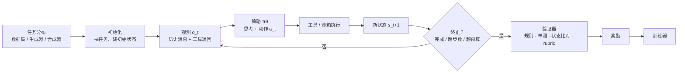
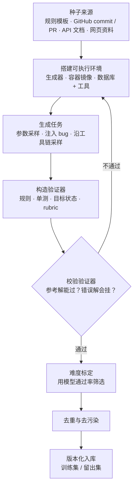
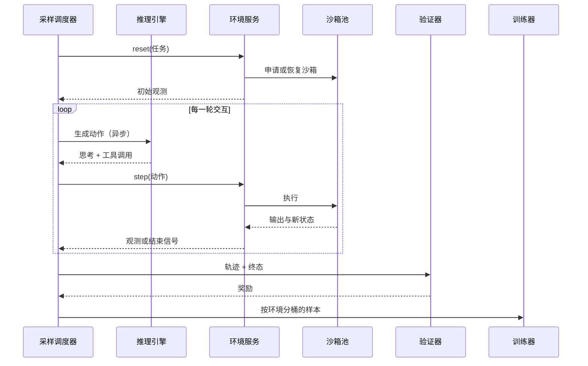

# 多环境与环境工程：环境是新的数据

::: tldr
- RL 的“数据”就是环境：任务、接口、工具、状态与重置、终止条件、验证器缺一不可；验证器的假阳性就是奖励作弊的入口。
- 规模化靠合成：无状态的程序化生成器几乎零成本；有状态的 SWE 与工具环境，成本单位是“环境”而不是“任务”，一套环境里批量造题最划算。
- 多环境混合要同时定四件事：按可学习性 $p(1-p)$ 分配采样、对齐各环境的奖励尺度、先在环境内做 token 平均再按目标份额加权、按环境分桶监控。
- 有状态环境做成独立服务，用容器或 microVM 隔离，支持快照、重置与 fork；环境故障造成的轨迹要丢弃或 mask，不能记 0 分。
- 如果只读一节：读 [多环境混合训练](#mixing)。
:::

<Term t="environment">环境</Term>（environment）是智能体与之交互、并据此得到奖励的完整系统：任务从哪里来，模型能看到什么、能做什么，状态怎样变化和重置，何时结束，以及由谁按什么标准给分。**环境工程**则是把“想让模型学会的能力”变成成千上万个可并行、可验证、可复现的环境实例，并把它们放进同一次 RL 训练里混合使用。

::: human
SFT 时代给模型的是“题库加标准答案”；RL 时代给它的是“练习场”：它得自己动手，练习场告诉它做对没有。练习场有多少、有多像真实世界，基本决定了它最后能学会什么。
:::

## 为什么环境成了瓶颈 {#why}

在可验证奖励的强化学习（<Term t="rlvr">RLVR</Term>）里，模型学习的对象不再是“提示—答案”对，而是“任务—验证器”对；到了智能体场景，还要加上工具、状态和终止条件。换句话说，**RL 的“数据”就是环境**。当 GRPO 一类算法趋于稳定（见 [算法谱系](/lenses/algorithms#grpo)），边际收益就从算法转移到了环境：数量够不够、覆盖面宽不宽、离真实使用有多远、验证器有没有漏洞。

| | SFT | RLVR | 智能体 RL |
|---|---|---|---|
| 训练单元 | 提示 + 示范回答 | 提示 + 验证器 | 任务 + 工具 + 状态 + 验证器 + 终止条件 |
| 规模化瓶颈 | 高质量示范 | 难度合适、答案可靠的题 | 可执行、可复现、可验证的环境 |
| 典型质量问题 | 示范有错 | 答案错、难度失配 | 验证器漏洞、环境不稳定、模拟与真实有差距 |

这一判断最有影响力的表述来自 Shunyu Yao 2025 年 4 月的长文 *The Second Half*[^yao]。他是 ReAct 与 τ-bench 的作者，这篇文章据他在斯坦福 CS224N 与哥伦比亚大学的演讲整理。核心论证分三步：

1. RL 有三个要素：算法、环境、先验。过去几十年研究者主要在改算法，事后看来最重要的却是先验（语言预训练）；有了好的先验，再把“推理”作为一种动作加进环境，“RL 算法反而可能是最不关键的部分”。
2. 这套通用配方能把几乎任何基准刷上去，所以“再造一个更难的考试”越来越快被解决；AI 的下半场要从“解决问题”转向“定义问题”，**评测比训练更重要**。
3. 作者认为最重要的问题是“效用问题”：AI 在考试上超过了大多数人，世界却没有因此改变多少；根源之一是评测设定与真实世界不同，例如默认全自动运行（真实任务需要与人交互）、默认 i.i.d.（真实工作是顺序进行、会积累经验）。

这是一篇观点文章，没有对照实验；它的价值在于判断方向，而这个方向很快被工业实践印证：

- **旗舰模型把环境当一等资产。** Kimi K2 收集了 3000 多个真实 MCP 工具、演化出 2 万多个合成工具，SWE 环境跑在支持 1 万以上并发沙箱的 Kubernetes 集群上[^k2]；MiniMax-M1 把数学、合成逻辑题、竞赛编程、SWE 沙箱和奖励模型判分的通用任务“按精心设计的课程”整合进同一个 RL 阶段[^m1]；DeepSeek-V3.2 的智能体 RL 用了约 8.5 万个任务，多数跑在真实环境里（GitHub issue 修复、搜索、代码解释器），另有 4,417 个任务连同 1,827 个环境完全由智能体自动合成[^ds32]。
- **环境开始像模型权重一样被分发。** Prime Intellect 在 2025-08-27 发布 Environments Hub，发布公告直言“RL 环境是下一波 AI 进展的关键瓶颈，而大实验室把它们锁起来了”[^pi-hub]；Meta 与 Hugging Face 在 2025-10-23 发布 OpenEnv[^openenv]；NVIDIA 用于 Nemotron 生产训练的 NeMo Gym 在 2025-11 发布首个版本 v0.1.0[^nemo]。
- **环境被主动设计，而不是被动接入。** Tongyi DeepResearch 的技术报告写道：环境“不应被看作外部现实，而应作为与训练过程深度耦合的系统来主动设计”[^tongyi]。

::: insight 环境就是新的数据
预训练的规模化靠“更多 token”，SFT 靠“更多好示范”，RL 的规模化靠“更多好环境”。好环境的三个指标可以对应到数据质量的三个指标：**覆盖**（任务与工具的多样性）↔ 数据多样性；**难度匹配**（通过率既不为 0 也不为 1）↔ 数据难度；**验证器可靠性**（假阳性、假阴性）↔ 标签噪声。
:::

## 一个环境由什么组成 {#anatomy}

把一次交互写成部分可观测 MDP（见 <Term t="mdp">MDP</Term>）：任务 $\tau\sim\mathcal T$ 从任务分布中抽出；环境给出初始状态 $s_0\sim\rho_0(\cdot\mid\tau)$；每一步策略看到观测 $o_t$（此前全部消息与工具返回），输出动作 $a_t$（一段文本：思考加一次工具调用或最终回答）；环境执行动作、转移到 $s_{t+1}\sim P(\cdot\mid s_t,a_t)$；满足终止条件时，验证器根据轨迹和终态给出奖励 $R(\tau,s_T,a_{0:T})$。训练目标是

$$
\max_\theta\ \E_{\tau\sim\mathcal T}\,\E_{a_{0:T}\sim\pi_\theta}\big[R(\tau,s_T,a_{0:T})\big].
$$

单轮数学题是它的特例：没有工具、$T=0$、验证器只看最终答案。

逐个部件看，每一个都有可以踩的坑：

1. **任务分布。** 来自固定数据集、程序化生成器或合成流水线；必须能按难度调节，并预留与训练分布隔离的留出集。
2. **观测与动作接口。** 通常是对话消息加工具的 JSON schema（函数调用或 MCP）。关键约束是**上下文只追加、不改写**：verifiers 的早期（v0）文档明确要求 rollout 中的 token 序列只增不改——一个 token 一旦进入上下文，之后就必须原样保留——否则训练时重算的 token 和采样时对不上；像 Qwen3、DeepSeek-R1-Distill 这类会从历史中删掉思考内容的聊天模板因此需要专门处理[^verifiers]。NeMo Gym 在 2026-09 的 v0.6.0 中支持用外部 harness 做 RL，也特别强调“在多步运行中保留精确的 token id”[^nemo]（相关问题见 [训推不一致](/lenses/infra#mismatch)）。
3. **工具。** 无状态工具（计算器、检索）只是函数；有状态工具（shell、数据库、浏览器、虚拟机）才需要沙箱。verifiers v0 的 `ToolEnv` 要求工具幂等、无状态，需要注入沙箱句柄或凭证时升级为 `StatefulToolEnv`[^verifiers]。
4. **状态与重置。** 每个回合必须有隔离且可一键恢复的初始状态：τ-bench 与 AgentScaler 用数据库初始态，OSWorld 用虚拟机快照，SWE 环境用容器镜像。Kimi K3 的 microVM 沙箱还支持 **fork**：从完全相同的状态复制一个沙箱专门用来判分，避免判分操作污染现场[^k3]。
5. **终止条件。** 模型给出最终回答、不再调用工具（verifiers v0 的 `ToolEnv` 即以此结束）、超过最大轮数、超过 token 或时间预算。被截断的轨迹怎么计奖励要单独约定，否则会悄悄变成长度惩罚。
6. **验证器与奖励。** <Term t="verifier">验证器</Term>可以是规则匹配、执行单元测试、比对终态，也可以是按 rubric 打分的 LLM 评审，逐级更通用、也逐级更容易被钻空子。

::: human
环境就像一间考场：发卷（任务）、答题纸（接口）、允许带的工具、考前把桌面收拾干净（重置）、收卷规则（终止）、阅卷老师（验证器）。任何一个环节松了，模型学到的就可能是“钻考场的空子”，而不是本事。
:::

**无状态与有状态。** 无状态环境（数学、逻辑谜题、单轮代码题）的“环境”就是一个奖励函数，可以和采样同进程计算，几乎零成本；有状态环境（SWE、终端、网页、电脑操作、带数据库的工具使用）要管理沙箱的创建、暂停、销毁与并发，单步延迟从毫秒到分钟不等，成本高出几个数量级，出故障的环节也多得多。多环境训练的大部分工程难题都来自后者。

**保真度光谱。** Tongyi DeepResearch 把环境分成三档[^tongyi]：*先验世界环境*只提供任务、工具和状态定义，让模型基于预训练知识“想象”交互过程，零成本但没有真实反馈，适合给智能体中训练批量造数据；*模拟环境*在本地复刻真实交互（如基于 2024 年维基百科离线库加本地检索工具模拟网页），稳定、便宜、可做归因实验，但覆盖有限、存在模拟与真实的差距；*真实环境*保真度最高，但交互贵、分布随时间漂移、还有探索风险。他们的做法是先在模拟环境里验证算法与策略，再迁到真实环境做最终训练。Kimi K2 的工具使用数据也采取混合路线：多数场景用维护状态、带受控随机性的“工具模拟器”（相当于世界模型），代码与 SWE 场景则换成真实执行沙箱[^k2]。

**验证器设计的四条经验。**

- *难解易验。* DeepSeek-V3.2 合成通用智能体任务时刻意追求“求解空间大、验证只需逐条检查约束”的任务[^ds32]；这类任务奖励可靠，又不会一下被做穿。
- *看终态，不看自述。* τ-bench、AgentScaler 用数据库终态判分，Kimi K3 的自主执行任务也明确以“验证器对最终环境状态的评估”而非“智能体自称完成”作为奖励[^k3]。
- *把验证器藏起来。* Kimi K3 让智能体与验证器隔离：公开验证器只给诊断反馈，隐藏验证器在留出场景上打分，并在有限提交次数下对失败施加惩罚[^k3]。
- *用验证器之前先验证它。* 参考解必须通过，已知错误解必须失败；验证器的假阳性就是 <Term t="reward-hacking">奖励作弊</Term> 的入口（见 [奖励作弊](/topics/rl-for-llm#reward-hacking)）。

## 接口与 Hub：环境开始标准化 {#hubs}

经典 RL 的 OpenAI Gym 只要一对 `reset()`/`step()`；LLM 智能体的环境接口还得回答五个问题：消息与工具 schema 怎么表示；成千上万个回合怎样异步并发；token 级的一致性怎么保证；环境怎样打包、隔离和分发；奖励与诊断信息怎么记录。2025 年以来的几个主流方案各有侧重：

| 项目 | 核心抽象 | 隔离与部署 | 典型用途 |
|---|---|---|---|
| [verifiers](/library/?id=verifiers)（Prime Intellect） | 数据集 + 交互逻辑 + Rubric；2026 年的 v1 改为 taskset × harness → trace | Prime 沙箱；经 Environments Hub 分发 | 社区环境、INTELLECT-3 训练 |
| [OpenEnv](/library/?id=openenv)（Meta · HF） | reset / step / state，类型化的动作与观测 | Docker 容器 + WebSocket，可部署到 HF Spaces | 跨框架的环境标准 |
| [NeMo Gym](/library/?id=nemo-gym)（NVIDIA） | 数据集 + harness + 验证器 + 逐任务状态 | 独立资源服务；多种沙箱后端 | Nemotron 生产训练与评测 |
| [GEM](/library/?id=gem-env)（Axon RL） | Gym 式接口 + 包装器，异步向量化 | 进程内或工具服务 | 多轮 RL 算法研究 |
| [TextArena](/library/?id=textarena) | 多玩家文本游戏 | 进程内 | 自博弈与对战评测 |
| [Reasoning Gym](/library/?id=reasoning-gym) / [InternBootcamp](/library/?id=internbootcamp) | 生成器 + 验证器（无状态） | 纯函数 | RLVR 题目供给 |
| Harbor（[Terminal-Bench](/library/?id=terminal-bench) 团队） | 任务目录：指令、容器、测试、参考解 | Docker、Daytona、Modal 等云沙箱 | 终端 / SWE 评测与 rollout 生成 |

三个趋势值得注意：

- **分发：从代码仓库到 Hub。** verifiers 把环境打包成带 `pyproject.toml` 的 Python 包（v0 时期统一暴露 `load_environment` 入口），用 `prime env push` 一条命令推送到 <Term t="environment-hub">Environments Hub</Term>，在任意机器上都能安装[^verifiers]；Prime Intellect 随后用 Hub 上的环境训练并评测了开源模型 INTELLECT-3[^intellect3]。OpenEnv 则把每个环境做成可部署到 Hugging Face Spaces 的容器服务[^openenv]。
- **互通：生态开始相互兼容。** NeMo Gym 可以直接接入 Reasoning Gym、verifiers、OpenEnv 与 Harbor 的环境[^nemo]；verifiers v1 支持 Harbor 格式的任务集[^verifiers]；SWE-Bench Pro 在 2026-09 的 V2 也以 Harbor 格式发布[^swepro]。
- **解耦：任务与 harness 分开。** verifiers v1 把“任务集”（数据、工具、奖励）与“harness”（模型运行其中的程序，如 Claude Code、Codex、mini-swe-agent）拆成两层[^verifiers]；NeMo Gym 把 harness 列为环境的四个组成部分之一[^nemo]。Kimi K3 走得更远：用一个“白盒”环境把 <Term t="scaffold">脚手架</Term> 拆成可配置的工具接口、系统提示、上下文管理、技能与子智能体等模块，训练时为不同任务组合出不同 harness，理由是“用单一固定 harness 训练会让模型过拟合某种工具 schema、提示或交互协议”[^k3]。

::: human
标准接口就像 USB：以前每个练习场都得配一根专用线，现在插上就能用。更进一步，连“怎么上场”（harness）也能换着来，模型就不会只认一种考场布置。
:::

## 规模化合成环境 {#synthesis}

真实世界的任务不会自动变成环境：真实 issue 要有人把仓库装好、把测试跑通；真实 API 要有稳定的沙箱和可判定的目标。<Term t="task-synthesis">任务合成</Term> 要做的，是批量生产“任务 + 可执行环境 + 验证器”三元组。不同领域的做法差别很大，但流水线的骨架是共通的：

### 程序化推理环境：出题机代替题库

最便宜的一类是无状态的程序化环境：每类任务写一个生成器 $g(\text{难度参数},\text{随机种子})\to(x,\ \text{验证器})$，题目要多少有多少，而且每道题都是新生成的，天然不在预训练语料里。

- [Reasoning Gym](/library/?id=reasoning-gym) 提供 100 多个生成器，覆盖代数、几何、图论、逻辑与各种游戏，支持按权重组合成复合数据集；NVIDIA 的 ProRL 与 Nemotron 3 Super 等工作用过它。
- [SynLogic](/library/?id=synlogic)（35 类逻辑任务）和 [Enigmata](/library/?id=enigmata)（36 类谜题）都给每类任务配“生成器 + 规则验证器”。两者都有工业落地：MiniMax-M1 用 SynLogic 框架合成了 41 类、约 5.3 万条逻辑 RL 数据[^m1]；Enigmata 的谜题数据被加入 Seed1.5-Thinking 的训练，并带来 AIME、GPQA 上的提升[^enigmata]。
- [InternBootcamp](/library/?id=internbootcamp) 把规模推到 1000 多个任务、8 个领域，其中 90% 以上的环境代码由 LLM 智能体工作流自动写成、再经质量过滤；它报告了两个现象：训练任务种类越多，效果和效率越好（“Task Scaling”），以及单独训练学不会的任务在多任务训练中突然变得可学（“涌现时刻”）[^intern]。
- [RLVE](/library/?id=rlve) 在 400 个环境上系统比较了 1、4、16、256 个环境联合训练的效果，并用 50 个留出环境测泛化：环境越多，留出表现越好。

难度标定是这类环境成败的关键。MiniMax-M1 的做法可以直接照搬：难度上界要求当前强推理模型的 pass@10 大于 0（保证可解），下界取基座模型通过率落在 0 到 0.5 之间的最低难度参数，训练后期随能力提升再加难[^m1]（更多难度过滤做法见 [数据工作流](/lenses/data#difficulty)）。

### SWE 环境：从“找题”到“造题”

SWE 环境贵在“有状态”：每道题都要一个装好依赖、能跑测试的仓库快照。这条线的演进，基本就是在降低“每道题一套环境”的成本：

| 工作 | 任务来源 | 环境构建 | 规模 | 验证方式 |
|---|---|---|---|---|
| [SWE-Gym](/library/?id=swe-gym) | 真实 issue / PR | 人工配置 | 约 2.4K 题 / 11 个仓库 | PR 自带测试 |
| [R2E-Gym](/library/?id=r2e-gym) | 从 commit 回译 | 自动（SWE-GEN） | 8.1K 题 / 13 个仓库 | 自动生成测试 |
| [SWE-smith](/library/?id=swe-smith) | 向代码注入 bug | 每个仓库一个镜像 | 5 万余题 / 250 多个环境 | 让已有单测失败即有效 |
| [SWE-rebench](/library/?id=swe-rebench) | 持续抓取真实 issue | 自动配置并执行验证 | 2.1 万余题，持续增长 | PR 测试 |
| Qwen3-Coder-Next | 挖掘 PR + 在已有环境中合成 | 环境构建智能体 + 专门训练的构建模型 | 大规模，镜像可复用 | 验证脚本必须区分修复前后 |

两条经验：

- **环境是成本单位，任务不是。** SWE-smith 反过来做——每个仓库只搭一个环境，在里面批量注入 bug，保留能让已有单测失败的实例再生成 issue 文本——于是合成成本主要随仓库数而非任务数增长[^swesmith]。SWE-bench-Live 在 2026-08 的更新里也改为“每个仓库只构建一个 commit，其余 commit 直接从已建镜像检出”：为 93 个仓库的 856 个 issue 建环境时，成功率不低于 98%，LLM API 成本省下 82%，镜像存储省下 78%[^swelive]。
- **造环境的智能体也会作弊。** Qwen3-Coder-Next 用专门的环境构建智能体为每个 PR 搭 Docker 环境和验证脚本，要求脚本能通过执行可靠地区分“有 bug”与“已修复”两种状态；他们发现构建智能体会利用表面的验证捷径，于是加入自动检测来过滤“不起作用的验证器”，并专门训练了一个提升构建质量的模型，最后再由质检智能体剔除歧义任务和测试错配[^qcn]。

工业界的规模已经到了另一个量级：DeepSeek-V3.2 构建了数万个可复现的 issue 修复环境，覆盖 Python、Java、JavaScript、Go 等多种语言[^ds32]；Kimi K2 的 SWE 环境支持 1 万以上并发沙箱[^k2]。

### 工具使用环境：模拟一个“可验证的世界”

真实 API 难以大规模、可重复地调用，于是工具使用环境普遍走向模拟：

- **Kimi K2**[^k2]：3000 多个真实 MCP 工具加 2 万多个按“类别 → 领域 → 工具”层级演化出的合成工具；组合出数千个带不同工具集的智能体；每个任务配一份 rubric（成功标准、预期工具使用模式、检查点）；由 LLM 扮演的用户与维护状态的工具模拟器生成多轮轨迹，最后由 LLM 评审按 rubric 过滤。这条流水线产出的是 SFT 数据，相当于大规模拒绝采样。
- **[AgentScaler](/library/?id=agentscaler)**（通义）：约 3 万个 API 按参数相似度建成工具图，用 Louvain 社区发现切成 1000 多个领域；每个领域落成“数据库 + Python 工具”的全模拟环境，工具调用就是读写数据库；沿工具图采样调用序列生成带初始态与目标态的任务，再用模拟用户采轨迹，按数据库终态和调用序列双重过滤。Tongyi DeepResearch 的函数调用数据就是这样合成的[^tongyi]。
- **DeepSeek-V3.2**[^ds32]：给定任务类别（如规划旅行）和一个带 bash 与搜索工具的沙箱，由智能体先收集数据存进沙箱数据库，再合成任务专用工具，然后提出一个简单任务及其解和 Python 验证函数，并在此基础上逐步加难；再用 DeepSeek-V3.2 在这些任务上跑 RL，只保留 pass@100 非零（至少能解出一次）的实例，最终得到 1,827 个环境、4,417 个任务。
- **Kimi K3**[^k3]：用智能体在网络上持续扩展一张层级知识图谱，按节点采样关键词、检索真实资料来合成任务；还构建了跨多个模拟日、事件相互依赖的“活环境”，单个 rollout 可包含上千次工具调用。

::: details 另一条路：让对手或模型自己出题
零和博弈天然提供随对手水平变化的难度：SPIRAL 在 TextArena 的游戏上做多轮、多智能体自博弈 RL[^spiral]。Absolute Zero 则让模型自己提出编程推理任务、用代码执行器验证任务是否有效并给出奖励，在不使用人工整理数据的情况下训练推理能力[^azr]。这类“自生成环境”省掉了题目来源，但任务分布会跟着模型走，需要额外监控多样性与难度。
:::

## 多环境混合训练 {#mixing}

有了成百上千个环境，下一个问题是怎么把它们放进同一次训练。设有 $K$ 个环境，环境 $e$ 的题目通过率为 $p_e$、奖励范围不同、轨迹长度不同、单步成本也不同。需要决定五件事：各环境抽多少、奖励怎么对齐、损失怎么聚合、顺序怎么安排、出了问题怎么看得见。下面的公式里，凡是标注“设计模式”的都是业界常见做法的归纳，不对应某一篇论文；标注出处的则来自具体工作。

### 各环境抽多少：采样权重

**设计模式一：按规模的温度采样。** 设环境 $e$ 有 $N_e$ 个任务，取

$$
w_e=\frac{ N_e^{\alpha} }{ \sum_{e'} N_{e'}^{\alpha} },\qquad \alpha\in[0,1].
$$

$\alpha=1$ 按规模比例抽，$\alpha=0$ 各环境均匀抽；取中间值可以防止大环境淹没小环境。这是多语言预训练里常用的温度采样在环境层面的翻版。

**设计模式二：按可学习性加权。** 以二值奖励加 GRPO 为例，组内 $G$ 个样本全对或全错时优势全为 0，这一组对梯度没有贡献（见 <Term t="dynamic-sampling">动态采样</Term>）。通过率为 $p$ 的题产生有效梯度的概率，以及用真实均值作基线时的期望优势幅度分别为

$$
P_{\text{mix} }(p)=1-p^{G}-(1-p)^{G},\qquad \E\big[\lvert r-p\rvert\big]=2p(1-p).
$$

两者都在 $p=0.5$ 附近最大、在 $p\to 0$ 或 $p\to 1$ 时趋于 0。于是可以按环境内题目的平均“可学习性”分配权重：$w_e\propto \E_{x\in e}\big[p_x(1-p_x)\big]$。

::: derive 为什么期望优势幅度是 2p(1−p)
设奖励 $r\in\{0,1\}$，$\Pr(r=1)=p$，基线取真实均值 $p$，优势 $A=r-p$。则
$$
\E\lvert A\rvert=p\cdot(1-p)+(1-p)\cdot p=2p(1-p).
$$
若再像 GRPO 那样除以标准差 $\sqrt{p(1-p)}$，得 $\E\lvert A\rvert=2\sqrt{p(1-p)}$，仍在 $p=0.5$ 处最大、在两端趋于 0，只是两端衰减得更慢——这也是标准差归一化会放大“几乎全对 / 全错”题目权重的原因（见 [Dr. GRPO](/lenses/algorithms#dr-grpo)）。组大小为 $G$ 时，组内至少一对一错的概率为 $1-p^G-(1-p)^G$；例如 $G=8$、$p=0.95$ 时只有约 34%，大部分采样被浪费。
:::

**有出处的三种做法：**

- *按题优先采样。* Kimi k1.5 跟踪每道题的成功率 $s_i$，按 $1-s_i$ 成比例抽题，把算力集中到模型最弱的地方[^k15]。
- *环境内自适应难度。* RLVE 在环境之间均匀抽取，但为每个环境维护一个难度上限 $h_e$，从最近 $W$ 档难度中均匀抽题；在难度 $h_e$ 上累计到足够样本后，若正确率不低于阈值（默认 0.9）就令 $h_e\leftarrow h_e+1$。代码默认 $W=4$，初始上限为 0，每次检查前至少积累 8 个提示的样本[^rlve]。
- *环境间的 bandit 课程。* Self-Evolving Curriculum 把每个题目类别当作非平稳多臂老虎机的一只手臂，以该类别样本的平均绝对优势作为“即时学习收益”，用 TD(0) 更新各臂的价值 $Q_e\leftarrow \eta\,r_e+(1-\eta)\,Q_e$，再按 $\text{softmax}(Q_e/T)$ 抽类别（$T$ 为温度）[^sec]。

### 奖励怎么对齐：尺度与归一化

不同环境的奖励天生不在一个尺度上：数学题是 $\{0,1\}$，RLVE 的很多环境给连续的部分分，MiniMax-M1 的 SWE 环境对编译错误、测试回退给零分或负分[^m1]，rubric 评审给的是多维分数。

GRPO 的组内标准化对同一个提示内的仿射变换是不变的（忽略分母里防除零的小常数）：若 $r'_i=a\,r_i+b$（$a>0$），则

$$
\hat A_i=\frac{r'_i-\operatorname{mean}(r'_1,\dots,r'_G)}{\operatorname{std}(r'_1,\dots,r'_G)}=\frac{r_i-\operatorname{mean}(r_1,\dots,r_G)}{\operatorname{std}(r_1,\dots,r_G)} .
$$

所以用标准差归一化时，各环境的奖励尺度会被自动抹平；代价是低方差的组被放大。若按 Dr. GRPO 的建议去掉标准差，奖励尺度就会直接变成梯度尺度，此时需要**按环境归一化（设计模式三）**：为每个环境维护奖励标准差的滑动估计 $\sigma_e$，用

$$
\hat A_i=\frac{r_i-\operatorname{mean}_{\text{组} }(r)}{\sigma_e+\epsilon}
$$

替代组内标准差，或者先把各环境奖励线性映射到 $[0,1]$。对无法“同一提示多次采样”的多轮环境，GEM 提出的 ReBN 做法是在批内对折扣回报做均值—方差归一化[^gem]。另外，RLVE 的作者提醒：训练规模较小时，把连续的部分分换成二值奖励有时效果更好[^rlve]。

### 损失怎么聚合：别让长轨迹环境霸占梯度

如果像 DAPO 那样在整个批次上做 token 级平均（见 <Term t="token-level-loss">token 级损失</Term>），环境 $e$ 在梯度中的份额约等于它的 token 份额：

$$
\mathcal L=\frac{1}{\sum_{i}\lvert y_i\rvert}\sum_i\sum_t \ell_{i,t}
\quad\Longrightarrow\quad
\text{环境 } e \text{ 的份额}\approx\frac{\sum_{i\in e}\lvert y_i\rvert}{\sum_i \lvert y_i\rvert}.
$$

一条 SWE 轨迹动辄数万 token（工具返回被 mask 后仍然很长），一道数学题通常几千 token；按样本数 1:1 混合时，SWE 的梯度份额可能是数学的数倍乃至十倍。**设计模式四**是先在环境内做 token 平均，再按目标份额 $\lambda_e$ 加权：

$$
\mathcal L=\sum_{e}\lambda_e\cdot\frac{1}{\sum_{i\in e}\lvert y_i\rvert}\sum_{i\in e}\sum_t \ell_{i,t},\qquad \sum_e\lambda_e=1 .
$$

此外，工具返回的 token 要用 <Term t="loss-mask">loss mask</Term> 排除在损失之外；Kimi K2 还按任务类型设定每条样本的最大 token 预算，超出即截断并惩罚，以免模型在不需要长推理的任务上也越答越长[^k2]。

### 顺序怎么安排：课程与遗忘

- **先可验证、后开放。** MiniMax-M1 先只用规则可验证的推理任务训练，再逐步混入由奖励模型判分的通用任务，并动态调整权重，以免遗忘已学到的数学与代码能力[^m1]。
- **先热身、后攻坚。** Kimi k1.5 先在全量数据上热身，再只训难题，消融显示明显优于均匀采样[^k15]；POLARIS 则在每个阶段结束时剔除已掌握（正确率高于 0.9）的题（见 [POLARIS](/library/?id=polaris)）。
- **防遗忘。** Kimi K2 在联合 RL 中加入基于精选高质量数据的 PTX 辅助损失，并对探索温度做衰减[^k2]（遗忘的机制见 [原理：遗忘](/lenses/principles#forgetting)）。
- **跨领域迁移并不对称。** Guru 的实验表明，预训练中常见的领域（数学、代码、科学）能从跨领域 RL 中获益，预训练覆盖少的领域（逻辑、模拟、表格）则需要本领域的环境才能提升（见 [Guru](/library/?id=guru)）。
- **先分后合。** 另一条路线是不把所有环境塞进一个策略：DeepSeek-V3.2 先训领域专家再蒸馏、最后做一次混合 RL[^ds32]；Kimi K3 为三个领域 × 三档推理强度各训一个专家，再用多教师 [On-Policy 蒸馏](/topics/opd) 合并[^k3]。

### 看得见：按环境分桶的监控

多环境训练最常见的失败是“总奖励在涨，某个环境在悄悄崩”。每个环境至少单独看六条曲线：平均奖励、通过率、零方差组比例（全对或全错的组）、回答长度与截断率、环境错误率（工具超时、沙箱崩溃）、在批次中的 token 份额。环境错误要与策略失败区分开：Tongyi DeepResearch 专门做了统一沙箱层，用限流、结果缓存、超时重试、降级与备用数据源切换，把不稳定的外部 API 包装成确定、稳定的接口，理由是“工具错误会污染智能体的学习轨迹”[^tongyi]。与之配套的**设计模式五**：环境侧故障导致的轨迹直接丢弃或 mask 掉，而不是给 0 分。

::: human
多个练习场一起练，就像同时补几门课：要决定每门课排几节（采样权重），把各科分数换算到同一把尺子上（归一化），别让作业最长的那门课占掉全部精力（损失聚合），先打基础再上难度（课程），还要每门课单独看成绩单（分桶监控）。
:::

## 多环境的 Infra {#infra}

有状态环境让 RL 系统从“GPU 密集”变成“GPU + CPU + 沙箱密集”。通用的 rollout 架构（训练系统整体见 [训练系统 Infra](/lenses/infra#anatomy)）是把环境做成独立服务，采样端异步地驱动大量回合：

几条来自一线报告的经验：

1. **重环境做成独立服务，用并发摊薄延迟。** Kimi K2 把虚拟机、代码解释器这类重环境部署为可独立扩容的服务，并同时运行大量 rollout，避免 GPU 空等；对超长的尾部轨迹用 <Term t="partial-rollout">partial rollout</Term>，暂停后在下一轮继续；并设计了受 Gym 启发的统一接口来接入新环境[^k2]。Tongyi DeepResearch 则把推理服务与工具服务拆成两个异步服务器，由一个集中的交互处理模块把两边的输出整理成统一的消息列表，实现步级别的异步 rollout[^tongyi]（见 [异步 RL](/lenses/infra#async)）。
2. **按工作流编排、判分与采样分离。** Qwen3-Coder-Next 在 Kubernetes 上把每个编程任务表示为“rollout、评测、后处理”三段式工作流：rollout 时智能体容器与环境容器同处一个 pod，评测在独立容器里执行[^qcn]。
3. **隔离强度要跟上模型的“破坏力”。** Kimi K3 在早期用容器运行时观察到智能体的意外操作引发内核崩溃和死锁，于是改用 Firecracker microVM：检查点和恢复延迟最低分别约 133 ms 和 49 ms；等待模型推理时把沙箱暂停（这段时间可占沙箱生命周期的 98%）；用 fork 出的副本做无副作用的判分[^k3]。
4. **可复现靠版本化。** 镜像、数据库初始态、工具版本、验证器版本都要进 rollout 日志；评测侧同理（见 [评测：智能体评测](/lenses/eval#agent-eval)）。

## 演化脉络 {#lineage}

<LineageGraph graph="env-scaling" />

这张图有四条主线。**静态基准**（WebArena、SWE-bench、OSWorld、τ-bench）最先把“真实任务 + 执行判分”做成可复现的环境，但它们只为考试设计，题少、环境搭建靠人工。**训练用 Gym**（SWE-Gym、Reasoning Gym、GEM、RLVE）把考题改造成可反复练习的训练场，并把难度控制内置进环境。**规模化合成**（R2E-Gym、SWE-smith、Kimi K2、AgentScaler、DeepSeek-V3.2、Kimi K3）解决“题从哪来”：从回译 commit、注入 bug，到由智能体自己搭数据库、写工具、出难解易验的任务。**标准与 Hub**（verifiers、Environments Hub、OpenEnv、NeMo Gym）解决“环境怎么共享”：统一接口、容器化、可安装、可组合。2026 年的前沿是把 harness 也变成环境的可配置部分，用 microVM 沙箱承载可暂停、可 fork 的长程任务，以及跨越多个模拟日、事件相互依赖的“活环境”。

## 关键工作精读 {#papers}

<EntryGrid :ids="['the-second-half', 'verifiers', 'reasoning-gym', 'swe-smith', 'r2e-gym', 'agentscaler', 'rlve', 'kimi-k2', 'deepseek-v3-2', 'kimi-k3']" />

- **The Second Half**：不是技术论文，但给出了这一页的问题意识——算法趋同之后，环境与评测的设计决定上限。读它时带着一个问题：你的环境默认了哪些“不真实”的设定？
- **verifiers**：最值得借鉴的是它的抽象边界。早期版本让数据集、交互逻辑、Rubric、解析器各管一件事，外加“token 序列只增不改”的硬约束；2026 年的 v1 改成 taskset、harness、trace 三层，把 harness 单独拆出来，代表了行业方向。
- **Reasoning Gym**：程序化环境的标准实现。它的价值不在任何单个任务，而在“难度可调 + 无限供给 + 天然无污染”这三件事同时成立。
- **SWE-smith 与 R2E-Gym**：两种互补的 SWE 造题思路。R2E-Gym 从真实 commit 回译，贴近真实分布；SWE-smith 在一个仓库里批量注入 bug，成本更低、规模更大。二者都证明了合成任务能训练出强 SWE 智能体。
- **AgentScaler**：把“工具使用”彻底改写成“读写数据库”，从而用状态比对得到可靠奖励。工具图加社区发现的领域划分方法可以直接复用。
- **RLVE**：给程序化环境加上自适应难度，并把“环境数量”当成扩展维度来做实验；代码短小，适合作为多环境课程的起点。
- **Kimi K2、DeepSeek-V3.2、Kimi K3**：工业级环境工程的三份一手材料，分别代表“模拟器 + rubric”、“智能体自动合成难解易验环境”、“可配置 harness + 隐藏验证器 + microVM”三种思路。

<EntryGrid :ids="['openenv', 'nemo-gym', 'gem-env', 'textarena', 'internbootcamp', 'synlogic', 'enigmata', 'swe-gym', 'openhands', 'swe-rebench']" />

## 可执行结论 {#takeaways}

::: takeaway
1. **先验证验证器，再训练。** 每个新环境上线前，用参考解和已知错误解各跑一遍：参考解必须过、错误解必须挂；再用基座模型抽样确认通过率既不是 0 也不是 1。
2. **按“可学习性”分配采样，而不是按题量。** 以 $p(1-p)$ 或“组内非零方差比例”估计每个环境的有效信号，定期重估权重；零方差组比例持续上升的环境要加难或降权。
3. **跨环境对齐奖励与损失。** 保留 GRPO 组内标准化时注意它对低方差组的放大；去掉标准差时改用按环境的奖励归一化；损失先在环境内做 token 平均，再按目标份额加权。
4. **有状态环境一律做成服务。** 用容器或 microVM 隔离，支持快照、重置和 fork；推理与工具执行异步解耦，长尾轨迹用 partial rollout。
5. **环境故障不等于策略失败。** 工具超时、沙箱崩溃造成的轨迹要丢弃或 mask，不要记 0 分；按环境单独监控奖励、通过率、长度、错误率与 token 份额。
6. **别只练一种 harness。** 智能体 RL 至少轮换两三种脚手架或提示与工具 schema 配置，并在未见过的 harness 上评测泛化。
:::

## 常见坑 {#pitfalls}

::: pitfall 验证器有洞，模型一定会找到
单测太弱、只检查输出格式、LLM 评审能被特定措辞糊弄，都会被 RL 放大成系统性的作弊。上线前做“红队”：让强模型专门尝试骗过验证器；上线后抽查高奖励轨迹。
:::

::: pitfall 静态题库被做穿之后，训练会悄悄停摆
通过率接近 1 的环境在 GRPO 下几乎不产生梯度，总奖励曲线却看起来很好。要么像 RLVE 那样自适应升难度，要么像 POLARIS 那样阶段性剔除已掌握的题。
:::

::: pitfall 合成环境与真实分布之间有差距
模拟工具的返回过于干净、数据库世界过于规整，模型在真实 API 的噪声、限流与报错面前会失手。至少保留一部分真实环境做最终训练与评测，并在合成时注入受控的失败与边界情况。
:::

::: pitfall 训练环境和评测基准“撞车”
用 SWE-bench 同源仓库造训练任务、用公开基准题做种子，都会让评测失真。合成前先对下游基准去重（Qwen3-Coder-Next 在挖掘 PR 时就先剔除与下游基准重叠的实例），并保留与训练环境完全隔离的留出环境。
:::

## 延伸阅读 {#further}

- 资料库：[环境相关条目](/library/?facet=env) · [评测相关条目](/library/?facet=eval) · [Agentic RL 全部条目](/library/?area=agentic-rl)
- 相关页面：[Agentic RL](/topics/agentic-rl#formulation)（多轮 RL 的形式化与 loss mask） · [评测](/lenses/eval)（环境即基准：怎样评得可信） · [数据工作流](/lenses/data#agentic-data)（智能体数据） · [训练系统 Infra](/lenses/infra#async)（异步 rollout） · [SWE 智能体 RL 实践](/practice/swe-agent)

[^yao]: Shunyu Yao, “The Second Half”，2025-04-10。<https://ysymyth.github.io/The-Second-Half/>
[^k2]: Kimi Team, “Kimi K2: Open Agentic Intelligence”，§3.1.1（工具使用数据合成）、§3.2.1（SWE 沙箱，1 万以上并发实例）、§3.2.3（预算控制、PTX 损失、温度衰减）、§3.3.4（智能体 rollout）。<https://arxiv.org/abs/2507.20534>
[^m1]: MiniMax, “MiniMax-M1: Scaling Test-Time Compute Efficiently with Lightning Attention”，§4.1（SynLogic 41 类任务、约 5.3 万条，难度上下界；SWE 沙箱奖励）、§4.3（课程）。<https://arxiv.org/abs/2506.13585>
[^ds32]: DeepSeek-AI, “DeepSeek-V3.2: Pushing the Frontier of Open Large Language Models”：引言称合成了“1,800 多个环境、8.5 万个复杂提示”；“Large-Scale Agentic Tasks”一节的任务表为代码智能体 24,667、搜索智能体 50,275、通用智能体 4,417、代码解释器 5,908，其中只有通用智能体的环境与提示都是合成的（保留 pass@100 非零后得到 1,827 个环境）；另述多语言 issue 修复环境的构建。<https://arxiv.org/abs/2512.02556>
[^pi-hub]: Prime Intellect, “Environments Hub: A Community Hub To Scale RL To Open AGI”，2025-08-27。<https://www.primeintellect.ai/blog/environments>；发布公告原文见 <https://x.com/PrimeIntellect/status/1960783427948699680>
[^openenv]: Hugging Face, “Building the Open Agent Ecosystem Together: Introducing OpenEnv”，2025-10-23。<https://huggingface.co/blog/openenv>
[^nemo]: NVIDIA NeMo Gym README（环境的四个组成部分；与 Reasoning Gym、verifiers、OpenEnv、Harbor 的集成；v0.6.0 保留精确 token id）。<https://github.com/NVIDIA-NeMo/Gym>
[^tongyi]: Tongyi DeepResearch Team, “Tongyi DeepResearch Technical Report”，§2（三类环境）、§3.3.2（基于环境扩展的函数调用数据合成）、§3.4.3（统一沙箱、离线维基模拟环境、异步 rollout）。<https://arxiv.org/abs/2510.24701>
[^k3]: Moonshot AI, “Kimi K3: Open Frontier Intelligence”，§4.2（白盒 RL 环境、知识图谱引导的任务合成、活环境、自主执行任务与隐藏验证器）、§5.3.2（AgentENV microVM 沙箱）。<https://arxiv.org/abs/2607.24653>
[^verifiers]: PrimeIntellect-ai/verifiers：v0 时期的 README（如 2025-10 的 v0.1.6 标签：环境打包与 `load_environment`、`ToolEnv` / `StatefulToolEnv`、token 序列只增约束及其与 Qwen3、R1-Distill 模板的冲突）；docs/v1（taskset、harness、trace，Harbor 任务集支持；v0 接口已移除）。<https://github.com/PrimeIntellect-ai/verifiers>
[^intellect3]: Prime Intellect Team, “INTELLECT-3: Technical Report”。<https://arxiv.org/abs/2512.16144>
[^swepro]: scaleapi/SWE-bench_Pro-os README（V2：11 个仓库上 642 个复核任务，Harbor 格式）。<https://github.com/scaleapi/SWE-bench_Pro-os>
[^enigmata]: BytedTsinghua-SIA/Enigmata README（用于 Seed1.5-Thinking 训练）。<https://github.com/BytedTsinghua-SIA/Enigmata>
[^intern]: InternLM/InternBootcamp README 与技术报告（1000+ 任务、90% 以上自动合成、Task Scaling、Emergent Moment）。<https://arxiv.org/abs/2508.08636>
[^swesmith]: SWE-bench/SWE-smith README（构建流程：建环境 → 合成任务 → 保留让单测失败的实例 → 生成 issue）。<https://github.com/SWE-bench/SWE-smith>
[^swelive]: microsoft/SWE-bench-Live README（2026-08-21 更新：每个仓库只用 RepoLaunch 构建一个 commit，其余 commit 从已建镜像检出并复用命令与解析器；856 个 issue、93 个仓库上成功率 ≥98%，LLM API 成本省 82%，镜像存储省 78%）。<https://github.com/microsoft/SWE-bench-Live>
[^qcn]: Qwen Team, “Qwen3-Coder-Next Technical Report”，§2（从 PR 构建可执行环境、过滤无效验证器、质检智能体、MegaFlow 编排）。<https://arxiv.org/abs/2603.00729>
[^spiral]: “SPIRAL: Self-Play on Zero-Sum Games Incentivizes Reasoning via Multi-Agent Multi-Turn Reinforcement Learning”。<https://arxiv.org/abs/2506.24119>
[^azr]: “Absolute Zero: Reinforced Self-play Reasoning with Zero Data”。<https://arxiv.org/abs/2505.03335>
[^k15]: Kimi Team, “Kimi k1.5: Scaling Reinforcement Learning with LLMs”，§2.3.4（课程采样与优先采样）及采样策略消融。<https://arxiv.org/abs/2501.12599>
[^rlve]: Zhiyuan-Zeng/RLVE：`slime/ray/rollout_data_source.py` 的难度更新逻辑与 `slime/utils/arguments.py` 的默认参数；README 的奖励设置说明。<https://github.com/Zhiyuan-Zeng/RLVE>
[^sec]: “Self-Evolving Curriculum for LLM Reasoning”。<https://arxiv.org/abs/2505.14970>
[^gem]: axon-rl/gem README（REINFORCE + ReBN，回报批归一化）与论文。<https://arxiv.org/abs/2510.01051>
