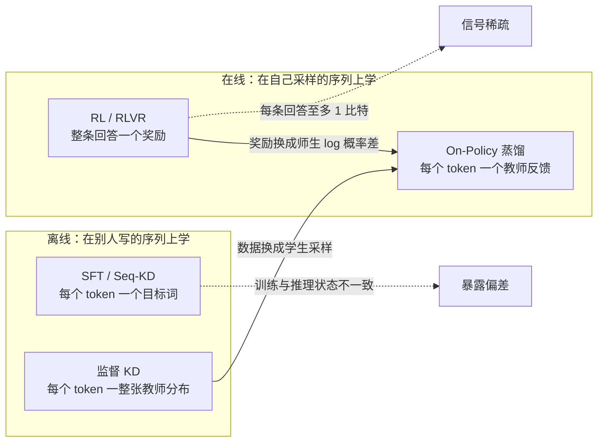
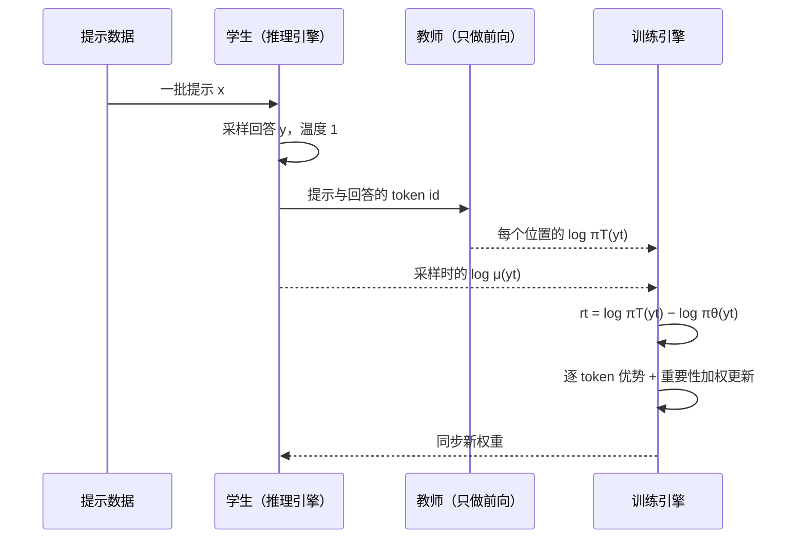
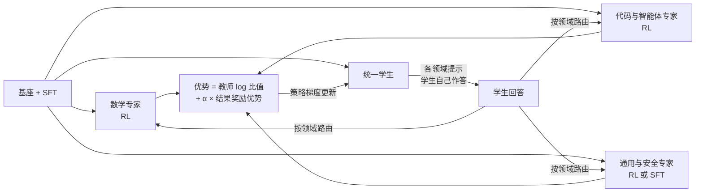

# On-Policy 蒸馏：让学生在自己的错误上被老师纠正

::: tldr
- OPD 让学生自己采样、教师给每个 token 打分；最常见的实现把采样 token 上的 $\log\pi_T-\log\pi_\theta$ 当逐 token 优势，直接复用现成的 RL 训练栈。
- 它最小化学生样本上的反向 KL，行为偏“模式寻求”；主流实现只保留当前 token 的项（折扣为 0），相对序列级目标有偏，但方差小得多。
- 有同 tokenizer 的强教师时它很省：Qwen3-8B 上用约 1/10 的 GPU 时超过了 RL，TM 的复现按 FLOPs 比继续 SFT 省 9–30 倍。
- 它复制教师已有的能力，不创造新能力：只用教师信号时学生很难超过教师；师生思维方式不兼容、前缀跑偏、长度膨胀时会悄悄失效。
- 如果只读一节：读 [从前向 KL 到反向 KL](#reverse-kl)。
:::

**On-Policy 蒸馏**（On-Policy Distillation，<Term t="on-policy-distillation">OPD</Term>）让学生模型用自己的策略生成回答，再由教师模型对回答里的**每一个 token** 给出概率反馈，学生据此在自己真正会走到的状态上逼近教师。它的采样方式来自强化学习（在线、<Term t="on-policy">on-policy</Term>），信号密度来自<Term t="knowledge-distillation">知识蒸馏</Term>（逐 token、稠密）。

::: human
SFT 像抄范文：范文再好，你自己写跑偏了也没人管。RL 像只报总分的考试：知道错了，不知道错在哪。OPD 是你自己写、老师拿红笔逐字批改，改的正是你会犯的错。
:::

## 在后训练流水线中的位置 {#position}

OPD 需要三样输入：

1. **一个已经会按格式作答的学生**。通常先做过 SFT 或离线蒸馏：GKD 和 MiniLLM 都从 SFT 过的学生起步，Qwen3 在 OPD 之前专门安排了一段离线蒸馏。
2. **一个与学生共享 tokenizer 的教师**：同家族更大的模型、用 RL 训出来的领域专家，甚至是“看过答案的学生自己”。
3. **一批只有提示、不需要答案的数据**。学生自己作答，教师只做一次前向（prefill）打分。

输出是一个在这批提示的分布上更接近教师的学生。工业界目前有四种典型用法：

| 用法 | 教师从哪来 | 代表 |
|---|---|---|
| 强到弱压缩 | 同家族更大的模型 | Gemma 2、Qwen3 小模型、Qwen3-Omni |
| 专家合并 | 分领域用 RL/SFT 训出的专家 | MiMo-V2-Flash、DeepSeek-V4、MiniCPM5 |
| 能力找回、持续学习 | 更早阶段的检查点 | GLM-5 跨阶段蒸馏、TM 个性化实验 |
| 自蒸馏 | 看到特权信息的自己 | OPSD、SDFT、SDPO |

和前后阶段的关系可以记成一句话：**OPD 之前要让学生“听得懂”教师，OPD 之后要让学生“超过”教师**。前者靠 SFT 或离线蒸馏对齐格式和思维方式，否则教师在学生前缀上的反馈会越来越不可靠（见[失效模式](#when-it-fails)）；后者要靠真实奖励——只用教师信号时，目标的最优解就是复制教师，学生很难系统性地超过它，所以工业流程常把 OPD 信号和结果奖励加在一起训。

### 一张 2×2 图：采样方式 × 信号密度 {#map}

后训练方法可以按两个问题分成四格：**训练数据是谁生成的**（决定在哪些状态上学），**每条样本给多密的信号**（决定每条样本能教多少）。

| | 稀疏：一条回答一个分数 | 稠密：每个 token 都有信号 |
|---|---|---|
| **离线**：人类或教师写好的固定数据 | 离线偏好学习（DPO 等）、离线 RL | SFT、<Term t="sequence-kd">Seq-KD</Term>、监督 KD（拟合教师整张分布） |
| **在线**：学生自己采样 | RL / <Term t="rlvr">RLVR</Term>（PPO、GRPO 等） | **On-Policy 蒸馏** |

- **行**（离线还是在线）决定有没有[暴露偏差](#exposure-bias)：离线方法只在别人走过的状态上学，没见过自己犯错之后的局面。
- **列**（稀疏还是稠密）决定样本效率：一个 0/1 奖励每条轨迹最多携带 1 比特信息，稠密信号在每个位置都给一个实数。
- OPD 在两个维度上同时占优，代价是必须有一个同 tokenizer 的教师，而且学生的上限受教师约束。

## 核心概念与推导 {#core}

### 从前向 KL 到反向 KL {#reverse-kl}

记号：提示 $x\sim\mathcal D$，学生 $\pi_\theta$ 生成回答 $y=(y_1,\dots,y_{\lvert y\rvert})$，第 $t$ 步的状态是 $s_t=(x,y_{<t})$，教师为 $\pi_T$。

**SFT 和 Seq-KD 是前向 KL。** 在教师写的序列上做最大似然：

$$\mathcal L_{\text{Seq-KD}}(\theta)=\E_{x\sim\mathcal D}\,\E_{y\sim\pi_T(\cdot\mid x)}\big[-\log\pi_\theta(y\mid x)\big]=\E_{x\sim\mathcal D}\,\KL\big(\pi_T(\cdot\mid x)\,\Vert\,\pi_\theta(\cdot\mid x)\big)+\text{const}$$

期望取在**教师**的样本上（Seq-KD 原文用教师的束搜索结果近似这个期望）；而且只要教师给某个回答正概率、学生给接近 0，损失就很大——学生被迫“覆盖”教师的所有模式（mode-covering）。容量不够时，学生只能把概率摊薄，连带把概率放到教师自己都不会去的地方，这是小模型胡说的一个来源。MiniLLM 正是为此把目标换成反向 KL；GKD 的主要出发点是训练与推理的分布不一致，但也以此为理由允许换散度。

**OPD 是学生样本上的反向 KL。**

$$\mathcal J(\theta)=\E_{x\sim\mathcal D}\,\KL\big(\pi_\theta(\cdot\mid x)\,\Vert\,\pi_T(\cdot\mid x)\big)=\E_{x\sim\mathcal D}\,\E_{y\sim\pi_\theta(\cdot\mid x)}\Big[\sum_{t=1}^{\lvert y\rvert}\big(\log\pi_\theta(y_t\mid s_t)-\log\pi_T(y_t\mid s_t)\big)\Big]$$

第二个等号用了自回归分解 $\log\pi(y\mid x)=\sum_t\log\pi(y_t\mid s_t)$。和前向 KL 比有两处变化：期望换成学生自己的样本（on-policy）；惩罚落在“学生给了概率、教师却认为不太可能”的地方——学生可以放弃教师的某些模式，但说出口的每个 token 都要被教师认可（mode-seeking）。

::: human
前向 KL 要求“老师会的你都得会一点”，学不全就每样都会一点、每样都不精；<Term t="reverse-kl">反向 KL</Term> 要求“你说出口的每句话老师都认可”，宁可只会一种解法，也不在两种解法之间和稀泥。
:::

**逐 token 奖励。** 把求和里的每一项取负，就得到 OPD 的核心量：

$$r_t=\log\pi_T(y_t\mid s_t)-\log\pi_\theta(y_t\mid s_t),\qquad \mathcal J(\theta)=-\E\Big[\sum_t r_t\Big]$$

最小化反向 KL 等价于最大化这些<Term t="dense-reward">逐 token 奖励</Term>之和。在同一状态上对 $y_t$ 取期望，$\E_{y_t\sim\pi_\theta(\cdot\mid s_t)}[r_t]=-\KL\big(\pi_\theta(\cdot\mid s_t)\,\Vert\,\pi_T(\cdot\mid s_t)\big)\le 0$，但单个 $r_t$ 可正可负。举个例子：学生在某处写了“因此”，自己给它 0.30 的概率，教师给 0.60，$r_t=\ln 2\approx+0.69$，这个 token 被鼓励；学生写了“显然”，自己给 0.20，教师只给 0.002，$r_t=\ln 0.01\approx-4.6$，被重罚。教师不用写一个字，只需把学生的回答“读”一遍。

**梯度：以 $r_t$ 为奖励、不打折扣的 REINFORCE。** 对 $\mathcal J$ 求梯度（完整推导在下方折叠框）：

$$\nabla_\theta\mathcal J=-\E_{x,\;y\sim\pi_\theta}\Big[\sum_{t}\Big(\underbrace{r_t}_{\text{当前项}}+\underbrace{\textstyle\sum_{t'>t}r_{t'}}_{\text{未来项}}\Big)\,\nabla_\theta\log\pi_\theta(y_t\mid s_t)\Big]$$

其中 $r$ 当作常数（不对它求导）。**当前项**的期望恰好是“固定状态 $s_t$ 时逐 token 反向 KL 的梯度”；**未来项**衡量“现在选 $y_t$，会把后面带到教师更认可还是更不认可的状态”。

::: derive 反向 KL 的梯度：从序列级到逐 token
记 $c_t=\log\pi_\theta(y_t\mid s_t)-\log\pi_T(y_t\mid s_t)=-r_t$，则 $\mathcal J=\E_{y\sim\pi_\theta}\big[\sum_t c_t\big]$（省略对 $x$ 的外层期望）。

**第 1 步：分布和被积函数都含 $\theta$，分别求导。** 用对数导数技巧 $\nabla_\theta\pi_\theta(y)=\pi_\theta(y)\,\nabla_\theta\log\pi_\theta(y)$ 与 $\log\pi_\theta(y\mid x)=\sum_{t'}\log\pi_\theta(y_{t'}\mid s_{t'})$：

$$\nabla_\theta\mathcal J=\E_{y\sim\pi_\theta}\Big[\sum_t\nabla_\theta c_t\Big]+\E_{y\sim\pi_\theta}\Big[\Big(\sum_t c_t\Big)\Big(\sum_{t'}\nabla_\theta\log\pi_\theta(y_{t'}\mid s_{t'})\Big)\Big]$$

**第 2 步：第一项为 0。** 教师不含 $\theta$，所以 $\nabla_\theta c_t=\nabla_\theta\log\pi_\theta(y_t\mid s_t)$；给定 $s_t$ 时

$$\E_{y_t\sim\pi_\theta(\cdot\mid s_t)}\big[\nabla_\theta\log\pi_\theta(y_t\mid s_t)\big]=\sum_v\nabla_\theta\pi_\theta(v\mid s_t)=\nabla_\theta\sum_v\pi_\theta(v\mid s_t)=\nabla_\theta 1=0$$

**第 3 步：第二项里“过去”的部分为 0。** 当 $t<t'$ 时，$c_t$ 只依赖 $y_{\le t}$，已经包含在 $s_{t'}$ 里；先对 $y_{t'}$ 取条件期望，同样得到 0。只剩 $t\ge t'$ 的项：

$$\nabla_\theta\mathcal J=-\E_{y\sim\pi_\theta}\Big[\sum_{t'}G_{t'}\,\nabla_\theta\log\pi_\theta(y_{t'}\mid s_{t'})\Big],\qquad G_{t'}=\sum_{t\ge t'}r_t$$

这就是以 $r_t$ 为奖励、以未折扣的剩余回报 $G_{t'}$ 为权重的 REINFORCE。$r_t$ 自身虽然含 $\theta$，但它的直接梯度在期望中已经是 0（第 2 步），所以实现时对它做 stop-gradient。

**第 4 步：把回报拆成当前项和未来项。** $G_t=r_t+\sum_{t'>t}r_{t'}$。固定 $s_t$ 时，当前项满足

$$-\E_{y_t\sim\pi_\theta(\cdot\mid s_t)}\big[r_t\,\nabla_\theta\log\pi_\theta(y_t\mid s_t)\big]=\nabla_\theta\KL\big(\pi_\theta(\cdot\mid s_t)\,\Vert\,\pi_T(\cdot\mid s_t)\big)$$

验证：直接对右边求导得 $\sum_v\nabla_\theta\pi_\theta(v\mid s_t)\big[\log\pi_\theta(v\mid s_t)-\log\pi_T(v\mid s_t)\big]+\sum_v\pi_\theta(v\mid s_t)\nabla_\theta\log\pi_\theta(v\mid s_t)$，后一项同第 2 步为 0，前一项正是左边。所以当前项可以**在整张词表上精确计算**，不必靠采样——这就是 MiniLLM 的“单步分解”，也是 GKD（取反向 KL 时）和 DeepSeek-V4 的做法；只用采样到的那一个 token 去估计它，就是 TM、GLM-5、MiMo-V2-Flash 式的实现。

**第 5 步：写成损失。** 只保留当前项（折扣 $\gamma=0$）时，对一条学生样本最小化

$$\mathcal L(\theta)=-\sum_{t}\sg\big[r_t\big]\,\log\pi_\theta(y_t\mid s_t)$$

把状态 $s_t$ 视为固定，它的梯度是 $\sum_t\nabla_\theta\KL\big(\pi_\theta(\cdot\mid s_t)\,\Vert\,\pi_T(\cdot\mid s_t)\big)$ 的无偏单样本估计；实现里常再除以 token 数取平均，相当于给不同长度的回答重新加权。它**丢掉了当前选择对未来状态的影响**，因此相对序列级反向 KL 是有偏的。

反过来，把未来项按折扣 $\gamma$ 加回来（$\gamma=1$ 就是无偏的序列级梯度，$0<\gamma<1$ 在偏差与方差之间折中），再把当前项换成全词表精确值，就是 MiniLLM 的完整形式；它的官方代码默认 $\gamma=0.95$，并把回报按剩余长度取平均。
:::

### 精确与近似：主流实现各省掉了什么 {#approximations}

几乎所有实现都在上面的精确梯度上做了近似。读论文、配框架时，逐项确认下面五处：

| 环节 | 精确做法 | 常见做法 | 影响与出处 |
|---|---|---|---|
| 未来项 | 回报含 $\sum_{t'>t}r_{t'}$ | 折扣 $\gamma=0$，只留当前项；GKD 的“不对采样过程求导”等价于这一步 | 有偏，但最坏情况方差上界随长度 $T$ 从 $O(T^4)$ 降到 $O(T^2)$（Revisiting OPD）；TM 试过 $\gamma>0$，没看到收益 |
| 当前项 | 在整张词表上算逐 token KL | 只用采样 token 的单样本估计 $-r_t$ | 无偏但方差大；DeepSeek-V4 因此改用全词表，Revisiting OPD 改用教师 top-K |
| 奖励的梯度 | 对 $r_t$ 做 stop-gradient（精确，不是近似） | 漏掉 stop-gradient，直接对 $-r_t$ 求导（错误写法） | 梯度只剩 $\sum_t\nabla_\theta\log\pi_\theta(y_t\mid s_t)$，期望为 0、与教师无关（verl 文档） |
| 采样分布 | 从当前 $\pi_\theta$ 采样 | 推理引擎 $\mu$ 或旧策略采样，用 $\pi_\theta/\mu$ 截断加权 | MiMo-V2-Flash 丢弃比值越界的 token；verl、slime 复用 PPO 式裁剪 |
| 归一化 | 按序列求和 | 按 token 平均，或按剩余长度归一化 | 改变长短回答的相对权重；MiniLLM 用长度归一化抵消对短回答的偏好 |

单样本估计有 k1、k2、k3 等写法（见 [KL 近似](/library/?id=kl-approx)与<Term t="kl-estimator">KL 估计器</Term>），OPD 常用的就是 k1，即 $-r_t$。

单样本与全词表之间还有折中：采样 token 上的负优势只会压低这个 token，却没告诉学生概率该挪到哪里。Asymmetric OPD 因此把学生轨迹上的位置分成两类：优势为正的位置保留原来的强化式更新，优势非正的位置改为对教师分布做局部的散度最小化；数学推理上比标准 OPD 平均高 4.09 分（强初始化）和 8.34 分（弱初始化）[^aopd]。

还要注意：**并非所有 OPD 都是反向 KL。** GKD 允许在学生样本上最小化前向 KL 或 JSD；TRL 的 `DistillationTrainer` 用 `beta` 在前向 KL（0）与反向 KL（1）之间插值，默认 1.0（异步版 `AsyncDistillationTrainer` 默认却是 0）；verl 的“GKD OPD”模式用教师 top-k 上的前向 KL；SDFT 的作者也说明论文结果实际用的是逐 token 前向 KL[^sdft]。学生样本上的前向 KL 不再是某个序列级散度的梯度，而更接近 DAgger：在学生访问的状态上，让学生拟合教师的整张分布。

### 暴露偏差与 DAgger：为什么要在自己的样本上学 {#exposure-bias}

标准 SFT 用<Term t="teacher-forcing">教师强制</Term>训练：第 $t$ 步总以正确前缀为条件。推理时条件换成模型自己写的前缀，一旦某步写偏，模型就进入训练中从没见过的状态，后续错误还会被放大——这就是<Term t="exposure-bias">暴露偏差</Term>。

模仿学习对此有定量刻画：只在专家状态上做监督学习（行为克隆）时，若单步出错率为 $\epsilon$，长度为 $T$ 的任务累计代价的上界随 $T^2\epsilon$ 增长；<Term t="dagger">DAgger</Term> 改为用学习者自己的策略收集状态、请专家在这些状态上标注，在一定的可恢复性假设下把上界降到关于 $T$ 线性[^dagger]。OPD 就是“专家随叫随到、而且对每个 token 都给出整张分布”的 DAgger：GKD 明确把自回归蒸馏表述为“带交互式专家的模仿学习”，TM 博客也说它的灵感来自 DAgger。

::: human
SFT 像只在驾校的标准路线上练车：一旦自己开偏，从没练过怎么从偏的地方回来。OPD 像教练坐在副驾，你开到哪儿，就在哪儿告诉你下一步怎么打方向。
:::

一步 OPD 在系统里的样子如下。注意教师只做前向，不做自回归解码：

## 演化脉络 {#lineage}

<LineageGraph graph="distillation" />

每一次改进都在修前一代的一个具体问题：

1. **从软标签到序列（2015–2016）**：Hinton KD 让学生拟合教师的整张分布；Seq-KD 把蒸馏搬到序列生成上，直接在教师写的序列上做最大似然。两者都是离线的。
2. **把学生样本请进来（2020–2023）**：ImitKD 把 KD 看成模仿学习，开始混入学生生成的序列。2023 年 6 月 MiniLLM 与 GKD 几乎同时出现：MiniLLM 从“换目标”入手（反向 KL + 策略梯度），GKD 从“换数据”入手（学生数据比例 λ + 任意散度），两条路在“学生样本上的反向 KL”会合。
3. **稳住并降本（2024–2025）**：DistiLLM 用 skew KL 让损失有界、用回放池复用学生样本；DistiLLM-2 发现损失要和数据来源搭配。
4. **工业化（2024–2025）**：Gemma 2 的报告已写明后训练里有“在学生分布上”的蒸馏，但只有一句话；Qwen3 在旗舰模型家族上批量用 OPD 做小模型，并公开量化了它相对 RL 的成本；TM 博客把它写成“在 RL 栈上换一个优势函数”的最简配方。
5. **成为后训练主干（2025 年末起）**：MiMo-V2-Flash 用多教师 OPD 合并领域专家，GLM-5 用它做跨阶段找回，DeepSeek-V4 用它取代混合 RL。2026 年的研究重心转向诊断：什么时候会失败、怎么修。

## 关键工作精读 {#papers}

<EntryGrid :ids="['minillm', 'gkd', 'tm-opd', 'mimo-v2-flash']" />

### MiniLLM：用策略梯度优化反向 KL {#minillm}

Gu 等（清华 CoAI 与微软研究院，ICLR 2024）要解决的问题是：生成式 LLM 的蒸馏沿用前向 KL 时，容量小的学生会高估教师分布里的低概率区域，生成质量差。做法是把目标换成反向 KL，按上文推导用<Term t="policy-gradient">策略梯度</Term>优化，再加三招稳住训练[^minillm]：

1. **单步分解**：把梯度拆成当前项和未来项，当前项在整张词表上求和，精确且可导，方差更低、收敛更快；只有未来项靠采样估计。
2. **教师混合采样**：作者观察到了<Term t="reward-hacking">奖励作弊</Term>——较小的学生模型有时会生成重复短语之类的退化句子，却能从教师那里拿到高分。于是每一步从 $\tilde p=\alpha\,\pi_T+(1-\alpha)\,\pi_\theta$ 采样（官方脚本 $\alpha=0.2$），再用逐 token 权重 $\pi_\theta/\tilde p$ 修正。
3. **长度归一化**：未来回报按剩余长度取平均，否则累积的 log 比值会让优化偏向短回答。

此外还加了 PPO 式裁剪（不用价值网络，也不加 PPO 的 KL 正则），并混入预训练语料上的语言模型损失。实验覆盖 GPT-2（120M–760M 学生，1.5B 教师）、OPT（1.3B–6.7B 学生，13B 教师）和 LLaMA（7B 学生，13B 教师），在指令跟随上整体优于 SFT、词级 KD 与 SeqKD，暴露偏差更低、校准更好、长文本生成更好。

**回头看**：作者本人为 TRL 撰写的 MiniLLMTrainer 文档指出，TM 博客的 OPD 正是 MiniLLM 目标“只用采样项、折扣 $\gamma=0$、不加全词表单步项”的特例[^trl-minillm]；arXiv 最新版也改名为 *MiniLLM: On-Policy Distillation of Large Language Models*。它的局限在于机制偏重：教师混合采样加 PPO，实现和调参都比后来的 TM 式配方复杂，实验也停留在 13B 教师和指令跟随任务，没有覆盖长链推理。

### GKD：学生数据比例 λ × 广义 JSD(β) {#gkd}

Agarwal 等（Google DeepMind，ICLR 2024）把自回归蒸馏看成**带交互式专家的模仿学习**，提出广义知识蒸馏（<Term t="gkd">GKD</Term>）：

$$\mathcal L_{\text{GKD}}(\theta)=(1-\lambda)\,\E_{(x,y)\sim(X,Y)}\big[\mathcal D(\pi_T\,\Vert\,\pi_\theta)(y\mid x)\big]+\lambda\,\E_{x\sim X}\,\E_{y\sim\pi_\theta(\cdot\mid x)}\big[\mathcal D(\pi_T\,\Vert\,\pi_\theta)(y\mid x)\big]$$

其中 $\mathcal D(\pi_T\,\Vert\,\pi_\theta)(y\mid x)=\frac{1}{\lvert y\rvert}\sum_t\mathcal D\big(\pi_T(\cdot\mid s_t)\,\Vert\,\pi_\theta(\cdot\mid s_t)\big)$ 是沿序列平均的逐 token 散度，$(X,Y)$ 是固定数据集（真实标注或教师生成），λ 是**学生数据比例**，并且**不对学生的采样过程求导**。散度可选前向 KL、反向 KL 或广义 <Term t="jsd">JSD</Term>：

$$\mathrm{JSD}(\beta)(P\,\Vert\,Q)=\beta\,\KL\big(P\,\Vert\,M\big)+(1-\beta)\,\KL\big(Q\,\Vert\,M\big),\qquad M=\beta P+(1-\beta)Q$$

这里 $P$ 是教师、$Q$ 是学生。JSD(β) 有界；β 接近 0 时行为接近前向 KL（$\lim_{\beta\to0}\mathrm{JSD}(\beta)/\beta=\KL(P\,\Vert\,Q)$），接近 1 时梯度接近反向 KL。λ=0 加前向 KL 就是监督 KD，λ=1 就是在线蒸馏。

实验用 SFT 过的 T5-XL（约 3B）当教师、T5-small/base/large 当学生，覆盖摘要（XSum）、翻译（WMT14 en-de）、数学（GSM8K + CoT），外加 FLAN 指令微调上的任务无关蒸馏。主要结论[^gkd]：

- **学生样本几乎总是更好。** 以相对初始学生的提升幅度计，在线 GKD 在摘要、翻译、数学上分别是基线 KD 方法的 2.1、1.7、1.9 倍（对不同学生规模取平均）。GSM8K 上只用学生生成的 CoT 最好，只要至少 25% 的数据来自学生，在线比例越高越好；XSum 上只用 5% 的训练数据、不看任何真实摘要的在线 GKD，超过了用全量数据的监督 KD。
- **散度要看任务和解码方式。** 从前向 KL 经 JSD 到反向 KL，生成多样性（用 Self-BLEU 衡量）逐步下降，质量往往更高，温度 1 采样时尤其明显；贪心解码下差别很小。翻译上 JSD 最好，数学上前向 KL 就不错，指令微调上反向 KL 最好。
- **可以和 RL 一起训。** 目标取 $(1-\alpha)\,\E[r(y)]-\alpha\,\E[\mathcal D]$，用教师代替“初始模型”当正则；以文本蕴含分数为奖励时，学生摘要的事实一致性超过了教师。作者建议与 RL 结合时用反向 KL 或 JSD(0.9)。

今天 GKD 的影子无处不在：Gemma 2 的后训练写明在学生分布上蒸馏（同时引用 GKD 与 MiniLLM）[^gemma2]，Gemma 3 的后训练以“改进版知识蒸馏”为主体并再次引用它[^gemma3]；TRL 的 `DistillationTrainer` 与 verl 的 GKD 模式都照它实现。

### DistiLLM 与 DistiLLM-2：稳住并降本 {#distillm}

**DistiLLM**（KAIST 与微软，ICML 2024）处理两个工程痛点[^distillm]。其一，KL 在某个 token 概率接近 0 时会爆：它提出 α-skew KL，把被比较的分布先和对方按比例混合——skew 前向 KL 为 $\KL\big(\pi_T\,\Vert\,\alpha\pi_T+(1-\alpha)\pi_\theta\big)$，skew 反向 KL 为 $\KL\big(\pi_\theta\,\Vert\,(1-\alpha)\pi_T+\alpha\pi_\theta\big)$（官方代码默认 α=0.1），损失和梯度都有界。其二，每步重采学生样本太贵：它按验证损失自适应地决定何时采学生样本，并把学生样本放进回放池复用，报告比同期方法最高快 4.3 倍。

**DistiLLM-2**（ICML 2025 Oral）进一步发现“损失 × 数据来源”要搭配[^distillm2]：教师写的回答上用 skew 前向 KL 拉高似然，学生写的回答上用 skew 反向 KL 压低教师不认可的部分；数据组织成“教师回答对学生回答”的成对形式，思路接近 DPO 式的对比学习。学生回答每轮用 vLLM 批量生成一次，是完全在线的一个便宜近似。

两者合起来的启示是：**“在线”的程度可以按预算调**。回放池、每轮生成一次都是可用的折中，只是样本越旧，越需要重要性修正。

### 工业配方：从强到弱压缩到多教师合并 {#industrial}

<EntryGrid :ids="['qwen3', 'mimo-v2-flash']" />

| 模型（时间） | OPD 放在哪一步 | 教师 | 值得记住的细节 |
|---|---|---|---|
| Gemma 2 / 3（2024-06 / 2025-03） | 后训练的蒸馏阶段，之后接 RL 微调 | 更大的指令模型 | Gemma 2 写明“在学生分布上蒸馏”并引 GKD、MiniLLM，细节未公开；Gemma 3 改称“改进版知识蒸馏”[^gemma2][^gemma3] |
| Qwen3（2025-05） | 小模型：离线蒸馏 → 在线蒸馏 | Qwen3-32B 或 235B-A22B | 8B 上比 RL 更好且只用约 1/10 GPU 时；pass@64 也上升[^qwen3] |
| MiMo-V2-Flash（2025-12） | SFT → 分领域专家 → 多教师 OPD | 数学、通用推理、安全，以及搜索、代码、工具使用等智能体专家 | 教师信号与结果奖励优势相加；训推比值越界的 token 直接丢弃[^mimo] |
| GLM-5（2026-02） | 顺序 RL 之后的最后一步：跨阶段蒸馏 | SFT、推理 RL、通用 RL 各阶段的最终检查点 | 优势直接换成教师与学生的 log 比值，GRPO 组大小设为 1，批大小 1024[^glm5] |
| Nemotron-Cascade 2（2026-03） | 级联 RL 全程穿插多领域 OPD | 各领域表现最好的中间检查点 | 用来高效找回级联训练中的基准回退[^cascade2] |
| DeepSeek-V4（2026-04） | 分领域 SFT + GRPO 训专家 → 多教师 OPD，取代混合 RL | 十个以上领域专家 | 全词表反向 KL；教师只缓存最后一层隐状态，训练时重算 logits[^dsv4] |
| MiniCPM5-1B（2026-05） | SFT → 分领域 RL 教师 → OPD | 数学、代码、闭卷问答、写作等 RL 教师 | 在师生 top-k 并集上算反向 KL，复用各教师的 RL 提示[^minicpm5] |

**Qwen3 的强到弱蒸馏**分两段：先把教师在思考与非思考两种模式下的输出拿来做离线蒸馏，让学生具备基本推理能力和模式切换；再让学生自己在两种模式下作答，对齐教师 logits 最小化 KL。它覆盖 0.6B 到 14B 的稠密模型和 30B-A3B 的 MoE，报告称整体只需四阶段完整训练约 1/10 的 GPU 时[^qwen3]。Qwen3-Omni 的 Thinker 沿用了同一流程，之后再接 GSPO[^qwen3omni]。

**MiMo-V2-Flash 的 MOPD**（<Term t="mopd">多教师在线蒸馏</Term>）把蒸馏直接写成 RL 目标。设 $\mu$ 为推理引擎的采样分布、$\pi_{T(x)}$ 为提示 $x$ 所属领域的教师，损失为 $-\E\big[\frac{1}{\lvert y\rvert}\sum_t w_t\hat A_t\log\pi_\theta(y_t\mid s_t)\big]$，其中

$$\hat A_t=\sg\Big[\log\frac{\pi_{T(x)}(y_t\mid s_t)}{\pi_\theta(y_t\mid s_t)}\Big]+\alpha\,\hat A^{\text{ORM}}_t,\qquad w_t=\sg\Big[\frac{\pi_\theta(y_t\mid s_t)}{\mu(y_t\mid s_t)}\Big]\cdot\mathbb{I}\Big[\epsilon_{\text{low}}\le\frac{\pi_\theta(y_t\mid s_t)}{\mu(y_t\mid s_t)}\le\epsilon_{\text{high}}\Big]$$

$\hat A^{\text{ORM}}_t$ 是结果奖励模型给出的优势（如 GRPO 的组内优势），$\mathbb{I}[\cdot]$ 是指示函数：训推概率比越界的 token 直接丢弃。结果并不全是赢：多数领域追平或超过最强教师（例如 AIME 2025 从 89.3 到 94.1，教师 93.9），但 BrowseComp 比教师低 6.3、创意写作掉了 3.9[^mimo]。

**GLM-5** 的动机是顺序 RL 会让后面的阶段覆盖前面学到的行为：最后一步用前面各阶段的最终检查点当老师，按比例混合各教师的 RL 训练提示；因为优势直接来自与教师的差距，不再需要一大组样本估计基线，所以 GRPO 组大小设为 1 以提高吞吐[^glm5]。

**DeepSeek-V4** 明确说，常见的“采样 token 的 log 比值当优势”省资源，但梯度方差大、训练常不稳，所以坚持全词表 logit 蒸馏；为此把教师权重放在分布式存储里按需加载，只缓存教师最后一层隐状态、训练时再过对应的预测头重算 logits，并按教师编号排序样本，保证每个 mini-batch 每个教师头只加载一次[^dsv4]。NVIDIA 则在 NeMo-RL 里公开了 Nemotron 3 Ultra 的后训练配方：学生先做 RLVR，再以它为通用教师、另训推理、RLHF、指令遵循和 SWE 四个专项教师，最后做多教师 OPD[^nemo-ultra]。

## 为什么省算力 {#compute}

**第一，信号密。** 一个 0/1 奖励每条轨迹最多携带 1 比特，而且 RL 还得自己推断是哪几个 token 起了作用（信用分配）；OPD 在每个位置都直接给出教师的判断，相当于只花一次教师前向，就拿到了一个逐 token 的过程奖励。TM 博客把 OPD 与过程奖励建模相类比，并用一个例子说明：学生把一道物理题当成纯数学题来做时，教师重罚的正是把推理带偏的那几个“分叉 token”，而错误的最终答案反倒几乎不受罚——给定前文，它已经完全可以预测[^tm]（参见[高熵分叉 token](/library/?id=forking-tokens)）。

**第二，有工业级的直接对照。** Qwen3 从同一个离线蒸馏过的 8B 检查点出发，只用数学和代码提示，比较继续做 RL 与做 OPD[^qwen3]：

| Qwen3-8B | AIME'24 | AIME'25 | LiveCodeBench v5 | GPU 时 |
|---|---|---|---|---|
| 离线蒸馏起点 | 55.0（90.0） | 42.8（83.3） | 42.0 | — |
| + RL | 67.6（90.0） | 55.5（83.3） | 52.9 | 17,920 |
| + OPD | **74.4（93.3）** | **65.5（86.7）** | **60.3** | **1,800** |

括号里是 pass@64。OPD 用约 1/10 的 GPU 时拿到了更高的分数；报告还指出 RL 没有提升 pass@64，而 OPD 提升了，并解释为对齐教师的 logits 扩大了学生的探索空间。

**第三，独立实验给出了同样量级的结论。** TM 博客以 Qwen3-8B-Base 为学生、Qwen3-32B 为名义教师（脚注说明 OPD 实际用的是表现略好的 Qwen3-8B，算力仍按 32B 计）[^tm]：

- **对比继续 SFT**：在 OpenThoughts3 的 40 万条提示上 SFT 后，AIME'24 为 60%；按对数线性外推，到 70% 约需 200 万条。从这个检查点做 OPD，约 150 步（约 7.7 万条提示、每条 4 个样本）就到 70%。按 FLOPs 算省 9 倍（SFT 数据现成、不计生成它的教师开销；按 GPU 时约 18 倍）到 30 倍（计入这部分开销）。
- **对比 RL**：先用 RL 训出教师、再蒸回原始模型，OPD 用少 7–10 倍的梯度步追平教师；它还能用更短的上下文、更小的 batch 训练，总计算量省 50–100 倍。
- **提示可以反复用**：只拿一条提示连续训 20 步、每步 256 个样本，AIME'24 也大致追平教师——目标是教师的整个分布，而不是某一个答案。

**第四，教师只做前向。** 教师每个样本只需一次 prefill，没有逐 token 解码，可以高度并行，还能与学生采样重叠进行；具体的算力账见[实践单元的成本估算](/practice/opd#cost)。

::: insight 省的是“复制能力”的钱，不是“获得能力”的钱
以上对比都假设已经有一个更强的教师，而教师本身往往来自昂贵的预训练或 RL。OPD 的价值在于把已有能力高效地复制给更小、更新或更专的模型，或者把分散在多个专家里的能力合到一起。想让学生系统性地超过教师，就要引入真实奖励。
:::

pass@k 上的结论目前还有分歧：Qwen3 报告 OPD 提升了 pass@64，而 2026 年一项从测试时扩展角度的研究发现，OPD 在提升采样效率的同时，常常会收缩学生在大采样预算下的能力边界[^tts]。在意多次采样的场景，最好自己测 pass@k（参见[pass@k 之争](/lenses/principles#pass-at-k-debate)）。

## 工程要点 {#practicalities}

1. **tokenizer 必须兼容。** slime、verl 和 TRL 的异步蒸馏都把学生的 token id 原样发给教师打分，所以默认要求同一词表，最省事的是同家族的大小模型。跨家族时可以用 TRL 的 GOLD 训练器：它在 ULD 的基础上按可见文本对齐两边的 token 片段、合并对应概率。即便同家族，`<think>` 这类特殊 token 的切分或含义不同也会扭曲 KL，Revisiting OPD 建议直接掩掉[^revisiting]。
2. **教师开销约等于一次前向。** 教师可以放在独立的推理服务上（slime 的 SGLang 模式、verl 的教师资源池、TRL 的 HTTP 教师），与学生采样重叠。只取采样 token 的 log 概率时最便宜；需要 top-k 或全词表时，传输和显存都会变重，这时可以借鉴 DeepSeek-V4 的隐状态缓存。
3. **和 RL 一起训。** 把 OPD 信号与任务奖励的优势相加：MiMo 用 $\hat A=\hat A^{\text{OPD}}+\alpha\hat A^{\text{ORM}}$，slime 用 $\hat A_t=A_t+\lambda_{\text{opd}}\,r_t$（即从任务优势里减去采样 token 上的反向 KL 估计）；verl 则在损失层面相加，由 `use_task_rewards` 与 `distillation_loss_coef` 控制。同时关掉 RL 里对参考模型的 KL 约束，否则学生会同时被拉向参考模型和教师[^verl]。
4. **和 SFT 一起用。** “先离线蒸馏、再在线蒸馏”是最稳的顺序（Qwen3 的两段式、Rethinking OPD 的离线冷启动），它让学生的思维方式先和教师对齐。
5. **持续学习与个性化。** TM 在内部文档上对 Qwen3-8B 做中训练后，混入 30% 对话数据时 IF-eval 从 85% 掉到 79%（只用文档时掉到 45%）；再用原始 Qwen3-8B 当老师，在与文档无关的 Tulu 3 提示上跑 OPD，IF-eval 回到 83%，内部知识问答反而从 36% 升到 41%[^tm]。GLM-5 的跨阶段蒸馏是同一个思路：用旧的自己当老师，把被新训练覆盖的行为找回来；SDFT 则让“看过示范的自己”当老师，边学新任务边少遗忘（参见[遗忘](/lenses/principles#forgetting)）。

## 什么时候会失败 {#when-it-fails}

OPD 的失败大多不报错，只表现为“不涨”或“慢慢变坏”。按症状排查：

| 症状 | 原因 | 怎么办 | 出处 |
|---|---|---|---|
| 分数几乎不涨，甚至下降 | 师生思维模式不兼容；或教师没有学生没见过的新能力（该文的反向蒸馏实验显示，同家族 1.5B 与 7B 教师在学生看来分布上几乎无法区分） | 先做离线蒸馏冷启动；按教师擅长的分布挑提示；换真正更强的教师 | Rethinking OPD[^rethinking] |
| 长回答后半段信号变差、训练不稳 | 学生前缀离教师常走的状态越来越远，教师判断变得不可靠；单个采样 token 的信号又噪又失衡 | 教师 top-K 截断并归一化的反向 KL（如 K=32）；rollout 用 top-p；只训高熵 token | Revisiting OPD[^revisiting] |
| 回答突然变长，截断样本占满批次，验证集崩 | 重复引起的长度膨胀：重复片段往往能拿到不低的教师分数（MiniLLM 也观察到这一点），学生自采样加上蒸馏目标会隐式偏向又长又重复的回答 | 对参考模型加散度约束并混合 rollout（StableOPD）；监控截断率与重复率；MiniLLM 式教师混合采样 | Demystifying OPD[^stableopd]、MiniLLM |
| 多样性下降，pass@k 缩水 | 反向 KL 天然模式寻求，学生只学会教师的一种解法 | 在质量与多样性之间权衡，改用 JSD 或前向 KL；同时报告 pass@1 与 pass@k | GKD[^gkd]、测试时扩展研究[^tts] |
| 少数 token 主导梯度 | “wait”“think”这类风格 token 的 KL 比数学相关 token 高 6–15 倍 | 逐 token 截断 KL 或按 token 重新加权 | OPSD[^opsd] |
| KL 一路下降，真实指标不涨 | 教师本身不完美，学生过度拟合了教师的偏差（teacher hacking） | 坚持在线生成数据（该文发现固定离线数据最容易出现这一问题）；用真实任务指标而不是 KL 选检查点；叠加结果奖励 | Teacher Hacking[^th] |
| KL 数值怪异、忽大忽小 | tokenizer 或特殊 token 不一致；推理引擎与训练引擎的概率不一致 | 同一 tokenizer；掩掉特殊 token；训推比值截断 | Revisiting OPD、MiMo-V2-Flash |

两个补充：

- **师生差距过大**时，学生的样本几乎都不被教师认可，信号几乎全是负的。除了先做离线蒸馏，还可以让教师参与采样：Speculative KD（Google，ICLR 2025）让学生提议 token、教师替换其中排名过低的，从而缩小差距[^skd]。
- TM 博客称反向 KL “不可作弊”，指的是“KL 低就意味着教师认为好”；但如果教师自己有偏差，学生会把偏差一起学走（参见[奖励作弊](/topics/rl-for-llm#reward-hacking)）。

## 2026：自蒸馏与诊断 {#self-distill}

2026 年最大的分支是<Term t="self-distillation">自蒸馏</Term>：不请更大的教师，而是让**同一个模型在看到特权信息时**当老师，在学生（看不到这些信息的自己）的样本上逐 token 蒸馏。

- **OPSD**：老师额外看到参考解。报告相比 GRPO 有 4–8 倍的 token 效率，并发现风格 token 会主导 KL，需要逐 token 截断[^opsd]。
- **SDFT**：老师额外看到一条示范，把“只有示范、没有奖励”的数据变成在线训练信号；新任务精度高于 SFT，遗忘明显更少，能顺序累积多项技能。
- **SDPO**：老师额外看到环境的文字反馈（报错、评审意见）或同组的成功样本，把稀疏的 RLVR 奖励变成逐 token 信号。

TRL 已收录 SDFT、SDPO 训练器，tinker-cookbook 也复现了 SDFT。同期另一条线是**诊断**：Revisiting OPD 与 Rethinking OPD 分别回答“采样 token 式 OPD 在哪里坏掉”和“OPD 成功需要什么条件”，后者的实现改进已被 MiniCPM5 采用，诊断指标已合入 verl。想系统入门，可从腾讯的 OPD 综述读起。

<EntryGrid :ids="['self-distilled-reasoner', 'sdft', 'sdpo', 'revisiting-opd', 'rethinking-opd', 'opd-survey']" />

::: takeaway
- 有同 tokenizer 的强教师、想提升小模型时，先做 OPD 再考虑 RL：Qwen3-8B 上 OPD 用约 1/10 的 GPU 时超过了 RL。
- 先离线蒸馏、再在线蒸馏：让学生先学会教师的格式和思维方式，教师的逐 token 反馈才对得上。
- 默认实现选“采样 token 的反向 KL、折扣为 0、奖励 stop-gradient”；不稳时依次升级为教师 top-K 截断 KL、全词表 KL。
- 多领域能力互相拉扯时，用“分领域训专家 + 多教师 OPD”合并，并叠加结果奖励优势，学生才有机会超过教师。
- 监控不只看 KL：同时盯回答长度、截断率、重复率、师生 top-k 重叠率和真实任务指标。
- 领域微调或顺序 RL 之后能力回退时，用之前的检查点当老师做一轮 OPD，比重新配比数据重训便宜得多。
:::

::: pitfall
- 师生 tokenizer 不同却直接把 token id 发给教师：KL 全部错位，训练曲线看起来照样在收敛。
- 在 RL 框架里跑 OPD 却没关参考模型 KL：学生同时被拉向参考模型和教师，两股力互相拉扯。
- 只看 KL 下降选检查点：重复和冗长的回答也能把 KL 刷低，必须以真实任务指标为准。
- rollout 用了 top-p 或低温，或者样本来自几步之前的策略，却不做重要性修正：样本已经不是当前策略的分布。
- 把 OPD 当成能超过教师的方法：只用教师信号时，目标的最优解就是教师本身，教师基本就是天花板。
:::

## 延伸阅读 {#further}

- 资料库筛选：[On-Policy 蒸馏全部条目](/library/?area=opd)；精读 [TM 博客](/library/?id=tm-opd)、[MiMo-V2-Flash](/library/?id=mimo-v2-flash)
- 动手：[一次 On-Policy 蒸馏：最小可跑通配方](/practice/opd)
- 前置与对照：[SFT 的目标函数](/topics/sft#objective)、[SFT 与 RL 的分工](/topics/sft#sft-vs-rl)、[LLM 强化学习中的 RLVR](/topics/rl-for-llm#rlvr)
- 横切视角：[策略梯度与 KL](/lenses/algorithms#kl)、[离策略修正](/lenses/algorithms#off-policy)、[训推不一致](/lenses/infra#mismatch)、[训练框架](/lenses/infra#frameworks)
- 外部清单：[awesome-on-policy-distillation](https://github.com/chrisliu298/awesome-on-policy-distillation)（按方法角色分类，持续更新）

[^qwen3]: Qwen Team，*Qwen3 Technical Report*，第 4 节开头、§4.5，以及 §4.7 的 Table 21。https://arxiv.org/abs/2505.09388
[^qwen3omni]: Qwen Team，*Qwen3-Omni Technical Report*，§4.1。https://arxiv.org/abs/2509.17765
[^tm]: Kevin Lu 与 Thinking Machines Lab，*On-Policy Distillation*，2025-10-27。https://thinkingmachines.ai/blog/on-policy-distillation/ ；复现脚本：https://github.com/thinking-machines-lab/tinker-cookbook/tree/main/tinker_cookbook/recipes/distillation
[^gkd]: Agarwal et al.，*On-Policy Distillation of Language Models: Learning from Self-Generated Mistakes*，ICLR 2024，§1、§3、§4。https://arxiv.org/abs/2306.13649
[^minillm]: Gu et al.，*MiniLLM: Knowledge Distillation of Large Language Models*，ICLR 2024。https://arxiv.org/abs/2306.08543 ；α=0.2、长度归一化与单步正则见官方脚本，折扣默认值 0.95 见 `arguments.py`：https://github.com/microsoft/LMOps/tree/main/minillm
[^trl-minillm]: TRL 文档 *MiniLLM Trainer*。https://github.com/huggingface/trl/blob/main/docs/source/minillm_trainer.md
[^distillm]: Ko et al.，*DistiLLM: Towards Streamlined Distillation for Large Language Models*，ICML 2024。https://arxiv.org/abs/2402.03898 ；skew KL 实现见 https://github.com/jongwooko/distillm
[^distillm2]: Ko et al.，*DistiLLM-2: A Contrastive Approach Boosts the Distillation of LLMs*，ICML 2025 Oral。https://arxiv.org/abs/2503.07067 ；代码：https://github.com/jongwooko/distillm-2
[^gemma2]: Gemma Team，*Gemma 2: Improving Open Language Models at a Practical Size*，后训练一节：“We also run distillation from the teacher on the student's distribution (Agarwal et al., 2024; Gu et al., 2024)”。https://arxiv.org/abs/2408.00118
[^gemma3]: Gemma Team，*Gemma 3 Technical Report*，后训练一节（引用 Agarwal et al., 2024）。https://arxiv.org/abs/2503.19786
[^mimo]: Xiaomi LLM-Core，*MiMo-V2-Flash Technical Report*，§4.1、§4.4 与 Table 7。https://arxiv.org/abs/2601.02780
[^glm5]: Zeng et al.，*GLM-5: from Vibe Coding to Agentic Engineering*，On-Policy Cross-Stage Distillation 一节。https://arxiv.org/abs/2602.15763
[^cascade2]: Yang et al.（NVIDIA），*Nemotron-Cascade 2: Post-Training LLMs with Cascade RL and Multi-Domain On-Policy Distillation*。https://arxiv.org/abs/2603.19220
[^dsv4]: DeepSeek-AI，*DeepSeek-V4: Towards Highly Efficient Million-Token Context Intelligence*，§5.1.2 与 §5.2.2。https://arxiv.org/abs/2606.19348 ；2026-04 随模型首发的 PDF：https://huggingface.co/deepseek-ai/DeepSeek-V4-Pro/blob/main/DeepSeek_V4.pdf
[^minicpm5]: OpenBMB，MiniCPM5 README，“What does RL + OPD bring?” 一节。https://github.com/OpenBMB/MiniCPM/tree/minicpm5
[^nemo-ultra]: NeMo-RL 文档 *Nemotron 3 Ultra*。https://github.com/NVIDIA-NeMo/RL/blob/main/docs/guides/nemotron-3-ultra.md
[^dagger]: Ross, Gordon & Bagnell，*A Reduction of Imitation Learning and Structured Prediction to No-Regret Online Learning*，AISTATS 2011；文中同时回顾了行为克隆的 $T^2\epsilon$ 上界。https://arxiv.org/abs/1011.0686
[^revisiting]: Fu et al.，*Revisiting On-Policy Distillation: Empirical Failure Modes and Simple Fixes*，COLM 2026。https://arxiv.org/abs/2603.25562 ；配置见 https://github.com/hhh675597/revisiting_opd
[^rethinking]: Li et al.，*Rethinking On-Policy Distillation of Large Language Models: Phenomenology, Mechanism, and Recipe*，ICML 2026 FoGen Workshop。https://arxiv.org/abs/2604.13016
[^stableopd]: Luo et al.，*Demystifying OPD: Length Inflation and Stabilization Strategies for Large Language Models*。https://arxiv.org/abs/2604.08527
[^tts]: Ge et al.，*Towards Understanding On-Policy Distillation through the Lens of Test-Time Scaling*（2026-08，较新，结论待更多复现）。https://arxiv.org/abs/2608.11829
[^opsd]: Zhao et al.，*Self-Distilled Reasoner*，https://arxiv.org/abs/2601.18734 ；风格 token 与逐 token KL 截断见代码仓库更新说明 https://github.com/siyan-zhao/OPSD
[^th]: Tiapkin et al.，*On Teacher Hacking in Language Model Distillation*。https://arxiv.org/abs/2502.02671
[^skd]: Xu et al.，*Speculative Knowledge Distillation: Bridging the Teacher-Student Gap Through Interleaved Sampling*，ICLR 2025。https://arxiv.org/abs/2410.11325
[^verl]: verl 文档 *On-Policy Distillation (OPD)*。https://github.com/verl-project/verl/blob/main/docs/algo/opd.md
[^aopd]: Jia et al.，*Asymmetric On-Policy Distillation: Bridging Exploitation and Imitation at the Token Level*（2026-05）。https://arxiv.org/abs/2605.06387
[^sdft]: SDFT 代码仓库 2026-04-07 更新说明。https://github.com/idanshen/Self-Distillation
