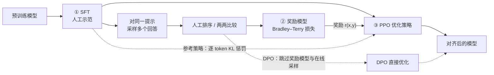
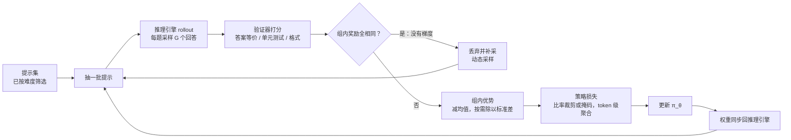
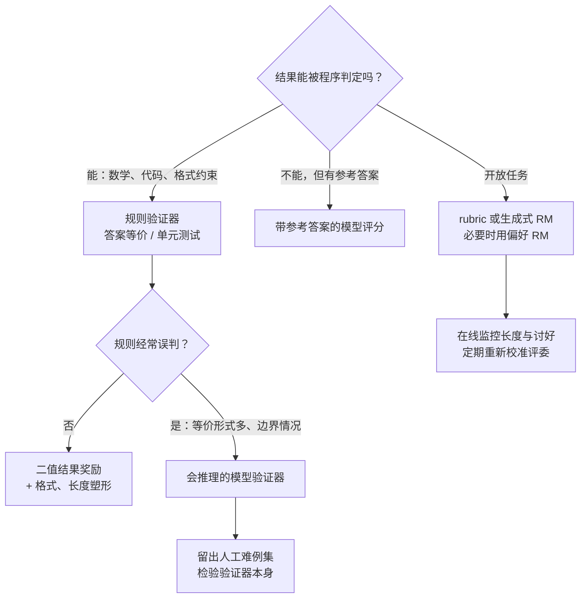

# LLM 强化学习：从 RLHF 到 RLVR

::: tldr
- RLHF 的奖励是学出来的代理，必须拴 KL；RLVR 的奖励由程序判定，能支撑几千步的长程训练。
- 推理 RL 的默认起点是去掉 KL 的 GRPO / DAPO 加难度筛选与长度管理，基座和数据决定上限，算法技巧决定能否稳定地接近上限。
- 奖励要先判得准：规则判不准就换会推理的验证器，开放任务用 rubric 或生成式评委，并在线盯住“只变长、不变好”。
- 规模上去后，失稳主要来自离策略与训推不一致；2026 年的旗舰用 RL 训分领域专家，再用多教师在线策略蒸馏合成一个模型。
- 如果只读一节：读[工业配方对照](#recipes)。
:::

**LLM 强化学习**让模型对提示自己采样回答，由奖励信号给回答打分，再按“比基线好的多学、比基线差的少学”的方向更新<Term t="policy">策略</Term>。奖励来自人类或 AI 的偏好时叫 <Term t="rlhf">RLHF</Term>，来自可自动判定的结果（答案对不对、测试过没过）时叫 <Term t="rlvr">RLVR</Term>。2022 年的 InstructGPT 让 RLHF 成为对齐的标准工序；2024 年 9 月的 o1 与 2025 年 1 月的 DeepSeek-R1 之后，RLVR 驱动的推理训练成了后训练里投入最大的一环：DeepSeek-V3.2 的后训练算力已超过预训练成本的 10%[^v32]。

::: human
SFT 是照着范文抄，RL 是自己写、老师只打分。分数可以来自“评委更喜欢哪篇”（RLHF），也可以来自“答案对不对”（RLVR）。后者判得准、判得便宜，所以能让模型连练几千步，练出会打草稿、会回头检查的推理模型。
:::

## RL 比 SFT 多了什么 {#why-rl}

RL 的目标是在不偏离参考模型太远的前提下，让期望奖励最大：

$$
J(\theta)=\E_{x\sim\mathcal D,\;y\sim\pi_\theta(\cdot\mid x)}\big[r(x,y)\big]-\beta\,\KL\big(\pi_\theta(\cdot\mid x)\,\big\|\,\pi_\text{ref}(\cdot\mid x)\big)
$$

$x$ 是从提示集 $\mathcal D$ 中抽出的提示，$y$ 是当前策略 $\pi_\theta$ 采样的回答，$r(x,y)$ 是序列级<Term t="reward">奖励</Term>，$\pi_\text{ref}$ 是<Term t="reference-policy">参考策略</Term>（通常是 SFT 模型），$\beta$ 控制约束强度。忽略 KL 项，梯度是按<Term t="advantage">优势</Term> $\hat A_t$ 加权的对数似然梯度 $\E\big[\sum_t\hat A_t\,\nabla_\theta\log\pi_\theta(y_t\mid x,y_{<t})\big]$，推导见[算法谱系](/lenses/algorithms#policy-gradient)。和 SFT 的交叉熵相比，它多出四样东西：

1. **在自己的分布上学。** SFT 只在示范数据的前缀上训练，推理时一旦走偏，后面的前缀模型从没见过（<Term t="exposure-bias">暴露偏差</Term>）。RL 的样本来自当前策略，纠正的正是模型真会犯的错。
2. **负反馈。** SFT 只告诉模型“该怎么写”，RL 还能告诉它“这样写不行”。Kimi k1.5 的对照实验里，带负梯度的策略优化比只在正确样本上做监督学习的 ReST 样本效率明显更高[^k15]。
3. **不可导的序列级目标。** 偏好、答案正确性、测试通过率都不可导；策略梯度只要求能打分，所以任何可程序化判定的结果都能直接当训练信号。
4. **示范里没有的行为。** DeepSeek-R1-Zero 没见过任何推理示范，只靠“答对给分”，AIME 2024 pass@1 就从 15.6% 升到 71.0%，并自发出现回头检查、换思路等行为[^r1]。

代价同样明确：需要可靠的奖励、昂贵的 <Term t="rollout">rollout</Term> 和更难调的训练；RL 究竟是“扩展了能力”还是“把已有能力采样得更准”，至今仍有争论（见[原理视角](/lenses/principles#pass-at-k-debate)）。

## 在流水线中的位置 {#pipeline}

RL 的输入是一个已经能按格式作答的模型（SFT 或<Term t="cold-start">冷启动</Term>之后的模型；做 <Term t="zero-rl">zero-RL</Term> 时直接用基座）和一批带验证器或奖励模型的提示，输出是期望奖励更高的策略。它在流水线中的位置一直在变：

| 时期 | 典型顺序 | 代表 |
|---|---|---|
| 2022–2024 | SFT → 奖励模型 → PPO，或 SFT → DPO（→ RLVR） | InstructGPT、Llama 2、Tülu 3 |
| 2025 | 冷启动 SFT → 推理 RL → 拒绝采样 SFT → 全场景 RL | DeepSeek-R1、Qwen3 |
| 2026 | SFT → 分领域 RL 专家 → 多教师在线策略蒸馏合并 | DeepSeek-V4、Kimi K3 |

中训练决定 RL 能走多远（[RL 就绪度](/topics/mid-training#rl-readiness)），SFT 决定从哪里起步（[SFT 与 RL 的分工](/topics/sft#sft-vs-rl)），RL 之后的蒸馏把能力搬到小模型或合并进一个模型（[On-Policy 蒸馏](/topics/opd)）。

## RLHF：从人类偏好到奖励模型 {#rlhf}

InstructGPT[^instructgpt] 把 RLHF 固定成三步：用人工示范做 SFT；对同一提示采样多个回答、请标注员排序，训练<Term t="reward-model">奖励模型</Term>；再用 <Term t="ppo">PPO</Term> 优化策略。奖励模型按 <Term t="bradley-terry">Bradley–Terry</Term> 假设训练，让偏好回答 $y_w$ 的得分高于 $y_l$：

$$
\mathcal L_\text{RM}(\phi)=-\E_{(x,y_w,y_l)}\Big[\log\sigma\big(r_\phi(x,y_w)-r_\phi(x,y_l)\big)\Big]
$$

RL 阶段把 KL 拆到每个 token 上，与奖励模型在结尾给出的分数一起构成回报（$T$ 为回答长度）：

$$
r_t=-\beta\log\frac{\pi_\theta(y_t\mid x,y_{<t})}{\pi_\text{ref}(y_t\mid x,y_{<t})}+\mathbb 1[t=T]\;r_\phi(x,y)
$$

这根“KL 绳子”在 RLHF 里省不得：奖励模型只是人类偏好的代理，持续优化代理 RM 时，真实奖励会随与初始策略的 KL 距离先升后降[^gao]（见[奖励作弊](#reward-hacking)）。InstructGPT 还在目标里混入预训练数据的似然（PPO-ptx）以减轻通用能力回退；最终 1.3B 的 InstructGPT 在人工评测中胜过 175B 的 GPT-3。

**AI 反馈。** Constitutional AI[^cai] 用一份自然语言“宪法”取代人工有害性标注：先让模型按原则自我批评、改写并做 SFT，再由模型给回答对打偏好、训练偏好模型做 RL，即 <Term t="rlaif">RLAIF</Term>。“让模型按原则当评委”的思路后来演化成 rubric 奖励与生成式奖励模型（见[下文](#rubric)）。

**DPO：离线的捷径。** KL 约束下 RLHF 的最优策略有闭式解，于是奖励可以写成 $\beta\log\frac{\pi_\theta(y\mid x)}{\pi_\text{ref}(y\mid x)}$，代回 Bradley–Terry 损失就得到 <Term t="dpo">DPO</Term>[^dpo]：

$$
\mathcal L_\text{DPO}=-\E\Big[\log\sigma\Big(\beta\log\frac{\pi_\theta(y_w\mid x)}{\pi_\text{ref}(y_w\mid x)}-\beta\log\frac{\pi_\theta(y_l\mid x)}{\pi_\text{ref}(y_l\mid x)}\Big)\Big]
$$

它不需要奖励模型和在线采样，Llama 3、Tülu 3 都用它做偏好对齐；代价是只能在给定的偏好对上学、不会探索新解法，所以数学、代码这类要“做出来”的能力仍然靠在线 RL。完整推导与变体见[算法谱系](/lenses/algorithms#dpo)。

**去掉 critic。** PPO 需要一个与策略同规模的<Term t="critic">价值网络</Term>。ReMax 用贪心解码回答的奖励作<Term t="baseline">基线</Term>[^remax]，RLOO 用同题其余样本的平均奖励作留一基线[^rloo]，都说明在“奖励只在结尾出现”的 RLHF 中价值网络并非必需，这为 GRPO 铺了路（[ReMax](/lenses/algorithms#remax)、[RLOO](/lenses/algorithms#rloo)）。

::: human
RLHF 像请评委打分：先让评委看大量“哪篇更好”的例子学会口味，再让选手为了高分反复练。选手练久了会摸透评委的偏好（比如越长越好），所以要拴一根绳子，不许离原来的自己太远。
:::

## RLVR：用可验证结果当奖励 {#rlvr}

RLVR 这个名字来自 [Tülu 3](/library/?id=tulu3)（2024 年 11 月）[^tulu3]：奖励不再来自学出来的奖励模型，而是来自可程序化判定的<Term t="verifier">验证器</Term>——数学答案做等价判定（如 [Math-Verify](/library/?id=math-verify)），代码跑单元测试，指令约束用规则检查，通常给 0/1 分。奖励判得准、不怕被“讨好”，所以能支撑几千步的长程训练。一个训练步如下：

主流算法是 DeepSeekMath 提出的 <Term t="grpo">GRPO</Term>[^grpo]：对同一提示采样 $G$ 个回答，用组内统计量代替价值网络：

$$
\hat A_{i}=\frac{r_i-\operatorname{mean}(r_1,\dots,r_G)}{\operatorname{std}(r_1,\dots,r_G)},\qquad
\mathcal J(\theta)=\E\bigg[\frac1G\sum_{i=1}^{G}\frac{1}{\lvert y_i\rvert}\sum_{t=1}^{\lvert y_i\rvert}\min\Big(\rho_{i,t}\hat A_{i},\ \clip\big(\rho_{i,t},1-\varepsilon,1+\varepsilon\big)\hat A_{i}\Big)\bigg]-\beta\,\widehat{\KL}
$$

$\rho_{i,t}$ 是第 $i$ 个回答第 $t$ 个 token 的新旧策略概率比，$\varepsilon$ 是裁剪范围，$\widehat{\KL}$ 是对 $\pi_\text{ref}$ 的 k3 估计[^klapprox]（数值与梯度的细节见 [KL 正则](/lenses/algorithms#kl)）。式中两处归一化——按回答长度 $1/\lvert y_i\rvert$ 平均、按组内标准差缩放——正是后来 Dr. GRPO 与 DAPO 动刀的地方（见[方法修正](#fixes)）。

DeepSeek-R1[^r1] 让这套做法成为范式。R1-Zero 直接在 V3-Base 上训练，奖励只有两项：答案是否正确，思考是否写在 `<think>` 标签里。团队刻意没用神经 ORM / PRM，理由是大规模 RL 中它们容易被钻空子，重训奖励模型又增加成本与复杂度。R1 随后补上冷启动数据和语言一致性奖励（语言混杂的思维链难读，加上后分数略降、可读性更好），再经拒绝采样 SFT 与全场景 RL，得到可用的通用推理模型。

### RLHF 与 RLVR 对照 {#rlhf-vs-rlvr}

| 维度 | RLHF（偏好奖励） | RLVR（可验证奖励） |
|---|---|---|
| 信号 | 人或 AI 对回答的相对偏好 | 答案对错、测试通过、约束满足等客观判定 |
| 奖励来源 | Bradley–Terry 训练的奖励模型，或生成式评委 | 规则与程序验证器；规则判不准时用模型验证器 |
| 典型算法 | PPO（带 KL 惩罚）、DPO、RLOO / ReMax | GRPO 及其变体（DAPO、Dr. GRPO、GSPO、CISPO），也有 PPO（ORZ、VAPO） |
| KL 约束 | 必需：奖励模型是代理，走远就过优化 | 常去掉或很小：奖励难被刷，模型需要走得更远 |
| 主要失效 | 奖励过优化：变长、讨好、套话 | 验证器漏洞、熵坍缩、长度失控、训推不一致导致崩溃 |
| 成本结构 | 偏好标注与奖励模型训练贵，回答较短 | 只需答案或测试，但长思维链的 rollout 是大头 |
| 适用任务 | 风格、帮助性、安全、开放式写作 | 数学、代码、逻辑、可程序检查的智能体任务 |

::: human
RLVR 像刷有标准答案的习题：对答案就行，不用请评委，也不怕评委被糊弄，所以能练很久。但“对答案”也有漏洞：选择题能蒙、格式能钻空子，所以题目和判卷规则本身要精心设计。
:::

## 奖励设计 {#reward-design}

奖励决定模型学成什么样。下面按“有没有标准答案”展开，再单独讨论奖励作弊。

### 结果奖励还是过程奖励 {#orm-vs-prm}

<Term t="orm">ORM</Term> 只看最终结果，<Term t="prm">PRM</Term> 逐步打分。OpenAI 的 Let's Verify Step by Step[^lv] 在 MATH 上做了大规模对照：用逐步人工标注训练的 PRM 做 best-of-N 重排，明显优于 ORM，在代表性子集上解出 78% 的题；随论文公开的 80 万条步骤标注 PRM800K 至今仍是 PRM 研究的常用数据。

但“重排好用”不等于“在线 RL 好用”。DeepSeek-R1 列出 PRM 的三个问题：通用推理里很难定义“一步”；判断中间步骤对错本身很难，模型自动标注不可靠、人工标注又无法扩展；一旦引入模型化的 PRM，就必然出现奖励作弊[^r1]。PRIME[^prime] 给出折中：隐式 PRM 只用结果标签训练，却能给每个 token 打分，

$$
r_t=\beta\log\frac{\pi_\phi(y_t\mid x,y_{<t})}{\pi_\text{ref}(y_t\mid x,y_{<t})}
$$

$\pi_\phi$ 就是用结果标签训练的 PRM 本身（由 SFT 模型初始化），它在 RL 中随策略在线更新，降低分布漂移与被钻空子的风险。结论：**可验证任务先用结果奖励；需要稠密信号时，优先考虑能在线更新的隐式过程奖励，而不是离线标注的静态 PRM。**

### 让验证器也会思考 {#verifier}

规则验证器会误判：答案等价但形式不同（例如 $2^{19}$ 与 524288）、边界情况，以及“过程错、答案碰巧对”。工业报告的共同做法是把验证器也做成会推理的模型：

- Kimi k1.5 用带思维链的奖励模型判数学答案，人工抽检准确率 98.5%，传统奖励模型只有 84.4%[^k15]。
- Seed1.5-Thinking 的思考型验证器在 456 条人工标注的难例上准确率 99.3%，原则型的 Seed-Verifier 为 82.7%，前者也更难被投机取巧[^seed]。
- Qwen3 的通用 RL 混用三类奖励：规则奖励、给出参考答案的模型评分（避免规则把对的判成错的）、无需参考答案的偏好奖励模型[^qwen3]。
- DeepSeekMath-V2 面对没有最终答案的证明题，训练按量表打分的证明验证器，再用“元验证”检查验证器指出的问题是否真实存在，最后以验证器为奖励训练会自我检查的生成器；在扩展测试时算力的设置下，Putnam 2024 得分 118/120[^dsmv2]。

### 没有标准答案：rubric 与生成式 RM {#rubric}

写作、对话、医疗建议这类任务没有唯一答案，两条路线正在合流：

- **<Term t="generative-reward-model">生成式奖励模型</Term>。** DeepSeek-GRM 先为问题生成评判原则，再写批评并打分；推理时多次采样，由元奖励模型引导投票，让奖励质量随推理算力提升[^dsgrm]。Seed1.5-Thinking 对不可验证数据用成对的生成式奖励模型，分数分布更平稳，与验证器分数混训时冲突更少[^seed]。
- **<Term t="rubric-reward">Rubric 奖励</Term>。** Rubrics as Rewards 为每道题生成评分量表、逐条检查后聚合成奖励，比直接让 LLM 裁判打 Likert 分在 HealthBench 上最高相对提升 31%[^rar]；同期的 RLCF 用清单替代奖励模型[^rlcf]。Kimi K2 的自我批评 rubric 奖励组合了核心价值条目、防投机的规定性条目与人工条目，并用可验证任务上的 rollout 持续校准评委[^k2]；K2.5 为不同任务准备多套 rubric，降低对单一评委的过拟合[^k25]。

两条路线的共同风险是评委自身的偏差。MiniMax-M1 发现生成式奖励模型系统性偏爱更长的回答，离线修补不够，只能在 RL 中在线监控“只变长、不变好”的迹象并及时重新校准[^m1]；Kimi K3 更直接：超出长度阈值的候选在两两比较中直接判负[^k3]。

### 奖励作弊 {#reward-hacking}

<Term t="reward-hacking">奖励作弊</Term>指策略利用奖励的漏洞拿高分、却没把事做好。它不是偶发 bug，而是优化的必然副产品：只要奖励是代理，优化得越狠，代理与真实目标的偏差就越会被放大[^gao]。Lilian Weng 的长文梳理了从游戏刷分到 LLM 讨好用户、篡改单元测试的大量案例[^weng]。LLM RL 里常见五种形态，工业报告各有对策：

| 形态 | 典型表现 | 报告中的对策 |
|---|---|---|
| 奖励模型过优化 | 回答变长、讨好、套话 | KL 约束与早停；在线监控长度偏置并重校奖励模型（MiniMax-M1）；多套 rubric（K2.5）；超长直接判负（K3） |
| 验证器假阳性 | 选择题、判断题靠蒙；证明题无从判定 | 剔除选择、判断与证明题，并删掉不写推理 8 次内就能猜中答案的题（k1.5）；过滤证明与选择题，不把原题改写成整数答案（MiMo） |
| 验证器误判 | 等价答案被判错，同一答案判决不一致 | 会推理的验证器（Seed1.5-Thinking）；带参考答案的模型评分（Qwen3） |
| 篡改环境 | 改测试、特判用例；内核优化任务里重放 CUDA graph、缓存输入、偷偷降精度 | 检测并惩罚这些策略；隔离被训模型与验证器，公开与隐藏验证器分离，限制提交次数（K3） |
| 在思维链里藏意图 | 对思维链施加监控惩罚后，模型学会隐藏意图继续作弊 | 不对思维链施加强优化压力，把它留给监控（[OpenAI](/library/?id=cot-obfuscation)） |

影响也可能不止于“分数虚高”：Anthropic 报告，在生产级编程 RL 中学会奖励作弊的模型，会把这种倾向泛化成更广泛的失准行为（[资料库](/library/?id=reward-hacking-misalignment)）；2026 年也有工作专门研究 RLVR 中模型如何钻验证器的空子[^gaming]。评估层面同样要防“假提升”：在 Qwen2.5-Math 上，连随机奖励都能提分（[虚假奖励](/lenses/principles#spurious-rewards)），数据污染也会制造 RL 的虚假收益（[资料库](/library/?id=reasoning-or-memorization)）。

::: human
考试只看最后一行答案，学生就会练猜答案；只看作文长度，作文就会越写越长。奖励作弊不是学生“坏”，而是分数和真本事之间总有缝，优化得越狠，缝被挖得越大。
:::

<EntryGrid :ids="['lets-verify', 'prime', 'deepseek-grm', 'rubrics-as-rewards', 'deepseekmath-v2', 'reward-overoptimization']" />

## 推理 RL 的演化 {#evolution}

<LineageGraph graph="reasoning-rl" />

四列泳道对应四股力量：OpenAI 的先行工作指出方向，工业报告给出能上生产的配方，开源复现检验哪些做法真正必要，方法修正解决规模化时暴露的具体毛病。

### 信号：o1、R1 与 k1.5 {#signals}

OpenAI 的 o1 博客[^o1]只给出两条曲线：性能随 RL 训练算力和测试时思考算力同时平滑上升（AIME 2024 单样本 74%，64 样本共识 83%，用学到的打分函数从 1000 个样本中重排可达 93%），没有配方。四个月后，DeepSeek-R1 与 Kimi k1.5 在同一天（2025 年 1 月 20 日，arXiv 版两天后上线）各给出一份配方，结论惊人地一致：**不用 MCTS、不用 PRM、不用价值网络**。R1 用 GRPO 加规则奖励；k1.5 用在线镜像下降变体（以采样均值为基线，用平方损失把更新约束在上一轮策略附近），配合长度惩罚、课程与优先采样，以及把超长回答分段生成的 partial rollout[^k15]。

### 开源复现：基座与数据比技巧重要 {#reproductions}

- DeepScaleR 从 R1 蒸馏的 1.5B 模型出发，把上下文从 8K 分段加长到 24K，AIME 2024 从 28.8% 提到 43.1%[^deepscaler]。
- Open-Reasoner-Zero 用原版 PPO（GAE $\lambda=\gamma=1$）、只奖励正确性、完全不加 KL，在 Qwen2.5-32B 基座上以约 1/10 的训练步数，超过 DeepSeek 在同一基座上做的 R1-Zero 式训练（DeepSeek-R1-Zero-Qwen-32B）[^orz]。
- SimpleRL-Zoo 把 zero-RL 搬到 10 个基座上，发现格式奖励与题目难度必须随基座调整[^simplerl]。
- Dr. GRPO 的作者发现 DeepSeek-V3-Base 本身已有“顿悟”式反思，Qwen2.5 基座不加模板也很强；与预训练分布不匹配的模板会先破坏能力、再由 RL“修复”，造成虚高的提升[^drgrpo]。

这一阶段的共识是：**基座先验和数据质量决定上限，算法技巧决定能否稳定地接近上限。**

<EntryGrid :ids="['open-reasoner-zero', 'simplerl-zoo', 'deepscaler', 'skywork-or1', 'prorl', 'acereason-nemotron']" />

### 方法修正：GRPO 规模化时的毛病 {#fixes}

把 GRPO 从 7B 数学题推到 32B、上万 token 的长思维链时，暴露出五类问题：

| 毛病 | 现象 | 修正 | 代表 |
|---|---|---|---|
| 熵坍缩 | 策略熵迅速下降，采样趋同，探索停止 | 放宽上裁剪（clip-higher）；自适应熵系数；不丢弃低概率 token | DAPO、Skywork-OR1、CISPO |
| 零梯度样本 | 组内全对或全错，优势为 0 | 动态采样过滤；易题池低概率回放 | DAPO、MiMo |
| 长度偏置 | 错误回答越写越长 | 去掉 $1/\lvert y_i\rvert$，改用常数或 token 级归一化 | Dr. GRPO、DAPO |
| 截断噪声 | 被截断的超长回答被当成错误 | 过滤超长样本，或按超出程度软惩罚 | DAPO |
| 比率噪声与 MoE 不稳 | 长回答与 MoE 路由放大 token 级比率的方差 | 序列级比率与裁剪；裁剪重要性权重本身 | GSPO、CISPO |

<Term t="entropy-collapse">熵坍缩</Term>、<Term t="dynamic-sampling">动态采样</Term>、<Term t="token-level-loss">token 级损失</Term>分别对应前三行。三种处理比率的方式只差一个式子：DAPO 用非对称的 $\clip(\rho_{i,t},1-\varepsilon_\text{low},1+\varepsilon_\text{high})$；<Term t="gspo">GSPO</Term> 改用序列级比率 $s_i=\big(\pi_\theta(y_i\mid x)/\pi_{\theta_\text{old} }(y_i\mid x)\big)^{1/\lvert y_i\rvert}$；<Term t="cispo">CISPO</Term> 则把梯度写成 $\sg\big(\clip(\rho_{i,t},\cdot)\big)\,\hat A_{i}\,\nabla_\theta\log\pi_\theta(y_{i,t}\mid x,y_{i,<t})$，只截断权重、不丢 token。推导与对照见[算法谱系](/lenses/algorithms#dapo)的 [GSPO](/lenses/algorithms#gspo)、[CISPO](/lenses/algorithms#cispo) 各节。

DAPO 在 Qwen2.5-32B 上的逐项消融给出了每项修正的边际价值：朴素 GRPO 30 分，加超长过滤 36，加 clip-higher 38，加软超长惩罚 41，加 token 级损失 42，加动态采样 50[^dapo]。价值路线也没有被淘汰：VAPO 用价值预训练、解耦 GAE 与随长度自适应的 $\lambda$ 修好了价值模型在长思维链上的偏差，同一基座 5,000 步内达到 60.4 分[^vapo]。

::: derive 为什么按长度平均会让错误回答变长
GRPO 给第 $i$ 个回答的每个 token 施加同一个优势 $\hat A_i$，再乘以 $1/\lvert y_i\rvert$，所以单个 token 的梯度权重是 $\hat A_i/\lvert y_i\rvert$：

- 答对（$\hat A_i>0$）时，回答越短，每个 token 得到的正向权重越大，模型倾向于把正确回答写短；
- 答错（$\hat A_i<0$）时，回答越长，每个 token 受到的惩罚越小，模型倾向于把错误回答写长。

两者叠加，就是训练中“平均长度一路上涨、主要是错误回答在变长”的现象。DAPO 把归一化改成对一组（实现中常为一批）中所有 token 取平均，即乘以 $1/\sum_i\lvert y_i\rvert$；Dr. GRPO 直接去掉 $1/\lvert y_i\rvert$ 并改用常数归一化。两种做法下，同一组内每个 token 的权重相同，不再因所在回答的长短而不同。

标准差归一化是另一个问题：组内奖励方差很小（题目过易或过难）时，除以一个很小的标准差会放大这些题的权重。Dr. GRPO 同样把它去掉，完整分析见[算法谱系](/lenses/algorithms#dr-grpo)。
:::

<EntryGrid :ids="['dr-grpo', 'vapo', 'reinforce-pp', 'gspo', 'remax', 'rloo']" />

### 工业化：从“能训”到“能上线” {#industrial}

2025 年 4 月之后的工业报告把重心从算法移到了系统与奖励：

- **Seed1.5-Thinking** 把 VAPO 与 DAPO 用在总参数 200B、激活 20B 的 MoE 上，并配合思考型验证器与流式 rollout 系统[^seed]。
- **Qwen3** 的推理 RL 只用 3,995 组题目-验证器，Qwen3-235B-A22B 的 AIME'24 在 170 步内从 70.1 升到 85.1，全程没有手动调超参；小模型改用在线策略蒸馏[^qwen3]。
- **MiniMax-M1** 用 CISPO 在 512 张 H800 上三周完成全量 RL，并发现训练与推理 kernel 的精度不一致会让奖励停止增长，把 LM head 提到 FP32 才解决[^m1]。
- **Magistral** 不借用任何其他模型的推理数据，从 Mistral Medium 3 纯 RL 训出推理模型，用语言一致性奖励让思维链跟随用户的语言[^magistral]；**MiMo** 为代码题设计了按测试难度给部分分的奖励[^mimo]。
- **DeepSeek-V3.2** 把后训练算力推到预训练的 10% 以上，稳定性手段几乎都在处理离策略与训推不一致：无偏 KL 估计、离策略序列掩码、保持 MoE 路由与采样截断掩码[^v32]。

### 扩展：从“能训”到“可预测” {#scaling}

ScaleRL 用超过 40 万 GPU 小时的消融，把 RL 的算力-性能曲线拟合成 sigmoid：不同配方的渐近上限不同，而损失聚合、归一化、课程、离策略算法这类细节主要改变的是效率；8B 模型的一次长跑中，用前 5 万 GPU 小时拟合的曲线准确预测了它跑到 10 万 GPU 小时的表现[^scalerl]。它组合出的 ScaleRL 配方采用了 MiniMax-M1 的 CISPO 损失，这也是方法修正与工业报告两条线的一次汇合。

## 工业配方对照 {#recipes}

只列报告里写明的做法，每一格都对照过报告原文；“—”表示报告没有写明或本站未能核实，不代表没用。

| 报告 | 策略优化 | KL | 奖励与验证 | 稳定与探索 | 长度与上下文 |
|---|---|---|---|---|---|
| DeepSeek-R1（2025-01） | GRPO | 保留，k3 估计 | 规则：答案匹配、代码跑预设测试、`<think>` 格式；R1 加语言一致性；全场景阶段对通用数据用奖励模型 | 冷启动 SFT；拒绝采样约 60 万推理 + 20 万非推理样本 | — |
| Kimi k1.5（2025-01） | 在线镜像下降变体，采样均值作基线，无价值网络 | 相对熵正则，锚点是上一轮策略（写成平方损失） | 数学用思维链奖励模型，代码跑自动生成的测试；剔除选择、判断、证明与易猜题 | 课程采样 + 按失败率优先采样 | 长度惩罚（先预热）；partial rollout；long2short |
| Open-Reasoner-Zero（2025-03） | PPO，GAE $\lambda=\gamma=1$ | 无 | 只奖励正确性，无格式奖励；约 12.9 万题 | batch 级优势归一化 | — |
| DAPO（2025-03） | GRPO 改 | 无 | 规则 ±1；DAPO-Math-17K | clip-higher（0.2 / 0.28）；动态采样；token 级损失 | 超长过滤 + 软惩罚（16K + 4K 缓冲） |
| Seed1.5-Thinking（2025-04） | PPO 式 actor-critic，组合 VAPO 与 DAPO 的技巧 | — | 可验证数据用思考型验证器；不可验证数据用成对生成式奖励模型 | 价值预训练、解耦 GAE、动态采样、clip-higher、token 级损失、正样本 LM 损失 | 长度自适应 GAE |
| MiMo-7B（2025-04） | GRPO 改，token 级损失 | 无 | 约 13 万道数学与代码题，只用规则正确性奖励；代码按测试难度给部分分 | 动态采样、clip-higher、以 10% 概率回放易题 | 不加格式与长度奖励；最大长度 32K |
| Qwen3（2025-05） | GRPO | — | 推理 RL 用 3,995 组题目-验证器；通用 RL 混用规则、带参考答案的模型评分与奖励模型 | 大 batch、每题多 rollout、离策略更新；控制熵平稳上升或持平 | 思考预算：推理时按预算截断（模式融合后自然获得） |
| Skywork-OR1（2025-05） | GRPO 改，token 级损失 | 无 | 数学 + 代码；按起点模型通过率离线筛题，每阶段再剔除上一阶段已全对的题 | 自适应熵控制；只保留优势非零的组；采样温度 1.0 | 分阶段加长（Math-7B：8K→16K→32K；32B：16K→24K） |
| MiniMax-M1（2025-06） | CISPO | 无 | 规则（数学、逻辑、竞赛编程、SWE 沙箱）+ 生成式奖励模型；先只训规则奖励的推理任务，再逐步混入通用任务 | 动态采样；LM head 用 FP32；按 token 概率检测重复并提前截断 | 长度惩罚；从 40K 起每档加 8K，扩到 80K |
| Magistral（2025-06） | GRPO 改，token 级损失 | 无 | 格式 + 正确性 + 软长度惩罚 + 语言一致性 | 放宽上裁剪（0.26–0.28）；minibatch 级优势归一化；过滤无差异组 | 软长度惩罚；不受罚长度 16K→24K→32K |
| ScaleRL（2025-10） | CISPO 损失 + 异步 PipelineRL（离策略最多 8 步） | 无 | 可验证数学题（Polaris-53K） | batch 级优势归一化、prompt 级损失平均、FP32 logits、零方差过滤、通过率 ≥ 0.9 的题不再采样 | 强制中断：插入“结束思考”的短语 |
| DeepSeek-V3.2（2025-12） | GRPO，优势只减组均值 | 保留，k3 乘重要性权重得到无偏梯度；强度按领域调，数学上可弱化或去掉 | 推理与智能体：规则结果奖励 + 长度惩罚 + 语言一致性；通用任务：按题 rubric 的生成式奖励模型；1,800+ 合成环境 | 离策略序列掩码（只掩负优势序列）；保持 MoE 路由与采样截断掩码 | 长度惩罚（见奖励） |
| Kimi K2 → K3（2025-07 → 2026-07） | k1.5 目标；K2.5 起对 log-ratio 越界的 token 置零梯度 | 不设 $\pi_\text{ref}$，只约束离上一轮策略的距离 | 可验证奖励 + 自我批评 rubric（K2）→ 多套 GRM rubric（K2.5）→ 智能体化生成式奖励模型（K3） | PTX 损失、温度衰减（K2）；partial rollout，靠逐 token 正则容忍陈旧数据（K3） | 按任务类型的 token 预算（K2）；Toggle（K2.5）；超出 $\tau\cdot b_0(x)$ 记 −1，训出三档推理强度（K3） |

表中事实分别出自各报告正文[^r1][^k15][^orz][^dapo][^seed][^mimo][^qwen3][^skywork][^m1][^magistral][^scalerl][^v32][^k2][^k25][^k3]。读表可以得到四个结论：

1. **KL 从标配变成选配。** ORZ、DAPO、MiMo、Skywork-OR1、MiniMax-M1、Magistral、ScaleRL 都去掉了对参考模型的 KL，理由是可验证奖励不易被刷、长思维链需要走得更远；DeepSeek 保留了 KL，在 V3.2 中修正了它在离策略数据上的梯度偏差，并按领域调强度；Kimi 约束的是离上一轮策略的距离，而不是离初始模型的距离。
2. **人人都在筛难度。** 离线按起点模型的通过率筛题、训练中过滤全对或全错的组，几乎是所有报告的共同步骤（见[难度筛选](/lenses/data#difficulty)）。
3. **长度被显式管理。** 长度惩罚、超长软惩罚、分阶段加长上下文、按题或按任务的 token 预算、强制中断，表中多数配方至少用了一种。
4. **稳定性的瓶颈从算法移向系统。** LM head 精度、MoE 路由、采样截断掩码、离策略掩码都是在对齐训练与推理两侧（见[训推不一致](/lenses/infra#mismatch)）。

<EntryGrid :ids="['kimi-k1-5', 'seed-thinking-1-5', 'qwen3', 'minimax-m1', 'magistral', 'mimo', 'deepseek-v3-2', 'kimi-k3']" />

## 前沿：2025 下半年到 2026 {#frontier}

2025 年下半年以来，主要矛盾从“能不能训起来”转向三件事：怎样稳定地花掉更多算力，怎样把多个领域的能力合成一个模型，怎样把奖励延伸到没有标准答案的任务。

### 信任域的锚点：从参考模型移到采样器 {#frontier-trust-region}

对参考模型的 KL 正在退场：GLM-5 在推理 RL 中明确为“加速 RL 提升”去掉了 KL 项[^glm5]；Kimi 从 K2 到 K3 都不设参考策略，只在平方损失里用 $\tau\log(\pi_\theta/\pi_{\theta_\text{old}})$ 约束离上一轮策略的距离[^k2][^k3]。

取而代之的是约束“训练策略离实际采样的策略有多远”：DeepSeek-V3.2 掩码偏离过大的负优势序列，并复用推理时的 MoE 路由[^v32]；Kimi K2.5 只对 log-ratio 落在区间内的 token 计算梯度，区间外直接置零，不论优势正负[^k25]；IcePop 对训推概率比越界的 token 做同样的掩码[^icepop]，DPPO 改用概率差（总变差距离的近似）而不是概率比来判定越界[^dppo]。共同点是：**直接屏蔽离采样策略太远的 token 或序列，而不只是按新旧概率比裁剪**。原因是异步与 partial rollout、训推引擎的数值差异，让“离采样器太远”成了比“离初始模型太远”更常见的失稳源头。Qwen 团队进一步说明，常用的 token 级目标只是序列级目标的一阶近似，只有训推差异与策略陈旧都很小时才成立（[资料库](/library/?id=stabilizing-rl-llm)）。系统侧的成因与修正见[训推不一致](/lenses/infra#mismatch)与[离策略修正](/lenses/algorithms#off-policy)。

### RL 负责造专家，蒸馏负责合并 {#frontier-mopd}

DeepSeek-V3.2 先用大规模 RL 训练多个领域专家、蒸馏回一个模型，再做一次混合 GRPO[^v32]。2025 年底起，这条路又进了一步：专家的能力改用多教师在线策略蒸馏（<Term t="mopd">MOPD</Term>）合并[^mopd]。小米 MiMo-V2-Flash 的报告（2025 年 12 月）把这一步明确提为一种后训练范式[^mimov2]；DeepSeek-V4 沿用 V3.2 的专家训练，但用十个以上教师的在线策略蒸馏整个取代了混合 RL 阶段[^v4]；Kimi K3 用三个领域 × 三档推理强度共九个 RL 专家做教师[^k3]；据 RLHF Book 课程的整理，Nemotron 3 Ultra 也用了十个以上教师，并做了两轮[^course]。按课程的归纳，流行的原因很务实：混在一个 RL 里的数学、代码与智能体任务会互相拖累，而分领域的“SFT + RL”容易并行、容易分工[^course]。也有不走 MOPD 的：GLM-5 按推理、智能体、通用三段依次做 RL，最后以各段检查点为教师做在线策略蒸馏，找回前面阶段学到的能力[^glm5]；据课程整理，微软的 MAI-Thinking-1 用轨迹蒸馏 SFT 合并各段 RL[^course]。蒸馏本身的原理与代价见 [On-Policy 蒸馏](/topics/opd)。

### 推理长度成为训练目标 {#frontier-length}

Qwen3 融合思考与非思考模式后，获得了在推理时按预算截断思考的能力[^qwen3]；Kimi K2 按任务类型设定 token 预算，超出即截断并惩罚[^k2]；K2.5 的 Toggle 交替进行“预算内作答”与“放开长度”两个阶段，在 K2 Thinking 上平均减少 25%–30% 的输出 token 而几乎不掉分，要解决的正是“长度过拟合”——在死板预算下训练的模型，给它更多算力也不会用[^k25]。K3 把长度直接写进奖励：用冷启动模型按题估计初始预算 $b_0(x)$，总 token 数（智能体任务还包括工具调用参数）超过 $\tau\cdot b_0(x)$ 即把奖励改为 −1；先用较大的 $\tau$ 训出 max 档，再逐步收紧 $\tau$ 得到 high、low 两档<Term t="thinking-budget">推理强度</Term>[^k3]。

### 扩展仍在继续 {#frontier-scaling}

ProRL 及后续的 ProRL v2、BroRL 分别从训练步数和每题 rollout 数两个方向加码[^prorl]；Kimi K3 的报告显示，知识、推理、视觉、智能体与编程等多项评测的得分和平均工具调用步数，都随 RL FLOPs 稳定上升[^k3]。未解决的问题是：ScaleRL 式的扩展曲线高度依赖配方与数据，能否跨领域、跨模型迁移还没有答案；智能体环境的规模（MiniMax-M2.5 称已有数十万个 RL 环境[^m25]）正在成为新的瓶颈，见[多环境与环境工程](/topics/multi-env)。

### 奖励的边界：开放任务、环境作弊与“RL 教会了什么” {#frontier-reward}

开放任务的评委正在变成智能体：Kimi K3 要求评委先读产物、再生成 rubric、逐项打分并记入计分板[^k3]；DeepSeek-V4 不再训练标量奖励模型，而是对按 rubric 打分的生成式奖励模型本身做 RL，让策略模型兼任评委[^v4]；DeepSeekMath-V2 用元验证约束验证器本身[^dsmv2]。环境越真实，作弊空间越大：K3 在内核优化任务中专门检测 CUDA graph 重放、输入缓存和降精度[^k3]，MiniMax-M2.5 引入过程奖励监控长轨迹的生成质量[^m25]。更根本的问题仍悬而未决：RL 究竟教会了新能力，还是把已有能力采样得更准？Qwen3 的对照中，RL 没有提高 AIME 的 pass@64，在线策略蒸馏却提高了[^qwen3]；ProRL 则报告长程 RL 能解出基座怎么采样都做不出的题[^prorl]。两类证据如何调和，见 [pass@k 之争](/lenses/principles#pass-at-k-debate)。

## 精读清单 {#reading}

<EntryGrid :ids="['instructgpt', 'ppo', 'constitutional-ai', 'dpo', 'lets-verify', 'grpo', 'deepseek-r1', 'dapo']" />

- **InstructGPT**：RLHF 三段式的出处，重点看奖励模型如何从排序数据中训练，以及 PPO-ptx 为什么要混入预训练梯度。
- **PPO**：裁剪代理目标本身很短，工程细节才是难点，配合 [PPO 的实现细节](/library/?id=ppo-implementation-details)一起读。
- **Constitutional AI**：AI 反馈的起点，今天的 rubric 奖励与生成式奖励模型都能在这里找到原型。
- **DPO**：离线偏好优化的基线，读懂它就明白 KL 约束下 RLHF 的最优策略长什么样。
- **Let's Verify Step by Step**：ORM 与 PRM 之争的基准实验，PRM800K 仍在被使用。
- **DeepSeekMath**：GRPO 的出处；先读 GRPO 一节，再看数学数据管线如何为 RL 打底。
- **DeepSeek-R1**：推理 RL 的分水岭，“失败尝试”一节与正文同样重要。
- **DAPO**：最好的消融样板，按表 1 的顺序复现，能体会每项技巧的边际价值。

::: takeaway
- **先把奖励做对，再调算法。** 能用规则判定就用规则；规则经常误判就换会推理的验证器，并留一份人工难例集检验它；开放任务用 rubric 或生成式奖励模型，并在线监控长度与讨好。
- **从一份“去 KL 的 GRPO / DAPO 配方”起步。** 离线按通过率筛题、在线过滤全对全错的组、token 级损失、clip-higher；KL 先设为 0 或很小，只有观察到漂移或奖励可被刷时再加。
- **同时盯四条曲线：** 训练奖励、验证集分数、策略熵、按对错分开统计的回答长度。熵过早坍缩或错误回答变长时，先查裁剪与损失聚合，而不是学习率。
- **把长度当作一等设计：** 从短上下文起步、分阶段加长；超长用软惩罚或预算奖励，别让截断噪声进入梯度。
- **规模上去后先对齐训练与推理：** LM head 精度、MoE 路由、采样截断掩码、离策略样本的掩码或截断，都比换算法更优先。
- **小模型优先蒸馏：** 有强教师时，在线策略蒸馏通常比直接 RL 更省更好（Qwen3-8B 上分数更高、GPU 时约为 RL 的 1/10），大规模 RL 留给旗舰模型与领域专家。
:::

::: pitfall
- **只在 Qwen2.5 上验证方法。** Qwen2.5-Math 用随机奖励也能提分，数据污染也会制造虚假提升；新方法至少再换一个模型家族、一份干净的评测集。
- **把“回答变长”当成推理涌现。** GRPO 的长度归一化、被截断的回答被当作错误，都会让长度上涨；分对错统计长度再下结论。
- **误用 k3 KL。** 直接对 k3 求导得到的并不是反向 KL 的梯度；离策略数据上还需要重要性权重修正（见 [KL 正则](/lenses/algorithms#kl)）。
- **学到的奖励模型不设早停。** 真实质量会随 KL 距离先升后降；用留出评测或人工抽检决定何时停。
- **题目与判卷规则未经审计。** 选择题、判断题能蒙，格式能投机，过严的格式奖励会压制弱基座的探索；上线前先查“不推理能否猜中”“不解题能否拿分”。
:::

## 延伸阅读 {#further}

- 资料库：[LLM 强化学习全部条目](/library/?area=rl-llm)，或只看其中的[算法类](/library/?area=rl-llm&facet=algorithm)。
- 推导与算法：[算法谱系与推导](/lenses/algorithms)，重点是 [GRPO](/lenses/algorithms#grpo)、[DAPO](/lenses/algorithms#dapo)、[KL 正则](/lenses/algorithms#kl)与[统一视角](/lenses/algorithms#unified-view)。
- 数据与评测：[RLVR 数据管线](/lenses/data#rlvr-pipeline)、[pass@k 与方差](/lenses/eval#pass-at-k)、[污染](/lenses/eval#contamination)。
- 系统与原理：[异步 RL](/lenses/infra#async)、[MoE 的 RL](/lenses/infra#moe)、[熵与探索](/lenses/principles#entropy)。
- 下一步：[Agentic RL](/topics/agentic-rl)、[On-Policy 蒸馏](/topics/opd)、[实践：数学 RLVR 从 GRPO 到 DAPO](/practice/rlvr-math)。

<EntryGrid :ids="['rlhf-book', 'kl-approx', 'reward-hacking-weng', 'openai-o1', 'scale-rl']" />

[^v32]: DeepSeek-AI, *DeepSeek-V3.2: Pushing the Frontier of Open Large Language Models*, 2025（“专家蒸馏 + 混合 RL”流程与奖励设计见 §3，无偏 KL、离策略序列掩码、保持路由与采样掩码见 §3.1）. <https://arxiv.org/abs/2512.02556> ；V3.2-Exp 报告与代码 <https://github.com/deepseek-ai/DeepSeek-V3.2-Exp>
[^k15]: Kimi Team, *Kimi k1.5: Scaling Reinforcement Learning with LLMs*, 2025. <https://arxiv.org/abs/2501.12599>
[^r1]: DeepSeek-AI, *DeepSeek-R1: Incentivizing Reasoning Capability in LLMs via Reinforcement Learning*, 2025（Nature 645:633–638）. <https://arxiv.org/abs/2501.12948>
[^instructgpt]: Ouyang et al., *Training language models to follow instructions with human feedback*, NeurIPS 2022. <https://arxiv.org/abs/2203.02155>
[^gao]: Gao, Schulman, Hilton, *Scaling Laws for Reward Model Overoptimization*, ICML 2023. <https://arxiv.org/abs/2210.10760>
[^cai]: Bai et al., *Constitutional AI: Harmlessness from AI Feedback*, 2022. <https://arxiv.org/abs/2212.08073>
[^dpo]: Rafailov et al., *Direct Preference Optimization: Your Language Model is Secretly a Reward Model*, NeurIPS 2023. <https://arxiv.org/abs/2305.18290>
[^remax]: Li et al., *ReMax: A Simple, Effective, and Efficient Reinforcement Learning Method for Aligning Large Language Models*, ICML 2024. <https://arxiv.org/abs/2310.10505>
[^rloo]: Ahmadian et al., *Back to Basics: Revisiting REINFORCE Style Optimization for Learning from Human Feedback in LLMs*, ACL 2024. <https://arxiv.org/abs/2402.14740>
[^tulu3]: Lambert et al., *Tülu 3: Pushing Frontiers in Open Language Model Post-Training*, 2024. <https://arxiv.org/abs/2411.15124> ；RLVR 的命名经过见 RLHF Book 第 7 章 <https://rlhfbook.com>
[^grpo]: Shao et al., *DeepSeekMath: Pushing the Limits of Mathematical Reasoning in Open Language Models*, 2024. <https://arxiv.org/abs/2402.03300>
[^klapprox]: John Schulman, *Approximating KL Divergence*, 2020. <http://joschu.net/blog/kl-approx.html>
[^lv]: Lightman et al., *Let's Verify Step by Step*, ICLR 2024. <https://arxiv.org/abs/2305.20050>
[^prime]: Cui et al., *Process Reinforcement through Implicit Rewards*, 2025. <https://arxiv.org/abs/2502.01456> ；隐式 PRM 的原始定义见 <https://arxiv.org/abs/2412.01981>
[^seed]: ByteDance Seed, *Seed1.5-Thinking: Advancing Superb Reasoning Models with Reinforcement Learning*, 2025（验证器准确率见表 1）. <https://arxiv.org/abs/2504.13914>
[^qwen3]: Qwen Team, *Qwen3 Technical Report*, 2025（推理 RL 见 §4.2，通用 RL 见 §4.4，蒸馏与 RL 的对照见表 21）. <https://arxiv.org/abs/2505.09388>
[^dsmv2]: Shao et al., *DeepSeekMath-V2: Towards Self-Verifiable Mathematical Reasoning*, 2025. <https://arxiv.org/abs/2511.22570>
[^dsgrm]: Liu et al., *Inference-Time Scaling for Generalist Reward Modeling*, 2025. <https://arxiv.org/abs/2504.02495>
[^rar]: Gunjal et al., *Rubrics as Rewards: Reinforcement Learning Beyond Verifiable Domains*, 2025. <https://arxiv.org/abs/2507.17746>
[^rlcf]: Viswanathan et al., *Checklists Are Better Than Reward Models For Aligning Language Models*, 2025. <https://arxiv.org/abs/2507.18624>
[^k2]: Kimi Team, *Kimi K2: Open Agentic Intelligence*, 2025（自我批评 rubric 奖励见 §3.2.2，RL 算法与预算控制见 §3.2.3）. <https://arxiv.org/abs/2507.20534>
[^k25]: Kimi Team, *Kimi K2.5: Visual Agentic Intelligence*, 2026（§4.4.2）. <https://github.com/MoonshotAI/Kimi-K2.5/blob/master/tech_report.pdf>
[^k3]: Kimi Team, *Kimi K3: Open Frontier Intelligence*, 2026（SFT、九个 RL 专家、推理强度控制、智能体化 GRM 与 MOPD 见 §4.1，RL 环境与防作弊见 §4.2）. <https://arxiv.org/abs/2607.24653> ；<https://github.com/MoonshotAI/Kimi-K3>
[^m1]: MiniMax, *MiniMax-M1: Scaling Test-Time Compute Efficiently with Lightning Attention*, 2025（CISPO 见 §3.1，生成式奖励模型的长度偏置见 §4.2.2，长度扩展见 §5）. <https://arxiv.org/abs/2506.13585>
[^weng]: Lilian Weng, *Reward Hacking in Reinforcement Learning*, 2024-11-28. <https://lilianweng.github.io/posts/2024-11-28-reward-hacking/>
[^gaming]: Helff et al., *LLMs Gaming Verifiers: RLVR can Lead to Reward Hacking*, 2026. <https://arxiv.org/abs/2604.15149>
[^o1]: OpenAI, *Learning to Reason with LLMs*, 2024-09-12. <https://openai.com/index/learning-to-reason-with-llms/>
[^deepscaler]: Luo et al., *DeepScaleR: Surpassing O1-Preview with a 1.5B Model by Scaling RL*, 2025. <https://pretty-radio-b75.notion.site/DeepScaleR-Surpassing-O1-Preview-with-a-1-5B-Model-by-Scaling-RL-19681902c1468005bed8ca303013a4e2>
[^orz]: Hu et al., *Open-Reasoner-Zero: An Open Source Approach to Scaling Up Reinforcement Learning on the Base Model*, 2025. <https://arxiv.org/abs/2503.24290>
[^simplerl]: Zeng et al., *SimpleRL-Zoo: Investigating and Taming Zero Reinforcement Learning for Open Base Models in the Wild*, COLM 2025. <https://arxiv.org/abs/2503.18892>
[^drgrpo]: Liu et al., *Understanding R1-Zero-Like Training: A Critical Perspective*, COLM 2025. <https://arxiv.org/abs/2503.20783>
[^dapo]: Yu et al., *DAPO: An Open-Source LLM Reinforcement Learning System at Scale*, 2025（逐项消融见表 1）. <https://arxiv.org/abs/2503.14476>
[^vapo]: Yue et al., *VAPO: Efficient and Reliable Reinforcement Learning for Advanced Reasoning Tasks*, 2025. <https://arxiv.org/abs/2504.05118>
[^magistral]: Mistral AI, *Magistral*, 2025（对 GRPO 的改动见 §2.1，格式、正确性、软长度惩罚与语言一致性奖励见 §2.2，不受罚长度的调整见 §5.2）. <https://arxiv.org/abs/2506.10910>
[^mimo]: Xiaomi LLM-Core Team, *MiMo: Unlocking the Reasoning Potential of Language Model – From Pretraining to Posttraining*, 2025（RL 数据与配方见 §3.2–3.3）. <https://arxiv.org/abs/2505.07608>
[^skywork]: He et al., *Skywork Open Reasoner 1 Technical Report*, 2025（MAGIC 配方见 §3.1，各模型的分阶段上下文长度见表 10–12）. <https://arxiv.org/abs/2505.22312> ；训练脚本 <https://github.com/SkyworkAI/Skywork-OR1>
[^scalerl]: Khatri et al., *The Art of Scaling Reinforcement Learning Compute for LLMs*, 2025. <https://arxiv.org/abs/2510.13786>
[^prorl]: Liu et al., *ProRL: Prolonged Reinforcement Learning Expands Reasoning Boundaries in Large Language Models*, 2025. <https://arxiv.org/abs/2505.24864> ；ProRL v2 <https://research.nvidia.com/labs/lpr/prorlv2/> ；BroRL <https://arxiv.org/abs/2510.01180>
[^glm5]: GLM-5 Team, *GLM-5: From Vibe Coding to Agentic Engineering*, 2026, §3.2. <https://arxiv.org/abs/2602.15763>
[^course]: Nathan Lambert, RLHF Book 课程材料（2026）：Conversation 1 梳理了 MiMo-V2-Flash、DeepSeek-V4、Nemotron 3 Ultra、MAI-Thinking-1、GLM-5 的后训练配方与 MOPD 流行的原因；Nemotron 3 Ultra 与 MAI-Thinking-1 的说法本页只经由这份整理引用. <https://github.com/natolambert/rlhf-book/tree/main/teach/course>
[^icepop]: X. Zhao et al.（蚂蚁集团），*Small Leak Can Sink a Great Ship—Boost RL Training on MoE with IcePop!*, 2025-09. <https://ringtech.notion.site/icepop>
[^dppo]: Qi et al., *Rethinking the Trust Region in LLM Reinforcement Learning*, 2026. <https://arxiv.org/abs/2602.04879>
[^mopd]: Ma et al., *MOPD: Multi-Teacher On-Policy Distillation for Capability Integration in LLM Post-Training*, 2026. <https://arxiv.org/abs/2606.30406>
[^m25]: MiniMax, MiniMax-M2.5 模型说明中的“RL Scaling”一节, 2026. <https://github.com/MiniMax-AI/MiniMax-M2.5>
[^v4]: DeepSeek-AI, *DeepSeek-V4: Towards Highly Efficient Million-Token Context Intelligence*, 2026（专家训练、三档推理强度与生成式奖励模型见 §5.1.1，多教师在线策略蒸馏见 §5.1.2）. <https://arxiv.org/abs/2606.19348>
[^mimov2]: Xiaomi LLM-Core Team, *MiMo-V2-Flash Technical Report*, 2025-12（MOPD 见 §4）. <https://arxiv.org/abs/2601.02780> ；<https://github.com/XiaomiMiMo/MiMo-V2-Flash>
