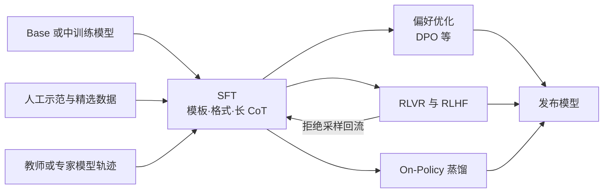
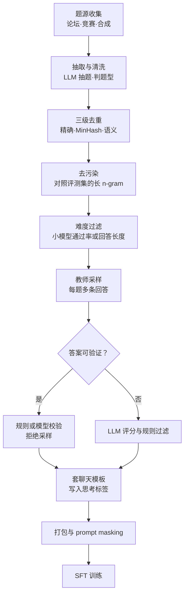
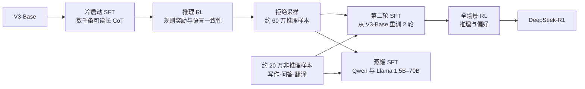

# SFT：先学会“样子”，再谈“本事”

<Term t="sft">监督微调</Term>（Supervised Fine-Tuning，SFT）用成对的“提示—示范回答”数据，以教师强制下的逐 token 交叉熵，把模型的输出分布拉向示范分布。它主要决定模型以什么格式、什么口吻、按什么推理套路作答；模型最终能解多难的题，更多取决于预训练与中训练积累的知识，以及之后 RL 在模型自身分布上的探索。

::: human
预训练让模型读完了一座图书馆，SFT 是给它看几千到几百万份“标准答卷”：怎么审题、怎么分步写、写完怎么收尾。它学得快，学到的却主要是答卷的样子；想让它真正多会几道题，还得靠后面的 RL 让它自己练。
:::

## SFT 在流水线里做什么 {#position}

输入是一个 base（或经过[中训练](/topics/mid-training)的）模型和一批示范数据 $(x, y^\ast)$；输出是一个会按聊天模板对话、会写目标格式、会在该停的地方停下的策略 $\pi_\text{SFT}$。它同时是后续 DPO、RL 与 KL 正则里的参考策略 $\pi_\text{ref}$，所以 SFT 的好坏会一路传导到后面每个阶段。

到 2025 年，SFT 在工业流水线里通常扮演四种角色：

1. **格式与行为对齐**：聊天模板、工具调用协议、拒答边界、口吻。数据量从几千到上百万条不等。
2. **RL 冷启动**：用数千到数十万条长 CoT 示范，先让模型“会想、想得可读”，再交给 [RLVR](/topics/rl-for-llm#rlvr)。
3. **蒸馏**：把更强模型或 RL 专家模型的轨迹当示范，小模型只做 SFT 就能拿到大部分能力（R1-Distill、OpenThinker）。
4. **回流与合并**：RL 之后用<Term t="rejection-sampling">拒绝采样</Term>把好轨迹收回来再 SFT，或把多个领域专家合并成一个模型，形成数据飞轮。



后续阶段见 [LLM 强化学习](/topics/rl-for-llm) 与 [On-Policy 蒸馏](/topics/opd)；数据侧的完整流水线见[数据工作流](/lenses/data#sft-pipeline)。

## 目标函数：最大似然就是前向 KL {#objective}

### 从最大似然到前向 KL {#mle-forward-kl}

记示范数据集为 $\mathcal D=\{(x,y^\ast)\}$，其中 $y^\ast$ 可以看作从某个示范分布 $p_\text{data}(\cdot\mid x)$ 中采样得到（人写的，或教师模型生成的）。SFT 最大化示范的对数似然，也就是最小化

$$
\mathcal L_\text{SFT}(\theta)=-\E_{(x,y^\ast)\sim\mathcal D}\Big[\sum_{t=1}^{\lvert y^\ast\rvert}\log\pi_\theta\big(y^\ast_t\mid x,y^\ast_{<t}\big)\Big].
$$

把前向 KL 展开：

$$
\KL\big(p_\text{data}(\cdot\mid x)\,\Vert\,\pi_\theta(\cdot\mid x)\big)
=\underbrace{\E_{y\sim p_\text{data}}\big[\log p_\text{data}(y\mid x)\big]}_{-H(p_\text{data})\text{，与 }\theta\text{ 无关}}
-\E_{y\sim p_\text{data}}\big[\log\pi_\theta(y\mid x)\big].
$$

第一项是示范分布的负熵，与参数无关；第二项正是负对数似然。所以**最小化 SFT 损失等价于最小化 $\KL(p_\text{data}\Vert\pi_\theta)$**。再用自回归分解 $\log\pi_\theta(y\mid x)=\sum_t\log\pi_\theta(y_t\mid x,y_{<t})$，就得到上面逐 token 的交叉熵：前缀 $y^\ast_{<t}$ 永远取自示范、而不是模型自己的生成，这就是<Term t="teacher-forcing">教师强制</Term>。

这个等价关系解释了 SFT 的三个性格：

- **覆盖而非挑选**。<Term t="forward-kl">前向 KL</Term> 在 $p_\text{data}(y\mid x)>0$ 而 $\pi_\theta(y\mid x)\to0$ 的地方给出趋于无穷的惩罚，模型必须给示范里出现过的每种写法都留出概率，包括错误、啰嗦和偶然的怪癖。与之相对，[反向 KL](/topics/opd#reverse-kl) $\KL(\pi_\theta\Vert p)$ 倾向于只抓一个峰，这正是 on-policy 蒸馏与 KL 正则 RL 的行为。
- **离线，没有探索**。训练时的前缀全来自示范，推理时模型却要在自己生成的前缀上继续写；训练与推理的分布不一致（<Term t="exposure-bias">暴露偏差</Term>）会在长 CoT 里逐步放大。这是 SFT 之后还要做 [On-Policy 蒸馏](/topics/opd)或 RL 的根本原因之一。
- **蒸馏就是 SFT**。若 $y^\ast$ 由教师 $\pi_T$ 采样，SFT 就是序列级 $\KL(\pi_T\Vert\pi_S)$ 的蒙特卡洛估计，即<Term t="sequence-kd">序列级知识蒸馏</Term>。R1-Distill、OpenThinker 都在做这件事。

::: human
前向 KL 像一个“全都要”的老师：示范里出现过的写法，哪怕只出现一次、哪怕是错的，模型都得给它留点概率。所以 SFT 数据里混进什么，模型就学会什么。
:::

### 逐 token 损失与 prompt masking {#masking}

实际训练时，一条多轮对话先经聊天模板变成一整串 token $s_i$，再用掩码 $m_{i,t}\in\{0,1\}$ 指定哪些位置算损失：

$$
\mathcal L(\theta)=\frac{1}{Z}\sum_{i\in\mathcal B}\sum_{t=1}^{\lvert s_i\rvert}m_{i,t}\,\ell_{i,t},\qquad
\ell_{i,t}=-\log\pi_\theta\big(s_{i,t}\mid s_{i,<t}\big),
$$

其中 $\mathcal B$ 是一个批次，$Z$ 是归一化常数（怎么取见[下文](#loss-aggregation)）。<Term t="prompt-masking">Prompt masking</Term> 就是只让模型“该说的话”取 $m=1$：

```text
片段                                          m   说明
<|im_start|>system\n你是一个助手<|im_end|>\n    0   系统提示：只读
<|im_start|>user\n3+5=?<|im_end|>\n           0   用户轮：只读
<|im_start|>assistant\n                       0   角色头：推理时由模板补上
<think>\n3 加 5 等于 8。\n</think>\n            1   思考过程：要学
答案是 8。                                     1   最终回答：要学
<|im_end|>                                    1   轮次结束符：必须学，否则停不下来
```

几条实践要点：

- **为什么要掩掉提示**：提示在推理时由用户给出，对它算损失既浪费容量，又会把模型往“写出用户式文本”的方向推；RAG、长文档问答这类提示远长于回答的数据，不掩码时损失几乎全被提示主导。
- **多轮对话**：可以对所有 assistant 轮算损失（TRL 的 `assistant_only_loss`），也可以只算最后一轮；前者样本效率更高，但要确认历史轮的内容与推理时的模板渲染一致（见下一节）。
- **工具与智能体数据**：工具返回、环境观测一律掩掉，与 RL 里的<Term t="loss-mask">损失掩码</Term>同理，详见 [Agentic RL](/topics/agentic-rl#loss-mask)。
- **上线前先看一眼**：把几条样本里 $m=1$ 的片段解码打印出来。s1 的训练脚本里留着一句注释：作者逐条核对过，损失恰好从思考 token 开始、到第一个 pad 结束[^s1code]。

### 聊天模板与 EOS：训练和推理说同一种“方言” {#chat-template}

<Term t="chat-template">聊天模板</Term>是模型与推理框架之间的接口契约：角色标记、轮次分隔符、思考标签、工具调用格式，连换行和空格都算数。训练时拼出的 token 序列必须与推理时 `apply_chat_template` 的结果逐字一致，否则模型是在一个没见过的分布上工作。

最常见的四类事故：

1. **EOS 被掩掉**。把 pad token 设成 EOS、再把所有 pad 位置的 label 设为 −100，真正的结束符也会一并被掩掉，模型学不会停。s1 的做法是专门挑一个从不使用的 token 当 pad（Qwen 上用 `<|fim_pad|>`）[^s1code]。
2. **结束符对不上**。模板里的轮次结束符（如 `<|im_end|>`）与生成配置里的 EOS（如 `<|endoftext|>`）不一致，模型答完还会继续写。Open-R1 的 README 专门警告：给 Qwen base 模型做 SFT 时必须把 EOS 设为 `<|im_end|>`[^openr1]。
3. **历史轮的思考内容**。Qwen3、R1-Distill 等推理模型的模板会在多轮历史里删掉之前轮次的 `<think>` 内容，R1-Distill 的模板还会在回答开头预填 `<think>`。训练数据若保留了历史思考，或 RL 的格式奖励没考虑预填，就会与推理时的输入对不上[^openr1]。
4. **新增特殊 token**。base 模型没有聊天模板时，新加 token 的嵌入是未训练的；更稳妥的做法是复用保留 token，并用该字符串原先切出的子词嵌入来初始化（open-instruct 就是这样做的）。

模板还承载“开关”。Llama-Nemotron 用系统提示 “detailed thinking on/off” 切换推理，Qwen3 用 `/think`、`/no_think` 与 `enable_thinking`，gpt-oss 的 harmony 格式则把推理强度写进系统消息（`Reasoning: high`），并把输出分到 analysis、commentary、final 三个通道[^harmony]。这些开关都要靠 SFT 数据里**同时存在两种模式的示范**才能学会；只改模板、不给数据，开关不会生效。

::: human
聊天模板就像答题卡的格式：名字写在哪、答案写在哪、写完画不画句号，训练和考试必须一模一样。最常见的事故是“句号”没教会，模型答完了却不知道该停。
:::

### Packing：塞满显卡，但别让样本“串味” {#packing}

SFT 样本长短悬殊，从几十 token 的闲聊到三万 token 的推理轨迹都有，按批补齐会浪费大量算力。<Term t="packing">Packing</Term> 把多条样本拼进一个定长块。朴素做法（先拼接、再用普通因果掩码）有两个问题：后一条样本的 token 能注意到前一条样本，位置编码也从前一条接着往下数，模型等于在“串味”的上下文里学习。正确做法是块对角因果掩码：

$$
M_{jk}=\mathbf 1\big[k\le j\big]\cdot\mathbf 1\big[\operatorname{doc}(j)=\operatorname{doc}(k)\big],
$$

即位置 $j$ 只能看见同一条样本里不晚于它的位置 $k$。工程上用 FlashAttention 的变长接口（按 `cu_seqlens` 切分）或按样本重置 `position_ids` 实现；每条样本第一个 token 的 label 也要掩掉，免得拿上一条样本的末尾去预测它（open-instruct 的 padding-free collator 在样本边界插入一个 −100 标签）[^packingfa2]。

两个容易忽略的细节：

- **别把样本拦腰截断**。“先拼接再按长度切块”（TRL 里叫 `wrapped`）适合预训练，放在 SFT 里会切断回答、丢掉结束符。best-fit decreasing 装箱能在几乎不损失利用率的前提下大幅减少截断，TRL 的 `bfd` 系列打包策略即源于此[^fewertrunc]。
- **无补齐批处理（padding-free）要配 FlashAttention 2/3**，否则同样会出现跨样本污染，TRL 文档称之为 batch contamination[^trlsft]。

### 损失怎么平均：按 token，还是按样本 {#loss-aggregation}

记样本 $i$ 的有效 token 数为 $n_i=\sum_t m_{i,t}$。常见的三种<Term t="loss-aggregation">损失聚合</Term>方式：

$$
\mathcal L_\text{seq}=\frac{1}{\lvert\mathcal B\rvert}\sum_{i}\frac{1}{n_i}\sum_t m_{i,t}\ell_{i,t},\qquad
\mathcal L_\text{tok}=\frac{\sum_i\sum_t m_{i,t}\ell_{i,t}}{\sum_i n_i},\qquad
\mathcal L_\text{sum}=\sum_i\sum_t m_{i,t}\ell_{i,t}.
$$

它们给单个 token 的权重分别是 $\frac{1}{\lvert\mathcal B\rvert\,n_i}$、$\frac{1}{\sum_i n_i}$ 和 $1$。区别在长回答：按序列平均时，一条 3 万 token 推理轨迹里每个 token 的权重只有 1 千 token 短回答的 1/30，长推理被系统性地“少学”。按 token 平均才是“每个 token 一票”，与 RL 里 DAPO 改用 <Term t="token-level-loss">token 级损失</Term>是同一个道理（见[算法谱系](/lenses/algorithms#dapo)）。

更隐蔽的是梯度累积与数据并行。很多训练代码在每个微批内先按 token 平均、再对各微批取平均，这既不是按序列平均，也不是全局按 token 平均。AI2 的 open-instruct 为此提供了 `reduce_loss=sum` 选项，代码注释写明：它让数据集中每个 token 等权，而不是在大量梯度累积时让每条样本等权，“可以带来 AlpacaEval 超过 5 分的提升”；Tulu 3 发布时的 8B/70B SFT 命令都用了 `--reduce_loss sum`[^tulu3cmd]。

::: derive 梯度累积为什么会“偷偷改权重”
设一次优化步用 $K$ 个微批，微批 $k$ 里有 $N_k$ 个有效 token，损失和为 $S_k=\sum_{(i,t)\in k}m_{i,t}\ell_{i,t}$。

**朴素做法**：每个微批先平均、再累积，

$$\mathcal L_\text{naive}=\frac{1}{K}\sum_{k=1}^{K}\frac{S_k}{N_k},$$

微批 $k$ 里每个 token 的权重是 $\frac{1}{KN_k}$。

**全局 token 平均**：

$$\mathcal L_\text{tok}=\frac{\sum_k S_k}{\sum_k N_k},$$

每个 token 的权重都是 $\frac{1}{\sum_k N_k}=\frac{1}{K\bar N}$，其中 $\bar N=\frac{1}{K}\sum_k N_k$。两者之比为

$$\frac{1/(KN_k)}{1/(K\bar N)}=\frac{\bar N}{N_k}.$$

也就是说，有效 token 少的微批（比如只装了一条短回答）里，每个 token 被放大了 $\bar N/N_k$ 倍；长 CoT 与短对话混训时，这个倍数可以到几十。

**修正**：先在所有微批与数据并行进程上汇总全局 token 数 $N=\sum_k N_k$，每个微批用 $S_k/N$ 反传，累积后恰好等于 $\mathcal L_\text{tok}$。这正是 transformers 社区长期讨论的梯度累积问题[^gaissue]，也是 open-instruct 改用求和损失的原因。

**求和与按 token 平均**：$\mathcal L_\text{sum}=\big(\sum_i n_i\big)\,\mathcal L_\text{tok}$，只差一个随步变化的缩放。在 Adam 下，整体缩放大多会被二阶矩归一化抵消，但各步 token 数不同时，求和会让 token 多的步更新略大。真正决定学到什么的，是**同一步内**各 token 的相对权重。
:::

::: human
按样本平均，相当于每份答卷不论长短都算一票：写了 3 万字推理的那份，每个字只值短答卷的几十分之一。按 token 平均，才是“每个字一票”。
:::

## 演化谱系 {#lineage}

SFT 数据的演化，大致是在“数量与质量”“人工与合成”两条轴上来回摆动：2022 年前后靠把现成 NLP 任务改写成指令来堆规模（FLAN）；2023 年一边用强模型合成数据（Self-Instruct、Alpaca），一边发现精选千条就够（LIMA）；2024 年出现完全开放的全流程配方与大规模自合成（Tulu 3、Magpie、NuminaMath）；2025 年 DeepSeek-R1 之后，长 CoT 蒸馏成为主线，问题从“要多少条”变成“题从哪来、谁当老师、怎么筛”。最右一列是帮助理解训练方式本身、以及 SFT 与 RL 关系的分析工作。

<LineageGraph graph="sft-data" />

## 数据配方的演化 {#data-recipes}

### Flan 2022：指令微调的规模化 {#flan}

Google 的 Flan Collection 把 Flan 2021、P3、Super-NaturalInstructions、多个 CoT 数据集与对话数据汇成一套，统一改写成零样本、少样本、带 CoT 等多种模板，按调好的比例混合，用来训练 Flan-T5 与 Flan-PaLM；配套的 Scaling Flan 工作把任务数扩到 1800 余个，并验证了模型规模的作用[^flan]。消融给出的三条结论至今成立：多种提示模板混合训练，零样本、少样本、CoT 三种设置都会变好；任务配平与输入反转（把输入输出对调生成新任务）是关键；指令微调过的 checkpoint 作为下游微调起点，收敛更快、效果更好。

今天看，学术 NLP 任务那种“短输入、短答案”的数据对对话模型帮助有限，但“先设计混合与模板多样性、再扩规模”的方法论一直延续到 Tulu 3 和后来的推理数据配方。

### Self-Instruct 与 Alpaca：合成数据起步 {#self-instruct-alpaca}

Self-Instruct 从 175 条人工种子任务出发，让 GPT-3 自举生成新指令与输入输出实例，用 ROUGE-L 相似度去重、启发式过滤后回灌任务池，得到 5.2 万条指令；作者抽查 200 条发现约 46% 有问题，但微调后的效果依然接近 InstructGPT-001[^selfinstruct]。三个月后，Stanford Alpaca 沿用这个流程、换用更强的 text-davinci-003，以不到 500 美元生成 5.2 万条数据微调 LLaMA-7B（学习率 2e-5、3 个 epoch、批大小 128、最大长度 512），初步人评与 text-davinci-003 相当，直接引爆了开源对话模型[^alpaca]。

这一波的教训是：模仿强模型能很快学到“像样的回答”，但学到的主要是风格。LIMA 随后给出了更精确的解释。

### LIMA：少即是多 {#lima}

LIMA 只用 1000 条精选示范（750 条来自 Stack Exchange、wikiHow 等社区的高质量问答，250 条作者手写）对 LLaMA-65B 做 SFT，不做任何 RLHF；人工评测中，43% 的情况下它与 GPT-4 持平或更好[^lima]。据此提出<Term t="superficial-alignment">浅层对齐假说</Term>：模型的知识与能力几乎都在预训练中获得，对齐只是教它与用户交互时用哪种格式与风格。消融显示，不提升多样性、只把同源数据翻倍几乎没有收益，而质量与多样性各自都有可测的正面作用；只加 30 条多轮对话示范，多轮能力就明显改善。

LIMA 的结论针对的是风格与格式，并不意味着少量数据能教会新能力，前提是底座足够强。两年后 LIMO、s1 在推理上重演了同一个故事，前提也一样。

### Tulu 3：把完整配方摊开 {#tulu3}

AI2 的 Tulu 3 是第一个把后训练全部环节（数据、代码、评测、中间 checkpoint）完整公开的工作：先按技能（数学、代码、精确指令遵循、安全等）整理公开数据，用 persona 驱动的方法合成补充数据，并严格去污染；再用近百万条混合数据做 SFT；接着在包含 SFT 模型自身回答的偏好数据上做长度归一化 DPO；最后在可自动判分的数学题与指令约束上做<Term t="rlvr">可验证奖励 RL</Term>，并由此提出了 RLVR 这个名字[^tulu3]。

SFT 阶段的配置可以直接参考：8B 学习率 5e-6、70B 学习率 2e-6，2 个 epoch，有效批大小 128，最大长度 4096，线性衰减、3% 预热，求和损失[^tulu3cmd]。更值得学的是它的工作方式：每类数据都在开发集与留出集上分别测边际收益，去污染先于一切。

### Magpie：让对齐模型自己出题 {#magpie}

Magpie 利用了一个简单的事实：对齐过的模型在训练中见过无数“用户轮前缀 + 用户问题”的序列，所以只给它模板里用户轮之前的前缀（例如 Llama-3 的 user 角色头），它就会自回归地补出一个像样的用户问题；再把问题喂回去就得到回答。作者用 Llama-3-Instruct 生成 400 万对，经质量、难度、奖励打标与基于 FAISS 最近邻距离的语义去重，筛出 30 万条；只用它做 SFT 的 Llama-3-8B-Base 在 AlpacaEval、Arena-Hard 等对齐评测上接近官方 Llama-3-8B-Instruct，而后者用了千万级数据外加反馈学习[^magpie]。Argilla 用同一流程基于 Llama-3.1-405B 生成了 magpie-ultra，后被 Hugging Face 收入 SmolLM2 的指令数据 SmolTalk。

它的短板同样清楚：题目分布跟着教师走，会扎堆在教师最熟悉的话题上，必须打标签后重采样；教师输出的使用许可也要事先看清。

### 竞赛数学：从 NuminaMath 到 Nemotron-Math {#math-data}

推理数据里最稀缺的是**题**。三代代表性工作展示了题源与解答的演进：

- **NuminaMath（2024-07）**：从中国高中习题到国际奥赛收集约 86 万道题，经 OCR、切分、翻译，再由 GPT-4o 统一改写成 CoT 解答；另用 GPT-4 系列模型生成约 7 万条工具集成推理（TIR）轨迹。以两阶段 SFT（先 CoT 后 TIR）训练的 7B 模型拿下首届 AIMO 进步奖（私有集 50 题解出 29 题）[^numina]。此后它成了 s1、OpenR1-Math-220k 等大量工作的题库。
- **OpenMathReasoning（2025-04）**：NVIDIA 从 AoPS 论坛用 LLM 抽题、判题型、提取答案、把证明题改写成有答案的题并去污染；用 DeepSeek-R1 与 QwQ-32B 生成 320 万条长 CoT 与 170 万条 TIR 轨迹，并训练“从多个候选里挑最优”的生成式选择器，拿下 AIMO-2 冠军（34/50）[^omr]。
- **Nemotron-Math（2025-12）**：在 AoPS 之外加入 Math StackExchange 与 MathOverflow，用 gpt-oss-120b 的高、中、低三档推理强度（各带或不带 Python）生成 750 万条最长 128K 的轨迹；先让低档模型对每题做 16 次，通过率不低于 0.8 的易题直接丢弃。加入 StackExchange 题后，HLE-Math 这类开放题更稳，竞赛题不掉分[^nm]。

演进方向很清楚：题源从“扫描考卷”走向“系统挖掘论坛”，解答从“人写的短解答”走向“强模型写的长 CoT”，再走向“同一题多档强度”，让模型学会**按需决定想多久**。

<EntryGrid :ids="['flan-2022', 'lima', 'tulu3', 'magpie', 'numinamath', 'self-instruct']" />

### 质量、数量与数据选择 {#data-selection}

把前面的工作放在一起，<Term t="data-selection">数据选择</Term>可以归纳为五条经验：

1. **先质量，再多样性，最后才是数量**。LIMA 的数量消融、OpenThoughts 的“题源宁少而精”都指向这一点。
2. **按“对当前模型的难度”筛题**。Phi-4-reasoning 只留模型“跳一跳够得着”的可教提示；Light-R1 用 DeepScaleR-1.5B 采样估计难度；Nemotron-Math 丢掉低档推理就能做对的题；OpenThoughts 发现按 LLM 标注的难度或回答长度过滤，好于预训练常用的 embedding、fastText 过滤。另见<Term t="difficulty-filtering">难度过滤</Term>。
3. **三级去重**：精确去重、MinHash 模糊去重、embedding 语义去重（Magpie 用 FAISS 最近邻距离）。Llama 3 的后训练还把语义聚类与质量、难度打分结合，在每个簇里优先保留高分样本[^llama3]。
4. **去污染先于一切**：对 AIME、MATH-500、GPQA 等评测集做精确匹配加长 n-gram 检测。Light-R1 用“忽略数字的精确匹配 + 32-gram”，并指出 MATH-500 与常用题库有数十道相同或只改了数字的题[^lightr1]。另见<Term t="decontamination">去污染</Term>与[评测污染](/lenses/eval#contamination)。
5. **蒸馏数据的答案校验没想象中重要，自采样数据的校验必不可少**。OpenThoughts 试了多种答案过滤都没有显著收益；但用自己的模型做拒绝采样时，不校验就等于把错误再学一遍。



数据侧的完整工具链、以及与 RLVR 数据流水线的差异，见[数据工作流](/lenses/data#sft-pipeline)。

## 长 CoT SFT：冷启动与蒸馏 {#long-cot}

o1 与 DeepSeek-R1 之后，SFT 多了一项新任务：教模型写<Term t="long-cot">长 CoT</Term>，也就是拆解问题、试错、回溯、自我验证，动辄上万 token。它有两种用法：给 RL 做<Term t="cold-start">冷启动</Term>，以及把推理能力蒸馏进可部署的小模型。

### DeepSeek-R1：冷启动、回流与蒸馏 {#r1-cold-start}

R1-Zero 证明了纯 RL 能在基座上激发长推理，但输出可读性差、语言混杂。R1 的补救是先用**数千条**可读的长 CoT 做冷启动 SFT（来源包括带长 CoT 的少样本提示、要求模型写出带反思与验证的详细答案、以及经人工整理的 R1-Zero 输出），统一成“推理过程 + 总结”的格式，再进入推理 RL[^r1]。

更关键的是 RL 之后那一步：从 RL checkpoint 做拒绝采样，得到约 60 万条推理样本，加上约 20 万条写作、问答、翻译等非推理样本，**从 V3-Base 重新做两个 epoch 的 SFT**，再做覆盖全场景的 RL。同一批约 80 万条数据直接拿去 SFT Qwen2.5 与 Llama 3（1.5B–70B），就是 R1-Distill 系列。论文的对照很有说服力：在 Qwen-32B 基座上直接做大规模 RL，只到 QwQ-32B-Preview 的水平，远不如蒸馏得到的 R1-Distill-Qwen-32B。



<EntryGrid :ids="['deepseek-r1', 'qwen3']" />

### 千条就够？s1 与 LIMO {#small-data}

s1 从 16 个来源收集 5.9 万道题，按三条准则筛到 1000 道：**质量**（去掉格式与生成错误）、**难度**（Qwen2.5-7B 与 32B 都做不对，且推理轨迹长）、**多样性**（按数学学科分类均匀抽样）。用这 1000 条轨迹对 Qwen2.5-32B-Instruct 做 SFT（学习率 1e-5、5 个 epoch、批大小 16，16 张 H100 约半小时），再配合 <Term t="budget-forcing">budget forcing</Term>：模型想结束思考时追加 “Wait” 逼它继续，超出预算就强制收尾。结果在竞赛数学上超过 o1-preview[^s1]。消融同样有启发：随机选 1000 道、只按多样性选、只挑最长的，都明显不如三准则联合；用全部 5.9 万道只多出一点分数，算力却高出几十倍。

LIMO 走得更远：从大规模题库层层筛出 817 道难题，精选带自我验证、探索与细致推导的推理链，同样在 Qwen2.5-32B-Instruct 上大幅提升 AIME 与 MATH，并提出“少即是多推理假说”：底座知识充足时，少量精准的“认知模板”就能激发复杂推理[^limo]。

两者的共同前提常被忽略：底座是经过大量数学语料训练的 Qwen2.5-32B。换成弱底座或小模型，千条数据不会有同样效果（见[下文](#long-cot-analysis)与 [Mid-training 的 RL 准备度](/topics/mid-training#rl-readiness)）。

<EntryGrid :ids="['s1', 'limo']" />

### 百万级配方：OpenThoughts {#openthoughts}

如果只精读一篇推理 SFT 数据的论文，就读 OpenThoughts[^ot]。它把数据流水线拆成题源、混合、题目过滤、去重、每题采样数、答案过滤、教师选择等环节，逐一做了 1000 多次受控实验，结论条条可执行：

1. **每题多采几条回答**（如 16 条）是廉价而稳定的扩量方式，比找新题便宜得多。
2. **更强的模型不一定是更好的老师**：QwQ-32B 当老师，优于基准分更高的 DeepSeek-R1。
3. **题源宁少而精**：少数几个高质量来源，好于为追求多样性而混入大量来源。
4. **按 LLM 标注的难度或 LLM 回答长度筛题**，好于 embedding、fastText 这类预训练式过滤。
5. **各种答案校验与过滤都没有带来显著收益**。

据此构建的 OpenThoughts3-1.2M（85 万数学、25 万代码、10 万科学）训练出的 OpenThinker3-7B，在 AIME25、LiveCodeBench、GPQA-Diamond 上分别比 R1-Distill-Qwen-7B 高出约 15 到 20 个百分点[^ot]。

::: human
OpenThoughts 相当于把“做一份推理训练数据”拆成六七道工序，每道都做对比实验。最反直觉的发现是：分数最高的模型不一定是最会教的老师，答案对不对的校验也没想象中重要。
:::

<EntryCard id="openthoughts" />

### 工业配方：分阶段、带开关、再接 RL {#industrial-recipes}

工业团队的长 CoT SFT 很少“一把梭”，而是把数据按难度、模式、阶段拆开：

- **Light-R1（奇虎 360）**：从没有长 CoT 能力的 Qwen2.5-32B-Instruct 出发，先用 7.6 万条按难度筛过的 R1 轨迹做第一阶段 SFT，再用其中最难的 3 千条做第二阶段，然后做半在线 DPO 与模型合并。每一步都有增益（AIME24 依次为 69.0、73.0、75.8、76.6），但第二阶段后 GPQA 从 64.3 降到 60.6，只训数学的遗忘清晰可见[^lightr1]。
- **Llama-Nemotron（NVIDIA）**：同类提示同时准备“推理开”“推理关”两种回答，用系统提示切换；最大的 Ultra 在 SFT 之后接大规模 RL，才在部分基准上超过教师 DeepSeek-R1[^nemotron]。
- **Phi-4-reasoning（微软）**：只挑处在 Phi-4 能力边缘的“可教”提示，用 o3-mini 写示范；14B 的 SFT 模型就超过了 R1-Distill-Llama-70B，一小段结果奖励 RL 再把推理拉长、分数提高[^phi4r]。
- **AceReason-Nemotron 1.1（NVIDIA）**：把 SFT 数据沿两个方向扩，更多题、每题更多回答，两者都有效，加题收益更大；更强的 SFT 起点在 RL 之后仍然更好，但差距被 RL 明显缩小；RL 采样温度按“温度调整后的熵约 0.3”来选[^acereason]。
- **Nemotron-Math（NVIDIA）**：多档推理强度的示范让模型学会控制思考长度；长上下文 SFT 按 16K→32K→64K→128K 分桶训练，提速 2–3 倍、精度只差 1–3%。但最后的长桶几乎只剩高档样本，若不刻意混入中低档数据，中低档也会越写越长[^nm]。

Qwen3 的四阶段流程（长 CoT 冷启动、推理 RL、思考模式融合、通用 RL）把“开关”也放进了 SFT：第三阶段用带 `/think` 与 `/no_think` 标记的混合数据，把思考与非思考两种模式融进同一个模型。

<EntryGrid :ids="['light-r1', 'llama-nemotron', 'phi-4-reasoning', 'acereason-1-1', 'openmathreasoning', 'nemotron-math']" />

### 为什么长 CoT 学得会、谁又学不动 {#long-cot-analysis}

CMU 等团队的 *Demystifying Long CoT* 用受控实验回答了几个关键问题[^demystify]：长 CoT SFT 的性能上限高于短 CoT，并让后续 RL 更容易继续提升，而短 CoT SFT 很快饱和；RL 中 CoT 长度的增长并不稳定，需要余弦长度奖励与 n-gram 重复惩罚来整形（这两个奖励已被 TRL 直接实现）；纠错等行为在基座里本就潜在存在，但要靠足够的 RL 算力才能稳定地激发出来。

另一面是**容量差距**。*Small Models Struggle to Learn from Strong Reasoners* 发现，3B 及以下的模型直接学长 CoT 或最强教师的轨迹，效果常常不如学短 CoT 或较小教师的轨迹；把长、短 CoT（或强、弱教师数据）按 1:4 混合的 Mix Distillation 能明显改善[^small]。这与 OpenThoughts“最强的不一定是最好的老师”一脉相承：教师的轨迹要落在学生学得动的范围里。蒸馏之后再做 [On-Policy 蒸馏](/topics/opd)，让学生在自己的分布上向教师对齐，是另一条补救路径。

<EntryGrid :ids="['demystifying-long-cot', 'small-models-struggle']" />

## SFT 与 RL：记忆、泛化与接力 {#sft-vs-rl}

### “SFT 记忆，RL 泛化”说对了什么 {#memorize-generalize}

Chu 等人在两个规则可变的环境里做了干净的对照：纸牌算术 GeneralPoints（用 4 张牌凑 24，训练与测试时 J、Q、K 的计值规则不同）和视觉导航 V-IRL（绝对方向与相对方向两套动作空间）。以结果奖励训练的 RL 能泛化到未见过的规则与视觉变体，SFT 则倾向记住训练规则、分布外性能下降；但**没有 SFT 先把输出格式稳住，RL 根本练不起来**[^sftrl]。

后续工作把这一现象推到真实的数学后训练上。*Does Math Reasoning Improve General LLM Capabilities?* 在同一底座、同一批数学题上对照 SFT 与 RL：两者数学都涨，但 SFT 模型在对话、指令遵循等非推理任务上明显退化，RL 模型保持甚至提升；表示与 token 分布分析显示，SFT 大范围扰动了与任务无关的 token，RL 只改动少量相关 token[^transfer]。原理层面，[RL's Razor](/library/?id=rl-razor) 给出了一个可检验的解释：遗忘程度可由微调后模型相对基座在新任务上的 KL 预测，而 on-policy 学习天然偏向 KL 最小的解（见[原理视角](/lenses/principles#forgetting)与<Term t="catastrophic-forgetting">灾难性遗忘</Term>）。

需要补一句：“SFT 记忆”不是 SFT 的宿命，而是**离线、离自身分布远**的数据带来的后果。用自己采样再筛选的数据做 SFT（拒绝采样）、控制 epoch、混入通用数据，都应能减轻遗忘。这是从上述 KL 解释推出的工程判断，而不是某篇论文的直接结论。

::: human
SFT 像背标准答案：同类题很快就会，规则一变就露馅；RL 像自己刷题对答案：学得慢，学到的是解法。所以工业界先用 SFT 教会“答题格式和基本套路”，再用 RL 练“真本事”。
:::

<EntryGrid :ids="['sft-memorizes-rl-generalizes', 'math-reasoning-transfer']" />

### 从 RL 视角看 SFT：DFT 的奖励修正 {#dft}

DFT 的出发点是一个漂亮的等式：SFT 的梯度可以写成策略梯度，只是奖励长得很奇怪[^dft]。对一条示范 $(x,y^\ast)$，定义指示奖励 $r(x,y)=\mathbf 1[y=y^\ast]$，则

$$
\nabla_\theta\log\pi_\theta(y^\ast\mid x)
=\E_{y\sim\pi_\theta(\cdot\mid x)}\Big[\underbrace{\frac{\mathbf 1[y=y^\ast]}{\pi_\theta(y\mid x)}}_{\text{隐式奖励}}\,\nabla_\theta\log\pi_\theta(y\mid x)\Big].
$$

也就是说，SFT 等价于用奖励 $r/\pi_\theta$ 做<Term t="policy-gradient">策略梯度</Term>：模型越觉得示范不可能，这个奖励就越大。换个角度更直观：对指示奖励，RL 的目标就是 $J(\theta)=\E_{y\sim\pi_\theta}[r]=\pi_\theta(y^\ast\mid x)$，而 SFT 优化的是 $\log J$，梯度 $\nabla_\theta\log J=\nabla_\theta J/J$ 天然带着一个 $1/\pi_\theta$ 放大器。放大器带来高方差，也让模型在“死记示范”上用力过猛。

DFT 的修正是一行代码：把每个 token 的损失乘以它自身的概率，并对这个系数停止梯度（$\sg$ 表示<Term t="stop-gradient">停止梯度</Term>）：

$$
\mathcal L_\text{DFT}(\theta)=-\E_{(x,y^\ast)\sim\mathcal D}\Big[\sum_{t}\sg\big(\pi_\theta(y^\ast_t\mid x,y^\ast_{<t})\big)\,\log\pi_\theta\big(y^\ast_t\mid x,y^\ast_{<t}\big)\Big].
$$

之所以放在 token 级而不是序列级，是因为序列概率是上千个 token 概率的乘积，数值上几乎为零。记 $p_t=\pi_\theta(y^\ast_t\mid x,y^\ast_{<t})$，由恒等式 $\sg(p_t)\,\nabla_\theta\log p_t=\nabla_\theta p_t$ 可见，DFT 对每个 token 的梯度就是 $\nabla_\theta p_t$：它优化的是“每个 token 猜对的概率之和”，而不是对数似然。标准 NLL 的梯度是 $\nabla_\theta p_t/p_t$，对模型最没把握的 token 放大最多。

::: derive SFT 梯度等于带 1/π 权重的策略梯度
**第 1 步**：固定 $x$ 与示范 $y^\ast$。SFT 的上升方向是 $g_\text{SFT}=\nabla_\theta\log\pi_\theta(y^\ast\mid x)$。

**第 2 步**：写成对所有回答的求和，

$$g_\text{SFT}=\sum_{y}\mathbf 1[y=y^\ast]\,\nabla_\theta\log\pi_\theta(y\mid x).$$

**第 3 步**：乘除 $\pi_\theta(y\mid x)$（在其大于零处成立），

$$g_\text{SFT}=\sum_y\pi_\theta(y\mid x)\,\frac{\mathbf 1[y=y^\ast]}{\pi_\theta(y\mid x)}\,\nabla_\theta\log\pi_\theta(y\mid x)=\E_{y\sim\pi_\theta(\cdot\mid x)}\Big[\frac{r(x,y)}{\pi_\theta(y\mid x)}\,\nabla_\theta\log\pi_\theta(y\mid x)\Big].$$

**第 4 步**：对照策略梯度。以 $r$ 为奖励的 on-policy 策略梯度是

$$g_\text{RL}=\E_{y\sim\pi_\theta(\cdot\mid x)}\big[r(x,y)\,\nabla_\theta\log\pi_\theta(y\mid x)\big]=\pi_\theta(y^\ast\mid x)\,\nabla_\theta\log\pi_\theta(y^\ast\mid x)=\nabla_\theta\pi_\theta(y^\ast\mid x),$$

所以 $g_\text{SFT}=g_\text{RL}/\pi_\theta(y^\ast\mid x)$：两者方向相同，SFT 多了权重 $1/\pi_\theta(y^\ast\mid x)$。

**第 5 步**：修正。给目标乘上 $\sg(\pi_\theta(y^\ast\mid x))$，

$$\nabla_\theta\Big[\sg\big(\pi_\theta(y^\ast\mid x)\big)\log\pi_\theta(y^\ast\mid x)\Big]=\pi_\theta(y^\ast\mid x)\,\nabla_\theta\log\pi_\theta(y^\ast\mid x)=g_\text{RL},$$

权重被抵消，剩下一个“干净”的稀疏奖励策略梯度。

**第 6 步**：落到 token 级。序列概率 $\prod_t p_t$ 对长序列几乎为零，DFT 改为对每个 token 乘 $\sg(p_t)$，得到正文中的 $\mathcal L_\text{DFT}$。这一步是启发式替代：它与第 5 步的序列级目标并不严格相等，但保留了“去掉 $1/p$ 放大器”的核心。

**直觉**：NLL 在 token 上的梯度是 $\nabla_\theta p_t/p_t$，DFT 是 $\nabla_\theta p_t$。前者把力气集中在模型认为最不可能的 token 上，它们可能是真正需要学的新知识，也可能是示范里的噪声与个人习惯；后者更保守，更贴近模型自身的分布。这与作者自述的局限一致：在答案唯一、推理近乎确定的低熵任务上 DFT 偏弱。由此还可以推断（尚无专门实验）：需要向底座注入新知识的场景，也应保留 NLL。
:::

DFT 在 7B 及以下模型的数学、代码与多模态推理上显著优于 SFT，并已被 TRL（`loss_type="dft"`）、LLaMA-Factory、ms-swift 内置；但作者在仓库里也坦言它在低熵、单一答案的任务上偏弱，社区还反馈过文学、金融等场景的失败[^dft]。把 SFT 与 RL 放进同一个梯度形式的更一般框架（例如 HPT 把各类后训练算法的梯度拆成稳定掩码、参考策略分母、优势估计与似然梯度四个部件[^hpt]），见[算法谱系的统一视角](/lenses/algorithms#unified-view)。

::: human
普通 SFT 对模型最没把握的字用力最猛，像逼学生逐字背下范文里最生僻的句子；DFT 按学生自己的把握程度给每个字打折，更像 RL 那样“顺着自己的思路学”。代价是：真正陌生、必须硬记的新知识，它也会学得更慢。
:::

<EntryCard id="dft" />

### 工业流水线里的接力 {#industrial-interplay}

把近两年的工业报告放在一起看，SFT 与 RL 的分工已经相当稳定：

1. **冷启动 → RL**：SFT 负责格式稳定、推理可读、在难题上有非零通过率，让 RL 拿得到奖励（R1、Qwen3、[Kimi k1.5](/library/?id=kimi-k1-5)）。AceReason 1.1 的结论提醒我们：更强的起点最终仍占优，但 RL 会抹平大部分差距，SFT 做到“足够好”即可。
2. **RL → 拒绝采样 → SFT**：RL checkpoint 生成的好轨迹被收回来，作为下一轮 SFT 的数据。R1 的第三阶段、[Llama 3](/library/?id=llama3) 多轮的“SFT + 拒绝采样 + DPO”都是这个飞轮。
3. **专家 → 合并**：先对数学、代码、智能体等领域分别训练专家，再用 SFT 把它们蒸馏进一个模型，最后统一做 RL（[GLM-4.5](/library/?id=glm-4-5)、[DeepSeek-V3.2](/library/?id=deepseek-v3-2)）。
4. **大 → 小**：小模型先做离线 SFT 蒸馏，再做 [On-Policy 蒸馏](/topics/opd)。Qwen3 的小模型就是先离策略、后在线策略蒸馏；Thinking Machines 的[在线策略蒸馏](/library/?id=tm-opd)还展示了它能找回个性化微调丢掉的能力。
5. **单阶段混合**：把离线示范直接混进 RL。LUFFY 把 R1 的轨迹放进 GRPO 的组里一起算优势[^luffy]，HPT 按当前表现在 SFT 与 RL 信号之间自适应切换[^hpt]。2026 年被 TRL 收录的 TailSFT 从另一个方向下手：SFT 时过滤掉相对初始策略“损失下降最多”的序列，为后续 RL 保住回答的覆盖度[^tailsft]。

### 该用 SFT，还是上 RL / OPD {#when-sft}

| 你的处境 | 首选 | 理由 |
|---|---|---|
| 要教新格式、新工具协议、新口吻 | SFT | 行为就是“样子”，示范最直接 |
| 有更强教师，目标是部署小模型 | SFT 蒸馏，再接 OPD | 离线蒸馏便宜，OPD 修正暴露偏差 |
| 有可验证奖励，模型已有非零通过率 | RLVR | 在自身分布上学，泛化更好、遗忘更少 |
| RL 起步通过率接近零、格式混乱 | 先冷启动 SFT | 给 RL 一个拿得到奖励的起点 |
| 担心遗忘通用能力 | 少量 SFT 加 RL，或用自采样数据 SFT | 离自身分布越近，遗忘越少 |

## LoRA 与超参 {#lora-hparams}

### LoRA Without Regret {#lora}

Thinking Machines 在 2025 年 9 月发布的这篇博客，是目前关于“<Term t="lora">LoRA</Term> 到底行不行”最系统的公开实验：在 Llama 3 与 Qwen3（含 MoE）上，用 Tulu 3 与 OpenThoughts3 做 SFT、用数学题做 RL，横扫 rank、学习率与批大小[^lora]。结论可以直接落地：

1. **中小规模后训练数据上，高 rank LoRA 与全参的学习曲线几乎重合**；数据量超出 LoRA 容量时它才落后，表现为训练效率下降，而不是撞上一个硬地板。
2. **挂到所有层，尤其是 MLP 与 MoE 层**；只挂注意力，即使用更高 rank 补齐参数量也更差。
3. **LoRA 对大批量更敏感**，这个惩罚不会因提高 rank 而消失，由“两矩阵乘积”参数化本身的训练动力学决定。
4. **RL 只需要很小的容量**：策略梯度从每条轨迹里得到的信息很少，rank 1 就能匹配全参。
5. **最优学习率约为全参的 10 倍**；在 $1/r$ 缩放下，最优学习率与 rank 基本无关。Thinking Machines 自家的 tinker-cookbook 里，这个倍数就直接取 10[^tinker]。

LoRA 每步的算力约为全参的三分之二，同一基座还可以挂多个适配器并发服务。Thinking Machines 的 [Tinker](/library/?id=tinker) 训练服务以 LoRA 为训练接口；Hugging Face TRL 也发布了官方复现指南，建议 SFT 用 rank 256 左右、RL 用 1–32[^trllora]。

<EntryCard id="lora-without-regret" />

### 超参速查 {#hparams}

下表都来自公开的训练脚本或论文[^tulu3cmd] [^s1code] [^openr1] [^nm] [^dft] [^tinker]，可以当作起点，而不是答案：

| 场景 | 学习率与调度 | 轮数 | 批大小 | 长度与打包 | 来源 |
|---|---|---|---|---|---|
| 通用指令 SFT，8B 全参 | 5e-6（70B 用 2e-6），线性衰减，3% 预热 | 2 | 128 条 | 4096，求和损失 | Tulu 3 |
| 千条长 CoT，32B 全参 | 1e-5，余弦，5% 预热 | 5 | 16 | 32768 | s1 |
| 35 万条 R1 蒸馏，7B 全参 | 4e-5，余弦（最低 10%），3% 预热 | 5 | 128 | 32768，不打包 | OpenR1-Distill-7B |
| 数百万条超长 CoT，8B 与 30B-A3B | 2e-4 恒定、无预热（经扫参） | 约 2 | 2048 | 16K→128K 分桶，打包 | Nemotron-Math |
| DFT，1.5B 数学 | 5e-5 | 1 | 256 | 2048 | DFT |
| LoRA SFT | 全参最优值约 10 倍，与 rank 基本无关 | — | 不宜过大 | 挂满所有线性层 | LoRA Without Regret |

从表里能读出几条规律：模型越大学习率越小；数据越少 epoch 越多（千条数据常训 3–5 轮，百万级 1–2 轮）；长 CoT 蒸馏可承受的学习率明显高于通用对话 SFT，值得单独扫参。最容易被忽视的一条是：**最大长度要盖住你关心的最长轨迹**。截断后的样本既没有结束符也没有最终答案，宁可丢弃或分桶，也不要截断后照常训练。

## 可执行结论 {#takeaways}

::: takeaway
- **先验管道，再谈数据**：抽几条样本打印 $m=1$ 的片段，确认轮次结束符在损失内、pad 不等于 EOS、训练与推理模板逐字一致。
- **长短混训用全局 token 平均**：梯度累积与数据并行下按全局 token 数归一化（或用求和损失）；打包时用块对角注意力或 padding-free，并用 best-fit 装箱避免截断。
- **数据上先求“题对、难度对”，再求多**：题源少而精，按当前模型的通过率或回答长度筛题，每题多采几条回答；换教师前先做小规模对照，最强的不一定最会教。
- **冷启动 SFT 的目标是给 RL 一个好起点**：格式稳定、通过率非零、多样性不塌，而不是把训练集刷满；RL 之后用拒绝采样回流，形成飞轮。
- **小模型别硬灌最长的推理**：3B 及以下混入短 CoT 或小教师数据（如 1:4），再用 On-Policy 蒸馏收尾。
- **LoRA 照三条用**：挂满所有线性层、学习率约为全参 10 倍、批别太大；RL 用低 rank，大规模 SFT 才考虑全参。
:::

## 常见坑 {#pitfalls}

::: pitfall 过度思考与啰嗦
长 CoT 蒸馏会把教师的冗长一并学来，简单题也写几千 token。Nemotron-Math 发现，长上下文阶段若只剩高档样本，中低档也会越写越长。对策：提供多档推理强度的示范并在各阶段保持比例；筛掉“答对但极其冗长”的轨迹；在 RL 阶段加入与长度相关的奖励设计（见[奖励设计](/topics/rl-for-llm#reward-design)）。
:::

::: pitfall 格式崩坏
模板不一致、EOS 被掩掉、思考标签开合不配对、思考与回答混写，都会让模型“答完不停”或拿不到格式奖励。对策：给模板写单元测试，逐 token 比较训练渲染与推理渲染；生成时统计未闭合思考标签与触顶截断的比例。
:::

::: pitfall 评测污染
公开题库（NuminaMath、AoPS 等）与 AIME、MATH-500 高度重叠，Light-R1 就发现 MATH-500 与常用题库有数十道相同或只改了数字的题。对策：精确匹配（忽略数字）、长 n-gram、语义检索三道去污染，并优先看模型发布后才出现的新题（如当年的 AIME）。
:::

::: pitfall 教师与学生的容量差
小模型学不动大模型的长推理，最强的教师也未必是最好的老师。对策：先在小规模上对照不同教师；3B 及以下混入短 CoT；蒸馏后再做 On-Policy 蒸馏或 RL。
:::

::: pitfall 灾难性遗忘
领域 SFT 会让通用能力退化：Light-R1 只训数学后 GPQA 下降，数学 SFT 模型在对话与指令遵循上退步。对策：混入通用数据、控制 epoch、优先用自采样数据；能用可验证奖励的领域提升尽量交给 RL；上线前必测一组非目标任务。
:::

## 延伸阅读 {#further-reading}

- 资料库中的全部 SFT 条目：[按领域筛选](/library/?area=sft)；只看数据类：[SFT × 数据](/library/?area=sft&facet=data)
- 上游：[Mid-training](/topics/mid-training)，尤其是[RL 准备度](/topics/mid-training#rl-readiness)：它决定了千条示范够不够用
- 下游：[LLM 强化学习](/topics/rl-for-llm)、[On-Policy 蒸馏](/topics/opd)、[实践：一次 On-Policy 蒸馏](/practice/opd)
- 横切：[数据工作流](/lenses/data#sft-pipeline)、[算法的统一视角](/lenses/algorithms#unified-view)、[遗忘与原理](/lenses/principles#forgetting)、[评测污染](/lenses/eval#contamination)
- 术语：[术语表](/glossary)

[^s1code]: s1 训练脚本：[train/sft.py](https://github.com/simplescaling/s1/blob/main/train/sft.py)（pad token 的选择与只对回答计损失的注释）、[train/sft.sh](https://github.com/simplescaling/s1/blob/main/train/sft.sh)（学习率 1e-5、5 个 epoch、预热 5%、余弦调度、块长 32768）。
[^openr1]: Hugging Face，[Open-R1 README](https://github.com/huggingface/open-r1)（EOS 与聊天模板对齐的警告、R1-Distill 模板预填 `<think>` 的说明）与 [OpenR1-Distill-7B 的 SFT 配置](https://github.com/huggingface/open-r1/blob/main/recipes/OpenR1-Distill-7B/sft/config_distill.yaml)。
[^harmony]: OpenAI，[harmony 响应格式](https://github.com/openai/harmony)：gpt-oss 使用的对话格式，含 analysis、commentary、final 通道与系统消息中的推理强度设置。
[^packingfa2]: open-instruct 的 [padding-free collator](https://github.com/allenai/open-instruct/blob/main/open_instruct/padding_free_collator.py)，以及它引用的 Hugging Face 博客 [Improving Hugging Face Training Efficiency Through Packing with Flash Attention 2](https://huggingface.co/blog/packing-with-FA2)。
[^fewertrunc]: Ding et al., [Fewer Truncations Improve Language Modeling](https://arxiv.org/abs/2404.10830)；TRL 在 [paper index](https://huggingface.co/docs/trl/paper_index) 中说明其 BFD 打包策略源于此文。
[^trlsft]: Hugging Face TRL 文档：[SFT Trainer](https://huggingface.co/docs/trl/sft_trainer) 与 [Reducing Memory Usage](https://huggingface.co/docs/trl/reducing_memory_usage)（packing、padding-free 与 batch contamination 警告）。
[^tulu3cmd]: AI2 open-instruct，Tulu 3 发布时（2024-11-22）的[复现命令](https://github.com/allenai/open-instruct/blob/b08997673f7c451171fe3ed39463114e7eeaf141/docs/tulu3.md)与同一版本 [finetune.py](https://github.com/allenai/open-instruct/blob/b08997673f7c451171fe3ed39463114e7eeaf141/open_instruct/finetune.py) 中 `reduce_loss` 的注释。
[^gaissue]: [huggingface/transformers#24725](https://github.com/huggingface/transformers/issues/24725)：open-instruct 代码注释引用的梯度累积与损失归一化讨论。
[^flan]: Longpre et al., [The Flan Collection](https://arxiv.org/abs/2301.13688)；Chung et al., [Scaling Instruction-Finetuned Language Models](https://arxiv.org/abs/2210.11416)；数据生成代码见 [google-research/FLAN](https://github.com/google-research/FLAN)。
[^selfinstruct]: Wang et al., [Self-Instruct](https://arxiv.org/abs/2212.10560)；46% 的抽查结果见[仓库 README](https://github.com/yizhongw/self-instruct)。
[^alpaca]: Stanford CRFM，[Alpaca 发布博客](https://crfm.stanford.edu/2023/03/13/alpaca.html)与[仓库](https://github.com/tatsu-lab/stanford_alpaca)（成本与微调超参）。
[^lima]: Zhou et al., [LIMA: Less Is More for Alignment](https://arxiv.org/abs/2305.11206)。
[^tulu3]: Lambert et al., [Tulu 3: Pushing Frontiers in Open Language Model Post-Training](https://arxiv.org/abs/2411.15124)。
[^magpie]: Xu et al., [Magpie](https://arxiv.org/abs/2406.08464)；SmolTalk 中的 magpie-ultra 见 [huggingface/smollm](https://github.com/huggingface/smollm/tree/main/text/data/smoltalk/magpie_ultra_v1)。
[^numina]: Li et al., [NuminaMath 数据技术报告](https://github.com/project-numina/aimo-progress-prize/blob/main/report/numina_dataset.pdf)（2024-07-22）与 Hugging Face 博客 [How NuminaMath Won the 1st AIMO Progress Prize](https://huggingface.co/blog/winning-aimo-progress-prize)。
[^omr]: Moshkov et al., [AIMO-2 Winning Solution](https://arxiv.org/abs/2504.16891)；数据构建流程见 [NeMo-Skills](https://github.com/NVIDIA-NeMo/Skills)。
[^nm]: Du et al., [Nemotron-Math: Efficient Long-Context Distillation of Mathematical Reasoning from Multi-Mode Supervision](https://arxiv.org/abs/2512.15489)（训练设置见其第 3.1 节，分桶训练与模式失衡见第 4.2 节）。
[^llama3]: Llama Team, [The Llama 3 Herd of Models](https://arxiv.org/abs/2407.21783)，后训练数据处理一节（质量与难度打分、语义去重）。
[^lightr1]: Wen et al., [Light-R1](https://arxiv.org/abs/2503.10460)；分阶段结果、数据来源与去污染细节见[仓库 README](https://github.com/Qihoo360/Light-R1)。
[^r1]: DeepSeek-AI, [DeepSeek-R1: Incentivizing Reasoning Capability in LLMs via Reinforcement Learning](https://arxiv.org/abs/2501.12948)。
[^s1]: Muennighoff et al., [s1: Simple test-time scaling](https://arxiv.org/abs/2501.19393)；数据与代码见 [simplescaling/s1](https://github.com/simplescaling/s1)。
[^limo]: Ye et al., [LIMO: Less is More for Reasoning](https://arxiv.org/abs/2502.03387)。
[^ot]: Guha et al., [OpenThoughts: Data Recipes for Reasoning Models](https://arxiv.org/abs/2506.04178)；数据构成与 OpenThinker3-7B 的成绩见[仓库 README](https://github.com/open-thoughts/open-thoughts)。
[^nemotron]: NVIDIA, [Llama-Nemotron: Efficient Reasoning Models](https://arxiv.org/abs/2505.00949)。
[^phi4r]: Microsoft, [Phi-4-reasoning Technical Report](https://arxiv.org/abs/2504.21318)。
[^acereason]: NVIDIA, [AceReason-Nemotron 1.1: Advancing Math and Code Reasoning through SFT and RL Synergy](https://arxiv.org/abs/2506.13284)。
[^demystify]: Yeo et al., [Demystifying Long Chain-of-Thought Reasoning in LLMs](https://arxiv.org/abs/2502.03373)；TRL 对其奖励函数的实现见 [paper index](https://huggingface.co/docs/trl/paper_index)。
[^small]: Li et al., [Small Models Struggle to Learn from Strong Reasoners](https://arxiv.org/abs/2502.12143)；1:4 的混合比例见[仓库](https://github.com/Small-Model-Gap/Small-Model-Learnability-Gap)。
[^sftrl]: Chu et al., [SFT Memorizes, RL Generalizes](https://arxiv.org/abs/2501.17161)。
[^transfer]: Huan et al., [Does Math Reasoning Improve General LLM Capabilities?](https://arxiv.org/abs/2507.00432)
[^dft]: Wu et al., [On the Generalization of SFT: A Reinforcement Learning Perspective with Reward Rectification](https://arxiv.org/abs/2508.05629)；局限说明与框架支持见[仓库 README](https://github.com/yongliang-wu/DFT)。
[^hpt]: [Towards a Unified View of Large Language Model Post-Training](https://arxiv.org/abs/2509.04419)，代码见 [TsinghuaC3I/Unify-Post-Training](https://github.com/TsinghuaC3I/Unify-Post-Training)。
[^luffy]: [LUFFY: Learning to Reason under Off-Policy Guidance](https://arxiv.org/abs/2504.14945)（NeurIPS 2025），代码见 [ElliottYan/LUFFY](https://github.com/ElliottYan/LUFFY)。
[^tailsft]: TRL [paper index](https://huggingface.co/docs/trl/paper_index) 中的 TailSFT: Filtered Fine-Tuning Improves Post-Training Performance（arXiv 2608.25756）条目及其 GSM8K 示例；发布不足两个月，仅作趋势参考。
[^lora]: John Schulman and Thinking Machines Lab, [LoRA Without Regret](https://thinkingmachines.ai/blog/lora/)（2025-09-29）。
[^tinker]: [tinker-cookbook 的 hyperparam_utils.py](https://github.com/thinking-machines-lab/tinker-cookbook/blob/main/tinker_cookbook/hyperparam_utils.py)：`get_lora_lr_over_full_finetune_lr` 直接返回 10，注释称该倍数在经验上最准确。
[^trllora]: Hugging Face TRL，[LoRA Without Regret 复现指南](https://huggingface.co/docs/trl/lora_without_regret)。
